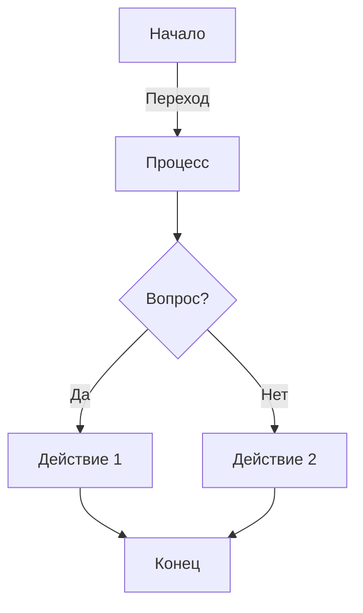

# [Book syntax](https://rust-lang.github.io/mdBook/for_developers/preprocessors.html)
 
 
## Links

[Here is a link!](https://www.rust-lang.org)

You may be using [Markdown Live Preview](https://markdownlivepreview.com/).

## Example Rust code

```
fn foo() -> i32 {
    1 + 1
}
```

## Blocks of code

```
let message = 'Hello world';
alert(message);
```

## Inline code

This web site is using `markedjs/marked`.


## Зачеркивание

An example of ~~strikethrough text~~. You can also use ~single tildes~.


## Сноски

This is an example of a footnote[^note].

[^note]: This text is the contents of the footnote, which will be rendered
    towards the bottom.

 
## Списки задач

- [x] Complete task
- [ ] Incomplete task

## Lists

### Unordered

* Item 1
* Item 2
* Item 2a
* Item 2b

### Ordered

1. Item 1
2. Item 2
3. Item 3
    1. Item 3a
    2. Item 3b


## Добавляем блок предупреждений

<div class="warning">A big warning!</div>

<div class="warning">

This is a bad thing that you should pay attention to.

Warning blocks should be used sparingly in documentation, to avoid "warning
fatigue," where people are trained to ignore them because they usually don't
matter for what they're doing.

</div>


## Headers

# This is a Heading h1
## This is a Heading h2
###### This is a Heading h6

## Emphasis

*This text will be italic*  
_This will also be italic_

**This text will be bold**  
__This will also be bold__

_You **can** combine them_


## Images


Классы HTML, предоставляемые mdBook 
Эти классы предоставляются по умолчанию для встроенного HTML для плавающих изображений.


<br><br><br><br>

## Blockquotes

> Markdown is a lightweight markup language with plain-text-formatting syntax, created in 2004 by John Gruber with Aaron Swartz.
>
>> Markdown is often used to format readme files, for writing messages in online discussion forums, and to create rich text using a plain text editor.

## Tables

| Left columns  | Right columns |
| ------------- |:-------------:|
| left foo      | right foo     |
| left bar      | right bar     |
| left baz      | right baz     |


# Препроцессоры: [KaTeX](https://github.com/lzanini/mdbook-katex) use LaTeX

[https://katex.org/](https://katex.org/)

Блочный элемент:
$$
 a_1= b {{numeq}}
$$

Список:

$R(экв) = \frac{1}{\frac{1}{R\ экв 12} + \frac{1}{R\ экв345678}} = \frac{1}{\frac{1}{15} + \frac{1}{7.07}}=\frac{1}{0.21} = 4.76, \Omega $

$U(R_1)=I_2\cdot R_1=6.67\cdot 9  \approx 60.03, V$

$\sum I_3\to U_3 \to \infty$
 
ЭДС, $\mathcal{E}$

$0.001 = 1 / 1000 = 10^{-3}$

$\color{#2EC27E}{a \to b}$

$\dots$ — троеточие

$\small: \text{уменьшает размер шрифта} $

$\footnotesize: уменьшает размер шрифта еще сильнее $

$\scriptsize: \text{делает шрифт очень маленьким} $

$\tiny: \text{делает шрифт минимального размера} $

$R\tiny RRRRR\normalsize \cdot I_1$

$R_{RRRRR} \cdot I_1 $
 
$V = \varphi потенциал или φ $ 

$\pm or \plusmn$


$
\begin{bmatrix}
a_{11} & a_{12} & | & b_1 \\
a_{21} & a_{22} & | & b_2
\end{bmatrix}
$

$
A =
\begin{bmatrix}
a_{11} & a_{12} \\
a_{21} & a_{22}
\end{bmatrix}
$


# Препроцессоры: [Mdbook Embedify](https://mr-addict.github.io/mdbook-embedify/)

Install:

`$ cargo install mdbook-embedify`

Добавить в book.toml:

```
[preprocessor.embedify]
scroll-to-top.enable = true
```

[link 1](https://mr-addict.github.io/mdbook-embedify/local/announcement-banner.html)
[link 2](https://github.com/MR-Addict/mdbook-embedify)
 
вставка codepen:



вставка YouTube:



свое приложение:
 
<iframe
  allowfullscreen
  name="mylink"
  loading="lazy"
  src="https://www.youtube.com/embed/DyTCOwB0DVw"
  style="width: 100%; height: 100%; border: none; aspect-ratio: 16/9; border-radius: 1rem; background: black"
  allow="accelerometer; autoplay; clipboard-write; encrypted-media; gyroscope; picture-in-picture; web-share"
></iframe>


# Препроцессоры: [mdbook-mermaid](https://github.com/badboy/mdbook-mermaid)
 
Install:

`cargo install mdbook-mermaid`

Добавить в book.toml:

```
[preprocessor.mermaid]
command = "mdbook-mermaid"
```

Пример диаграммы Mermaid




# Препроцессоры: mdbook-admonish

Пример использования mdbook-admonish

Install:

`cargo install mdbook-admonish`

`mdbook-admonish install`

Добавить в book.toml:

```
[preprocessor.admonish]
```

```admonish info
A beautifully styled message.
```

```admonish warning
A beautifully styled message.
```

```admonish error
A beautifully styled message.
```

```admonish example
My example is the best!
```

```admonish
A plain note.
```
 
# Препроцессоры: [mdbook-codeblocks](https://crates.io/crates/mdbook-codeblocks)


```rust

fn main() { println!("hello world"); }
```