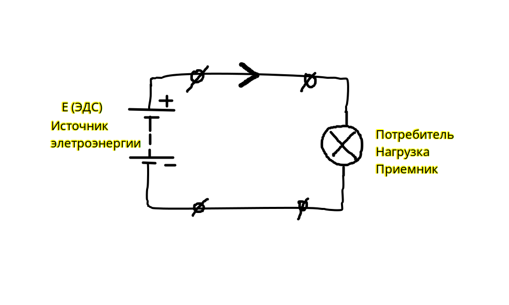

# Электрическая цепь. 

[Электрическая цепь](../../glossary_of_terms/index.md#Электрическая-цепь) — это замкнутая проводящая система, через которую может протекать электрический ток. Она состоит из различных компонентов, таких как источники энергии (например, батареи или генераторы), проводники (провода или кабели), элементы управления (выключатели, предохранители) и различные электрические устройства (резисторы, конденсаторы, лампочки и другие)

[Источник электроэнергии](../../glossary_of_terms/index.md#Источник-электроэнергии-ИЭЭ) ЭДС (Электродвижущая сила) — это устройство или система, которая обеспечивает подачу электрической энергии в электрическую цепь. Источники электроэнергии преобразуют другие формы энергии (механическую, химическую, солнечную и т. д.) в электрическую. Эти устройства обеспечивают ток, который используется для питания различных приёмников электроэнергии.

[Приёмник/потребитель/нагрузка электроэнергии](../../glossary_of_terms/index.md#Приемник-электроэнергии-ПЭЭ) —  это устройство или установка, которая преобразует электрическую энергию в другие виды энергии (например, механическую, тепловую, световую) для выполнения какой-либо работы. В контексте электрических цепей, приёмник электроэнергии является конечным элементом системы, куда подается энергия от источника (например, генератора или аккумулятора)

[Резистор](../../glossary_of_terms/index.md#Резистор) может выступать в роли нагрузки/потребителя/приёмника цепи.

**Во внутренней части источника напряжения ток протекает от минуса к плюсу.**

**Во внешней части схемы ток протекает от плюса к минусу.**

Схема замещения показывает основные свойства элементов. Электрокомпоненты представлены на схеме в виде моделей:

В роли потребителя электроэнергии выступает резистор <strong>R</strong>:

