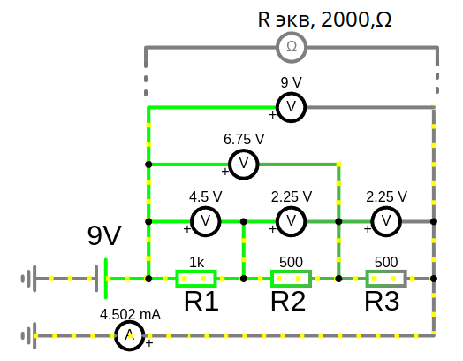
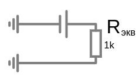
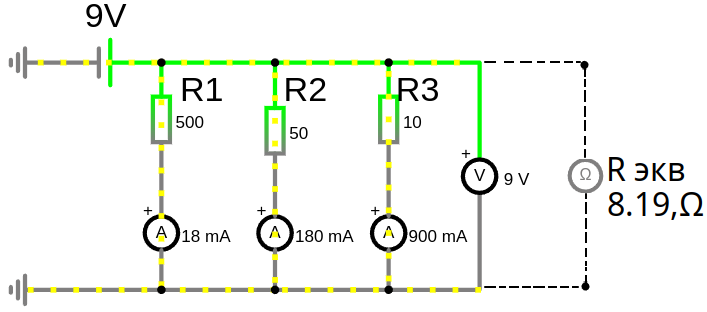
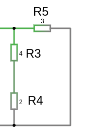

# Урок 10. Последовательное и параллельное соединение резисторов.

## Последовательное соединение резисторов (общий ток)

<a href="/theories_of_electrical_circuits/falstad/circuitjs-10-series.txt" download="circuitjs-10-series.txt">Скачать схему для www.falstad.com/circuit</a>

Схема замещения последовательного соединение резисторов как $R_{эквивалентное}$ 

где, $R_{экв}=R_1+R_2+R_3\ $ т.е. $\ R_{экв}=\sum R$ 

#### **Характеристики:**
1. **Общее сопротивление:**
   При последовательном соединении резисторов общее сопротивление суммируется:
    
   $R_{экв} = R_1 + R_2 + \dots + R_n$
  
   где $ R_1, R_2, \dots, R_n $ — сопротивления отдельных резисторов.

2. **Ток в цепи:**
   Во всех резисторах протекает одинаковый ток:
   
   $I = \frac{U}{R\ {\text{экв}}}$
   
   где $U$ — общее напряжение на цепи.

3. **Напряжение на каждом резисторе:**
   Напряжение делится между резисторами пропорционально их сопротивлениям:
   
   $U_i = I \cdot R_i$
   
   $U_i$ — напряжение на $i$-м резисторе.

   $U_{общ} = U_1+U_2+U_3+\dots+U_n\ = I\cdot R_1 +I\cdot R_2\cdot +\dots+ I\cdot R_n\cdot = I\cdot R\ экв.$

---

#### **Пример:**
Если три резистора $R_1 = 1000 \, \Omega$, $R_2 = 500 \, \Omega$, $R_3 = 500 \, \Omega$ соединены последовательно, общее сопротивление будет:
 
- $R_{}{экв} = R_1 + R_2 + R_3 = 1000 + 500 + 500 = 2000,\Omega = 2 \, k \Omega$

- $I = \frac{9,V}{2000,\Omega} = 0,0045, A = 4.5, mA$

- $U_1 = I \cdot R_1 = 0,0045, A\cdot 1000,\Omega = 4.5, V$

- $U_2 = I \cdot R_2 = 0,0045, A\cdot 500,\Omega = 2.25, V$
- $U_3 = I \cdot R_3 = 0,0045, A\cdot 500,\Omega = 2.25, V$
---

## Параллельное соединение резисторов (общее наряжение)

На схеме ниже, резистор $R_5$ параллельно соединен с двумя резисторами $R_3$ и $R_4$

#### **Характеристики:**
1. **Общее сопротивление:**
   При параллельном соединении обратное общее (эквивалентное) сопротивление равно сумме обратных сопротивлений всех резисторов:
    
   $\frac{1}{R_{}{экв}} = \frac{1}{R_1} + \frac{1}{R_2} + \dots + \frac{1}{R_n}$
   
   или:
   
   $R_{экв} = \frac{1}{\left(\frac{1}{R_1} + \frac{1}{R_2} + \dots + \frac{1}{R_n}\right)}$
    
   Для упрощения расчетов используют проводимость $G=\frac{1}{R}$ 

   $G_{экв} = \sum \frac{1}{R_n} $

2. **Напряжение:**
   Напряжение на каждом резисторе одинаково:
   
   $U_{общ} = U_1 = U_2 = \dots = U_n$
  

3. **Ток:**
   Ток делится между резисторами обратно пропорционально их сопротивлениям:
   
   $I_{общ} = \frac{U}{R_{экв}} = \frac{U}{R_1} + \frac{U}{R_2} +\dots+\frac{U}{R_n} = \sum I = I_1+I_2+\dots+I_n$ 

   $I_i = \frac{U}{R_i}$
   
   где $I_i$ — ток через $i$-й резистор.

---

#### **Пример:**
Если три резистора $R_1 = 500 \, \Omega$, $R_2 = 50 \, \Omega$, $R_3 = 10 \, \Omega$ соединены параллельно:
 
$G = \frac{1}{R_{экв}} = \frac{1}{R_1} + \frac{1}{R_2} + \frac{1}{R_3} \to \frac{1}{R_{экв}} = \frac{1}{500} + \frac{1}{50} + \frac{1}{10} \to \frac{1}{R\ {\text{экв}}} = 0.122\ S$
 
- $R_{экв} = \frac{1}{0.122} \approx 8.19 \, \Omega$

- $I_1 = \frac{U}{R_1}= \frac{9}{500} = 0.018, А = 18,\ mA$
- $I_2 = \frac{U}{R_2}= \frac{9}{50} = 0.18, А = 180,\ mA$
- $I_3 = \frac{U}{R_3}= \frac{9}{10} = 0.9, А = 900,\ mA$

- $I_{общ} = I_1+I_2+I_3 = 0.018 + 0.18 + 0.9 \approx 1.1, А\ $ или $\ I_{общ} = \frac{U}{R_{экв}}=\frac{9}{8.19} \approx 1.1, А$

---

### **Сравнение:**
| Свойство                 | Последовательное соединение       | Параллельное соединение            |
|--------------------------|-----------------------------------|------------------------------------|
| Сопротивление            | Суммируется                       | Обратные сопротивления суммируются |
| Ток                      | Одинаков для всех резисторов      | Делится между резисторами          |
| Напряжение               | Делится между резисторами         | Одинаково на всех резисторах       |
| Применение               | Ограничение тока                  | Снижение общего сопротивления      |

