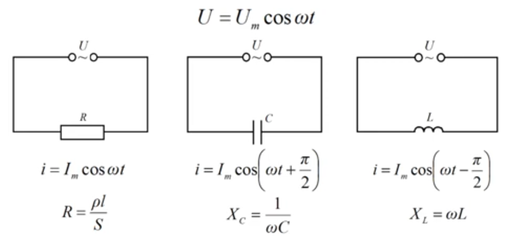
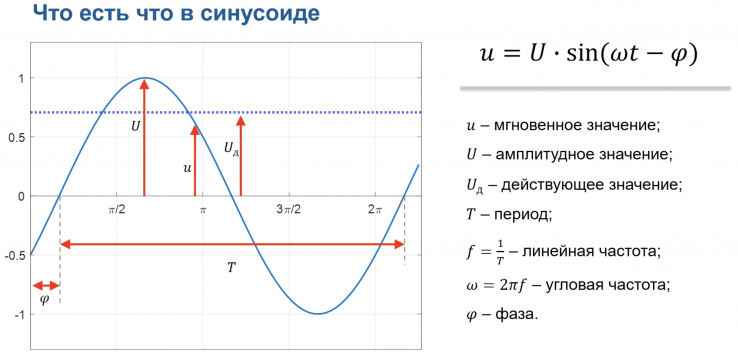
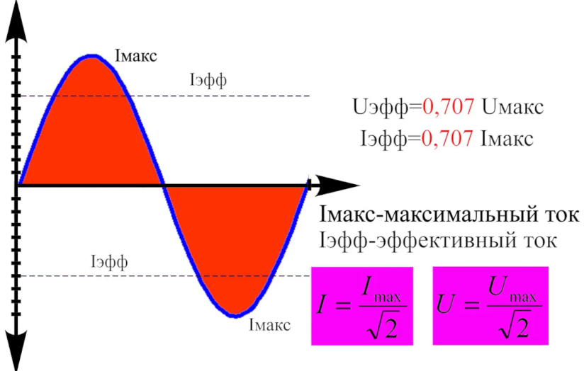
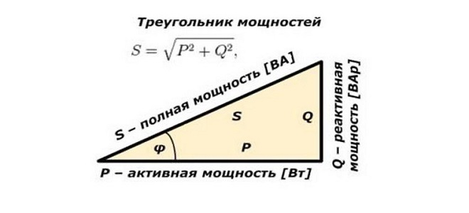

# Цепи переменного тока (AC)

```admonish info
Вам не нужно сразу углубляться в сложные вещи вроде комплексных чисел или диаграмм Фазора — достаточно понять, как меняется ток/напряжение во времени, и как на это влияют [конденсаторы](https://www.youtube.com/watch?v=xyR2NiGvzFY&list=PL8uwGGI-Cxq7_82j2kLih6bspk4DkOMec&index=57&pp=iAQB) и [катушки](https://www.youtube.com/watch?v=T6sh-Ixq6fI&list=PL8uwGGI-Cxq7_82j2kLih6bspk4DkOMec&index=58&pp=iAQB). А потом уже по мере необходимости углубляться.
```
**Переменный ток** - Вынужденные колебания заряженных частиц в проводнике под воздействием внешней переодически изменяющейся эдектродвижущей силы (ЭДС) т.е. это колебания не затухаюшие и не свободные.

Основные задачи электротехники – это произвести, передать и распределить энергию, по пути её к тому же приходится, преобразовывать. Всё это проще делать на переменном токе $i$ , чем на постоянном $I$.

<details>

<summary>зачем использовать цепи переменного тока</summary>

Передача энергии на большие расстояния с **высоким напряжением и низким током** снижает потери. Это связано с законом Джоуля-Ленца:  
 
$P_{\text{потерь}} = I^2\cdot R$
 
Где:  
- $ P_{\text{потерь}} $ — потери мощности в виде тепла (Вт).  
- $ I $ — ток (А).  
- $ R $ — сопротивление проводника (Ом).  

Если при передаче увеличить напряжение и уменьшить ток, потери в проводах резко сокращаются! Например, линии электропередачи работают на **110 кВ, 220 кВ или даже 500 кВ**. 
Уменьшая ток, мы минимизируем нагрев проводов, что позволяет передавать больше энергии на те же расстояния.


**Для передачи мощности на большое расстояние надо повысить напряжение, а потом понизить через трансформатор, но раньше трансформатор мог это делать только с переменным напряжением (Переменный ток (AC) постоянно меняет направление и создает переменное магнитное поле в сердечнике трансформатора. Это поле индуцирует напряжение во второй обмотке — энергия передается. Постоянный ток (DC) создает статическое магнитное поле, которое не меняется со временем. В результате во второй обмотке вообще не возникает напряжения, и трансформатор не работает.), но сейчас уже появилась технология HVDC-линии (High Voltage DC), где с помощью силовой электроники можно повысить постоянное напряжение до ±500 кВ и выше!**
 

Передача энергии на большие расстояния постоянным током (DC) имеет ряд преимуществ перед переменным током (AC):
- Отсутствие реактивных потерь в DC, что повышает эффективность
- Меньший эффект скин-эффекта в DC, что требует меньшего сечения проводов
- Меньшие потери на корону(ионизацию воздуха вокруг проводов)
- Возможность передачи большей мощности: При одинаковом напряжении линии постоянного тока могут передавать большую мощность, чем линии переменного тока.
- Подводные кабели: Для передачи энергии по подводным кабелям на большие расстояния постоянный ток является более эффективным, так как позволяет избежать потерь, связанных с ёмкостью кабеля.

 
Однако, у передачи постоянным током есть и недостатки:
- Необходимость использования сложных и дорогих преобразователей переменного тока в постоянный и обратно. Преобразование DC-AC из постоянного в переменный ток менее выгодно при передаче на большие расстояния чем наоборот AC-DC. Так как для DC-AC есть необходимость в дорогих и сложных электронных устройствах т.е. в мощных инверторах для работы с высокими напряжениями и токами, к тому же будут большие потери и необходима борьба с гармоническими искажениями. А вот при AC-DC используется более простые, дешевые и надежные трансформаторы
- Сложность прерывания постоянного тока при авариях.

И моторы переменного тока (AC) обычно проще по конструкции, чем моторы постоянного тока (DC)

- Мотору постоянного тока необходимо иметь миним три обмотки что бы он мог вращаться, так же мотору нужен постоянный магнит или электромагнит, и нужен коллектор который должен снимать ток с токосьемников терясь об них и тем самым создает электромагнитные помехи и быстро изнашивается, что ведет к постоянному обслуживанию и в итоге снижает их рентабельность.

- Мотор переменного тока, его обмотки могут быть расчитаны на любое напряжение так как их можно подключить через трансформатор, которой работает только на переменном токе. Самому простому мотору переменного тока достаточно иметь всего одну обмотку и ему не нужны магниты и электромагниты для запуска вращения, и не требуется коллектор со шетками, износу в моторе подвергаются только подшибники.

 
**Пример: передача мощности 10 МВт на расстояние 100 км**

Пусть сопротивление линии составляет $ 0,05 \, \Omega/\text{км} $. 

Тогда общее сопротивление:  
- $R_{\text{линии}} = 0,05 \times 100 = 5 \, \Omega$

Рассчитаем потери для **высокого напряжения (110 кВ)** и **низкого напряжения (75 кВ)**.

**1. Передача при 110 кВ:** 
- Мощность: $ 10 \, \text{МВт} = 10^7 \, \text{Вт}$  
- Напряжение: $ 110 \, \text{kV} = 110\,000 \, \text{В}$

Ток в линии:  
- $I = \frac{P}{U} = \frac{10^7}{110\,000} \approx 90,91 \, \text{А}$

Потери мощности:  
- $P_{\text{потерь}} = I^2 R = (90,91)^2 \times 5 \approx 41,32 \, \text{kW}$

 **Потери:** ≈ 41,32 кВт (всего **0,41%** от мощности). 


**2. Передача при 75 кВ:**  
- Напряжение: $ 75 \, \text{kV} = 75\,000 \, \text{В} $  

Ток в линии:  
- $I = \frac{P}{U} = \frac{10^7}{75\,000} \approx 133,33 \, \text{А}$
 

Потери мощности:  
- $P_{\text{потерь}} = I^2 R = (133,33)^2 \times 5 \approx 88,89 \, \text{kW}$

**Потери:** ≈ 88,89 кВт (уже **0,89%** от мощности). 

**Итог:** При повышении напряжения потери резко падают, потому что потери зависят от квадрата тока!  
- При 110 кВ потери в **2 раза меньше**, чем при 75 кВ. 


Несмотря на преимущества AC, у него есть и проблемы:
- Эффект скин-слоя: при высоких частотах ток течет только по поверхности проводника → эффективное сечение уменьшается, а сопротивление растет.
- Емкостные и индуктивные потери: на длинных кабелях возникают реактивные потери, особенно в подводных линиях (например, кабель ЛЭП превращается в гигантский конденсатор).

HVDC решает эти проблемы:
- Нет скин-эффекта: ток течет по всему сечению проводника.
- Нет реактивных потерь: постоянный ток не создает переменных электрических и магнитных полей, которые забирают часть энергии.


**HVDC**: В последнее время технологии передачи постоянного тока высокого напряжения (HVDC) развиваются, и они становятся все более эффективными для передачи на очень большие расстояния.
HVDC особенно эффективен для передачи электроэнергии между разными энергосистемами, а также для подводных кабелей.

---

</details>


В отличие от стабильного постоянного электрического тока, переменный ток характеризуется периодической сменой полярности с определенной частотой. Например, в типичной бытовой электрической сети такие изменения происходят 50 раз в секунду, что в терминах электротехники называется частотой 50 Гц. Электроны то идут в одну сторону, то в другую, но из-за смены полярности ток продолжает течь.

Передача переменного тока обладает преимуществом в том, что она не ограничивается длиной расстояния, мощностью и не приводит к большим потерям энергии. Это свойство позволяет использовать переменный ток в электрических линиях передачи. Кроме того, трёхфазная система электроснабжения удобна для подключения электромоторов и обладает другими техническими преимуществами. И Генераторам проще создавать переменный ток из-за принципа электромагнитной индукции так как направление тока меняется с каждым полуоборотом и простоты конструкции.

В сетях переменного тока напряжение источника меняется синусоидально (синусоидальный ток), что позволяет эффективно передавать энергию на большие расстояния. Обозначается как "AC" (Alternating Current) на английском языке.

Переменный ток, может быть трансформирован с помощью трансформаторов для различных устройств с разными потребностями в напряжении. Переменный ток может быть однофазным или трехфазным. В бытовых сетях обычно используется однофазный ток, а в промышленности — трехфазный. Трёхфазный переменный ток используется в трёхфазных электродвигателях.

Сымым распрастраненным способом получения синусоидального сигнала является электромагнитная индукция, создаваемая генератором переменного тока. Есть и другие способы получения переменного тока, схема с осциллятором с питанием постоянным током, в которой используются эффекты индуктивности и емкости, заставляюшие ток реверберировать.

Переменный ток легко генерируется на электростанциях с помощью турбин и генераторов, где вращающееся магнитное поле естественным образом создает переменный сигнал.

С помощью трансформаторов переменный ток можно легко преобразовать:
- Повысить напряжение для передачи на большие расстояния.
- Понизить напряжение для безопасного использования у потребителей.


**Синусоидальное напряжение** — это напряжение, которое изменяется во времени по закону синуса. Оно описывается формулой:
 
   $U(t) = U_0 \cdot \sin(\omega t + \phi)$
  
   где:
   - $ U(t) $ — мгновенное значение напряжения в момент времени $ t $,
   - $U_0 $ — амплитудное значение напряжения (максимальное значение),
   - $ \omega $ — угловая частота, связанная с частотой $f $ соотношением $\omega = 2\pi f $,
   - $ \phi $ — начальная фаза.

   Таким образом, синусоидальное напряжение периодически меняет свою величину и направление, в отличие от постоянного напряжения.





**Мгновенное значение** – это значение в данный момент времени.

**Амплитудное значение** – наибольшее значение которого достигает сигнал.

**Действующее значение (Среднеквадратичное (СКЗ, RMS) или Эффективное напряжение)** – это такое значение постоянного напряжения, которое производит такой же тепловой эффект, как и рассматриваемые синусоидальные.

**Период $T$** – наименьший период времени между двумя одинаковыми значениями сигнала. 

**Частота линейная $f$** – это величина обратная периоду $f=\frac{1}{T}$ (Hz). Количество полных колебаний или циклов периодического процесса, происходящих в единицу времени

**Частота угловая $\omega$** –  скорость изменения фазы колебательного или вращательного движения в единицу времени $\omega=2 π f$ (рад/с)  

**Фаза $\psi$** – это то, насколько синусоида сдвинута относительно начала координат в момент времени 0.

Когда говорят о переменном напряжении или токе, говорят обычно действующее значение и частоту. Например, в розетке 220 Вольт, 50 Герц. Это значит, что действующее значение 220 Вольт, а линейная частота 50 Герц, период 20 миллисекунд кстати.

Действующее (эффективное) значение напряжения ($U_{действ}$) оно же среднеквадратичное значение переменного напряжения.
Оно показывает, какое постоянное напряжение произведёт такую же мощность на резисторе, как и данное переменное напряжение. 

Большинство измерительных приборов переменного тока (вольтметры, амперметры) показывают действующие значения. 
- Электроприборы: На электроприборах указывается действующее значение напряжения, на которое они рассчитаны.
- Расчёты мощности: Для расчёта мощности в цепях переменного тока используется действующее значение напряжения.

$U_{действ} = \frac{ U_{ампл}}{\sqrt{2}}\approx 0.707 \cdot U_{ампл}$

где $U_{ампл}$ – Амплитудное (максимальное) значение напряжения — это максимальное значение напряжения в синусоидальном (или другом периодическом) сигнале. Насколько высоко поднимается напряжение от нулевого уровня в положительном направлении и насколько низко опускается в отрицательном направлении.

$U_{ампл} = U_{действ} \cdot \sqrt{2}$

Если в розетке напряжение 220 В (действующее значение), то амплитудное значение будет:
- $U_{ампл} = 220 \cdot \sqrt{2} = 311\ V$

Ток так же связан действующим значением (среднеквадратичный (СКЗ) или эффективный ток).
Амперметры переменного тока, как и вольтметры, измеряют действующие значения тока. 
При расчётах мощности и других параметров цепей переменного тока используются действующие значения тока.
 - $I_{действ} = \frac{I_{ампл} }{ \sqrt{2}} \approx 0.707 \cdot I_{ампл}$
 - $I_{ампл} = I_{действ} \cdot \sqrt{2}$

Если в цепи переменного тока действующее значение тока составляет 10 А, то амплитудное значение тока будет:
- $I_{ампл} = 10 А \cdot \sqrt{2} \approx 14.14 А$




### Сигналы переменного тока

Прямоугольный сигнал – представляет состояние "истина" или "ложь"

Треугольный и пилообразеый сигналы полезны для тактирования схем.

С помощью анализов Ферье можно создавать периодические сигналы людой формы, складывая несколько синусоидальных сигналов

## Реактивная мощность 

Это недостаток переменного тока $i$.

Конденсаторы и катушки индуктивности обладают свойством реактивности только в цепях переменного тока. 
Они создают реактивное сопротивление т.е. нагрузку но без потребления тока, в результате не вся выделяемая мощность генератора тратится на полезную работу т.е. реативная мощность не выполняет полезной работы. 

Там, где есть **реактивные элементы** (катушки индуктивности и конденсаторы), мощность делится на несколько компонентов.



**Полная мощность ($ S $)**  
Полная мощность показывает **общее количество энергии**, которое передаётся в цепь. Её измеряют в вольт-амперах (ВА) или в англоязычной литературе VA,киловольт-амперы kVA, мегавольт-амперы MVA:  
 
Эта формула справедлива, когда реактивная мощность равна нулю, то есть все элементы цепи являются активными (например, сопротивление). 
- $S = U_{\text{действ}} \times I_{\text{действ}}$ [вольт-ампер, ВА]

Когда в цепи присутствуют элементы с реактивной мощностью (индуктивности и конденсаторы), то напряжение и ток сдвигаются по фазе. Тода полная мощность — это гипотенуза в прямоугольном треугольнике мощностей:  
- $S = \sqrt{P^2 + Q^2}$ [вольт-ампер, ВА]

А угол сдвига фаз ($φ$ - угол между активной и полной мощностями) можно найти так:  
- $\cos(\varphi) = \frac{P}{S}$ 

Когда мы складываем активную и реактивную мощности, мы складываем их как векторы. Это означает, что мы учитываем их фазовый сдвиг.

Вольт-ампер (ВА) используется для обозначения полной мощности в цепях переменного тока, чтобы отличить её от активной мощности (Вт).
 
**Активная мощность ($P$)** — это мощность, которая совершает полезную работу (например, нагрев, освещение, движение мотора и т. д.). Она измеряется в ваттах (Вт) или в англоязычной литературе W,киловатты kW,мегаватты MW.

$P = U_{\text{действ}} \cdot I_{\text{действ}} \cdot \cos(\varphi)$
 
Где:  
- $ \varphi $ — угол сдвига фаз между током и напряжением  
- $ \cos(\varphi)$ — коэффициент мощности

**Реактивная мощность ($Q$)** — это **мощность, которая не расходуется на полезную работу**, но колеблется между источником и реактивными компонентами (катушками и конденсаторами), накопляя энергию в индуктивностях и ёмкостях. Она не совершает полезную работу, но необходима для работы цепей переменного тока. Она измеряется в вольт-амперах реактивных (ВАр) или в англоязычной литературе VAR, киловольт-амперы реактивные kVAR, мегавольт-амперы реактивные MVAR.

$Q = U_{\text{действ}} \cdot I_{\text{действ}} \cdot \sin(\varphi)$ [вольт-амперах реактивных, ВАр]
 
- **Индуктивность (катушка)** даёт **положительную** реактивную мощность (энергия накапливается в магнитном поле).  
- **Ёмкость (конденсатор)** даёт **отрицательную** реактивную мощность (энергия накапливается в электрическом поле).  

### Компенсация реактивной мощности

Поэтому в реальной электроэнергетике стараются **компенсировать реактивную мощность** (например, с помощью конденсаторов) для улучшения **коэффициента мощности** и уменьшения потерь.

Катушки индуктивности вызывают сдвиг фазы тока и напряжения, в результате чего:
- Ток и напряжение не совпадают по фазе.
- Возникает реактивная мощность, которая создаёт дополнительные потери, но не выполняет полезную работу.
Индуктивность создаёт положительное реактивное сопротивление ($X_L$), которое задерживает энергию в магнитном поле.

Конденсаторы — это как раз те элементы, которые помогают компенсировать индуктивное сопротивление и тем самым повышают коэффициент мощности. Конденсатор в свою очередь создаёт отрицательное реактивное сопротивление ($X_L$) которое сдвигает фазу тока в противоположную сторону. Это значит, что он компенсирует «задержку» энергии, которую вызывает индуктивность.

Если правильно подобрать ёмкость конденсатора, его реактивная мощность $Q_C$ может полностью компенсировать реактивную мощность индуктивности $Q_L$, и в результате система будет работать с коэффициентом мощности близким к единице ($cos(φ)$).


---

