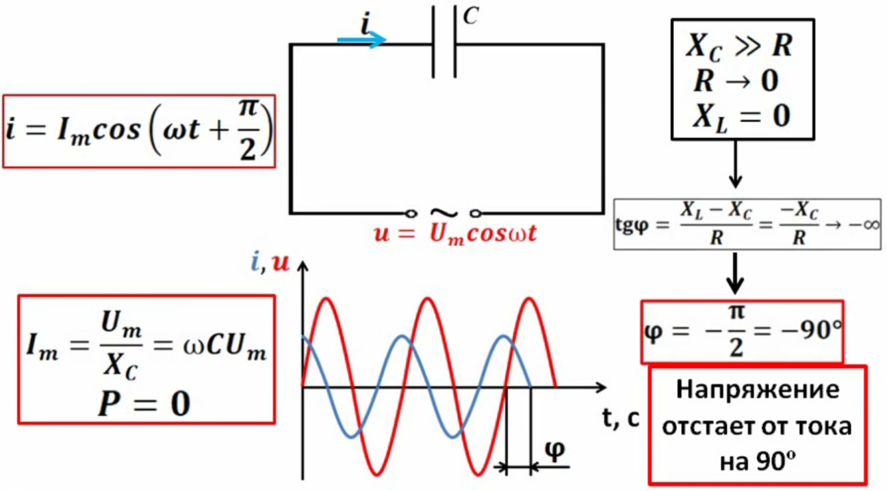
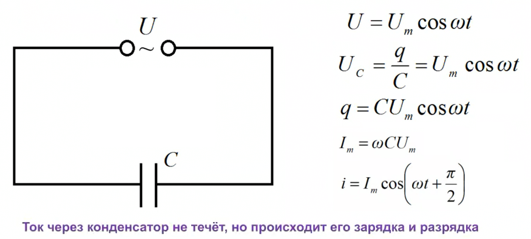
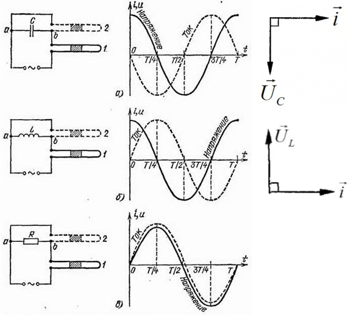
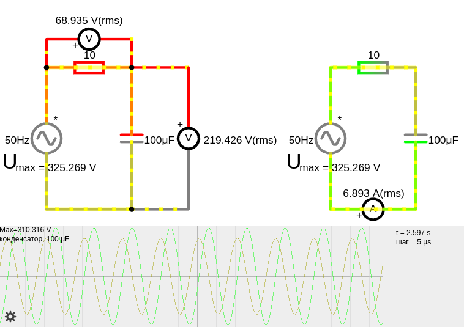
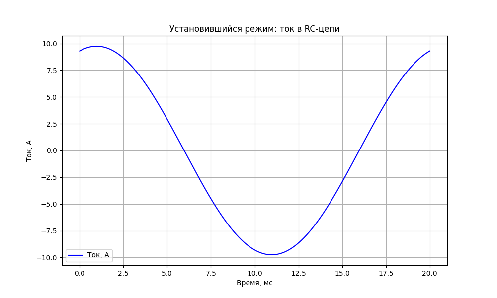
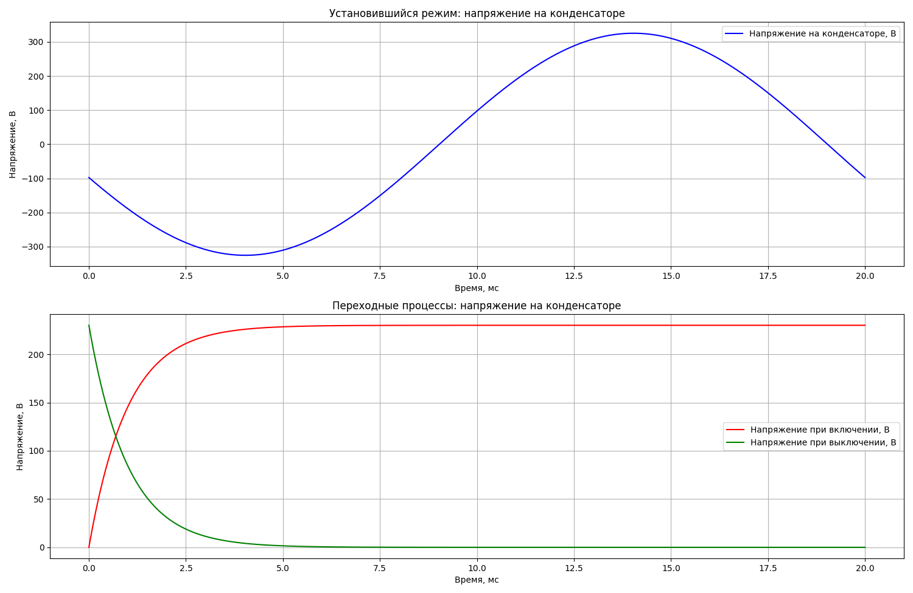
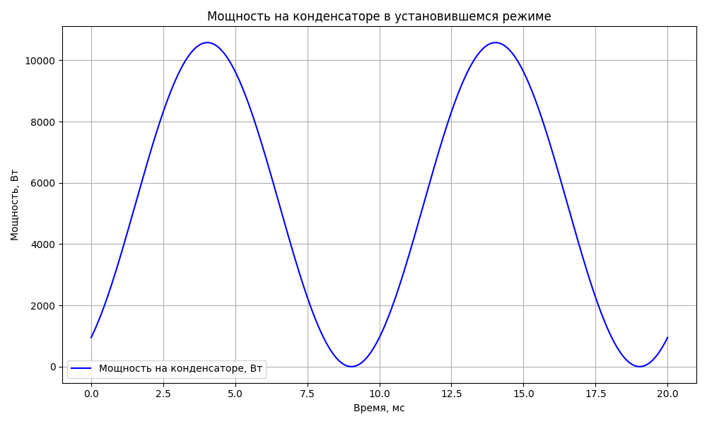
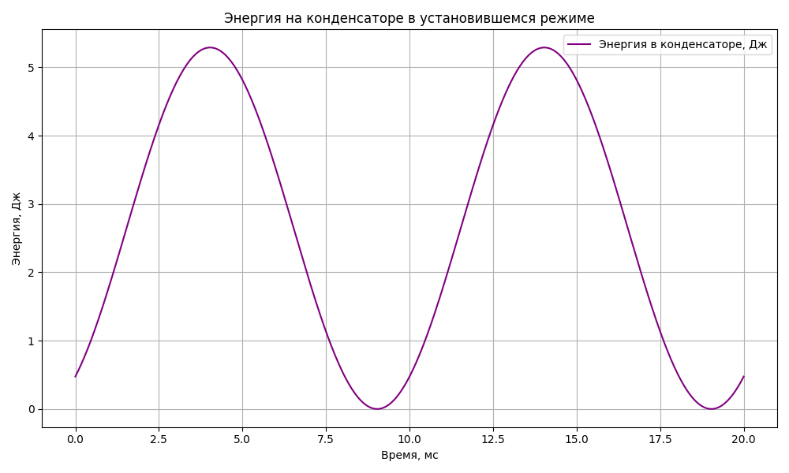
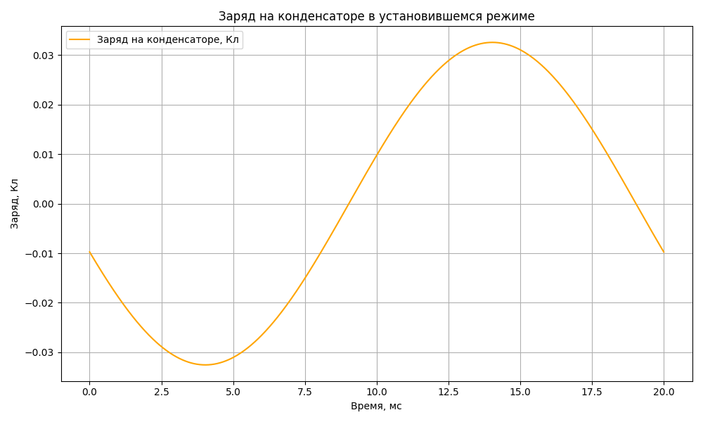

# Емкостной элемент

Если в цепи постоянного тока конденсатор в установившемся режиме перестает прорускать ток, так как он полностью зарядился, то в цепях переменного тока происходит смена потенциала на его концах и конденсатор после заряда начинает разряжаться.

В цепях переменного тока, конденсатор пропускает ток, хотя диэлектрик конденсатора не может пропускать ток.
Диэлектрик не пропускает ток, ток компенсируется из-за того что в диэлектрике диполи притягиваются своими полюсами к пластинам, минус диэлектрика к плюсу пластины и так же на другой стороне диэлектрика, плюс диполя к минусу пластины конденсатора. **И это электрическое поле в диэлектрике понижает электрическое поле, что провоцирует ЭДС компенсировать заряды, выравнивая поле за счет новых зарядов которые ЭДС создает**. Таким образом, хоть ток и не проходит через диэлектрик, но с обоих сторон конденсатора ток протекает за счет компенсации ЭДС.





В отличие от резистора, где вся активная мощность рассеивается в тепло, у конденсатора реактивная мощность просто пульсирует между источником и конденсатором. Поскольку активная составляющая = 0, нет выделения тепла.

Конденсаторы, практически, не потребляют активную энергию так как резистор, поэтому не греются. Среднее значение активной мощности на полном периоде — ноль. Конденсатор не потребляет активную мощность, но потребляет реактивную для создания электрического поля.


**Конденсатор и энергия:**  

**Активная мощность ($ P $)** — это та мощность, которая **реально потребляется и преобразуется** в тепло, свет, движение (Вт). Её тратят резисторы, лампы, двигатели.  

**Реактивная мощность ($ Q $)** — это **обратимая мощность**, которая **не тратится**, а **перекачивается туда-обратно** между источником и элементом (вар). Она создаёт электромагнитные поля, но **не выделяет тепло**.  

**Полная мощность ($ S $)** — это **векторная сумма активной и реактивной мощности**:  
 
$S = \sqrt{P^2 + Q^2}$

В реальной сети конденсаторы могут как помогать, так и вредить, в зависимости от того, как настроена компенсация реактивной мощности.
Конденсаторы создают реактивную нагрузку, но не потребляют энергию напрямую. В больших сетях реактивная мощность снижает КПД генераторов и линий, поэтому её стараются компенсировать. Специальные батареи конденсаторов ставят на подстанциях, чтобы компенсировать реактивку и улучшить коэффициент мощности сети.

**Коэффициент мощности ($ \cos \varphi $)** показывает, насколько нагрузка эффективна:  
 
$\cos \varphi = \frac{P}{S}$
 
**Чем ближе к 1 — тем лучше!**

## Выбор размерности

Для сети переменного тока емкость конденсатора выбирают по значению амплитудного напряжения, а не действующего как в цепи постоянного тока. 

$E_{амплитудное}=\sqrt{2} \cdot U_{действующее}$

Например для сети 220 Вольт: $E_{амплитудное}=\sqrt{2} \cdot 220 = 310\ Вольт$

## Сдвиг фаз

В цепи с конденсатором ток опережает напряжение на $\pi/2$ т.е. 90 градусов (в идеальном конденсаторе без сопротивления).
Это означает, что пик тока достигается раньше, чем пик напряжения.

Конденсатор накапливает электрический заряд, и этот процесс препятствует мгновенному изменению напряжения.
Это приводит к фазовому сдвигу между током и напряжением.

Когда к конденсатору прикладывается синусоидальное напряжение, ток начинает течь сразу, заряжая пластины конденсатора.
Напряжение на конденсаторе увеличивается по мере накопления заряда.
Таким образом, ток достигает своего максимума раньше, чем напряжение.

Когда ток достигает максимума, напряжение только начинает увеличиваться.



Это уравнение показывает, что ток опережает напряжение.<br>
- $I = U / Xc = ωC \cdot U$

* Где:
    * I — ток
    * U — напряжение
    * Xc — емкостное сопротивление
    * ω- угловая частота.
    * C- ёмкость.


## Пример расчета RC-цепи с синусоидальным напряжением  



<a href="/theories_of_electrical_circuits/falstad/circuitjs-102.txt" download="circuitjs-102.txt">Скачать схему для www.falstad.com/circuit</a>

**Дано:**  
- Напряжение источника: $ U = 230 \text{ В} $ (т.е. действующее (rms) среднеквадратичное, эффективное)
- Частота тока: $ f = 50 \text{ Гц} $  
- Емкость конденсатора: $ C = 100\ uF = 0.0001 \text{ F} $  
- Активное сопротивление: $ R = 10 \, \Omega $  

**Расчет:**

1. **Емкостное (реактивное) сопротивление конденсатора ($X_C$)**
    
    Оно возникает из-за способности конденсатора накапливать заряд на своих пластинах.

    $X_C = \frac{1}{\omega C} = \frac{1}{2 \cdot \pi \cdot f\cdot C} = \frac{1}{2 \pi \cdot 50 \cdot 0.0001} \approx 31.83 \, \text{Ом}$
 
    Чем выше частота $f$, тем меньше емкостное сопротивление. Это означает, что конденсатор легче пропускает высокочастотные сигналы и хуже — низкочастотные.

    Чем больше емкость, тем меньше емкостное сопротивление. Конденсатор большой емкости легче пропускает переменный ток, чем конденсатор малой емкости.


1. **Импеданс (полное сопротивление) цепи**
 
    $Z = \sqrt{R^2 + X_C^2}= \sqrt{10^2 + 31.83^2} \approx 33.37 \, \text{Ом}$

    Или расчет импеданса по формуле:
    - $Z = \frac{U_{действ}}{I_{действ}} = \frac{230}{6.89} \approx 33.37 \, Ом$

    Импеданс определяет, какой ток будет протекать в цепи при заданном напряжении. Это важно для расчета токов, выбора компонентов (например, проводов, предохранителей) и оценки нагрузки на источник питания.

1. **Амплитуда напряжения в цепи (максимальное)**

    $ U_{ампл} = U_{действ}\cdot \sqrt{2} = 230 \sqrt{2} \approx 325.27 \, \text{В}$

1. **Амплитуда тока в цепи (максимальное)**
 
    $I_{ампл} = \frac{U_{ампл}}{Z} = \frac{325.27}{33.37} \approx 9.75 \, \text{А}$
     
1. **Ток в цепи, действующий (rms среднеквадратичный, эффективный)**
 
    Установившийся ток — это состояние, когда ток в цепи переменного тока колеблется с постоянной амплитудой и частотой. Это означает, что переходные процессы, вызванные включением источника переменного тока или изменением параметров цепи, завершились.

    $I_{действ} = \frac{I_{ампл}}{\sqrt{2}} = \frac{9.75}{\sqrt{2}} \approx 6.89 \, \text{А}$


   Или ток через цепь определяется по закону Ома для цепей переменного тока:
   -  $I_{действ} = \frac{U_{действ}}{Z} = \frac{230}{33.37} \approx 6.89 \, \text{А}$  

    - где 
        - $U_{действ}$ — действующее значение напряжения
        - $Z$ — импеданс цепи

1. **Фазовый сдвиг ($ \varphi $) между напряжением и током в цепи с конденсатором**

    В RC-цепи есть два элемента:
    - **Резистор ($ R $):** Напряжение на резисторе совпадает по фазе с током, как и в RL-цепи.
    - **Конденсатор ($ C $):** Напряжение на конденсаторе отстаёт от тока на 90°. Это противоположно катушке, где напряжение опережает ток.

    Когда резистор и конденсатор соединены последовательно, их влияние на ток и напряжение комбинируется.
    Фазовый сдвиг между напряжением и током в RC-цепи также меньше 90° и зависит от соотношения сопротивления (R) и емкостного сопротивления (Xc).

    Фазовый сдвиг между напряжением и током в RC-цепи:<br>
    $\varphi = \arctan\left( \frac{X_C}{R} \right)= \arctan\left( \frac{31.83}{10} \right) \approx \arctan(3.183) \approx 1.266 \, \text{рад} \quad (\approx 72.5^\circ)$
    
 
1. **Напряжение на резисторе и конденсаторе, действующее**

    Напряжение на резисторе ($ U_R $) и конденсаторе ($U_C $) рассчитываются по формулам:

    $U_R = I_{действ} \cdot R= 6.89 \cdot 10 = 68.9 \, \text{В}$
    
    $U_C = I_{действ} \cdot X_C= 6.89 \cdot 31.83 \approx 219.3 \, \text{В}$
    
    **Проверка по теореме Пифагора**<br>
    Проверяем действующее напряжение в цепи:<br>
    
    $U_{действ} = \sqrt{U_R^2 + U_C^2} = \sqrt{68.9^2 + 219.3^2} \approx 230 \, В$
 

1. **Активная мощность ($P$) в цепи (постоянная составляющая)**

    Полезная мощность, которая преобразуется в тепло или работу.

    $P = I_{действ}^2 \cdot R= 6.89^2 \cdot 10 \approx 474.7 \, \text{Вт}$
 
1. **Реактивная мощность ($Q$) в цепи (переменная составляющая)**
 
    $Q = I_{действ}^2 \cdot X_C= 6.89^2 \cdot 31.83 \approx 1510.6 \, \text{ВАр}$ (вольт-амперах реактивных)

    Или воспользуемся другой формулой:
    - $Q = U_{действ} \cdot I_{действ} \cdot \sin(\varphi) = 230 \cdot 6.89 \cdot \sin(72.5) \approx 1511\ ВАр$ 
    - где:
        - $ U_{действ} $ — действующее значение напряжения,
        - $ I_{действ} $ — действующее значение тока,
        - $ \varphi $ — фазовый сдвиг между напряжением и током.
 
    Реактивная мощность увеличивает нагрузку на сеть, но не выполняет полезной работы. Ее учет помогает правильно проектировать системы компенсации (например, с использованием конденсаторов) для повышения эффективности. 

1. **Полная мощность ($S$)**
 
    $S = U_{действ} \cdot I_{действ} = 230 \cdot 6.89 \approx 1584.7 \, \text{ВА}$

    Коэффициент мощности ($\cos(\varphi) $)
    - $\cos(\varphi) = \frac{P}{S} = \frac{474.7}{1584.7} \approx 0.3$
    - Это означает:
        - Только **30%** энергии, передаваемой источником, используется для полезной работы.
        - Остальные **70%** — это реактивная мощность, которая "колеблется" между источником и катушкой индуктивности, не выполняя полезной работы.

    Коэффициент мощности ($\cos(\varphi) $) - показывает, насколько эффективно энергия передается от источника к нагрузке. Коэффициент мощности показывает, какая часть полной мощности $S$ используется для выполнения полезной работы 

    **Значения коэффициента мощности**
    - **$\cos(\varphi) = 1$**: Идеальный случай. Напряжение и ток совпадают по фазе, реактивная мощность отсутствует. Вся энергия передается в нагрузку без потерь. Это возможно только в цепях с чисто активной нагрузкой (например, резистор).
    - **$0 < \cos(\varphi) < 1$**: Реальный случай. Напряжение и ток не совпадают по фазе из-за наличия реактивных элементов (катушек или конденсаторов). Часть энергии "колеблется" между источником и нагрузкой, не выполняя полезной работы.
    - **$\cos(\varphi) = 0$**: Чисто реактивная нагрузка (например, идеальная катушка или конденсатор). Вся мощность является реактивной, полезная работа не выполняется.

    **Почему это важно?**
    - **Энергоэффективность**: Низкий коэффициент мощности ($\cos(\varphi) < 0.9$) указывает на неэффективное использование энергии. Это приводит к увеличению потерь в сети и перегрузке источников питания.
    - **Экономия**: Энергокомпании часто штрафуют потребителей за низкий коэффициент мощности, так как это увеличивает нагрузку на сеть.
    - **Проектирование**: При проектировании электрических систем важно учитывать коэффициент мощности, чтобы правильно выбирать компоненты (например, провода, трансформаторы) и минимизировать потери.

### Анализ временных (мгновенных значений) характеристик

1. **постоянная времени ($\tau$)**

    $\tau = R\cdot C = 10 \cdot 0.0001 = 0.001 \, \text{с} \quad (1 \, \text{мс})$

1. **Ток в цепи, установившийся режим**

    Установившийся режим — это состояние цепи, при котором ток и напряжение изменяются периодически (синусоидально) с постоянной амплитудой и частотой. **Т.е. мы хотим видеть как меняется синусоидально ток в установившемся режиме со стабильной амплитудой**

    $ i(t) = I_{ампл} \sin(\omega \cdot t + \varphi)$

    Здесь плюс перед фазовым ϕ сдвигом показывает, что ток опережает напряжение, что характерно для цепи с емкостью.

    где:
    - $I_{ампл}=9.75\ A$ - амплитудное значение тока.
    - $\omega = 2 \pi f = 314.16 \, \text{рад/с}$
    - $\varphi =72.5^\circ \approx 1.266$ радиана
 
    Перевод градусов в радианы:
    - $72.5^\circ \cdot (\frac{\pi}{180})\approx 1.266$ радиана

    Для $ t = \tau = 1 \, \text{мс} $:
    - $i(0.001) = 9.75 \cdot \sin(314.16\cdot 0.001 + 1.266) \approx 9.74 \, \text{А}$ ???

    Для $ t = 5\tau = 5 \, \text{мс} $:
    - $i(0.005) = 9.75 \cdot \sin(314.16\cdot 0.005 + 1.266) \approx 2.92 \, \text{А}$



<details>

<summary>build chart use python</summary>

```python
import numpy as np
import matplotlib.pyplot as plt

# Параметры цепи
U = 230  # Напряжение источника, В
f = 50   # Частота, Гц
C = 100e-6  # Емкость, Ф
R = 10   # Активное сопротивление, Ом

# Угловая частота
omega = 2 * np.pi * f

# Амплитуда напряжения
U_max = U * np.sqrt(2)

# Импеданс
Z = np.sqrt(R**2 + (1 / (omega * C))**2)

# Амплитуда тока
I_max = U_max / Z

# Фазовый сдвиг
phi = np.arctan(1 / (omega * C * R))

# Время
t = np.linspace(0, 0.02, 1000)  # От 0 до 20 мс

# Ток в установившемся режиме
i_steady = I_max * np.sin(omega * t + phi)

# Построение графика
plt.figure(figsize=(10, 6))
plt.plot(t * 1000, i_steady, label='Ток, А', color='b')
plt.title('Установившийся режим: ток в RC-цепи')
plt.xlabel('Время, мс')
plt.ylabel('Ток, А')
plt.legend()
plt.grid(True)
plt.show()
```
</details>


1. **Ток в цепи, переходный процесс при включении**

    Для цепи **RC** переходной процесс при включении синусоидального напряжения также описывается суммой двух составляющих: **установившегося тока** и **переходного тока**. Формула для тока в цепи RC будет выглядеть следующим образом:

    $i(t) = I_{уст} \cdot \sin(\omega t - \varphi) + I_{переход}(t)$
 
    где:
    - $ I_{уст} $ — амплитуда установившегося тока,
    - $ \omega = 2 \pi f $ — угловая частота,
    - $ \varphi $ — фазовый сдвиг между напряжением и током,
    - $ I_{переход}(t) $ — переходная составляющая тока, которая затухает со временем.

1. **Напряжение на конденсаторе, установившийся режим**

    $U_C(t) = U_{ампл} \sin(\omega t - \varphi - \frac{\pi}{2})$

    где:
    - $U_{ампл}=325.27\ В$
    - $\omega = 2 \pi f = 314.16 \, \text{рад/с}$
    - $\varphi =72.5^\circ \approx 1.266$ радиана
    - $\frac{\pi}{2}\ радиан=90^\circ$

    Перевод градусов в радианы:
    - $\frac{\pi}{2} = 90^\circ \cdot (\frac{\pi}{180})\approx 1.5708$ радиана

    Для $ t = \tau = 1 \, \text{мс} $:
    - $\omega t = 314.16 \cdot 0.001 = 0.31416 \, \text{рад} \quad (\approx 18^\circ)$
    - $U_C(0.001) = 325.27 \cdot \sin(314.16\cdot 0.001  - 1.266 - 1.5708) \approx  -188.8 \, \text{В}$
    

    Для $ t = 5\tau = 5 \, \text{мс} $:
    - $\omega t = 314.16 \cdot 0.005 = 1.5708 \, \text{рад} \quad (\approx 90^\circ)$
    - $U_C(0.005) = 325.27 \cdot \sin(314.16\cdot 0.005  - 1.266 - 1.5708) \approx -310.27 \, \text{В}$

    Для $t =14 \, \text{мс}$:
    - $U_C(0.014) = 325.27 \cdot \sin(314.16\cdot 0.014  - 1.266 - 1.5708) \approx 325.25 \, \text{В}$

1. **Напряжение на конденсаторе, переходный процесс при включении**

    $U_C(t) = U_{действ} \left( 1 - e^{-\frac{t}{\tau}} \right)$

    Для $ t = \tau = 1 \, \text{мс} $:
    - $U_C(0.001) = 230 \left( 1 - e^{-\frac{0.001}{0.001}} \right)\approx 145.4 \, \text{В}$
    
    Для $ t = 5\tau = 5 \, \text{мс} $:
    - $U_C(0.005) = 230 \left( 1 - e^{-\frac{0.005}{0.001}} \right) \approx 228.5 \, \text{В}$

1. **Напряжение на конденсаторе, переходный процесс при выключении**

    $U_C(t) = U_{\text{действ}} \cdot e^{-\frac{t}{\tau}}$

    Для $ t = \tau = 1 \, \text{мс} $:
    - $U_C(0.001) = 230 \cdot e^{-\frac{0.001}{0.001}} \approx 84.6 \, \text{В}$

    Для $ t = 5\tau = 5 \, \text{мс} $:
    - $U_C(0.005) = 230 \cdot e^{-\frac{0.005}{0.001}} \approx 1.54 \, \text{В}$



<details>

<summary>build chart use python</summary>

```python
import numpy as np
import matplotlib.pyplot as plt

# Параметры цепи
U = 230  # Напряжение источника, В
f = 50   # Частота, Гц
C = 100e-6  # Емкость, Ф
R = 10   # Активное сопротивление, Ом

# Угловая частота
omega = 2 * np.pi * f

# Постоянная времени
tau = R * C

# Установившийся ток и напряжение
I_ust = U / R
U_ust = U

# Амплитуда напряжения
U_max = U_ust * np.sqrt(2)

# Фазовый сдвиг
phi = np.arctan(1 / (omega * C * R))

# Время
t = np.linspace(0, 0.02, 1000)  # От 0 до 20 мс

# Установившийся режим
U_C_steady = U_max * np.sin(omega * t - phi - np.pi/2)

# Переходный процесс при включении
U_C_transient_on = U_ust * (1 - np.exp(-t / tau))

# Переходный процесс при выключении
U_C_transient_off = U_ust * np.exp(-t / tau)

# Построение графиков
plt.figure(figsize=(15, 10))

# Установившийся режим
plt.subplot(2, 1, 1)
plt.plot(t * 1000, U_C_steady, label='Напряжение на конденсаторе, В', color='b')
plt.title('Установившийся режим: напряжение на конденсаторе')
plt.xlabel('Время, мс')
plt.ylabel('Напряжение, В')
plt.legend()
plt.grid(True)

# Переходные процессы
plt.subplot(2, 1, 2)
plt.plot(t * 1000, U_C_transient_on, label='Напряжение при включении, В', color='r')
plt.plot(t * 1000, U_C_transient_off, label='Напряжение при выключении, В', color='g')
plt.title('Переходные процессы: напряжение на конденсаторе')
plt.xlabel('Время, мс')
plt.ylabel('Напряжение, В')
plt.legend()
plt.grid(True)

plt.tight_layout()
plt.show()
```
</details>

1. **Мгновенная мощность, в установимшемся режиме**
    
    $P(t) = U_C(t) \cdot I_C(t)$

    где:
    - $U_C(t) = U_{ампл} \sin(\omega t - \varphi - \frac{\pi}{2})$
        - $U_C(0.014) = 325.25$
    - $I_C(t) = \frac{U_C(t)}{R}$

    Для $ t = 14 \, \text{мс} $:
    - $p(0.014) = 325.25 \cdot \frac{325.25}{10}  \approx 10578.75 \, \text{Вт}$



<details>

<summary>build chart use python</summary>

```python
import numpy as np

# Параметры цепи
U_rms = 230  # Напряжение источника, В (среднеквадратичное)
f = 50   # Частота, Гц
C = 100e-6  # Емкость, Ф
R = 10   # Активное сопротивление, Ом

# Угловая частота
omega = 2 * np.pi * f

# Амплитудное напряжение
U_max = U_rms * np.sqrt(2)

# Фазовый сдвиг
phi = np.arctan(1 / (omega * R * C))

# Время (14 мс)
t = 14e-3  # 14 мс

# Напряжение на конденсаторе в момент времени 14 мс
U_C_t = U_max * np.sin(omega * t - phi - np.pi/2)

# Ток в момент времени 14 мс
I_C_t = U_C_t / R

# Мощность в момент времени 14 мс
P_t = U_C_t * I_C_t  # Можно также использовать P_t = U_C_t**2 / R

# Результаты
U_C_t, I_C_t, P_t

```
</details>

1. **Энергия в емкости, установимшемся режиме**
 
    Энергия, запасенная в электрическом поле емкости:<br>
    $W = \frac{1}{2}\cdot C\cdot U_{C}^2(t)$

    где:
    - $U_C(t)$  — напряжение на конденсаторе в момент времени t. В нашем случае, напряжение на конденсаторе в установившемся режиме в момент времени t
    
    $U_C(t) = U_{ампл} \sin(\omega t - \varphi - \frac{\pi}{2})$

    - $U_C(0.001) = -188.8$
    - $U_C(0.005) = -310.27$
    - $U_C(0.014) = 325.25$


    Для $ t = \tau = 1 \, \text{мс} $: 
    - $W(0.001) = \frac{1}{2}\cdot C\cdot U_{C}^2(t) = \frac{1}{2} \cdot 0.0001 \cdot (-188.8)^2  \approx 1.78 \, \text{Дж}$
 
    Для $ t = 5\tau = 5 \, \text{мс} $:
    - $W(0.005) = \frac{1}{2} \cdot 0.0001 \cdot (-310.27)^2 \approx 4.81 \, \text{Дж}$

    Для $ t = 14 \, \text{мс} $:
    - $W(0.014) = \frac{1}{2} \cdot 0.0001 \cdot 325.25^2 \approx 5.289 \, \text{Дж}$



<details>

<summary>build chart use python</summary>

```python
import numpy as np
import matplotlib.pyplot as plt

# Параметры цепи
U = 230  # Напряжение источника, В
f = 50   # Частота, Гц
C = 100e-6  # Емкость, Ф
R = 10   # Активное сопротивление, Ом

# Угловая частота
omega = 2 * np.pi * f

# Постоянная времени
tau = R * C

# Установившийся ток и напряжение
I_ust = U / R
U_ust = U

# Амплитуда напряжения
U_max = U_ust * np.sqrt(2)

# Фазовый сдвиг
phi = np.arctan(1 / (omega * C * R))

# Время
t = np.linspace(0, 0.02, 1000)  # От 0 до 20 мс

# Установившийся режим
U_C_steady = U_max * np.sin(omega * t - phi - np.pi/2)

# Энергия в установившемся режиме
E_steady = 0.5 * C * U_C_steady**2

# Построение графика для энергии
plt.figure(figsize=(10, 6))

# Энергия в установившемся режиме
plt.plot(t * 1000, E_steady, label='Энергия в конденсаторе, Дж', color='purple')
plt.title('Энергия на конденсаторе в установившемся режиме')
plt.xlabel('Время, мс')
plt.ylabel('Энергия, Дж')
plt.legend()
plt.grid(True)

plt.tight_layout()
plt.show()

```
</details>


1. **Заряд в емкости, установимшемся режиме**

    $Q(t) = C \cdot U_C(t)$

    где:
    - $U_C(t)$  — напряжение на конденсаторе в момент времени t. В нашем случае, напряжение на конденсаторе в установившемся режиме в момент времени t
    
    $U_C(t) = U_{ампл} \sin(\omega t - \varphi - \frac{\pi}{2})$

    - $U_C(0.001) = -188.8$
    - $U_C(0.005) = -310.27$
    - $U_C(0.014) = 325.25$

    Для $ t = \tau = 1 \, \text{мс} $: 
    - $Q(0.001) = 0.0001 \cdot (-188.8) \approx -0.01888 \, \text{Дж}$
 
    Для $ t = 5\tau = 5 \, \text{мс}$:
    - $Q(0.005) = 0.0001 \cdot (-310.27) \approx -0.031 \, \text{Дж}$
    
    Для $ t = 14 \, \text{мс} $:
    - $Q(0.014) = 0.0001 \cdot 325.25 \approx 0.032 \, \text{Дж}$



<details>

<summary>build chart use python</summary>

```python
import numpy as np
import matplotlib.pyplot as plt

# Параметры цепи
U = 230  # Напряжение источника, В
f = 50   # Частота, Гц
C = 100e-6  # Емкость, Ф
R = 10   # Активное сопротивление, Ом

# Угловая частота
omega = 2 * np.pi * f

# Постоянная времени
tau = R * C

# Установившийся ток и напряжение
I_ust = U / R
U_ust = U

# Амплитуда напряжения
U_max = U_ust * np.sqrt(2)

# Фазовый сдвиг
phi = np.arctan(1 / (omega * C * R))

# Время
t = np.linspace(0, 0.02, 1000)  # От 0 до 20 мс

# Установившийся режим (напряжение на конденсаторе)
U_C_steady = U_max * np.sin(omega * t - phi - np.pi/2)

# Заряд на конденсаторе в установившемся режиме
Q_steady = C * U_C_steady

# Построение графика для заряда
plt.figure(figsize=(10, 6))

# Заряд на конденсаторе в установившемся режиме
plt.plot(t * 1000, Q_steady, label='Заряд на конденсаторе, Кл', color='orange')
plt.title('Заряд на конденсаторе в установившемся режиме')
plt.xlabel('Время, мс')
plt.ylabel('Заряд, Кл')
plt.legend()
plt.grid(True)

plt.tight_layout()
plt.show()

```
</details>

---

