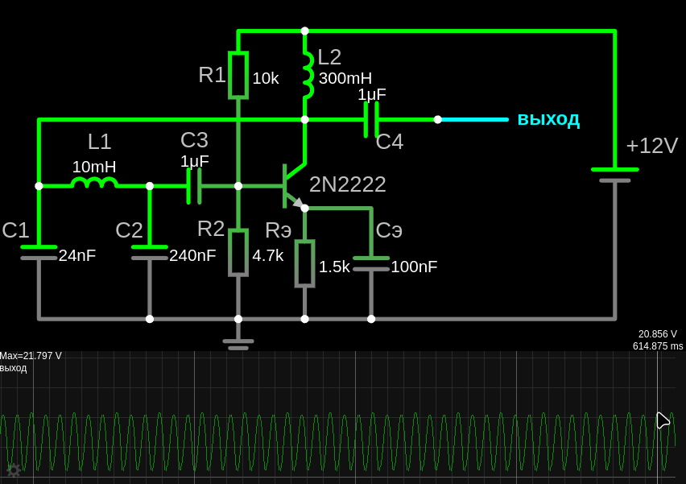

# Линейные генераторы сигналов (синусоидальные)
 
Сымым распрастраненным способом получения синусоидального сигнала является электромагнитная индукция, создаваемая генератором переменного тока. Есть и другие способы получения переменного тока, LC-схема с осциллятором с питанием постоянным током, в которой используются эффекты индуктивности и емкости, заставляюшие ток реверберировать.
 
Генераторы сигналов — это устройства, которые создают, пульсирующее напряжение, периодические сигналы (синусоидальные, прямоугольные, треугольные и т.д.). Их можно изучать как в контексте **линейных**, так и **нелинейных** цепей, в зависимости от типа генератора и принципа его работы. 

**Т.е. линейные генераторы сигналов дают переменное напряжение и ток, с отрицательной полуволной.**
- Если генератор используется без выходного конденсатора (С-выход), то сигнал будет действительно переменным, с отрицательной полуволной.

- Если стоит конденсатор на выходе, то сигнал будет смещён вверх (только положительные колебания, но переменные).

- Если генератор работает на транзисторе в схеме с общим эмиттером, то он переворачивает фазу, но колебания остаются симметричными относительно нуля.


### Типы линейных генераторов: 
- **1. LC-генераторы** – используют индуктивность (L) и ёмкость (C) для формирования колебаний.  
- **2. Кварцевые генераторы** – основаны на пьезоэлектрическом эффекте, обеспечивают высокую точность частоты, особенноно на высоких частотах (выше нескольких сотен МГц).  
- **3. RC-генераторы** (реже, т.к. хуже стабильность) – на резисторах и конденсаторах.  
- **4. Генераторы на операционных усилителях** – с частотной стабилизацией.  


**Принцип работы**: Используют линейные компоненты (катушки, конденсаторы, резисторы) и линейные усилители для создания синусоидальных сигналов.

**Особенности**:
  - Работают в линейном режиме.
  - Используют положительную обратную связь для создания колебаний.
  - Выходной сигнал — синусоидальный.


Линейные генераторы (например, LC- или RC-генераторы) проще для понимания, так как они основаны на линейных принципах (резонанс, фазовый сдвиг). Они помогают понять базовые концепции генерации сигналов, такие как обратная связь и устойчивость.

---
# 2. Кварцевые генераторы (резонатор)

Кварцевые генераторы обычно генерируют синусоидальный сигнал с очень стабильной частотой. Кварцевые генераторы широко используются там, где требуется высокая точность и стабильность частоты. Это электронное устройство, которое использует пьезоэлектрический эффект кварца для создания стабильного и точного электрического сигнала с определённой частотой.

Для создания кварцевого генератора кварцевый резонатор включается в состав электронной схемы, которая включает в себя усилитель и цепь обратной связи. Кварц не генерирует ток сам по себе.

Для работы кварцевого генератора необходим источник питания, который обеспечивает энергией усилитель и другие компоненты схемы.
Источник питания обеспечивает ток, необходимый для поддержания колебаний.
Кварцевый резонатор, по сути, задает частоту, а транзисторы и прочие элементы схемы, усиливают сигнал, и питаются от источника постоянного тока.

---

# 1. Линейный генератор (LC-генератор)

LC-генератор — это автоколебательная система, которая сама преобразует постоянное напряжение в переменное за счёт резонанса в LC-контуре и положительной обратной связи. LC-генератор самовозбуждается при включении питания (DC) и дальше работает автономно

**Принцип работы**:<br>
LC-генератор работает на основе **положительной обратной связи (ПОС)**, компенсирующей потери энергии в контуре.  

1. **Колебательный контур (L и C)** создаёт резонансную частоту $f_0$ 

   **Добротность контура (Q):**  $Q = \frac{1}{R} \sqrt{\frac{L}{C}}$ Чем выше **Q**, тем стабильнее генерация. 
    
2. **Активный элемент** питается от постоянного тока (транзистор, операционный усилитель или лампа) усиливает сигнал, компенсируя потери в LC-контуре, поддерживая незатухающие колебания. 

    - BJT (биполярный транзистор): Хорошо работают на низких и средних частотах. Могут использоваться и на более высоких частотах, но характеристики могут ухудшаться.

    - FET (полевой транзистор): Особенно MOSFET, обладают более высоким входным сопротивлением, что может быть полезно для минимизации влияния на резонансный контур. Хорошо работают на средних и высоких частотах. JFET также могут использоваться.

    - Операционный усилитель (ОУ): Обычно имеют ограниченную полосу пропускания. Подходят для генераторов Клаппа на относительно низких частотах (звуковые и низкочастотные радиодиапазоны). На высоких частотах их усиление может падать, что затруднит поддержание колебаний. Имеют низкое выходное сопротивление, что облегчает работу на нагрузку.

3. **Обратная связь** подаёт часть выходного сигнала обратно в контур, поддерживая колебания:<br>
    - генератор с трансформаторной обратной связью<br>
    - генератор с автотрансформаторной связью (Хартли)<br>
    - генератор с ёмкостной обратной связью (Колпитца)<br>

  Если обратная связь достаточна для компенсации потерь (**условие Бакахаузена** $K \cdot \beta \geq 1$), генератор самовозбуждается и выдаёт синусоиду.

Существует несколько схем LC-генераторов — это генератор Хартли, [генератор Колпитца](https://www.youtube.com/watch?v=5liB9th1clc) и [еще](https://www.falstad.com/circuit/e-colpitts.html), генератор Клаппа, и другие. Схем генератора Клаппа также существует несколько вариантов [1](https://eax.me/clapp-oscillator/). 

**Применение LC-генераторов**:
- Радиопередатчики и приёмники (гетеродины).
- Генераторы сигналов в измерительной технике.
- Частотные модуляторы (ЧМ).
- Высокочастотные генераторы в индукционном нагреве.

Вывод:
LC-генераторы — это классические схемы для генерации синусоидальных сигналов на высоких частотах. Их выбор зависит от требуемой стабильности, диапазона частот и сложности конструкции. Для более точной генерации используют кварцевые резонаторы, но LC-схемы остаются популярными из-за простоты и возможности перестройки частоты. Не подходит для очень низких частот (лучше RC-генераторы)


## 1.1 LC-генератор на BJT транзисторе 

```admonish warning
Сперва понять биполярный [транзистор](/theories_of_electrical_circuits/lessons/105.html)
```

Разновидность емкостной трехточечной схемы (получившие общее название **осцилляторные** схемы), а точнее, **генератора Колпитца** или еще точнее модификация генератора Колпитца - Генератор Клаппа. Является очень распространённой топологией генераторов синусоидальных (гармонических) колебаний, то есть чистой волны определенной частоты без примеси гармоник. 

LC-генератором называется электронная схема на основе колебательного контура из катушки индуктивности и конденсатора, обеспечивающая незатухающие электрические колебания в этом контуре. То есть имеющая положительную обратную связь (ПОС), которая подкачивает энергию в контур.

**Генератор Клаппа** (Clapp Oscillator) — это усовершенствованная версия генератора Колпитца ( основная идея схемы Клаппа заключается в замене катушки с малой индуктивностью, в генераторе Колпитца, последовательным колебательным контуром, имеющим на рабочей частоте то же сопротивление, что и исходная катушка), отличающаяся высокой стабильностью частоты за счёт введения дополнительного последовательного конденсатора.

Почему Клапп лучше, чем Колпитц?
Он даёт более стабильную частоту, потому что один из конденсаторов ($C_э$) заземлён, уменьшая влияние паразитных ёмкостей. 
Конденсатор $C_э$ всегда расположен между эмиттером транзистора и "землёй" (GND), параллельно резистору $R_э$ (для термостабилизации). Т.е. $C_э$ шунтирует $R_э$ по переменному току. Если в схеме нет $R_э$(например, в некоторых ВЧ-схемах) то $C_э$ стоит напрямую между эмиттером и землёй.

Существует несколько схем генератора Клаппа на **биполярном транзисторе (BJT)**. Они различаются по способу включения транзистора, что влияет на КПД, стабильность и частотный диапазон. Рассмотрим основные варианты:

Классический генератор Клаппа на биполярном транзисторе (BJT) чаще всего строится по схеме с **общим эмиттером (ОЭ)**, потому что этот вариант обеспечивает хорошее усиление и стабильность. 
- Для частот от **1–30 МГц** подойдёт генератор Клаппа на BJT с **общим эмиттером**. 
- Если нужна высокая частота до **50–100 МГц** или стабильность — выбирайте схему с **общей базой**. 
- Схема с **общим коллектором** (эмиттерный повторитель) для частот **100 кГц – 10 МГц** обладает низким выходным импедансом (можно нагружать на низкоомную цепь)

### [Осциллятор Клаппа с общим эмиттером (ОЭ)](https://www.electronics-tutorials.ws/oscillator/colpitts.html)



<a href="/theories_of_electrical_circuits/falstad/circuitjs-103.txt" download="circuitjs-103.txt">Скачать схему для www.falstad.com/circuit</a>
  
Классическая схема, где однокаскадный транзистор включён по схеме с общим эмиттером. Колебательный контур (LC) подключён между коллектором и базой, а обратная связь обеспечивается через ёмкостной делитель напряжения.  
 
Колебательный контур $C_1, L_1, C_2$ с колебательным условие $X_{C_1}+X_{C_2}=X_{L}$

Эмиттерный вывод транзистора фактически подключен к соединению двух конденсаторов, $C_э, C_1, C_2$ которые соединены последовательно и действуют как простой делитель напряжения. 

Когда источник питания впервые подается, конденсаторы $C_1$ и $C_2$ заряжаются, а затем разряжаются через катушку L.
 
Колебания на конденсаторах прикладываются к соединению база-эмиттер и появляются в усиленном виде на выходе коллектора.

Резисторы $R_1$ и $R_2$ обеспечивают обычное стабилизирующее смещение постоянного тока для транзистора в обычном режиме т.е. чтобы открыть его, в то время как дополнительные конденсаторы $C_3, C_4$ действуют как конденсаторы обхода постоянного тока. 
Еще про $R_1$ и $R_2$, они образуют делитель напряжения между питанием (+Vcc) и землёй (GND). Средняя точка (где соединяются $R_1$ и $R_2$) подаёт постоянное напряжение на базу транзистора.
Почему это "стабилизирующее" смещение?  Если температура транзистора растёт, его ток увеличивается → напряжение на эмиттере (Ve) тоже растёт. Но поскольку Vb фиксировано (благодаря R1 и R2), разница Vb – Ve уменьшается → ток автоматически снижается до нормы. Это предотвращает тепловой разгон (саморазрушение транзистора).

<details>

<summary>Пример расчёта для схемы:</summary>

Допустим:  
- Vcc = 12 В,  
- R1 = 10 кОм, R2 = 3.3 кОм.  
Напряжение на базе (Vb) будет:  
 
$V_b = Vcc \cdot \frac{R2}{R1 + R2} = 12 \cdot \frac{3.3}{10 + 3.3} \approx 3\, \text{В}$
 
Это смещение открывает транзистор, позволяя ему усиливать сигнал.
</details>

Радиочастотный дроссель (RFC) $L_2$ используется в коллекторной цепи для обеспечения высокого реактивного сопротивления (в идеале разомкнутой цепи) на частоте колебаний ( $ƒr$ ) и низкого сопротивления на постоянном токе, чтобы помочь начать колебания.
 

Частота колебаний генератора Колпитца определяется резонансной частотой LC -контура и вычисляется как:
$ƒr=\frac{1}{2 \pi \sqrt{L\cdot C_T}}$

где $C_T$ — емкость конденсаторов $C_1$ и $C_2$, соединенных последовательно, и определяется как:
$C_T=\frac{C_1\cdot C_2}{C_1+C_2}$

Центральный отвод колебательного контура выполнен в месте соединения с сетью «емкостного делителя напряжения» для подачи части выходного сигнала обратно на эмиттер транзистора.

Величина обратной связи зависит от значений $C_1$ и $C_2$. Мы видим, что напряжение на $C_1$ равно выходному напряжению генератора, Vout, а напряжение на $C_2$ является напряжением обратной связи генератора. Тогда напряжение на $C_1$ будет намного больше, чем на $C_2$. Таким образом, изменяя значения конденсаторов $C_1$ и $C_2$, мы можем регулировать величину напряжения обратной связи, возвращаемого в контур. Однако большие величины обратной связи могут привести к искажению выходной синусоиды, в то время как малые величины обратной связи могут не позволить схеме колебаться. Поэтому обратная связь основана на **соотношении** емкостей:
$Feedback Fraction=\frac{C_1}{C_2}$ %

 
---
 
**Компоненты схемы:**  
- Транзистор (BJT - однокаскадный NPN биполярный транзистор (Q1, например, 2N2222, BC547, KT315)) – активный элемент для усиления сигнала.  
- Индуктивность ($L_1$) – определяет частоту генерации вместе с конденсаторами.  
- Конденсаторы ($C_1, C_2, C_3$) – формируют делитель напряжения и участвуют в резонансе.  
- Резисторы ($R_1, R_2$) – задают рабочую точку транзистора.  
- Конденсатор связи ($C_4$) – передаёт сигнал на нагрузку, отсекает DC, пропуская только синусоиду.  
- $C_э$ – блокирует постоянную составляющую в цепи эмиттера.
- $C_3$ – подбирается под нужную частоту (часто используют подстроечный конденсатор).

**Расчёт частоты генерации**  
- $C_1=24\ nF$
- $C_2=240\ nF$    
- $L_1=10\ mH$  

$C_T=\frac{C_1\cdot C_2}{C_1+C_2}=\frac{24nF\cdot 240nF}{24nF+240nF}=21.82\ nF$ 

$ƒr=\frac{1}{2 \pi \sqrt{L\cdot C_T}}=\frac{1}{2 \pi \sqrt{0.01\cdot 21.82nF}}=10.8\ kHz$

доля обратной связи: $F_F=\frac{C_1}{C_2}=\frac{24nF}{240nF}=10$%

**Почему C₃ так важен?**  
- Если $C_3 \ll C_1, C_2$, то частота практически определяется только **$L$ и $C_3$**:  
  
  $f_0 \approx \frac{1}{2\pi \sqrt{L \cdot C_3}}$
 
- Это делает схему **менее зависимой от паразитных ёмкостей транзистора** (Cₑₑ, Cᵦₑ и др.).  

 

#### **Настройка:**  
1. Подбираем **L** и **C₃** для нужного диапазона частот.  
2. **$C_1$ и $C_2$** выбираем так, чтобы выполнялось условие обратной связи:  
   
   $\frac{C_2}{C_1 + C_2} \cdot K \geq 1$
    
   (где $K$ – коэффициент усиления транзистора).  
3. Для перестройки частоты можно использовать **варикап** вместо $C_3$. 


Конфигурация транзисторного усилителя представляет собой усилитель с общим эмиттером, выходной сигнал которого сдвинут по фазе на 180^o по отношению к входному сигналу. Дополнительный сдвиг фазы на 180^o, требуемый для генерации, достигается тем, что два конденсатора соединены вместе последовательно, но параллельно с индуктивной катушкой, в результате чего общий сдвиг фазы схемы равен нулю или 360^o.
Два конденсатора последовательно создают сдвиг фазы на 180^o , который инвертируется еще на 180 o для получения требуемой положительной обратной связи. Частота колебаний, которая представляет собой более чистое синусоидальное напряжение, определяется резонансной частотой колебательного контура.

**Проверить стабильность  LC-генератора**

Проверяется очень просто. Берем паяльный фен, ставим на минимальную температуру (у меня это 100°C) и буквально пару секунд дуем на генератор. Если видим, как частота моментально уплывает, то стабильности нет. Для изготовления стабильного генератора он должен быть основан на **кварцевом резонаторе**, а также использовать NP0 конденсаторы и, желательно, компоненты с погрешностью 1%. 


## 1.1 LC-генератор на операционном усилителе (ОУ) 

Генератор Колпитца с использованием операционного усилителя

.")

Работа генератора Колпитца на ОУ точно такая же, как и для транзисторной версии, с рабочей частотой, рассчитанной таким же образом. 

Обратите внимание, что поскольку это инвертирующая конфигурация усилителя, отношение R2/R1 устанавливает коэффициент усиления усилителя. Для начала колебаний требуется минимальный коэффициент усиления 2,9. Резистор R3 обеспечивает необходимую обратную связь с LC-контуром.


