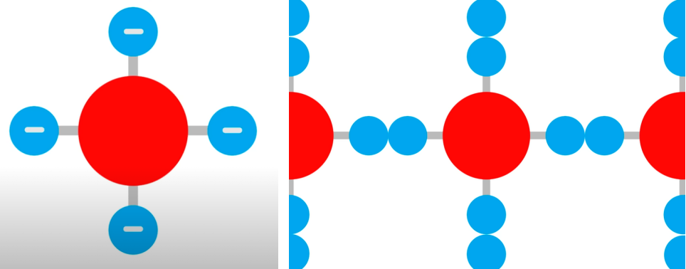
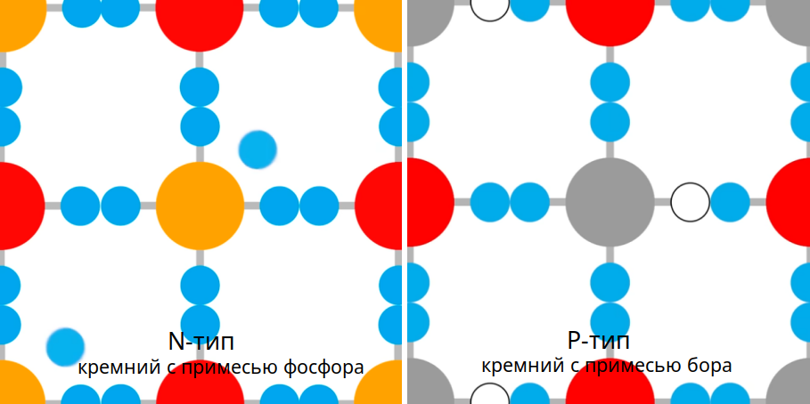
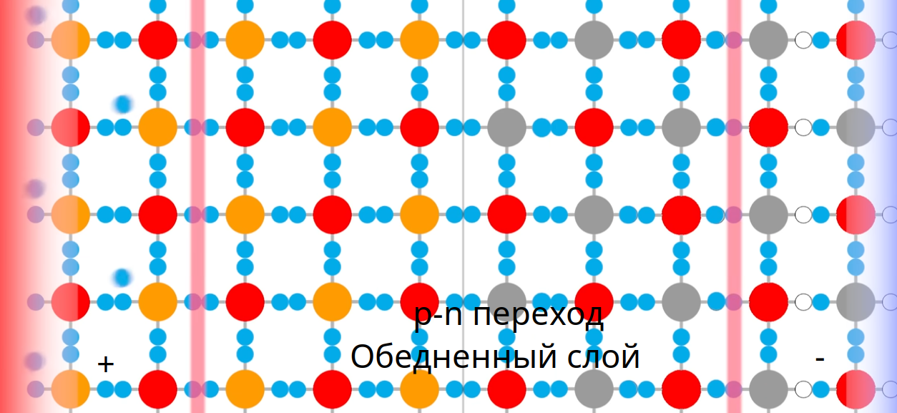
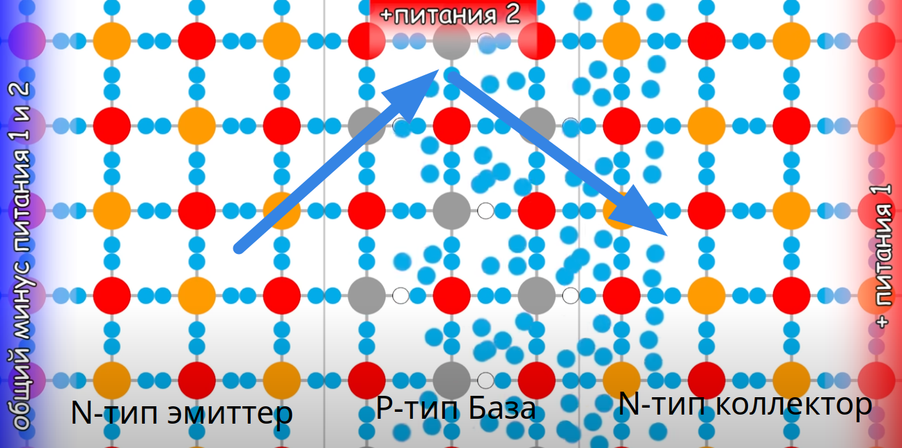
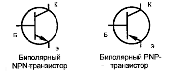

# Транзистор

### Полупроводники и транзисторы  

#### **Полупроводники**  
Полупроводники — это материалы, которые по своим электрическим свойствам занимают промежуточное положение между проводниками (металлами) и диэлектриками (изоляторами). Их главная особенность — способность изменять свою проводимость в зависимости от внешних условий, таких как температура, освещение или приложенное напряжение.  

**Примеры полупроводников:**  
- Кремний (Si) — самый распространенный материал для производства электроники  
- Германий (Ge) — используется в некоторых радиотехнических устройствах  
- Арсенид галлия (GaAs) — применяется в высокочастотной и оптоэлектронной технике  

#### **Транзистор**  
Транзистор — это полупроводниковый прибор, который используется для усиления, переключения и генерации электрических сигналов. Он является основой современной электроники, начиная от процессоров и заканчивая бытовой техникой.  

Атом кремния имеет 4 связи для формирования кристалической решетки. Чистый кремний не имеет свободных электронов, поэтому он диэлектрик т.е. у него низкая электропроводность. 

Но с добавлением примесей для образования свободных связей он превращается в полупроводник.
 
<code>N-тип</code> кремния (Negative) – кремний с примесью фосфора (P) или мышьяка (As), содержит 5 связей т.е. **избыточные** отрицательно заряженные частицы, электроны как основные носители заряда.

<code>P-тип</code> кремния (Positive) – кремний с примесью бора (B) или алюминия (Al), содержит 3 связи "**дырки**" как основные носители положительного заряда, которые притягивают свободные электроны.  Эти элементы не имеют достаточного количества электронов, и в результате образуются "дырки" – это места, где не хватает электрона.

Когда <code>N-тип</code> и <code>P-тип</code> соединяются, **образуется <code>p-n</code> переход** – основа всех полупроводниковых приборов, включая диоды, транзисторы, микросхемы.

**Обедненный слой** – на границе <code>N-тип</code> кремния c <code>P-тип</code> кремнием, в котором нет свободных связей что означает протекание тока не будет, по сути это чистый кремний.

Если положительная полярноть на стороне <code>N-тип</code> кремния, то его свободные электроны притягиваются к плюсу, тогда на стороне <code>P-тип</code> кремния отрицательная полярноть, дырки притягиваются к минусу. В итоге обедненная область расширяется, тем самым ухудшая условия для протекания тока. **При этих условиях ток не течет!**

Но если поменять полярноть, сделать отрицательную полярность для на стороне <code>N-тип</code> кремния, то его отрицательно заряженные электроны теперь стремятся притянуться к плюсу, но на пути у них стоит **барьер - обедненный слой**, что бы преодолеть (пробить) его необходимо достаточное напряжение смещения больше чем <code> 0.7 вольт</code>, тогда будет течь ток. (Эта конструкция называется кремниевый диод с pn-переходом, падение напряжения на диоде этим и обьясняется, усилие при преодолении барьера ). **При этих условия ток течет!**

У <code>NPN</code> транзистора средний слой с дырками (<code>P-тип</code> кремния), и имеет два <code>p-n</code> перехода ограждающие передвижение электронов. Коллектор хоть и является <code>N-типом</code> как и эммитер, но в коллекторе концентрация примеси (легирование) со свободными электронами намного меньше, поэтому электроны движутся от эмиттера через базу к коллектору (а направление тока, соответственно наоборот, от коллектора к эмиттеру, так уж сложилось исторически). И чем больше эта разность свободных электронов между коллектором и эмиттером тем большим током может управлять база своим малым током, называется это соотношение **коэффициент усиления $h_{FE}$**

Коэффициент усиления $h_{FE}$ показывает, во сколько раз усиливается ток базы при прохождении через транзистор.
$$h_{FE}=\frac{I_{коллектор}}{I_{база}}$$

Соотношение между током базы и током коллектора задаётся коэффициентом усиления по току:  
- $I_{коллектор} = h_{FE} \cdot I_{база}$
- Если $ h_{FE} = 100 $, а мы подадим ток базы $ I_{база} = 10$ мкА, то через коллектор пойдёт **1 мА**.

У маломощных транзисторов $h_{FE}=100-800$, у мощных $h_{FE}=10-100$. Это связано с тем, что у мощных транзисторов более крупные структуры, и их база расходует больше тока. Но коэффициент усиления это величина не постоянная, он зависит **от тока коллектора**, при среднем токе 1-10 mA усиление максимально, а при малых и больших токах усиление падает. Еще коэффициент усиления зависит **от температуры**, чем больше температура тем подвижней электроны и усиление растет. И если транзистор работает в **обратном режиме**, т.е. к коллектору подключен минус а к эмиттеру плюс, то коэффициент усиления падает в 10 и более раз, так как в коллекторе мало свободных электронов и они неохотно движутся!

**Как происходит открытие транзистора.** В общем, условие открытие происходит когда напряжение на базе больше чем напряжение на эмиттере на 0.7 вольт. Внутри транзистора это выглядит так, при подаче достаточного напряжения на базу, электроны с области <code>N-типа</code> эмиттера преодолевают свой <code>p-n</code> переход и заполняют область <code>P-типа</code> кремния т.е. базу и дальше к коллектору. В обратном режиме, тоже ток будет протекать от коллектора к эмиттеру, но из-за малого количества электронов, усиления не будет, поэтому это не прямое назначение транзистора. 

## Биполярный транзистор (BJT - Bipolar Junction Transistor) 
   - Имеет три области: **эмиттер, база и коллектор**  
   - Управляется небольшим током, подаваемым на базу  
   - Может быть **p-n-p** или **n-p-n** типа  

NPN - Основной ток течет от коллектора (N) к эмиттеру (N), если на базу подано положительное напряжение относительно эмиттера. Когда база получает небольшой положительный ток, транзистор открывается, и большой ток проходит от коллектора к эмиттеру.

PNP - Ток течет от эмиттера (P) к коллектору (P), если на базу подано отрицательное напряжение относительно эмиттера. Когда база получает небольшой отрицательный ток, транзистор открывается, и большой ток проходит от эмиттера к коллектору.

**Основное различие NPN и PNP**
| Тип | Направление основного тока | Управляющее напряжение на базе |
|------|-----------------------------|----------------------------------|
| **NPN** | От коллектора к эмиттеру | Положительное (относительно эмиттера) |
| **PNP** | От эмиттера к коллектору | Отрицательное (относительно эмиттера) |

Почему полупроводник "биполярный"? 
Дело в том, что такое название полупроводник получил из-за того, что в физических процессах, которые протекают во время его работы, участвуют все типы носителей заряда - дырки и электроны. Благодаря этому процессу, мы можем увидеть прямое влияние на принцип управления выходными сигналами.

##### **Как работает транзистор?**  
Транзистор можно представить как регулируемый кран для электрического тока:  
- В **биполярном транзисторе** небольшой ток базы управляет большим током через коллектор-эмиттер.  
- В **полевом транзисторе** напряжение на затворе изменяет проводимость канала между истоком и стоком.  

 
Основная задача транзистора - это усиливать ток,а побочно можно усилить и напряжение на зависимых от него элементах цепи.

---

### Схема с общим коллектором для усиления тока (эмиттерный повторитель)
В схеме с общим коллектором (ОК) выходной сигнал снимается с эмиттера, а коллектор подключён к питанию (+Vcc). Вход подаётся на базу транзистора.

Она часто используется в качестве буфера, потому что имеет высокое входное сопротивление и низкое выходное сопротивление. Не нагружает предыдущий каскад схемы.

.")

Эмиттерный повторитель, так как напряжение на входе в базу такое же как на выходе из эмиттера (минус падение напряжение на  <code>p-n</code> переход 0.7 вольт), усиление происходит только по току.

.")

В эмиттерном повторителе всегда есть резистор $R_{E}$ между эмиттером и землёй. Он создаёт отрицательную обратную связь для стабильной работы транзистора, так как без него ток ветви коллектор-эмиттер начнет расти и тем самым поднимет напряжение на эмиттере что ухудшит условие открывания транзистора и он начнет закрываться или наоборот сильнее открываться насыщаясь при поднятии температуры на транзисторе из-за высокого тока (так как при росте температуры увеличивается $h_{FE}$, что приводит к лавинообразному росту тока (тепловой разгон)).
Таки образом $R_{E}$ поддерживает выходное напряжение и ток!

- **Если $V_E$ попытается увеличиться**, то:  
  - Ток через $ R_E$ возрастает.  
  - Это снижает $V_{BE}$, и транзистор **закрывается сильнее** → $V_E$ опускается обратно.  

- **Если $V_E$ уменьшается**, то:  
  - Ток через $R_E$ падает.  
  - Это увеличивает $V_{BE}$, и транзистор **открывается сильнее** → $V_E$ снова поднимается.  

**Итог**: Напряжение на эмиттере **автоматически стабилизируется близко к напряжению базы**, с разницей в **0.7 В**. 
 
**Как подбирать $ R_E $?** 
    
**1. Выбираем рабочий ток $ I_E $ (почти равен $ I_C $)**  
Например, пусть нам нужен $ I_C = 10 $ мА.  

**2. Определяем напряжение на эмиттере $ V_E $**  
Обычно выбирают $ V_E \approx 10\%-20\% $ от напряжения питания $V_{CC} $.  
Например, если $ V_{CC} = 12 В $, можно взять $ V_E = 2 В $.  

**3. Рассчитываем $R_E $**  

$R_E = \frac{V_E}{I_E} = \frac{2В}{10мА} = 200 \, \Omega$

**4. Проверяем напряжение базы**  
Так как $ V_{BE} \approx 0.7 В$, напряжение на базе будет:  

$V_B = V_E + V_{BE} = 2В + 0.7В = 2.7В$

Значит, управляющее напряжение на базе должно быть около **2.7 В**.  

---

### Схема с общим эмиттером для усиления напряжения и тока  

https://www.youtube.com/watch?v=oPKx_itmNkM

Схема ОЭ – основа усилителей!

 
Если не подавать напряжение на базу то напряжение и ток на коллектор-эмиттере будет максимальным, но если начать подавать напряжение на базу то линия коллектор-эмиттер будет иметь многократное увеличение тока и напряжения,а вот на выходе т.е. на $R_{C}$ резисторе коллектора наоборот будет снижение напряжения и тока, и тем больше снижение на нем чем больше оно на базе, получается инвертированное напряжение

В схеме ОЭ:
- Входной сигнал подаётся на базу (относительно эмиттера).
- Выходной сигнал снимается с коллектора (также относительно эмиттера).
- Эмиттер является общей точкой для входной и выходной цепей (отсюда название).

**Роль резисторов в схеме ОЭ**  

**$R_C$ – коллекторный резистор**  
   - Преобразует изменения тока $ I_C $ в **изменения напряжения**.  
   - Чем больше $R_C $, тем **сильнее усиление**.  

**$R_E$ – эмиттерный резистор (если есть)**  
   - **Создаёт отрицательную обратную связь** для стабилизации схемы.  
   - Без него схема может **нестабильно работать** (может быть чувствительна к изменениям температуры).  

**$R_B$ – резистор базы (может быть два – $ R_1 $ и $ R_2 $)**  
   - Ограничивает базовый ток.  
   - Задаёт **рабочую точку** транзистора, чтобы он не был слишком закрытым или насыщенным.  

---

## Полевой транзистор (FET - Field-Effect Transistor)
   - Управляется напряжением, а не током  
   - Включает MOSFET (металло-оксидный полевой транзистор), который широко используется в микропроцессорах и силовой электронике  
