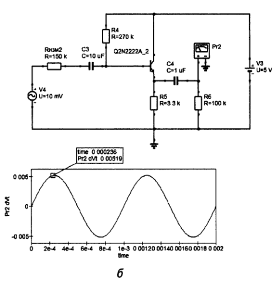

# Транзистор


### Полупроводники и транзисторы  
На замену электронных ламп пришли полупроводники.

#### **Полупроводники**  
Полупроводники — это материалы, которые по своим электрическим свойствам (удельное сопротивление) занимают промежуточное положение между проводниками (металлами) и диэлектриками (изоляторами). Их главная особенность — способность изменять свое удельное сопротивление т.е. проводимость в зависимости от внешних условий, таких как температура, освещение или приложенное напряжение.  

**Примеры полупроводников:**  
- Кремний (Si) — самый распространенный материал для производства электроники  
- Германий (Ge) — используется в некоторых радиотехнических устройствах  
- Арсенид галлия (GaAs) — применяется в высокочастотной и оптоэлектронной технике  

#### Транзистор 
Транзистор — это полупроводниковый прибор, который используется для усиления, переключения и генерации электрических сигналов. Он является основой современной электроники, начиная от процессоров и заканчивая бытовой техникой.  

<details>

<summary>Устройство транзисторов</summary>

Атом кремния имеет 4 связи для формирования кристалической решетки. Чистый кремний не имеет свободных электронов, поэтому он диэлектрик т.е. у него низкая электропроводность. 


Но с добавлением примесей для образования свободных связей он превращается в полупроводник.
 
<code>N-тип</code> кремния (Negative) – кремний с примесью фосфора (P) или мышьяка (As), содержит 5 связей т.е. **избыточные** отрицательно заряженные частицы, электроны как основные носители заряда.

<code>P-тип</code> кремния (Positive) – кремний с примесью бора (B) или алюминия (Al), содержит 3 связи "**дырки**" как основные носители положительного заряда, которые притягивают свободные электроны.  Эти элементы не имеют достаточного количества электронов, и в результате образуются "дырки" – это места, где не хватает электрона.


Когда <code>N-тип</code> и <code>P-тип</code> соединяются, **образуется <code>p-n</code> переход** – основа всех полупроводниковых приборов, включая диоды, транзисторы, микросхемы.


**Обедненный слой** – на границе <code>N-тип</code> кремния c <code>P-тип</code> кремнием, в котором нет свободных связей что означает протекание тока не будет, по сути это чистый кремний.

Если положительная полярноть на стороне <code>N-тип</code> кремния, то его свободные электроны притягиваются к плюсу, тогда на стороне <code>P-тип</code> кремния отрицательная полярноть, дырки притягиваются к минусу. В итоге обедненная область расширяется, тем самым ухудшая условия для протекания тока. **При этих условиях ток не течет!**

Но если поменять полярноть, сделать отрицательную полярность для на стороне <code>N-тип</code> кремния, то его отрицательно заряженные электроны теперь стремятся притянуться к плюсу, но на пути у них стоит **барьер - обедненный слой**, что бы преодолеть (пробить) его необходимо достаточное напряжение смещения больше чем <code> 0.7 вольт</code>, тогда будет течь ток. (Эта конструкция называется кремниевый диод с pn-переходом, падение напряжения на диоде этим и обьясняется, усилие при преодолении барьера ). **При этих условия ток течет!**

У <code>NPN</code> транзистора средний слой с дырками (<code>P-тип</code> кремния), и имеет два <code>p-n</code> перехода ограждающие передвижение электронов. Коллектор хоть и является <code>N-типом</code> как и эммитер, но в коллекторе концентрация примеси (легирование) со свободными электронами намного меньше, поэтому электроны движутся от эмиттера через базу к коллектору (а направление тока, соответственно наоборот, от коллектора к эмиттеру, так уж сложилось исторически). И чем больше эта разность свободных электронов между коллектором и эмиттером тем большим током может управлять база своим малым током, называется это соотношение **коэффициент усиления $h_{FE}$**

Коэффициент усиления $h_{FE}$ показывает, во сколько раз усиливается ток базы при прохождении через транзистор.
$$h_{FE}=\frac{I_{коллектор}}{I_{база}}$$

Соотношение между током базы и током коллектора задаётся коэффициентом усиления по току:  
- $I_{коллектор} = h_{FE} \cdot I_{база}$
- Если $ h_{FE} = 100 $, а мы подадим ток базы $ I_{база} = 10$ мкА, то через коллектор пойдёт **1 мА**.

У маломощных транзисторов $h_{FE}=100-800$, у мощных $h_{FE}=10-100$. Это связано с тем, что у мощных транзисторов более крупные структуры, и их база расходует больше тока. Но коэффициент усиления это величина не постоянная, он зависит **от тока коллектора**, при среднем токе 1-10 mA усиление максимально, а при малых и больших токах усиление падает. Еще коэффициент усиления зависит **от температуры**, чем больше температура тем подвижней электроны и усиление растет. И если транзистор работает в **обратном режиме**, т.е. к коллектору подключен минус а к эмиттеру плюс, то коэффициент усиления падает в 10 и более раз, так как в коллекторе мало свободных электронов и они неохотно движутся!

**Как происходит открытие транзистора.** В общем, условие открытие происходит когда напряжение на базе больше чем напряжение на эмиттере на 0.7 вольт. Внутри транзистора это выглядит так, при подаче достаточного напряжения на базу, электроны с области <code>N-типа</code> эмиттера преодолевают свой <code>p-n</code> переход и заполняют область <code>P-типа</code> кремния т.е. базу и дальше к коллектору. В обратном режиме, тоже ток будет протекать от коллектора к эмиттеру, но из-за малого количества электронов, усиления не будет, поэтому это не прямое назначение транзистора. 


---

</details>

## Биполярный транзистор (BJT - Bipolar Junction Transistor) 
   - Имеет три области: **эмиттер, база и коллектор**  
   - Управляется небольшим током, подаваемым на базу  
   - Может быть **p-n-p** или **n-p-n** типа  


NPN - Основной ток течет от коллектора (N) к эмиттеру (N), если на базу подано положительное напряжение относительно эмиттера. Когда база получает небольшой положительный ток, транзистор открывается, и большой ток проходит от коллектора к эмиттеру.

PNP - Ток течет от эмиттера (P) к коллектору (P), если на базу подано отрицательное напряжение относительно эмиттера. Когда база получает небольшой отрицательный ток, транзистор открывается, и большой ток проходит от эмиттера к коллектору.

.")

**Основное различие NPN и PNP**
| Тип | Направление основного тока | Управляющее напряжение на базе |
|------|-----------------------------|----------------------------------|
| **NPN** | От коллектора к эмиттеру | Положительное (относительно эмиттера) |
| **PNP** | От эмиттера к коллектору | Отрицательное (относительно эмиттера) |

Почему полупроводник "биполярный"?<br>
Дело в том, что такое название полупроводник получил из-за того, что в физических процессах, которые протекают во время его работы, участвуют все типы носителей заряда - дырки и электроны. Благодаря этому процессу, мы можем увидеть прямое влияние на принцип управления выходными сигналами.


##### **Как работает транзистор?**  
Транзистор можно представить как регулируемый кран для электрического тока:  
- В **биполярном транзисторе** небольшой ток базы управляет большим током через коллектор-эмиттер.  
- В **полевом транзисторе** напряжение на затворе изменяет проводимость канала между истоком и стоком.  

Основная задача транзистора - это усиливать ток, а побочно можно усилить и напряжение на зависимых от него элементах цепи.

Среди биполярных транзисторов (BJT) популярный NPN-тип, так как NPN проще в производстве (70-80% рынка) и совместимы с стандартными схемами и простой интеграции с интегральными микросхемами.

**ТОП-5 самых популярных биполярных (BJT) транзисторов**

- 2N3904 (NPN) — универсальный маломощный.
- BC547 (NPN) — аналог 2N3904, популярен в Европе.
- 2N2222 (NPN) — средняя мощность, до 800 мА.
- 2N3906 (PNP) — комплементарный к 2N3904.
- TIP31C (NPN) — мощный (до 3 А).


---

### 1. Схема с общим коллектором (ОК) - Common Collector (CC) или эмиттерный повторитель (Emitter Follower), для усиления тока. Для NPN-транзисторов   

В схеме с общим коллектором (ОК) выходной сигнал снимается с эмиттера, а коллектор подключён к питанию (+Vcc). Вход подаётся на базу транзистора.

В схеме ОК:
- Входной сигнал подаётся на базу относительно земли (коллектора). Коллектор обычно подключён к питанию, т.е. к общей точке схемы.
- Выходной сигнал снимается с эмиттера относительно земли (коллектора чаще всего заземлён) 
- Коллектор является общей точкой для входной и выходной цепей (отсюда и название).

Низкое выходное сопротивление , полезно для согласования высокоимпедансного источника с низкоомной нагрузкой. Она часто используется в качестве буфера, потому что имеет высокое входное сопротивление (десятки кОм) и низкое выходное сопротивление. Не нагружает предыдущий каскад схемы.

**Есть усиление по току**  
- Ток эмиттера $I_E = I_B + I_C = (\beta + 1) I_B$ 
- Коэффициент усиления по току:  
  
  $K_I = \beta + 1 \quad (\text{обычно } 50–300)$

.")

Эмиттерный повторитель, так как напряжение на входе в базу такое же как на выходе из эмиттера (минус падение напряжение на  <code>p-n</code> переход 0.7 вольт), усиление происходит только по току.

.")

В эмиттерном повторителе всегда есть резистор $R_{E}$ между эмиттером и землёй. Он создаёт отрицательную обратную связь для стабильной работы транзистора, так как без него ток ветви коллектор-эмиттер начнет расти и тем самым поднимет напряжение на эмиттере что ухудшит условие открывания транзистора и он начнет закрываться или наоборот сильнее открываться насыщаясь при поднятии температуры на транзисторе из-за высокого тока (так как при росте температуры увеличивается $h_{FE}$, что приводит к лавинообразному росту тока (тепловой разгон)).
Таки образом $R_{E}$ поддерживает выходное напряжение и ток!

- **Если $V_E$ попытается увеличиться**, то:  
  - Ток через $ R_E$ возрастает.  
  - Это снижает $V_{BE}$, и транзистор **закрывается сильнее** → $V_E$ опускается обратно.  

- **Если $V_E$ уменьшается**, то:  
  - Ток через $R_E$ падает.  
  - Это увеличивает $V_{BE}$, и транзистор **открывается сильнее** → $V_E$ снова поднимается.  

**Итог**: Напряжение на эмиттере **автоматически стабилизируется близко к напряжению базы**, с разницей в **0.7 В**. 
 

**Роль элементов в схеме ОК**

- Резистор базы ($R_B$ или делитель $R_1, R_2$) Задаёт начальное смещение базы 
    - В простейшем варианте - один резистор между базой и питанием  
    - В стабильных схемах - делитель напряжения  
    - Сопротивление должно быть достаточно большим (10-100 кОм), чтобы не нагружать источник сигнала  
 
- Резистор эмиттера $R_E$
    - Основной нагрузочный элемент  
    - Преобразует ток эмиттера в напряжение  
    - Определяет выходное сопротивление схемы  
    - Чем больше $R_E$, тем выше КПД, но меньше максимальный выходной ток 
    - Выходное сопротивление: $R_{вых} ≈ \frac{r_{бэ}}{\beta + 1} || R_E$ 

- Конденсатор связи $C_{вх}$
    - Разделяет постоянную и переменную составляющие входного сигнала  
    - Предотвращает влияние смещения на источник сигнала  
    - Расчёт ёмкости: $C_{вх} ≥ \frac{1}{2πf_{min}R_{вх}}$, где $R_{вх}$ - входное сопротивление каскада 

- Блокировочный конденсатор $C_E$
    - В классической схеме ОК обычно отсутствует  
    - Может добавляться для фильтрации высокочастотных помех  

- Источник питания $U_{пит}$
    - Обеспечивает рабочую точку транзистора  
    - Напряжение должно быть выше максимального выходного сигнала  


**Полная таблица ролей элементов в схеме с общим коллектором (ОК)**

| Элемент         | Роль в схеме ОК                                                                 |   Типовые значения                     | Что будет, если убрать? |
|-----------------|-------------------------------------------------------------------------------|--------------------------------------|-------------------------|
| **Транзистор**  | Основной активный элемент, реализует повторительное действие                   | BC547, 2N3904 (npn)                  | Схема не работает       |
| **$R_B$**     | Задаёт ток базы (в простейшем варианте)                                        | 10-100 кОм                           | Нет смещения, транзистор закрыт |
| **Делитель $R_1,R_2$** | Стабильное задание напряжения базы                                      | $R_1$=10кОм, $R_2$=4.7кОм       | Температурная нестабильность |
| **$R_E$**     | Задаёт ток эмиттера, определяет выходное сопротивление                        | 100 Ом - 1 кОм                       | Короткое замыкание выхода |
| **$C_{вх}$**  | Разделительный конденсатор, передаёт только переменный сигнал                  | 1-10 мкФ (для НЧ)                    | Постоянное смещение влияет на источник |
| **$C_E$**     | Блокировочный конденсатор (в классической схеме обычно не используется)       | 0.1-1 мкФ       | -                       |
| **$U_{пит}$** | Источник питания, обеспечивает рабочую точку                                   | 5-15 В                               | Схема не работает       |


**Как подбирать $ R_E $?** 
    
**1. Выбираем рабочий ток $ I_E $ (почти равен $ I_C $)**  
Например, пусть нам нужен $ I_C = 10 $ мА.  

**2. Определяем напряжение на эмиттере $ V_E $**  
Обычно выбирают $ V_E \approx 10\%-20\% $ от напряжения питания $V_{CC} $.  
Например, если $ V_{CC} = 12 В $, можно взять $ V_E = 2 В $.  

**3. Рассчитываем $R_E $**  

$R_E = \frac{V_E}{I_E} = \frac{2В}{10мА} = 200 \, \Omega$


**4. Проверяем напряжение базы**  
Так как $ V_{BE} \approx 0.7 В$, напряжение на базе будет:  

$V_B = V_E + V_{BE} = 2В + 0.7В = 2.7В$

Значит, управляющее напряжение на базе должно быть около **2.7 В**.  

---

### 2. Схема с общим эмиттером (ОЭ) - Common Emitter (CE), для усиления напряжения и тока. Для NPN-транзисторов 
ОЭ остаётся самой популярной схемой для усилителей НЧ и радиочастотных каскадов.

https://www.youtube.com/watch?v=oPKx_itmNkM

Она обеспечивает усиление и по току, и по напряжению, а следовательно, и по мощности, а также инвертирует фазу сигнала на 180°. Имеет среднее входное и выходное сопротивление (1–10 кОм).

В схеме ОЭ:
- Входной сигнал подаётся на базу (относительно эмиттера) т.е. между базой и эмиттером.
- Выходной сигнал снимается с коллектора (также относительно эмиттера) т.е. между коллектором и эмиттером.
- Эмиттер является общей точкой для входной и выходной цепей (отсюда и название).


 
Если не подавать напряжение на базу то напряжение и ток на выходе будет максимальным,  но если начать подавать напряжение на базу то линия коллектор-эмиттер будет иметь многократное увеличение тока и напряжения,а вот на выходе т.е. на $R_{C}$ резисторе коллектора наоборот будет снижение напряжения и тока, и тем больше снижение на нем чем больше оно на базе, получается инвертированное напряжение.


**Роль элементов в схеме ОЭ**  

- $R_C$ – коллекторный нагрузочный резистор 
   - Преобразует изменения тока $I_C$ в выходное **изменения напряжения** $U_{вых} = U_{пит} - I_C \cdot R_C$.  
   - Чем больше $R_C $, тем **сильнее усиление** по напряжению, но тем сильнее ограничение по максимальному току.
   - Определяет коэффициент усиления по напряжению: $K_U \approx -\frac{R_C}{r_{э}}, \quad \text{где } r_{э} = \frac{25\ \text{мВ}}{I_E}$
   - Выбор значения:
    - Большой $R_C$ → выше усиление, но меньше максимальный выходной ток. 
    - Малый $R_C$ → меньше усиление, но выше стабильность.

- $R_E$ – эмиттерный резистор (если есть), cтабилизатор
   - **Создаёт отрицательную обратную связь** для увеличения термостабилизации схемы, но снижает усиление. 
   - Уменьшает нелинейные искажения.
   - Без него схема может **нестабильно работать** (может быть чувствительна к изменениям температуры).  
   - Если параллельно $R_E$ (зашунтирован) добавлен $C_E$, то для переменного сигнала $R_E$ "исчезает", и усиление возрастает.
   - Как работает: При росте $I_C$ → растёт $I_E$ → падение напряжения на $R_E$ увеличивается → $U_{BE}$ уменьшается → ток $I_B$ стабилизируется.  

- $R_B$ – резистор базы (может быть два – $R_1$ и $R_2$)  
   - Ограничивает базовый ток.  
   - Задаёт **рабочую точку** транзистора, начальный ток базы $I_B$, чтобы он не был слишком закрытым или насыщенным. 
   - При двух резисторах, делает схему стабильнее — делитель напряжения. Расчёт для делителя: $U_B \approx \frac{R_2}{R_1 + R_2} \cdot U_{пит}, \quad I_B = \frac{U_B - 0.7\ \text{В}}{R_E \cdot (\beta + 1)}$ 

- Конденсатор эмиттера $C_E$
    - Шунтирует $R_E$ **для переменного сигнала**, увеличивая усиление.  
    - Без него усиление падает:  $K_U \approx -\frac{R_C}{R_E + r_{э}}$
    - С ним:  $K_U \approx -\frac{R_C}{r_{э}} \quad (\text{усиление максимально})$
    - Выбор ёмкости: Должен иметь низкое сопротивление на рабочей частоте: $X_C = \frac{1}{2\pi f C_E} \ll R_E$. Обычно $C_E \geq 10\ \text{мкФ}$ (для звукового диапазона).

- Конденсаторы связи $C_{вх}$, $C_{вых}$
    - $C_{вх}$ — пропускает переменный сигнал на базу, блокируя постоянное смещение.  
    - $C_{вых}$ — отделяет усиленный сигнал от постоянного напряжения коллектора.  
    
    Как выбрать:
    - Ёмкость должна быть такой, чтобы $X_C$ была мала на минимальной частоте:  $C \geq \frac{1}{2\pi f_{min} R_{вх/вых}}$
    - Например, для $f_{min} = 20\ \text{Гц}$ и $R_{вх} = 1\ \text{кОм}$:  $C_{вх} \geq \frac{1}{2\pi \cdot 20 \cdot 1000} \approx 8\ \text{мкФ}$

- Источник питания $U_{пит}$
    - Напряжение должно быть достаточным для работы $R_C$ и $R_E$.

- Нагрузка $R_{нагр}$
    - Роль - внешнее сопротивление (например, следующий каскад или динамик).
    - Влияние на схему: Уменьшает усиление, так как образует делитель с $R_C$: $K_U \approx -\frac{R_C \parallel R_{нагр}}{r_{э}}$


**Итоговая таблица ролей элементов**  


| Элемент         | Роль в схеме ОЭ                                                                 | Типовые значения                     | Что будет, если убрать? |
|-----------------|--------------------------------------------------------------------------------|--------------------------------------|-------------------------|
| **Транзистор**  | Усиливает сигнал ($I_C = \beta I_B$).                                        | BC547, 2N3904 (NPN), КТ315 (СССР)   | Нет усиления.           |
| **$R_B$**       | Задаёт ток базы $I_B$ (или делитель $R_1, R_2$).                          | 10 кОм – 1 МОм (для $R_B$)<br>10 кОм/2.2 кОм (для делителя) | Транзистор закроется или войдёт в насыщение. |
| **$R_C$**       | Преобразует $I_C$ в выходное напряжение.                                     | 1–10 кОм (зависит от $U_{пит}$)     | Нет выхода (коллектор "висит" в воздухе). |
| **$R_E$**       | Стабилизирует ток, уменьшает искажения.                                        | 100 Ом – 2 кОм                      | Схема становится нестабильной. |
| **$C_E$**       | Увеличивает усиление по переменному току.                                      | 10–100 мкФ (для НЧ)                 | Усиление падает.        |
| **$C_{вх}$**    | Пропускает сигнал на базу, блокирует постоянное смещение.                     | 1–10 мкФ (для НЧ)<br>0.1–1 мкФ (для ВЧ) | Нарушается рабочая точка. |
| **$C_{вых}$**   | Отделяет выходной сигнал от постоянного напряжения.                           | 1–100 мкФ (для НЧ)<br>0.01–1 мкФ (для ВЧ) | На выходе будет постоянная составляющая. |
| **$U_{пит}$**   | Обеспечивает питание.                                                         | 5–15 В (для маломощных схем)        | Схема не работает.      |
| **$R_{нагр}$**  | Внешняя нагрузка (следующий каскад).                                          | 1–100 кОм                           | Усиление максимально, но возможны искажения. |


---

### 3. Схема с общей базой (ОБ) - Common Base (CB), для усиление только напряжения. Для NPN-транзисторов 
Если важно высокое быстродействие и малое искажение — применяют ОБ (общая база).  Идеальный выбор для ВЧ-усилителей. Схема ОБ лучше работает на высоких частотах, чем ОЭ, из-за отсутствия эффекта Миллера (емкость перехода база-коллектор не усиливается).

https://youtu.be/oPKx_itmNkM?t=463

В схеме ОБ:
- **Входной сигнал** подаётся **между эмиттером и базой** (база заземлена по переменному току через конденсатор).  
- **Выходной сигнал** снимается **между коллектором и базой** (база остаётся общей точкой).  
- **База** — общий электрод для входа и выхода (отсюда название "общая база").  

Усиление по напряжению (обычно 10–200)

Фаза не инвертируется: если $U_{вх}$ растёт → $U_{вых}$ тоже растёт.

Входное сопротивление Низкое (десятки Ом), так как ток эмиттера $I_E$ зависит от $U_{вх}$

Выходное сопротивление Очень высокое (~$R_C$), как в схеме ОЭ.

**Роль элементов в схеме ОБ** 
- Резистор в эмиттере $R_E$ — задаёт ток $I_E$, задаёт рабочую точку транзистора. Чем больше $R_E$ тем меньше $I_E$ и тем ниже усиление. Если $R_E$ слишком мал → возможен перегрев транзистора.
- Резистор в коллекторе $R_C$ — формирует выходное напряжение. Преобразует ток коллектора $I_C$ в выходное напряжение $U_{вых}=I_C\cdot R_C$. Определяет коэффициент усиления по напряжению: $K_U \approx \frac{R_C}{r_э}$, где $r_э=\frac{25 mB}{I_E}$
  Выбор значения $R_C$:
  - Большой $R_C$ → выше усиление, но меньше максимальный ток. 
  - Малый $R_C$ → меньше усиление, но выше стабильность.
- Конденсатор $C_B$ — шунтирует базу на землю по переменному току, делая её "общей" для сигнала. Подавляет пульсации питания и помехи. Ёмкость должна быть такой, чтобы на рабочей частоте его сопротивление $X_C=\frac{1}{2 \pi f\cdot C}$ было много меньше входного сопротивления схемы. Обычно используют $C_B\geq 1\ мкФ$  (для НЧ) или 10 – 100 нФ 10–100 нФ (для ВЧ).
- $U_{пит}$ - Обеспечивает смещение транзистора в активный режим. Напряжение должно быть достаточным для работы $R_C$ и $R_E$
- Конденсатор связи $C_{вх}$ — пропускает переменный сигнал на эмиттер, блокируя постоянную составляющую. Ёмкость должна быть такой, чтобы $X_C$ была мала на минимальной рабочей частоте.
- Конденсатор связи $C_{вых}$ — отделяет выходной сигнал от постоянного напряжения коллектора. Ёмкость должна быть такой, чтобы $X_C$ была мала на минимальной рабочей частоте.
- Внешнее сопротивление $R_{нагр}$, подключённое к выходу (например, следующий каскад или динамик). Уменьшает усиление, так как образует делитель с $R_C$. Чем больше $R_{нагр}$ тем ближе усиление к расчётному.

**Итоговая таблица ролей элементов**  

| Элемент         | Роль в схеме ОБ                                                                 | Типовые значения                     | Что будет, если убрать? |
|-----------------|--------------------------------------------------------------------------------|--------------------------------------|-------------------------|
| **Транзистор**  | Усиливает сигнал, управляет током $I_C$ в зависимости от $I_E$.            | BF199 (ВЧ), 2N3904 (НЧ), КТ368 (СССР) | Схема не работает.      |
| **$R_E$**       | Задаёт ток эмиттера $I_E$, определяет входное сопротивление.                 | 100 Ом – 5 кОм (зависит от тока)    | Транзистор может сгореть (неограниченный $I_E$). |
| **$R_C$**       | Преобразует $I_C$ в выходное напряжение, задаёт усиление.                    | 1–10 кОм (для $U_{пит}$=5–15 В)     | Нет выхода (коллектор "висит" в воздухе). |
| **$C_B$**       | Делает базу "общей" для переменного сигнала.                                   | 10 нФ – 1 мкФ (для ВЧ схем)         | База не заземлена → схема теряет свойства ОБ. |
| **$U_{пит}$**   | Обеспечивает питание и смещение.                                               | 5–15 В (маломощные схемы)           | Транзистор закрыт, усиления нет. |
| **$C_{вх}$**    | Пропускает входной сигнал, блокирует постоянное напряжение.                    | 1–10 мкФ (НЧ), 0.1–1 мкФ (ВЧ)       | Нарушается смещение.    |
| **$C_{вых}$**   | Отделяет усиленный сигнал от постоянного напряжения.                           | 1–100 мкФ (НЧ), 0.01–1 мкФ (ВЧ)     | На выходе будет постоянная составляющая. |
| **$R_{нагр}$**  | Внешняя нагрузка (например, следующий каскад).                                 | 1–100 кОм                           | Усиление максимально, но возможны искажения. |


```admonish info
Для PNP-транзисторов схемы аналогичны, но с критическими отличиями в полярности напряжений и направлении токов. 
```
 
---

## Полевой транзистор (FET - Field-Effect Transistor)
- Для высокочастотных схем: N-MOSFET
- Для мощных нагрузок: N-MOSFET
- Управляется напряжением, а не током  
- Включает MOSFET (металло-оксидный полевой транзистор), который широко используется в микропроцессорах и силовой электронике  

.")

**Типы FET и их применение**
| Тип                | Особенности                     | Где используют?               |
|--------------------|---------------------------------|-------------------------------|
| **MOSFET (N/P)**   | Управление напряжением, высокий ток | БП, моторы, процессоры       |
| **JFET (N/P)**     | Низкий шум, линейность          | Аудиоусилители, ВЧ-схемы     |
| **IGBT**           | Гибрид MOSFET + BJT             | Инверторы, промышленность    |
| **GaN/SiC FET**    | Сверхвысокие частоты/мощность   | 5G, электромобили, спутники  |

```admonish info
Полевые транзисторы (FET, MOSFET, JFET) применяют, когда биполярные (BJT) не справляются.
```

**Главные преимущества FET перед BJT**
| Характеристика          | Полевые транзисторы (FET)       | Биполярные транзисторы (BJT)  |
|-------------------------|----------------------------------|--------------------------------|
| **Управление**          | Напряжением ($U_{GS}$)        | Током базы ($I_B$)           |
| **Входное сопротивление** | Очень высокое (ГигаОмы)       | Низкое (килоОмы)               |
| **Потребляемая мощность** | Практически нулевая (в статике) | Требует тока базы              |
| **Скорость переключения** | Высокая (до ГГц)               | Средняя (до сотен МГц)         |
| **Мощность/нагрев**     | Меньше потерь ($R_{DS(on)}$)  | Больше потерь ($V_{CE(sat)}$)|
| **Шум**                 | Низкий (идеально для аудио)     | Выше (особенно на ВЧ)          |

**Если кратко:**  
- **Выбирайте BJT** для простых аналоговых схем и ремонтной замены.  
- **Выбирайте FET** для цифровой логики, мощных ключей и ВЧ-устройств.  
- **Выбирайте IGBT/GaN** для промышленности и экстремальных условий.  


**Где и зачем используют FET?**

**1. Цифровая электроника (логика, процессоры)**
- Почему? 
  MOSFET (особенно **CMOS-технология**) позволяют создавать микросхемы с:  
  - Минимальным энергопотреблением (важно для батареек).  
  - Высокой плотностью элементов (миллиарды транзисторов в CPU).  
- Примеры:  
  - Логические элементы (NAND, NOR).  
  - Память (DRAM, Flash).  
  - Современные процессоры (Intel, AMD).  

**2. Импульсные источники питания (DC-DC, инверторы)**

- Почему? 
  - MOSFET быстро переключаются (меньше потерь на нагрев).  
  - Могут работать с высокими токами (до сотен Ампер).  
- Примеры:  
  - Блоки питания ПК.  
  - Зарядные устройства (USB-PD).  
  - Электромобили (преобразователи напряжения).  

**3. Аналоговые усилители (низкий шум)**

- Почему? 
  - JFET и MOSFET дают меньше шума, чем BJT.  
  - Высокое входное сопротивление (не нагружает источник сигнала).  
- Примеры:  
  - Микрофонные предусилители.  
  - Высококачественные аудиоусилители.  

**4. ВЧ-устройства (радио, антенны)**

- Почему? 
  - FET работают на высоких частотах (ГГц) без искажений.  
  - Малая ёмкость затвора (важно для антенн).  
- Примеры: 
  - Радиопередатчики.  
  - СВЧ-усилители (Wi-Fi, 5G).  

**5. Мощные ключи (моторы, реле, светодиоды)**

- Почему?  
  - MOSFET выдерживают токи до 100+ А (например, **IRF3205**).  
  - Почти нет падения напряжения в открытом состоянии (\(R_{DS(on)} \approx 0.01\ Ом\)).  
- Примеры: 
  - Драйверы моторов (Arduino, дроны).  
  - Управление светодиодными лентами.  


Наиболее популярные **N-канальные MOSFET**. Примеры моделей IRFZ44N, 2N7000

**ТОП-5 самых популярных полевых (FET) транзисторов**

- IRFZ44N (N-MOSFET) — мощный, до 49 А.
- 2N7000 (N-MOSFET) — маломощный, для логики.
- IRF9Z34N (P-MOSFET) — комплементарный к IRFZ44N.
- J113 (N-JFET) — для аналоговых схем.
- BS170 (N-MOSFET) — аналог 2N7000.


