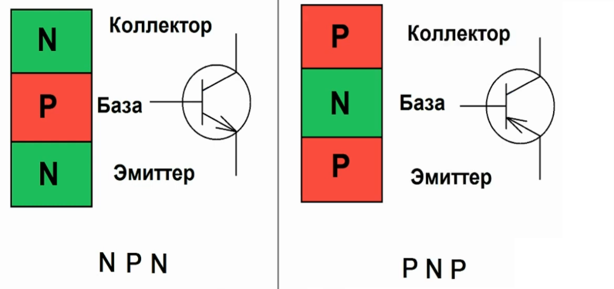

# Транзистор


[Поиск даташитов www.alldatasheet.com](https://www.alldatasheet.com/)

### Полупроводники и транзисторы  
На замену электронных ламп пришли полупроводники.

#### **Полупроводники**  
Полупроводники — это материалы, которые по своим электрическим свойствам (удельное сопротивление) занимают промежуточное положение между проводниками (металлами) и диэлектриками (изоляторами). Их главная особенность — способность изменять свое удельное сопротивление т.е. проводимость в зависимости от внешних условий, таких как температура, освещение или приложенное напряжение.  

**Примеры полупроводников:**  
- Кремний (Si) — самый распространенный материал для производства электроники  
- Германий (Ge) — используется в некоторых радиотехнических устройствах  
- Арсенид галлия (GaAs) — применяется в высокочастотной и оптоэлектронной технике  

#### Транзистор 
Транзистор — это полупроводниковый прибор, который используется для усиления (сам транзистор ничего не может усилить он **создает усиленную копию входного сигнала** используя ток от источника выходного питания, в смысле малым источником тока например фотоэлементом который выдает малый ток но достаточный для открытия базы, можно управлять большим проходящим током через коллектор-эмиттер), переключения и генерации электрических сигналов. Он является основой современной электроники, начиная от процессоров и заканчивая бытовой техникой.  

Если потребляемый ток нагрузки больше, чем максимальный отдаваемый ток Вашего устройства, то нужно увеличить ток. Для этого обычно испоьзуют транзисторы.

<details>

<summary>Устройство транзисторов</summary>

Атом кремния имеет 4 связи для формирования кристалической решетки. Чистый кремний не имеет свободных электронов, поэтому он диэлектрик т.е. у него низкая электропроводность. 


Но с добавлением примесей для образования свободных связей он превращается в полупроводник.
 
<code>N-тип</code> кремния (Negative) – кремний с примесью фосфора (P) или мышьяка (As), содержит 5 связей т.е. **избыточные** отрицательно заряженные частицы, электроны как основные носители заряда.

<code>P-тип</code> кремния (Positive) – кремний с примесью бора (B) или алюминия (Al), содержит 3 связи "**дырки**" как основные носители положительного заряда, которые притягивают свободные электроны.  Эти элементы не имеют достаточного количества электронов, и в результате образуются "дырки" – это места, где не хватает электрона.


Когда <code>N-тип</code> и <code>P-тип</code> соединяются, **образуется <code>p-n</code> переход** – основа всех полупроводниковых приборов, включая диоды, транзисторы, микросхемы.


**Обедненный слой** – на границе <code>N-тип</code> кремния c <code>P-тип</code> кремнием, в котором нет свободных связей что означает протекание тока не будет, по сути это чистый кремний.

Если положительная полярноть на стороне <code>N-тип</code> кремния, то его свободные электроны притягиваются к плюсу, тогда на стороне <code>P-тип</code> кремния отрицательная полярноть, дырки притягиваются к минусу. В итоге обедненная область расширяется, тем самым ухудшая условия для протекания тока. **При этих условиях ток не течет!**

Но если поменять полярноть, сделать отрицательную полярность для на стороне <code>N-тип</code> кремния, то его отрицательно заряженные электроны теперь стремятся притянуться к плюсу, но на пути у них стоит **барьер - обедненный слой**, что бы преодолеть (пробить) его необходимо достаточное напряжение смещения больше чем <code> 0.7 вольт</code>, тогда будет течь ток. (Эта конструкция называется кремниевый диод с pn-переходом, падение напряжения на диоде этим и обьясняется, усилие при преодолении барьера ). **При этих условия ток течет!**

У <code>NPN</code> транзистора средний слой с дырками (<code>P-тип</code> кремния), и имеет два <code>p-n</code> перехода ограждающие передвижение электронов. Коллектор хоть и является <code>N-типом</code> как и эммитер, но в коллекторе концентрация примеси (легирование) со свободными электронами намного меньше, поэтому электроны движутся от эмиттера через базу к коллектору (а направление тока, соответственно наоборот, от коллектора к эмиттеру, так уж сложилось исторически). И чем больше эта разность свободных электронов между коллектором и эмиттером тем большим током может управлять база своим малым током, называется это соотношение **коэффициент усиления $h_{FE}$**

Коэффициент усиления $h_{FE}$ показывает, во сколько раз усиливается ток базы при прохождении через транзистор.
$$h_{FE}=\frac{I_{коллектор}}{I_{база}}$$

Соотношение между током базы и током коллектора задаётся коэффициентом усиления по току:  
- $I_{коллектор} = h_{FE} \cdot I_{база}$
- Если $ h_{FE} = 100 $, а мы подадим ток базы $ I_{база} = 10$ мкА, то через коллектор пойдёт **1 мА**.

У маломощных транзисторов $h_{FE}=100-800$, у мощных $h_{FE}=10-100$. Это связано с тем, что у мощных транзисторов более крупные структуры, и их база расходует больше тока. Но коэффициент усиления это величина не постоянная, он зависит **от тока коллектора**, при среднем токе 1-10 mA усиление максимально, а при малых и больших токах усиление падает. Еще коэффициент усиления зависит **от температуры**, чем больше температура тем подвижней электроны и усиление растет. И если транзистор работает в **обратном режиме**, т.е. к коллектору подключен минус а к эмиттеру плюс, то коэффициент усиления падает в 10 и более раз, так как в коллекторе мало свободных электронов и они неохотно движутся!

**Как происходит открытие транзистора.** В общем, условие открытие происходит когда напряжение на базе больше чем напряжение на эмиттере на 0.7 вольт. Внутри транзистора это выглядит так, при подаче достаточного напряжения на базу, электроны с области <code>N-типа</code> эмиттера преодолевают свой <code>p-n</code> переход и заполняют область <code>P-типа</code> кремния т.е. базу и дальше к коллектору. В обратном режиме, тоже ток будет протекать от коллектора к эмиттеру, но из-за малого количества электронов, усиления не будет, поэтому это не прямое назначение транзистора. 


---

</details>

## Биполярный транзистор (BJT - Bipolar Junction Transistor) 

<details>

<summary>Проверка работоспособности транзисторов</summary>

Чаще всего, сгорают в схемах транзисторы. Проверить их на работоспособность очень просто. Для начала, стоит прозвонить переходы База-Эмиттер и База-Коллектор. Они должны проводить ток в одном направлении, но не пускать в обратном. В зависимости от того, ПНП это транзистор или НПН, ток они будут проводить к Базе или от Базы. Для удобства, можем представить его в виде двух диодов

Так же стоит прозвонить переход Эмиттер-Коллектор. Точнее это 2 перехода. . . Ну в прочем не суть. В любом транзисторе, ток не должен проходить через них в любом направлении, пока транзистор закрыт. Если же на Базу подали напряжение, то ток протекая через переход База-Эмиттер откроет транзистор, и сопротивление перехода Эмиттер-Коллектор резко упадёт, почти до нуля. Учтите, что падение напряжения на переходах транзистора обычно не ниже 0,6В. А у сборных транзисторов (Дарлингтонов) более 1,2В. По этому некоторые «китайские» мультиметры с батарейкой в 1,5В просто не смогут их открыть. Не поленитесь/поскупитесь достать себе мультиметр с «Кроной»!

Учтите, что в некоторых современных транзисторах параллельно с цепью Коллектор-Эмиттер встроен диод. Так что стоит изучить даташит на Ваш транзистор, если Коллектор-Эмиттер звонится в одну сторону!

Если хотя бы одно из утверждений не подтверждается, то транзистор нерабочий. Но прежде чем заменить его, проверьте оставшиеся детали. Возможно причина в них!

---

</details>

   - Имеет три области: **эмиттер, база и коллектор**  
   - Управляется небольшим током, подаваемым на базу  
   - Может быть **p-n-p** или **n-p-n** типа  



NPN - Основной ток течет от коллектора (N) к эмиттеру (N), если на базу подано положительное напряжение 0.7 вольт относительно эмиттера. Когда база получает небольшой положительный ток, транзистор открывается, и большой ток проходит от коллектора к эмиттеру.


PNP - Ток течет от эмиттера (P) к коллектору (P), если на базу подано отрицательное напряжение относительно эмиттера. Когда база получает небольшой отрицательный ток, транзистор открывается, и большой ток проходит от эмиттера к коллектору.

.")

**Основное различие NPN и PNP**
| Тип | Направление основного тока | Управляющее напряжение на базе |
|------|-----------------------------|----------------------------------|
| **NPN** | От коллектора к эмиттеру | Положительное (относительно эмиттера) |
| **PNP** | От эмиттера к коллектору | Отрицательное (относительно эмиттера) |

Почему полупроводник "биполярный"?<br>
Дело в том, что такое название полупроводник получил из-за того, что в физических процессах, которые протекают во время его работы, участвуют все типы носителей заряда - дырки и электроны. Благодаря этому процессу, мы можем увидеть прямое влияние на принцип управления выходными сигналами.


##### **Как работает транзистор?**  
Транзистор можно представить как регулируемый кран для электрического тока:  
- В **биполярном транзисторе** небольшой ток базы управляет большим током через коллектор-эмиттер.  
- В **полевом транзисторе** напряжение на затворе изменяет проводимость канала между истоком и стоком.  

Основная задача транзистора - это усиливать ток, а побочно можно усилить и напряжение на зависимых от него элементах цепи.

Среди биполярных транзисторов (BJT) популярный NPN-тип, так как NPN проще в производстве (70-80% рынка) и совместимы с стандартными схемами и простой интеграции с интегральными микросхемами.

**ТОП-5 самых популярных биполярных (BJT) транзисторов**

- 2N3904 (NPN) — универсальный маломощный.
- BC547 (NPN) — аналог 2N3904, популярен в Европе.
- 2N2222 (NPN) — средняя мощность, до 800 мА.
- 2N3906 (PNP) — комплементарный к 2N3904.
- TIP31C (NPN) — мощный (до 3 А).

---

# Схемы включения транзистора

Для использования транзистора в качестве "усилителя" (это не усилитель как таковой, это управленец с помощью малого сигнала, большим сигналом) напряжения, тока или мощности входной сигнал, который надо получить но усиленный, подают на два каких-либо электрода и с двух электродов снимают усиленный сигнал. При этом один из электродов обязательно будет общим, чем и определяется название способа включения транзистора. 

Т.е. вывод транзистора, который не участвует в передаче сигнала (сигнал это не плюс питания схемы, сигнал это например слабая синусоида от антенны) является общим! 
- В схеме с **ОЭ** именно эмиттер не участвует ни в приеме сигнала ни в выводе, так как вход идет на базу, а вывод сигнала с коллектора и с общего провода т.е. эмиттера.
   - Тут сигнал подается на базу, а + DC питание на коллектор
- А в схеме с **ОК**, коллектор не участвует ни в приеме ни в выводе сигнала, так как вход идет на базу, а вывод сигнала с эмиттера и с общего провода т.е. коллетора.
   - Тут сигнал подается на базу, а + DC питание на коллектор
- Схема с **ОБ**, вход идет на эмиттер, а вывод сигнала с коллектора и с общего провода т.е. базы.
   - Тут сигнал подается на эмиттер, а + DC питание на коллектор


Во избежание ошибок при этом надо помнить, что под входом (выходом) понимают точки, между которыми дей­ствует входное (выходное) **переменное напряжение**. 
Не следует рассматривать вход и выход по постоянному напря­жению. Т.е. DC питание всегда подается на коллектор для правильной работы NPN транзистора. 

Подразделять схемы по тому, какой электрод является общей точкой входной и выходной цепи, также не следует, так как в одной из схем эти цени совмещены в одну цепь и все ее точки являются общими.

---

# Характеристики транзистора

Необходимые данные о конкретном транзисторе (из [даташитов www.alldatasheet.com](https://www.alldatasheet.com/)), что-бы использовать его в схеме.

1. **Входная характеристика** транзистора. Это зависимость тока базы от напряжения между базой и эмиттером. 
Входная характеристика похожа у всех транзисторов одной мощностной группы. 
Это отношение приращения наряжения на базе к приращению тока базы. На графике при 0.6 вольт напряжения между базой и эмиттером, ток на базы будет 38 мкА


2. **Выходные характеристики**. Графики зависимости тока коллектора от напряжения между коллектором и эмиттером.
Это показания при разных токах базы. Это отношение приращения напряжения к приращению тока коллектора.


3. **Передаточная (переходная) характеристика**. Это зависимость тока коллектора от напряжения на базе.

    $I_S$ - это обратный ток, который зависит температуры и от напряжения коллектор-эмиттер
    $U_T$ - это термический (температурный) потенциал, при комнатной температуре 20 градусов равен 25 мВ

 характеристика.")

Крутизна это соотношение преращения тока коллектора к преращению наряжения базы-эмиттер, при постоянном коллекторном напряжении $S=\frac{I_C}{U_T}$

4. Характеристики $B$ и $\beta$ транзистора ($\beta=\frac{I_{вых\ К}}{I_{вх\ Б}}$ коэффициент усиления, показывает во сколько раз выходной ток коллектора $I_C$ больше входного тока базы $I_B$, а точнее **каким током $I_B$ можно открыть транзистор через базу, чтобы через цепь коллекто-эмиттер пошел заданный ток $I_C$** )

    $B$ - статический коэффициент передачи тока (в справочниках он как $h_{21э}$)

    $\beta$ - дифференциальный (динамический) коэффициент передачи тока

    $h_{FE}=\frac{I_C}{I_B}$ - Hybrid parameter forward current gain, common emitter

    Обычно дифференциальный коэффициент не намного больше статического коэффициент, поэтому для простоты расчетов принимают их равными.

    В справочник дают разброс $\beta=400\dots 1000$, но его можно измерить мультиметром (в транзисторе KT3102EM  мультиметр показывает $\beta=565$)

    


5. Предельные характеристики

    - предельный ток коллектора $I_C$
    - максимальное напряжение коллектор-эмиттер $V_{CEO}$
    - максимальная рассеиваемая мощность Power Dissipation $P_{tot} = V_{CE} \cdot I_C$ и следовательно максимально возможный ток коллектора, исходя из мощности транзистора $I_{C,\text{max}} = \frac{P_{tot}}{V_{CE}}$

    

6. Сопротивления переходов 
- базы-эмиттер влияет на входное сопротивление (можно найти по входнаым характеристикам)
- коллектор-эмиттер влияет на выходное сопротивление каскада (можно найти по выходным характеристикам)

---
 

## Полевой транзистор (FET - Field-Effect Transistor)
Книга "Книга "Паоло Аливерти. Электроника для начинающих - самый простой пошаговый самоучитель" стр. 138" стр. 152

<details>

<summary>Проверка работоспособности транзисторов</summary>

У исправного полевого транзистора между всеми его выводами должно быть бесконечное сопротивление. Причем бесконечное сопротивление прибор должен показывать независимо от прикладываемого тестового напряжения. Следует заметить, что имеются некоторые исключения.

Если при проверке приложить положительный щуп тестового прибора к затвору транзистора n-типа, а отрицательный — к истоку, зарядится емкость затвора и транзистор откроется. При замере сопротивления между стоком и истоком прибор покажет некоторое сопротивление. Неопытные ремонтники могут принять такое поведение транзистора за его неисправность. Поэтому перед «прозвонкой» канала «сток-исток» замкните накоротко все ножки транзистора, чтобы разрядить емкость затвора. После этого сопротивление сток-исток должно стать бесконечным. В противном случае транзистор признается неисправным.

Учтите ещё, что в современных мощных полевых транзисторах между стоком и истоком имеется встроенный диод поэтому канал «сток-исток» при проверке ведет себя как обычный диод. Для того чтобы избежать досадных ошибок, помните о наличии такого диода и не примите это за неисправность транзистора. Проверить это легко, пролистав даташит на Ваш экземпляр.

---

</details>

Для управления нагрузкой, ток которой составляет десятки ампер(особо мощные электродвигатели, лампы и тд) применяется полевой транзистор.

- Для высокочастотных схем: N-MOSFET
- Для мощных нагрузок: N-MOSFET
- Управляется напряжением, а не током  
- Включает MOSFET (металло-оксидный полевой транзистор), который широко используется в микропроцессорах и силовой электронике  

.")

MOSFET транзисторы (metal–oxide–semiconductor field-effect transistor), (Метал Оксид Полупроводник (МОП)) – это  полевые транзисторы, не путать с обычными полевиками! У полевых транзисторов три вывода: G - затвор, D - сток, S – исток. Различают N канальный и Р, в обозначении данных транзисторов имеется диод Шоттки, он пропускает ток от истока к стоку, и ограничивает напряжение сток – исток.


Применяются они в основном для коммутации больших токов, управляются они не током, как биполярные транзисторы, а напряжением, и как правило, имеет очень малое сопротивление открытого канала, сопротивление канала величина постоянная и не зависит от тока. MOSFET транзисторы специально разработаны для ключевых схем, можно сказать как замена реле, но в некоторых случаях можно и усиливать, применяются в мощных усилителях НЧ.

**Плюсы у данных транзисторов следующие:**
- Минимальная мощность управления и большой коэффициент усиления по току
- Лучшие характеристики, например большая скорость переключения.
- Устойчивость к большим импульсам напряжения.
- Схемы, где применяются такие транзисторы, обычно более простые.

**Минусы:**
- Стоят дороже, чем биполярные транзисторы.
- Боятся статического электричества.
- Наиболее часто для коммутации силовых цепей применяют MOSFET с N-каналом. Напряжение управления должно превышать порог 4 В, вообще, необходимо 10-12 В для надежного включения MOSFET. Напряжение управления - это  напряжение, приложенное между затвором и истоком для включения MOSFET транзистора.


**Типы FET и их применение**
| Тип                | Особенности                     | Где используют?               |
|--------------------|---------------------------------|-------------------------------|
| **MOSFET (N/P)**   | Управление напряжением, высокий ток | БП, моторы, процессоры       |
| **JFET (N/P)**     | Низкий шум, линейность          | Аудиоусилители, ВЧ-схемы     |
| **IGBT**           | Гибрид MOSFET + BJT             | Инверторы, промышленность    |
| **GaN/SiC FET**    | Сверхвысокие частоты/мощность   | 5G, электромобили, спутники  |

```admonish info
Полевые транзисторы (FET, MOSFET, JFET) применяют, когда биполярные (BJT) не справляются.
```

**Главные преимущества FET перед BJT**
| Характеристика          | Полевые транзисторы (FET)       | Биполярные транзисторы (BJT)  |
|-------------------------|----------------------------------|--------------------------------|
| **Управление**          | Напряжением ($U_{GS}$)        | Током базы ($I_B$)           |
| **Входное сопротивление** | Очень высокое (ГигаОмы)       | Низкое (килоОмы)               |
| **Потребляемая мощность** | Практически нулевая (в статике) | Требует тока базы              |
| **Скорость переключения** | Высокая (до ГГц)               | Средняя (до сотен МГц)         |
| **Мощность/нагрев**     | Меньше потерь ($R_{DS(on)}$)  | Больше потерь ($V_{CE(sat)}$)|
| **Шум**                 | Низкий (идеально для аудио)     | Выше (особенно на ВЧ)          |

**Если кратко:**  
- **Выбирайте BJT** для простых аналоговых схем и ремонтной замены.  
- **Выбирайте FET** для цифровой логики, мощных ключей и ВЧ-устройств.  
- **Выбирайте IGBT/GaN** для промышленности и экстремальных условий.  


**Где и зачем используют FET?**

**1. Цифровая электроника (логика, процессоры)**
- Почему? 
  MOSFET (особенно **CMOS-технология**) позволяют создавать микросхемы с:  
  - Минимальным энергопотреблением (важно для батареек).  
  - Высокой плотностью элементов (миллиарды транзисторов в CPU).  
- Примеры:  
  - Логические элементы (NAND, NOR).  
  - Память (DRAM, Flash).  
  - Современные процессоры (Intel, AMD).  

**2. Импульсные источники питания (DC-DC, инверторы)**

- Почему? 
  - MOSFET быстро переключаются (меньше потерь на нагрев).  
  - Могут работать с высокими токами (до сотен Ампер).  
- Примеры:  
  - Блоки питания ПК.  
  - Зарядные устройства (USB-PD).  
  - Электромобили (преобразователи напряжения).  

**3. Аналоговые усилители (низкий шум)**

- Почему? 
  - JFET и MOSFET дают меньше шума, чем BJT.  
  - Высокое входное сопротивление (не нагружает источник сигнала).  
- Примеры:  
  - Микрофонные предусилители.  
  - Высококачественные аудиоусилители.  

**4. ВЧ-устройства (радио, антенны)**

- Почему? 
  - FET работают на высоких частотах (ГГц) без искажений.  
  - Малая ёмкость затвора (важно для антенн).  
- Примеры: 
  - Радиопередатчики.  
  - СВЧ-усилители (Wi-Fi, 5G).  

**5. Мощные ключи (моторы, реле, светодиоды)**

- Почему?  
  - MOSFET выдерживают токи до 100+ А (например, **IRF3205**).  
  - Почти нет падения напряжения в открытом состоянии (\(R_{DS(on)} \approx 0.01\ Ом\)).  
- Примеры: 
  - Драйверы моторов (Arduino, дроны).  
  - Управление светодиодными лентами.  


Наиболее популярные **N-канальные MOSFET**. Примеры моделей IRFZ44N, 2N7000

**ТОП-5 самых популярных полевых (FET) транзисторов**

- IRFZ44N (N-MOSFET) — мощный, до 49 А.
- 2N7000 (N-MOSFET) — маломощный, для логики.
- IRF9Z34N (P-MOSFET) — комплементарный к IRFZ44N.
- J113 (N-JFET) — для аналоговых схем.
- BS170 (N-MOSFET) — аналог 2N7000.


**Основные параметры, определяющие рабочую точку FET:**

- Ток стока покоя (IdQ): Постоянный ток, протекающий через сток транзистора при отсутствии входного сигнала.
- Напряжение сток-исток покоя (VdsQ) или напряжение сток-затвор покоя (VgsQ): Постоянное напряжение между стоком и истоком или стоком и затвором транзистора при отсутствии входного сигнала.