# BJT NPN. Схема с общим эмиттером

### [Схема с общим эмиттером (ОЭ)](https://www.youtube.com/watch?v=zlOYcJJ3jBo) - Common Emitter (CE), для усиления напряжения и тока. Для NPN-транзисторов 
ОЭ остаётся самой популярной схемой для усилителей НЧ и радиочастотных каскадов.

Она обеспечивает усиление $A=10 \dots 2500\ раз$ и по току, и по напряжению, а следовательно, и по мощности, а также инвертирует фазу сигнала на 180°. Имеет среднее входное (1–50 кОм) и большое выходное сопротивление равное от $R_C\to \infty$ $\approx 100\ кОм $ .

В схеме ОЭ:
- Входной сигнал подаётся на базу (относительно эмиттера) т.е. между базой и эмиттером.
- Выходной сигнал снимается с коллектора (также относительно эмиттера) т.е. между коллектором и эмиттером.
- Эмиттер является общей точкой для входной и выходной цепей (отсюда и название).

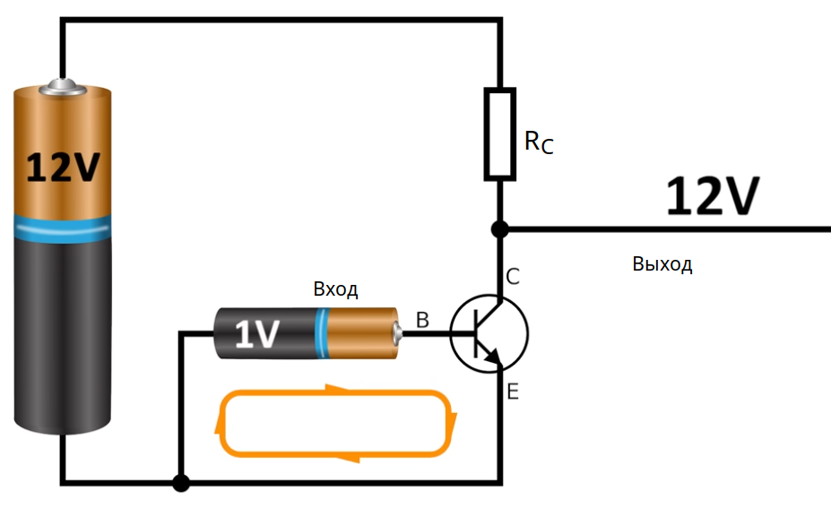
 
Если не подавать напряжение на базу то напряжение и ток на выходе будет максимальным,  но если начать подавать напряжение на базу то линия коллектор-эмиттер будет иметь многократное увеличение тока и напряжения,а вот на выходе т.е. на $R_{C}$ резисторе коллектора наоборот будет снижение напряжения и тока, и тем больше снижение на нем чем больше оно на базе, получается инвертированное напряжение.

- Когда напряжение на базе растёт → база-эмиттерный переход сильнее открыт → ток базы растёт → ток коллектора $I_{C}$ тоже растёт (потому что транзистор усиливает). 
- Больше ток через коллекторный резистор $R_{C}$ → по закону Ома падение напряжения на нём растёт
- Значит, **напряжение на коллекторе падает**, потому что: $U_{C}=U_{вх}-I_{C}\cdot R_{C}$, получается инвертированное напряжение.

**Коефициент передачи $A$ усиления по напряжению**.
Так как сопротивление резисторов в цепи коллектора намного меньше сопротивления коллектор-эмиттер, поэтому им пренебрегаем. Но учитываем сопротивление нагрузки, оно подключается параллельно коллектору. Просто увеличить сопротивление резистора коллектора при этом не уменьшая тока нельзя но можно в качестве сопротивления использовать источник тока

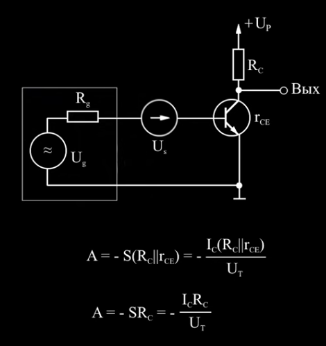

Предельный случай максимального усиления $\mu$. Предел модуля коеффициента передачи

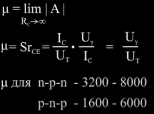

Для предельного случая найдем входное напряжение чтобы коеффициент гармоник не превышал 1%

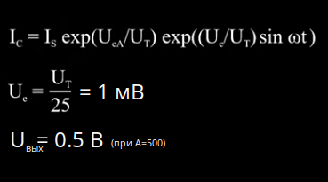

Вообщем такая схема может подойти либо где полезные сигналы очень малы либо не учитывают коеффициент гармоник. 
Что бы сделать схему более линейной необходимо ввести **отрицательную обратную связь**!

**1. Отрицательная обратная связь** - это связь которая уменьшает (корректирует) ошибку системы. Дает температурную стабильность и повторяемость.

**Последовательная отрицательная обратная связь по току**, за это отвечает резистор эмиттрера $R_E$. Когда на эмиттере есть достаточное напряжение, сопротивление $R_E$ создаёт обратную связь по току → если ток возрастает, падает $U_{E}$ → закрывает базу → стабилизирует ток.

- при малом напряжении на эмиттере 0.2 вольта, ток через делитель напряжения к базе будет относительно маленьким.
Это приводит к заниженному напряжению базы относительно входного напряжения, что делает делитель напряжение менее эффективным. Так же низкое напряжение базы приводит к низкому току базы и в следствии к низкому усилению транзистора.
- при среднем напряжении на эмиттере 1.5 вольта, ток через делитель достаточно большой. Оптимальный вариант.
- при большом напряжении на эмиттере 3.5 вольта, ток через делитель будет уже довольно большим. Завышенное напряжение базы приводит к ограниченной амплитуде напряжения коллектора. Неэффективно иметь больший ток на базе в плане энергопотребления.

$A$ - это коеффициент усиления, а $r_e$ - это входное сопротивление, а выходное сопротивление примерно равно сопротивлению в коллектороной цепи. 

Параллельная обратная связь по напряжению

**Параллельная обратная связь по напряжению**, за это отвечает резистор эмиттрера $R_N$ и $R_1$. И если $R_1$ на порядок больше чем $R_N$ то коэффициент связи $A$ можно упростить.

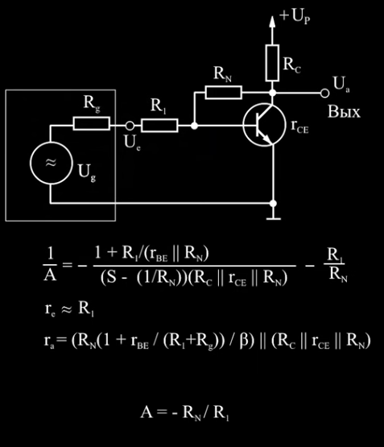

**2. Рабочая точка (Operating Point) транзистора** — это конкретный набор значений постоянного тока и напряжения (напряжение смещения) на выводах транзистора в отсутствие входного сигнала переменного тока. Она определяет режим работы транзистора по постоянному току и является исходным состоянием, вокруг которого будет происходить усиление или коммутация переменного сигнала.

Рабочая точка должна быть чуть больше 0.6 вольт на базе (для транзисторов из германия - 0.2 вольта, транзисторы из германия (устарелые) имеют обратные токи на порядки больше чем у кремниевых транзисторов)

В случае использования на входе переменного сигнала, это смещение "приподнимает" весь входной сигнал таким образом, чтобы даже самая нижняя точка отрицательной полуволны находилась выше порогового напряжения отпирания транзистора.

Основные параметры, определяющие рабочую точку BJT:
- Ток коллектора покоя (IcQ): Постоянный ток, протекающий через коллектор транзистора при отсутствии входного сигнала.
- Напряжение коллектор-эмиттер покоя (VceQ): Постоянное напряжение между коллектором и эмиттером транзистора при отсутствии входного сигнала.
- Также могут быть важны ток базы покоя (IbQ) и напряжения на других выводах.

Режим транзистора. Для аналоговых схем (например, усилителя), транзистор должен быть:
- не в насыщении (где он как замкнутый ключ), транзистор входит в насыщение, когда: $U_C ≤ U_B+0.7\ В$. На практике если $U_C < 1\ вольта$ то он уже в насыщении т.е. полностью открыт.
  Теоретический максимум (при насыщении) тока коллектора: $I_{C(sat)}\approx \frac{U_{вх}}{R_C}$

- и не в отсечке (где он вообще не проводит)
- а в **активной области** $U_C > 1$ — где он как усилитель.
- если делаешь **усилитель** — рабочая точка нужна, чтобы он усиливал сигнал линейно, без искажений.
- если ты делаешь **ключ** (например, в ШИМ или логике) — тогда тебе важно, чтобы он быстро переходил между насыщением и отсечкой.
 
Какая рабочая точка считается "хорошей" (для усилителя)?
1. $U_{CE}$ (напряжение коллектор-эмиттер) должно быть примерно половиной от $Vcc$ — тогда у сигнала будет максимум запаса по амплитуде, вверх и вниз, и не будет уходить ни в насыщение ни в отсечку.
2. $I_C$ (ток коллектора) должен быть в разумных пределах 200 µA - 10 mA (0.0002 A - 0.01 A): не слишком маленький (плохое усиление), и не слишком большой (нагрев, потери). Часто берут 1–2 мА для небольших сигналов.
3. $U_{E}$ (напряжение на эмиттере) 1-2 вольта, чтобы получалось хорошее смещение
4. $U_{B}$ (напряжение на базе) $U_{E}$ + 0.7 вольт $\approx 1.7-2.7\ вольт$

 

**Рабочая точка через делитель наряжения $R_1$ и $R_2$**. А на вход и выход напряжение идет через конденсаторы. Но из-за отсутвия резистора обратной связи в цепи эмиттера трудно подобрать входное напряжение поэтому используют подстроечный для $R_2$. к тому же такая схема чувствительна к температурному дрейфу 1 градус уменьшает наряжение база-эмиттер на 2 мили-вольта,а на выходе он усилится в $A$ раз. Но эта схема выгодней чем рабочая точка через установку базового тока

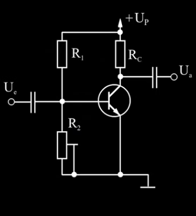

Вместо подстроечного резистора можно использовать потенциометр:

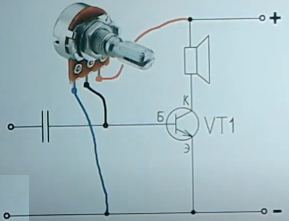

Рабочая точка через установку базового тока

**Рабочая точка через установку базового тока**. 
Базой ток известен, поэтому по закону Ома можно расчитать сопротивление для $R_1$. 
Для германиевых (устарелых) транзисторов надо учесть величину обратного тока коллектор-база так он будет складываться с базовым током.
Присутвует температурная зависимость коефициента обратной связи, на 1% при увеличении на 1 градус

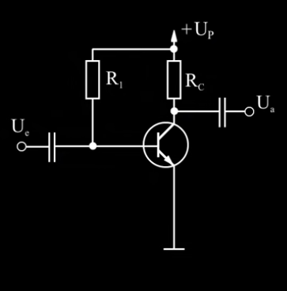

**Пример 1. Расчет рабочей точки транзистора в активном режиме:**

[Расчет, рабочей точки через делитель напряжения $R_1$ и $R_2$ с обратной связью по току через $R_E$](https://youtu.be/zlOYcJJ3jBo?t=1618)

Входные данные:
- $\beta=250$ – коэффициент усиления тока (для простоты расчета, статический и дифференциальный коэффициенты передачи тока равны)
- $I_C=200\ µA$ (коллекторный ток выберем небольшим, так что бы входное сопротивление было побольше)
- $U_{вх}=12\ V$

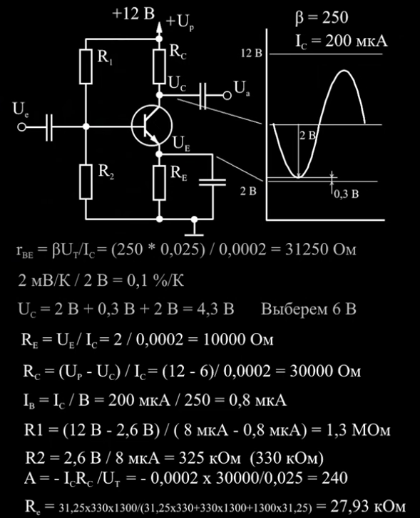

Входной импеданс усилителя ОЭ (со стороны базы) :
- входное сопротивление $r_{BE} \approx \frac{U_T}{I_B}=\frac{0.025}{0.0000008}=31250\ Om$ (где $U_T=0.025\ V$ при комнатной температуре)

Выбор $U_E$ потенциала эмиттера (2 Вольта) при отсутвии сигнала, чем он больше тем меньше температурная нестабильность (0.1%/K)

Выбор $U_C$ потенциала коллектора, учтем ситуацию, напряжение между коллектором и эмиттером при максимальном сигнале не должно уменьшится до напряжения насищения 0.3 Вольта и при этом потенциал коллектора не должен быть большим что бы не снизить коеффициент усиления, тогда выберем входное напряжение 2 Вольта относительно потенциала коллектора. Потенциал коллектора должен быть больше суммы потенциала эмиттера $U_E=2$ и амплитуды входного сигнала 0.3 Вольта и запаса на насищение (2 Вольта), итого 4.3 Вольта, округлим до $U_C=6\ Вольт$

Рассчитаем номинал сопротивление резистора коллектора $R_C=30000\ Om$ и эмиттера $R_E=10000\ Om$

Рассчитаем базовый делитель $R_1$, $R_2$. 
- Имеем $U_E=2\ Вольта$ то  $U_B=U_E+0.6=2.6\ Вольта$.
- А ток базы $I_B=\frac{I_C}{B}=0.8\ mkA$.
- Выберем ток протекающий через делитель $R_1$, $R_2$ в 10 раз больше тока базы т.е. $I_{делителя}=8\ mkA$, тогда $R_1=\frac{U_P-U_B}{I_{делителя}-I_B}=1.3\ MOm$, а $R_2=\frac{U_B}{I_{делителя}}=325\ kOm$ (330 kOm, ближайщее из ряда E24)

Входное сопротивление каскада $R_e=27.93\ kOm$ это будет параллельное сопротивление всех сопротивлений базового делителя $R_1$, $R_2$ и сопротивление база-эмиттер

Коеффициент усиления не нагруженного каскада $A=240$

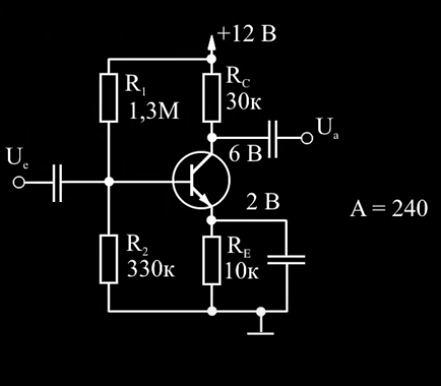

**Вывод**: каскад по схеме с общим эмиттером можно сделать с большим расбросом коеффициента по напряжению до тысяч раз.
Схема с общим эмиттером поворачивает фазу на 180 градусов.
Входное сопротивление не большое от 1 kOm до 10 kOm. Выходное сопротивление относительно большое. Схема является источником тока.

**Роль элементов в схеме ОЭ**  

- $R_C$ – коллекторный нагрузочный резистор 
   - Преобразует изменения тока $I_C$ в выходное **изменения напряжения** $U_{вых} = U_{пит} - I_C \cdot R_C$.  
   - Чем больше $R_C $, тем **сильнее усиление** по напряжению, но тем сильнее ограничение по максимальному току.
   - Определяет коэффициент усиления по напряжению: $K_U \approx -\frac{R_C}{r_{э}}, \quad \text{где } r_{э} = \frac{25\ \text{мВ}}{I_E}$
   - Выбор значения:
    - Большой $R_C$ → выше усиление, но меньше максимальный выходной ток. 
    - Малый $R_C$ → меньше усиление, но выше стабильность.

- $R_E$ – эмиттерный резистор (если есть), cтабилизатор
   - **Создаёт отрицательную обратную связь** для увеличения термостабилизации схемы, но снижает усиление. 
   - Уменьшает нелинейные искажения.
   - Без него схема может **нестабильно работать** (может быть чувствительна к изменениям температуры).  
   - Если параллельно $R_E$ (зашунтирован) добавлен $C_E$, то для переменного сигнала $R_E$ "исчезает", и усиление возрастает.
   - Как работает: При росте $I_C$ → растёт $I_E$ → падение напряжения на $R_E$ увеличивается → $U_{BE}$ уменьшается → ток $I_B$ стабилизируется.  

- $R_B$ – резистор базы (может быть два – $R_1$ и $R_2$)  
   - Ограничивает базовый ток.  
   - Задаёт **рабочую точку** транзистора, начальный ток базы $I_B$, чтобы он не был слишком закрытым или насыщенным. 
   - При двух резисторах, делает схему стабильнее — делитель напряжения. Расчёт для делителя: $U_B \approx \frac{R_2}{R_1 + R_2} \cdot U_{пит}, \quad I_B = \frac{U_B - 0.7\ \text{В}}{R_E \cdot (\beta + 1)}$ 

- Конденсатор эмиттера $C_E$
    - Шунтирует $R_E$ **для переменного сигнала**, увеличивая усиление.  
    - Без него усиление падает:  $K_U \approx -\frac{R_C}{R_E + r_{э}}$
    - С ним:  $K_U \approx -\frac{R_C}{r_{э}} \quad (\text{усиление максимально})$
    - Выбор ёмкости: Должен иметь низкое сопротивление на рабочей частоте: $X_C = \frac{1}{2\pi f C_E} \ll R_E$. Обычно $C_E \geq 10\ \text{мкФ}$ (для звукового диапазона).

- Конденсаторы связи $C_{вх}$, $C_{вых}$
    - $C_{вх}$ — пропускает переменный сигнал на базу, блокируя постоянное смещение. Защищает и транзистор и источник сигнала от сигнала выхода т.е. защищает источник сигнала от постоянного сигнала.  
    - $C_{вых}$ — отделяет усиленный сигнал от постоянного напряжения коллектора.  
    
    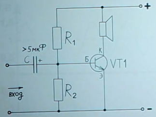

    Как выбрать:
    - Ёмкость должна быть такой, чтобы $X_C$ была мала на минимальной частоте:  $C \geq \frac{1}{2\pi f_{min} R_{вх/вых}}$
    - Например, для $f_{min} = 20\ \text{Гц}$ и $R_{вх} = 1\ \text{кОм}$:  $C_{вх} \geq \frac{1}{2\pi \cdot 20 \cdot 1000} \approx 8\ \text{мкФ}$

- Источник питания $U_{пит}$
    - Напряжение должно быть достаточным для работы $R_C$ и $R_E$.

- Нагрузка $R_{нагр}$
    - Роль - внешнее сопротивление (например, следующий каскад или динамик).
    - Влияние на схему: Уменьшает усиление, так как образует делитель с $R_C$: $K_U \approx -\frac{R_C \parallel R_{нагр}}{r_{э}}$

**Итоговая таблица ролей элементов**  

| Элемент         | Роль в схеме ОЭ                                                                 | Типовые значения                     | Что будет, если убрать? |
|-----------------|--------------------------------------------------------------------------------|--------------------------------------|-------------------------|
| **Транзистор**  | Усиливает сигнал ($I_C = \beta I_B$).                                        | BC547, 2N3904 (NPN), КТ315 (СССР)   | Нет усиления.           |
| **$R_B$**       | Задаёт ток базы $I_B$ (или делитель $R_1, R_2$).                          | 10 кОм – 1 МОм (для $R_B$) 10 кОм/2.2 кОм (для делителя) | Транзистор закроется или войдёт в насыщение. |
| **$R_C$**       | Преобразует $I_C$ в выходное напряжение.                                     | 1–10 кОм (зависит от $U_{пит}$)     | Нет выхода (коллектор "висит" в воздухе). |
| **$R_E$**       | Стабилизирует ток, уменьшает искажения.                                        | 100 Ом – 2 кОм                      | Схема становится нестабильной. |
| **$C_E$**       | Увеличивает усиление по переменному току.                                      | 10–100 мкФ (для НЧ)                 | Усиление падает.        |
| **$C_{вх}$**    | Пропускает сигнал на базу, блокирует постоянное смещение.                     | 1–10 мкФ (для НЧ) 0.1–1 мкФ (для ВЧ) | Нарушается рабочая точка. |
| **$C_{вых}$**   | Отделяет выходной сигнал от постоянного напряжения.                           | 1–100 мкФ (для НЧ) 0.01–1 мкФ (для ВЧ) | На выходе будет постоянная составляющая. |
| **$U_{пит}$**   | Обеспечивает питание.                                                         | 5–15 В (для маломощных схем)        | Схема не работает.      |
| **$R_{нагр}$**  | Внешняя нагрузка (следующий каскад).                                          | 1–100 кОм                           | Усиление максимально, но возможны искажения. |

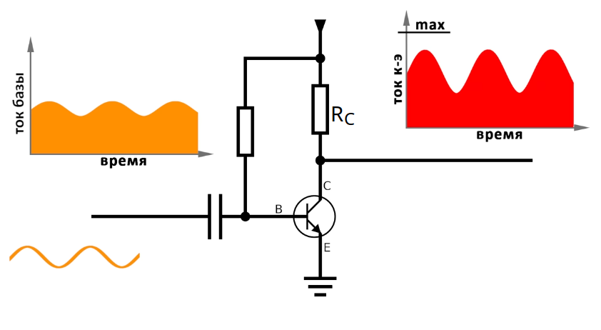

---

# Пример 2. Расчета рабочей точки транзистора в активном режиме

Входные данные:
- $U_{вх}=12\ вольт$
- транзистор 2N2222A, hFE=250 экспирементально в активном режиме  

Предустановки:
- $U_{CE}=\frac{U_{вх}}{2}=6\ V$ (что-бы не выходить из активного режима)
- $I_C\approx I_E=0.0002\ A=200\ \mu A$  (если ток коллектора велик (например, 2 мА), то будет $r_{BE}$ относительно мал, и это приведет к необходимости выбора очень маленького сопротивления для $R_2$, что в свою очередь вызовет высокий ток через делитель, что нежелательно.)  
- $I_B=\frac{I_C}{\beta}= \frac{0.0002}{50}=0.000004\ A$ ($4\ \mu A$) для надежности hFE=50
- $U_E=2\ V$   
- $U_B=U_E+0.7=2.7\ V$

Тогда:
- $U_{C}=U_{CE}+U_{E}=6+2=8\ V$
- $R_C=\frac{U_{вх}-U_{C}}{I_C}=\frac{12-8}{0.0002}=20000\ \Omega$ (В ряду E24 ближайшим номиналом будет 20000 Ом)
- $R_E=\frac{U_E}{I_E}=\frac{2}{0.0002}=10000 \ \Omega$ (В ряду E24 ближайшим номиналом будет 10000 Ом)

- Подберем сопротивления резисторов $R_1$, $R_2$ для делителя напряжения

    Входное динамическое сопротивление $r_{BE}$ подключено параллельно нижнему резистору $R_{2}$, они образуеют $R_{экв}$ которое значительно ниже $R_{2}$, что снижает $𝑈_𝐵$. Чтобы делитель работал точно: Нужно, чтобы $R_{2} \ll r_{BE}$ или проще: ток через делитель должен быть в 10 раз больше, чем $I_B$

    Самое важное условие — ток через делитель!

    Чтобы делитель не "проваливался", ток через него $I_{div} \ge 10\cdot I_B$  
    
    $I_{div} = 20\cdot 0.000004=0.00008\ A$

    $R_{общ}=\frac{U_{вх}}{I_{div}} = \frac{12}{0.00008} = 150000\ \Omega$

    $U_B = U_{вх} \cdot \frac{R_2}{R_1 + R_2}\Rightarrow \frac{R_2}{R_1 + R_2} = \frac{U_B}{U_{вх}}= \frac{2.7}{12}=0.225$

    $R_2 = 0.225\cdot R_{общ} = 0.225\cdot 150000=33750\ \Omega$ (В ряду E24 ближайшим номиналом будет 33000 Ом) 

    $R_1 = R_{общ} - R_2 = 150000- 33750=116250\ \Omega$ (В ряду E24 ближайшим номиналом будет 120000 Ом)

    Перерасчет $U_B$ c реальными номиналами резисторов делителя: 
    - $U_B = U_{вх} \cdot \frac{R_2}{R_1 + R_2}= 12 \cdot \frac{33000}{120000 + 33000} = 2.59\ V$ (по прежнему больше на 0.7 вольт напряжения эмиттера)
    - $I_{div}=\frac{U_{вх}}{R_{общ}}= \frac{12}{120000 + 33000}=0.000078\ A$ (по прежнему в 20 раз больше тока базы)

---

    ​$r_{BE}=\frac{U_{T}}{I_B}= \frac{0.025}{0.000001333}=18755\ \Omega$ 
    (где $U_{T} \approx 0.025\ V$ при комнатной температуре $20^\circ$ (термическое напряжение))

    Исходим из того что $R_2 \ll r_{BE}$ примерно в 10 раз: 
    - $R_2 = \frac{r_{BE}}{10} = \frac{18755}{10}=1876\ \Omega$
    - $R_1=R_2 \cdot (\frac{U_{вх}}{U_B} - 1)=1876 \cdot (\frac{12}{2.7} - 1)=6462\ \Omega$

    Проверка тока делителя $I_{div}$ 
    - $R_{общ}=R_1 + R_2 = 1876 + 6462 = 8338\ \Omega$
    - $I_{div}=\frac{U_{вх}}{R_{общ}}=\frac{12}{8338}=0.0014\ A$ 

    **ток делителя $I_{div}$ в 1000 раз больше тока базы, и $r_{BE}$ в 10 раз больше $R_2$**

    А если пойти от тока делителя тогда $R_{общ}=\frac{U_{вх}}{I_{div}}=\frac{12}{0.00002666} = 450112\ \Omega$

    тогда 
    - $R_2= \frac{r_{BE}}{10} =1875\ \Omega$ и 
    - $R_1=R_{общ}-R_2=448236\ \Omega$
    - $U_B = U_{вх} \cdot \frac{R_2}{R_1 + R_2} = 12 \cdot \frac{1875}{448236 + 1875}=0.05\ V$ что мало, должно быть больше чем на эмиттере,  но для увеличения напряжения надо увеличить R2 что приведет уменьшению разницы с $r_{BE}$, можно поднять напряжение входа и hFE тоже плавает

---

$R_{общ}=\frac{U_{вх}}{I_{div}}=\frac{12}{0.0002}=60000\ \Omega$

найдем соотношение резисторов: $U_B = U_{вх} \cdot \frac{R_2}{R_1 + R_2} \Rightarrow \frac{U_B}{U_{вх}}=\frac{R_2}{R_1 + R_2}$

подставим $R_1 + R_2 = R_{общ}$: $\frac{U_B}{U_{вх}}=\frac{R_2}{R_{общ}} \Rightarrow R_2 = \frac{U_B}{U_{вх}}\cdot R_{общ} = \frac{2.7}{12}\cdot 60000 = 13500\ \Omega$ и $R_1 = R_{общ} - R_2 = 46500\ \Omega$

Условие $R_{общ} \lll r_{BE}$ 

---

Начнем с $R_E$ последовательной отрицательной обратной связи по току

1. Зададим напряжение на участке коллектор-эмиттер

  
   
   $I_C$ (ток коллектора) должен быть в разумных пределах 200 µA - 10 mA (0.0002 A - 0.01 A): не слишком маленький (плохое усиление), и не слишком большой (нагрев, потери). Часто берут 1–2 мА для небольших сигналов.

   Выберим $R_C$ сопротивление коллекторного резистора 

2. Подберем сопротивления резисторов для делителя напряжения

При расчёте делителя напряжения $R_1 + R_2$: Входное динамическое сопротивление $r_{BE}$ подключен параллельно нижнему резистору $R_{2}$, они образуеют $R_{экв}$ которое значительно ниже $R_{2}$, что снижает $𝑈_𝐵$. Чтобы делитель работал точно: Нужно, чтобы $R_{2} \ll r_{BE}$ или проще: ток через делитель должен быть в 10 раз больше, чем $I_B$
 
​$r_{BE}=\frac{U_{T}}{I_B}$ (где $U_{T} \approx 0.025\ V$ при комнатной температуре $20^\circ$ (термическое напряжение))

Формула делителя для напряжение базы: 
$U_B = U_{вх} \cdot \frac{R_2}{R_1 + R_2}$

Напряжение на базе $U_{B}$ должно быть в диапазоне $U_{E}$ + 0.7 вольт $\approx 1.7-2.7\ вольт$, при этом напряжение на эмиттере
$U_{E}$ 1-2 вольта, чтобы получалось хорошее смещение.

При этом значения сопротивлений делителя должны быть "жёстким" таким $I_{R_1,R_2}=\frac{U_{вх}}{R_1+R_2}$, что бы ток через них был $\geq$ 10 раз, чем ток базы.

   $U_{С}$ > $U_{B}$

4. $U_{B}$ (напряжение на базе) $U_{E}$ + 0.7 вольт $\approx 1.7-2.7\ вольт$  

3. $U_{E}$ (напряжение на эмиттере) 1-2 вольта, чтобы получалось хорошее смещение 