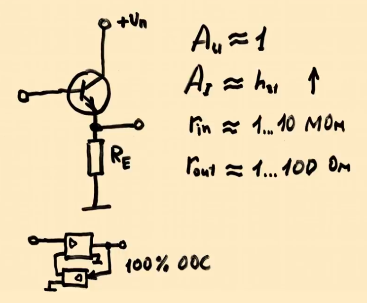

# BJT NPN. Схема с общим коллектором

Книга "Ревич Ю. В. - Занимательная электроника. 6-е изд (2021)" стр. 124

### Схема с общим коллектором (ОК) - Common Collector (CC) или эмиттерный повторитель (Emitter Follower), для усиления тока. Для NPN-транзисторов   

Коеффициент усиления $A$ по току большой, а по напряжению отсутвует. Поэтому эту схему часто используют в стабилизаторах напряжения.
Имеет большое входное сопротивление и маленькое выходное сопротивление.

В схеме с общим коллектором (ОК) выходной сигнал снимается с эмиттера, а коллектор подключён к питанию (+Vcc). Вход подаётся на базу транзистора. Имеет хорошие линейные свойства так как охвачен 100% обратной связью по напряжению.

В схеме ОК:
- Входной сигнал подаётся на базу относительно земли (коллектора). Коллектор обычно подключён к питанию, т.е. к общей точке схемы.
- Выходной сигнал снимается с эмиттера относительно земли (коллектора чаще всего заземлён) 
- Коллектор является общей точкой для входной и выходной цепей (отсюда и название).

Низкое выходное сопротивление , полезно для согласования высокоимпедансного источника с низкоомной нагрузкой. Она часто используется в качестве буфера, потому что имеет высокое входное сопротивление (десятки кОм) и низкое выходное сопротивление. Не нагружает предыдущий каскад схемы.

**Есть усиление по току**  
- Ток эмиттера $I_E = I_B + I_C = (\beta + 1) I_B$ 
- Коэффициент усиления по току:  
  
  $K_I = \beta + 1 \quad (\text{обычно } 50–300)$

.")

Эмиттерный повторитель, так как напряжение на входе в базу такое же как на выходе из эмиттера (минус падение напряжение на  <code>p-n</code> переход 0.7 вольт), усиление происходит только по току.

.")

В эмиттерном повторителе всегда есть резистор $R_{E}$ между эмиттером и землёй. Он создаёт отрицательную обратную связь для стабильной работы транзистора, так как без него ток ветви коллектор-эмиттер начнет расти и тем самым поднимет напряжение на эмиттере что ухудшит условие открывания транзистора и он начнет закрываться или наоборот сильнее открываться насыщаясь при поднятии температуры на транзисторе из-за высокого тока (так как при росте температуры увеличивается $h_{FE}$, что приводит к лавинообразному росту тока (тепловой разгон)).
Таки образом $R_{E}$ поддерживает выходное напряжение и ток!

- **Если $V_E$ попытается увеличиться**, то:  
  - Ток через $ R_E$ возрастает.  
  - Это снижает $V_{BE}$, и транзистор **закрывается сильнее** → $V_E$ опускается обратно.  

- **Если $V_E$ уменьшается**, то:  
  - Ток через $R_E$ падает.  
  - Это увеличивает $V_{BE}$, и транзистор **открывается сильнее** → $V_E$ снова поднимается.  

**Итог**: Напряжение на эмиттере **автоматически стабилизируется близко к напряжению базы**, с разницей в **0.7 В**. 
 

**Роль элементов в схеме ОК**

- Резистор базы ($R_B$ или делитель $R_1, R_2$) Задаёт начальное смещение базы 
    - В простейшем варианте - один резистор между базой и питанием  
    - В стабильных схемах - делитель напряжения  
    - Сопротивление должно быть достаточно большим (10-100 кОм), чтобы не нагружать источник сигнала  
 
- Резистор эмиттера $R_E$
    - Основной нагрузочный элемент  
    - Преобразует ток эмиттера в напряжение  
    - Определяет выходное сопротивление схемы  
    - Чем больше $R_E$, тем выше КПД, но меньше максимальный выходной ток 
    - Выходное сопротивление: $R_{вых} ≈ \frac{r_{бэ}}{\beta + 1} || R_E$ 

- Конденсатор связи $C_{вх}$
    - Разделяет постоянную и переменную составляющие входного сигнала  
    - Предотвращает влияние смещения на источник сигнала  
    - Расчёт ёмкости: $C_{вх} ≥ \frac{1}{2πf_{min}R_{вх}}$, где $R_{вх}$ - входное сопротивление каскада 

- Блокировочный конденсатор $C_E$
    - В классической схеме ОК обычно отсутствует  
    - Может добавляться для фильтрации высокочастотных помех  

- Источник питания $U_{пит}$
    - Обеспечивает рабочую точку транзистора  
    - Напряжение должно быть выше максимального выходного сигнала  

**Полная таблица ролей элементов в схеме с общим коллектором (ОК)**

| Элемент         | Роль в схеме ОК                                                                 |   Типовые значения                     | Что будет, если убрать? |
|-----------------|-------------------------------------------------------------------------------|--------------------------------------|-------------------------|
| **Транзистор**  | Основной активный элемент, реализует повторительное действие                   | BC547, 2N3904 (npn)                  | Схема не работает       |
| **$R_B$**     | Задаёт ток базы (в простейшем варианте)                                        | 10-100 кОм                           | Нет смещения, транзистор закрыт |
| **Делитель $R_1,R_2$** | Стабильное задание напряжения базы                                      | $R_1$=10кОм, $R_2$=4.7кОм       | Температурная нестабильность |
| **$R_E$**     | Задаёт ток эмиттера, определяет выходное сопротивление                        | 100 Ом - 1 кОм                       | Короткое замыкание выхода |
| **$C_{вх}$**  | Разделительный конденсатор, передаёт только переменный сигнал                  | 1-10 мкФ (для НЧ)                    | Постоянное смещение влияет на источник |
| **$C_E$**     | Блокировочный конденсатор (в классической схеме обычно не используется)       | 0.1-1 мкФ       | -                       |
| **$U_{пит}$** | Источник питания, обеспечивает рабочую точку                                   | 5-15 В                               | Схема не работает       |

**Как подбирать $ R_E $?** 
    
**1. Выбираем рабочий ток $ I_E $ (почти равен $ I_C $)**  
Например, пусть нам нужен $ I_C = 10 $ мА.  

**2. Определяем напряжение на эмиттере $ V_E $**  
Обычно выбирают $ V_E \approx 10\%-20\% $ от напряжения питания $V_{CC} $.  
Например, если $ V_{CC} = 12 В $, можно взять $ V_E = 2 В $.  

**3. Рассчитываем $R_E $**  

$R_E = \frac{V_E}{I_E} = \frac{2В}{10мА} = 200 \, \Omega$

**4. Проверяем напряжение базы**  
Так как $ V_{BE} \approx 0.7 В$, напряжение на базе будет:  

$V_B = V_E + V_{BE} = 2В + 0.7В = 2.7В$

Значит, управляющее напряжение на базе должно быть около **2.7 В**.  
 
---

.")

<a href="/theories_of_electrical_circuits/falstad/circuitjs-108.txt" download="circuitjs-108.txt">Скачать схему для www.falstad.com/circuit</a>