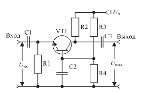
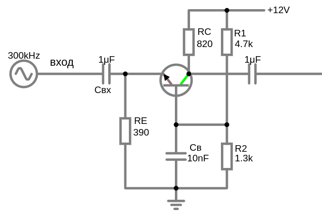
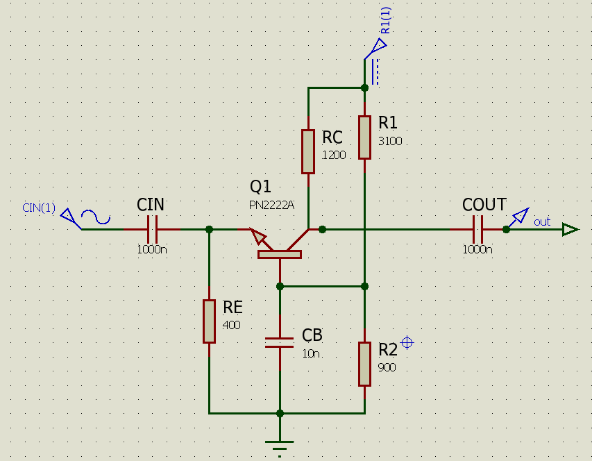
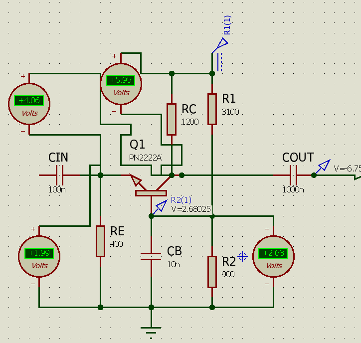
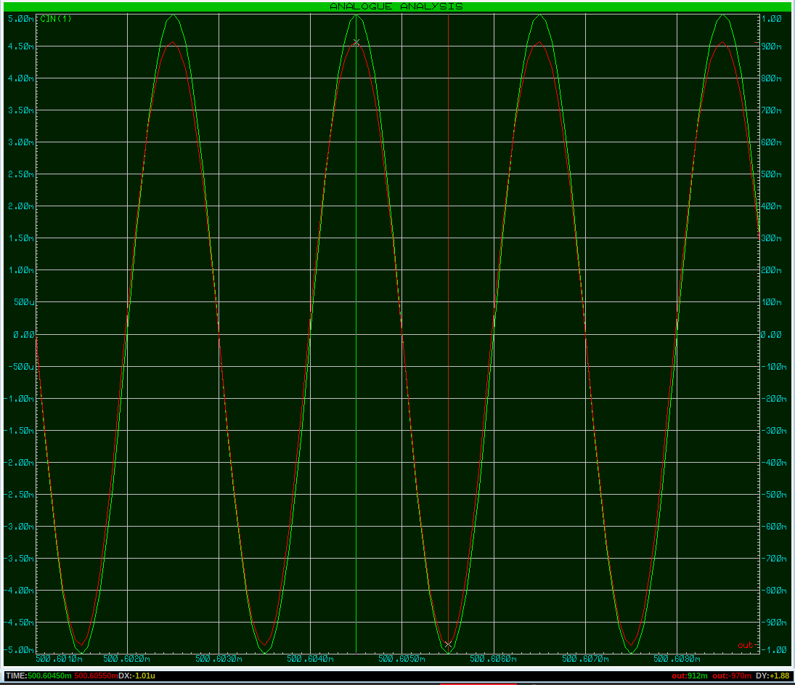
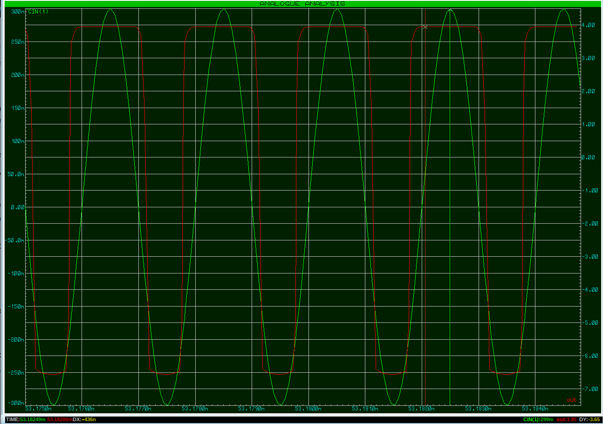

# BJT NPN. Схема с общей базой

[Схема с общей базой (каскад с общей базой)](https://digteh.ru/Sxemoteh/ShVklTrz/OB/)

### Схема с общей базой (ОБ) - Common Base (CB), для усиление только напряжения. Для NPN-транзисторов 
Если важно высокое быстродействие и малое искажение — применяют ОБ (общая база).  Идеальный выбор для ВЧ-усилителей и для антенных усилитей с выходным сопротивлением до 100 Ом.  

Схема с общей базой — это усилитель четырехполюсник, где база транзистора используется как для подключения входного сигнала, так и для подключения нагрузки.

В схеме ОБ:
- **Входной сигнал** подаётся **между эмиттером и базой** (база заземлена по переменному току через конденсатор).  
- **Выходной сигнал** снимается **между коллектором и базой** (база остаётся общей точкой).  
- **База** — общий электрод для входа и выхода (отсюда название "общая база").  



- Коэффициент усиления по напряжению $A=\frac{U_{вых}}{U_{вх}}=\frac{U_{CB}}{U_{EB}}$ (обычно 10–200), такой же как в схеме с ОЭ. 
- Ток не усиливает, коэффициент усиления по току $\approx 1$ так как ток коллектора всегда лишь немного меньше тока эмиттера.
- Сигнал не инвертирует. Если $U_{вх}$ растёт → $U_{вых}$ тоже растёт. (Но, возможен небольшой сдвиг фазы. Фаза выходного сигнала чуть опережает входной — на 5–30°. Это нормально и связано с внутренними емкостями транзистора (между переходами Б-К и Б-Э) и реакцией цепи (входной и выходной конденсаторы) на высоких частотах.)
- Входное сопротивление очень маленькое (десятки Ом) $R=\frac{U_{EB}}{I_E}$, так как ток эмиттера $I_E$ зависит от $U_{вх}$. Входным сопротивлением этого усилительного каскада является эмиттерное сопротивление транзистора. Это накладывает определенные ограничения на применение данной схемы. Сопротивление источника сигнала должено иметь низкое выходное сопротивление, желательно десятки Ом.
- Выходное сопротивление очень большое (~$R_C$), как в схеме ОЭ. Теоретически, выходное сопротивление транзистора в схеме ОБ велико (обусловлено эффектом Эрли и может достигать десятков-сотен килоом). Однако на практике оно шунтируется $R_C$, поэтому реальное выходное сопротивление схемы ближе к $R_C$.
- Высокая частотная характеристика (из-за отсутствия эффекта Миллера).
- Стабильность усиления на высоких частотах (в ВЧ-усилителях, радиочастотных схемах).

Схему используют в высокочастотной (ВЧ) схемотехнике из-за того, что паразитная эмкость цепи коллектор-база не участвует в отрицательной обратной связи (из-за отсутствия эффекта Миллера) и схема устойчива к самовозбуждению.

**Редкость ее применения в общей разработке обусловлена в основном ее низким входным импедансом и отсутствием значительного усиления по току**, что делает ее менее универсальной по сравнению со схемами с общим эмиттером и общим коллектором для широкого спектра низкочастотных и среднечастотных приложений.
  - Так как очень низкий входной импеданс. Когда источник с высоким выходным сопротивлением подключается к усилителю с низким входным сопротивлением, возникает сильный делитель напряжения, большая часть сигнала теряется на выходном сопротивлении источника. К тому же вход системы с низким сопротивлением потребляет значительный ток, что нагружает сам источник сигнала, источник должен выдержать такой ток, чтобы обеспечить необходимое входное напряжение. Если источник не может обеспечить достаточный ток, сигнал искажается или ослабляется. Во многих приложениях это неудобно, так как большинство источников сигнала имеют относительно высокий выходной импеданс, что приводит к значительным потерям сигнала при подключении к усилителю с низким входным импедансом.
  - В схеме ОБ входной и выходной сигналы не имеют общей емкости, которая могла бы вызвать эффект Миллера. Эффект Миллера в схеме ОЭ приводит к увеличению эквивалентной входной емкости на высоких частотах, что снижает верхнюю границу частотного диапазона усилителя. Отсутствие этого эффекта в схеме ОБ делает ее предпочтительной для высокочастотных приложений, где важна широкая полоса пропускания.

Учитывая, что ток коллектора в схеме с общей базой протекает по сопротивлению R1, включенному параллельно источнику сигнала, получается, что данный усилительный каскад охвачен 100% параллельной отрицательной обратной связью по току. Это приводит к расширению полосы пропускания усилителя. Малое входное сопротивление усилительного каскада не позволяет шунтировать входной сигнал паразитными емкостями печатной платы и других электронных компонентов схемы. Кроме того, малая проходная емкость Cкэ, образованная последовательным включением эмиттерного и коллекторного переходов, уменьшает значение входной паразитной емкости схемы с общей базой. Все эти факторы приводят к исключительной широкополосности амплитудно-частотной характеристики данного каскада.

---

В схеме с общей базой ОБ положительное приращение напряжения на входе ∆UВх вызывает увеличение тока эмиттера Iэ, что приводит к увеличению как тока коллектора Iк, так и напряжения выхода ∆Uвых, причем ∆Uвых >> ∆Uвх.

В схеме с ОБ источник входного напряжения включен в цепь эмиттер-база, а нагрузка и источник питания — в цепь коллектор-база.

Входное сопротивление схемы с ОБ мало (несколько омов или десятков омов), так как эмиттерный переход включен в прямом направлении. Выходное сопротивление схемы, наоборот, велико (сотни килоомов), так как коллекторный переход включен в обратном
направлении.

Малое входное сопротивление схемы с ОБ является существенным ее недостатком, ограничивающим применение ее в усилителях. Через
источник входного сигнала в этой схеме проходит весь ток эмиттера, и усиления по току не происходит (коэффициент усиления по току α <1). Усиление по напряжению и по мощности в этой схеме может достигать нескольких сотен.


---

В этом случае база через конденсатор Сб по переменному току заземлена,частотных, т.е. соединена с общим проводником питания. Входной сигнал через конденсатор Ссв подают на эмиттер и базу, а усиленный сигнал снимают с коллектора и с заземленной базы. База, таким образом, является общим электродом входной и выходной цепей каскада.  Такой каскад дает усиление по току меньше единицы, а по напряжению такое же, как транзистор, включенный по схеме ОЭ (10...200). Из-за очень малого входного сопротивления, не превышающего нескольких десятков Ом (30... 100 Ом), включение транзистора по схеме ОБ используют главным образом в генераторах электрических колебаний, в сверхрегенеративных каскадах, применяемых, например, в аппаратуре радиоуправления моделями.

---
 


  
**Роль элементов в схеме ОБ** 
- Резистор в эмиттере $R_E$ — задаёт ток $I_E$, задаёт рабочую точку транзистора. Чем больше $R_E$ тем меньше $I_E$ и тем ниже усиление. Если $R_E$ слишком мал → возможен перегрев транзистора.
- Резистор в коллекторе $R_C$ — формирует выходное напряжение. Преобразует ток коллектора $I_C$ в выходное напряжение $U_{вых}=I_C\cdot R_C$. Определяет коэффициент усиления по напряжению: $K_U \approx \frac{R_C}{r_э}$, где $r_э=\frac{25 mB}{I_E}$
  Выбор значения $R_C$:
  - Большой $R_C$ → выше усиление, но меньше максимальный ток. 
  - Малый $R_C$ → меньше усиление, но выше стабильность.

- Конденсатор $C_B$ — шунтирует базу на землю по переменному току (не даёт напрямую соединиться источнику сигнала и смещению эмиттера по постоянному току), делая её "общей" для сигнала. Подавляет пульсации питания и помехи. Он должен быть достаточно большим, чтобы эффективно заземлять базу на нужных частотах.

- $U_{пит}$ - Обеспечивает смещение транзистора в активный режим. Напряжение должно быть достаточным для работы $R_C$ и $R_E$

- Конденсатор связи (развязочный) $C_{вх}$ — пропускает переменный сигнал (от антенны или генератора сигнала) на эмиттер, блокируя постоянную составляющую. Ёмкость должна быть такой, чтобы $X_C$ была мала на минимальной рабочей частоте. Ёмкость должна быть такой, чтобы на рабочей частоте его сопротивление $X_C=\frac{1}{2 \pi f\cdot C}$ было много меньше входного сопротивления схемы (в эмиттере $R_e=10–50$  Ом) т.е. $X_C \lll R_e$. Обычно используют $C_{вх}\geq 1\ мкФ$  (для НЧ) или 10–100 нФ (для ВЧ).

- Конденсатор выхода $C_{вых}$ — отделяет выходной сигнал от постоянного напряжения коллектора. Ёмкость должна быть такой, чтобы $X_C$ была мала на минимальной рабочей частоте.

| Частота | Нагрузка | Рекомендуемый $ C_{\text{вых}} $ |
|---------|----------|----------------------------|
| ~10 кГц | 10 кОм   | 1–10 мкФ |
| ~100 кГц | 10 кОм   | 0.47–2.2 мкФ |
| ~1 МГц | 10 кОм   | 0.1–1 мкФ |
| >10 МГц | 1 кОм    | 100 нФ…220 нФ |

- Внешнее сопротивление $R_{нагр}$, подключённое к выходу (например, следующий каскад или динамик). Уменьшает усиление, так как образует делитель с $R_C$. Чем больше $R_{нагр}$ тем ближе усиление к расчётному.

**Итоговая таблица ролей элементов**  

| Элемент         | Роль в схеме ОБ                                                                 | Типовые значения                     | Что будет, если убрать? |
|-----------------|--------------------------------------------------------------------------------|--------------------------------------|-------------------------|
| **Транзистор**  | Усиливает сигнал, управляет током $I_C$ в зависимости от $I_E$.            | BF199 (ВЧ), 2N3904 (НЧ), КТ368 (СССР) | Схема не работает.      |
| **$R_E$**       | Задаёт ток эмиттера $I_E$, определяет входное сопротивление.                 | 100 Ом – 5 кОм (зависит от тока)    | Транзистор может сгореть (неограниченный $I_E$). |
| **$R_C$**       | Преобразует $I_C$ в выходное напряжение, задаёт усиление.                    | 1–10 кОм (для $U_{пит}$=5–15 В)     | Нет выхода (коллектор "висит" в воздухе). |
| **$C_B$**       | Делает базу "общей" для переменного сигнала.                                   | 10 нФ – 1 мкФ (для ВЧ схем)         | База не заземлена → схема теряет свойства ОБ. |
| **$U_{пит}$**   | Обеспечивает питание и смещение.                                               | 5–15 В (маломощные схемы)           | Транзистор закрыт, усиления нет. |
| **$C_{вх}$**    | Пропускает входной сигнал, блокирует постоянное напряжение.                    | 1–10 мкФ (НЧ), 0.1–1 мкФ (ВЧ)       | Нарушается смещение.    |
| **$C_{вых}$**   | Отделяет усиленный сигнал от постоянного напряжения.                           | 1–100 мкФ (НЧ), 0.01–1 мкФ (ВЧ)     | На выходе будет постоянная составляющая. |
| **$R_{нагр}$**  | Внешняя нагрузка (например, следующий каскад).                                 | 1–100 кОм                           | Усиление максимально, но возможны искажения. |


```admonish info
Для PNP-транзисторов схемы аналогичны, но с критическими отличиями в полярности напряжений и направлении токов. 
```

# Расчет схемы включения транзистора с ОБ в активном режиме
Расчет резисторов, входящих в эти схемы не зависит от схемы включения транзистора и для схемы с общей базой проводится точно так же как и для схемы с общим эмиттером.

Для питания транзистора в схеме с общей базой с наилучшими характеристиками по стабильности режима транзистора, подходит последовательная отрицательная обратная связь по току (Эмиттерная стабилизация) как и для схемы с ОЭ, с помощью $R_E$. 

Рабочая точка (Operating Point) транзистора, так же наилучшим вариантом будет через делитель напряжения $R_1$, $R_2$



<a href="/theories_of_electrical_circuits/falstad/circuitjs-109.txt" download="circuitjs-109.txt">Скачать схему для www.falstad.com/circuit</a>



<a href="/theories_of_electrical_circuits/Proteus/TransistorOB.pdsprj" download="TransistorOB.pdsprj">Скачать схему для Proteus 8</a>
 

   <details>

   <summary>Расчетные напряжения</summary>

  

   </details>

Входные данные:
- $U_{вх}=12\ вольт$
- транзистор BC547 B331 или 2N2222
  -  транзистор должен иметь высокую граничную частоту (Gain Bandwidth Product) $f_T$
- Для входного ВЧ сигнала примерно 500 kHz

Предустановки:
- $U_{C}=\frac{U_{вх}}{2}= U_{CE}+U_E= 6\ V$ (что-бы не выходить из активного режима)
- $U_{CE}= U_C-U_{RE} = U_{вх} - (U_{RС} + U_{RE}) = 4\ V$ (то что осталось от напряжения)
- $I_C\approx I_E=0.005\ A=5\ mA$ (по даташиту у BC547 $I_{C\ max}=100\ mA$) 
- $I_B=\frac{I_C}{\beta}= \frac{0.005}{50}=0.0001\ A$ ($100\ \mu A$) для надежности hFE=50
- $U_E=U_{RE}=2\ V$  (напряжение на эмиттере) 
- $U_B=U_{RE}+0.7=2.7\ V$ (напряжение смещения базы) 

$U_{вх} = U_{RC} + U_{CE} + U_{RE}\Rightarrow 12 = U_{RC} + 4 + 2 \Rightarrow U_{RC} = 12 -6 = 6\, В$
 
Тогда:
- $R_E=\frac{U_{RE}}{I_E}= \frac{2}{0.005} = 400 \Omega$ (В ряду E24 ближайшим номиналом будет 390 Ом)
  - проверим, $I_E=\frac{U_B-0.7}{R_E}=\frac{2.7-0.7}{400}=0.005\ A=5\ mA$
- $R_C=\frac{U_{RC}}{I_C}=\frac{6}{0.005} = 1200 \Omega$ (В ряду E24 ближайшим номиналом будет 1300 или 1100 Ом)

- Делитель напряжения, подберем сопротивления резисторов $R_1$, $R_2$ (как в схеме с ОЭ)

  $I_{div} \ge 10\cdot I_B \Rightarrow I_{div} = 30\cdot 0.0001=0.003\ A$ 

  $R_{общ}=\frac{U_{вх}}{I_{div}} = \frac{12}{0.003} = 4000\ \Omega$

  $U_B = U_{вх} \cdot \frac{R_2}{R_1 + R_2}\Rightarrow \frac{R_2}{R_1 + R_2} = \frac{U_B}{U_{вх}}= \frac{2.7}{12}=0.225$

  $R_2 = 0.225\cdot R_{общ} = 0.225\cdot 4000 = 900\ \Omega$ (В ряду E24 ближайшим номиналом будет 910 Ом) 

  $R_1 = R_{общ} - R_2 = 4000 - 900 = 3100\ \Omega$ (В ряду E24 ближайшим номиналом будет 3000 Ом)

  Проверим: $U_B = U_{вх} \cdot \frac{R_2}{R_1 + R_2} = 12 \cdot \frac{900}{3100 + 900}=2.7\ V$ ( можно использовать последовательное соединение резисторов для точного номинала 3100 и 900)
    - $U_B = U_{R_2} = I_{div} \cdot R_2 = 0.003\cdot 900=2.7\ V$


- Конденсатор связи (развязочный) $C_{вх}$

  $R_{вх}\approx R_E =400\ Ом$ 

  (внутреннее сопротивление эмиттера $
    r_e = \frac{V_T}{I_E} =  \frac{0.025}{0.005} = 5\ \Omega 
    
    \quad (\text{где} V_T \approx 25\,\text{мВ при 25 °C})
  $ 
  Переменный сигнал не "видит" резистор $R_E$ напрямую, если он шунтирован развязочным конденсатором $C_{вх}$)

  Реактивное сопротивление конденсатора: $X_{C_{вх}}=\frac{1}{2 \pi f\cdot C}$

  Чтобы сигнал почти весь проходил через конденсатор, нужно:<br> $X_{C_{вх}} \ll R_{вх} \quad \text{(например, в 5–10 раз меньше)}$

  Пусть $X_{C_{вх}} \leq \frac{R_{вх}}{10} = 39\,\Omega $

  Минимальная рабочая частота: $f=500000\ Hz = 500\ kHz$

  Тогда: $C_{вх} \geq \frac{1}{2\pi f X_C} = \frac{1}{2\pi \cdot 500000 \cdot 39} \approx 8.15\,nF$ (возьмем $C_{вх}=100\ nF=0.0000001\ F$)

  Для ВЧ (0.5 – 30 mHz) $C_{вх}$ лучше взять с запасом: **22 nF, 47 nF, 100 nF — идеально подойдёт для ВЧ.**

  А для НЧ и СЧ емкость можно увеличить: 
  - НЧ (20 Hz – 20 kHz) $ X_C < 10\ \Omega$ тогда $C_{вх}=1–10 \mu F$
  - СЧ (50–500 kHz) $ X_C < 50\ \Omega$ тогда $C_{вх}=10–100\ nF$
 
  Влияние частоты сигнала на  $A_v$ (при $U_{вх}=10\ mV$)
  | $C_{вх}$      | $U_{вых}$      |  $f$      | $A_v$ |
  |---------------|----------------|-----------|-------|
  | 10 nF         | -366/+366 mV   |  500 kHz  |  36   | 
  | 100 nF        | -1.76/+1.58 mV |  500 kHz  |  167  | 
  | 1000 nF (1 uF)| -1.98/+1.75 mV |  500 kHz  | 186   | 

- Конденсатор выхода $C_{вых}$

  Реактивное сопротивление конденсатора: $X_{C\ вых} = \frac{1}{2\pi \cdot f \cdot C}$

  $X_{C\ вых} \ll R_{\text{нагрузки}}$ (Если за выходом стоит приёмник сигнала, антенна, каскад — смотри их входное сопротивление.)

  Если $R_{\text{нагрузки}}=1000\,\Omega$

  $C_{вых} \geq \frac{1}{2\pi \cdot 500000 \cdot 1000} \approx 0.0000000003\ pF$ (возьмем $C_{вых}=1\,\mu\text{F}$)

- Конденсатор базы $C_B$
  
  Надо, чтобы **на рабочей частоте $ X_{C_B} \ll R_2 $** (нижнее плечо делителя — через него конденсатор "садится" на землю).

  $X_{C_B} \leq R_2 / 10 = \frac{1300}{10}=130\,\Omega$

  Минимальная рабочая частота: $f=500000\ Hz = 500\ kHz$

  $C_B \geq \frac{1}{2\pi \cdot 500000 \cdot 130} \approx 2.45\,\ nF$ (лучше взять с запасом: 10–100 nF)

- Выходное сопротивление $R_{out}$

  В схеме с ОБ, выход снимается с коллектора, значит:

  $R_{out} \approx R_C \parallel r_o$

  Если $r_o \gg R_C $, то: $R_{out} \approx R_C = 1200\,\Omega$
 
  $r_o \approx \frac{V_A + U_{CE}}{I_C}= \frac{70 + 6}{0.005} = 15.2\,k\Omega$
  
  Где: $ V_A $ — напряжение Эрли (обычно 50–100 В для кремниевых NPN)

  $R_{out} \approx \frac{1200 \cdot 15.2k}{1200 + 15.2k} \approx 1112\,\Omega$
 
  
- Коэффициент усиления по напряжению $A_v$

  для схемы с ОБ: $A_v \approx \frac{R_C}{r_e}$

  где:
     - $r_e \approx \frac{25\,\text{мВ}}{I_E} = \frac{0.025}{0.0051} \approx 4.9\,\Omega$
      
  $A_v \approx \frac{1200}{4.9} \approx 245$
 
  Частота сигнала влияет на коэффициент усиления напряжения $A_v$ (При $U_{вх}=5 mV$ и $C_{вх}=1000\ nF$)

  | $U_{вых}$    |  $f$      | $A_v$ |
  |--------------|-----------|-------|
  | -174/+174 mV |  5 kHz    |  35   | 
  | -742/+707 mV |  50 kHz   |  145  | 
  | -970/+912 mV |  500 kHz  |  188  | 
  | -969/+914 mV |  1 MHz    |  188  | 
  | -888/+862 mV |  5 MHz    |  175  | 

  $A_v=((864+819)÷2)÷5=168$

  <details>

  <summary>напряжение входа и выхода совпали по фазе при частоте 500 kHz</summary>

  

  </details>

  При входной амплитуде 25 мВ заметен нижний срез амплитуды -3.97/+3.44 т.е. транзистор вошел в насыщение
  - $U_C=U_{C\ покоя}-3.97=6-3.97 = 2.03\ В$
  - $U_{CE}=U_{C}-U_{E}=2.03-2 = 0.03\ В$ (что соответствует режиму насыщения $U_{CE} \lesssim 0.2\,В $)

  

- Максимальный входной сигнал $U_{вх\ max}$ (Амплитуды входного сигнала) 

  Если входной сигнал слишком большой:
    - Напряжение на эмиттере выходит за пределы рабочей точки.
    - Транзистор входит в насыщение или отсечку, искажая сигнал.
    - Искажение формы сигнала (верх или низ синусоиды "срезается").
      - когда верх "срезается" это транзистор вошел в режим отсечки, транзистор перестаёт реагировать на вход 
      - когда низ "срезается" перенасыщение или перегрев, транзистор "упирается" в минимальное $U_C$

    - Уменьшение реального коэффициента усиления (из-за нелинейности).
    - Возможен перегрев транзистора (если токи становятся слишком большими).

  Входное сопротивление схемы ОБ: 

   $r_{вх} \approx r_e = \frac{V_T}{I_E} =  \frac{0.025}{0.005} = 5\ \Omega$ 
     - где $V_T \approx 25\,\text{мВ при 25 °C}$

   $U_{вх\ max}=0.1\cdot r_e\cdot I_E = 0.1\cdot 5 \cdot 0.005 = 0.0025\ V=2.5\ mV$   **Практически можно подавать до 5–10 мВ, но уже возможны небольшие искажения.**

   Например, если подать на вход 1 Вольт то рабочая точка эмиттера $U_E=2\ V$ будет колебаться от 1 до 3 Вольт
   - при положительной синусоиде напряжение на эмиттере вырастит до $U_E=3\ V$, соответсвенно на базе стабильно есть 2.7 вольт заданные делителем напряжения, и чтобы транзистор был открыт, должно соблюдаться условие $U_{BE}= U_{B}-U_{E} \ge 0.7$. 
   Но тогда $U_{BE}= 2.7-3 < 0.7$ транзистор закрывается, входит в отсечку (перестаёт проводить).
   А при уменьшении $U_E=1\ V$ тогда $U_{BE}=1.7\ V$ транзистор сильно открывается, входит в насыщение или перегреется из-за большого тока.

   <details>

   <summary>Искажение формы выходного сигнала из-за большого входного</summary>

   

   На вход был подан сигнал 300 mV (0.3 V) с частотой 500 kHz (зеленая), на выходе обрезанная по верху и по низу синусоида (красная)

   Уже при входном сигнале в 65 мВ (0.065 V) транзистор выходит из активного режима.
   
   </details>

