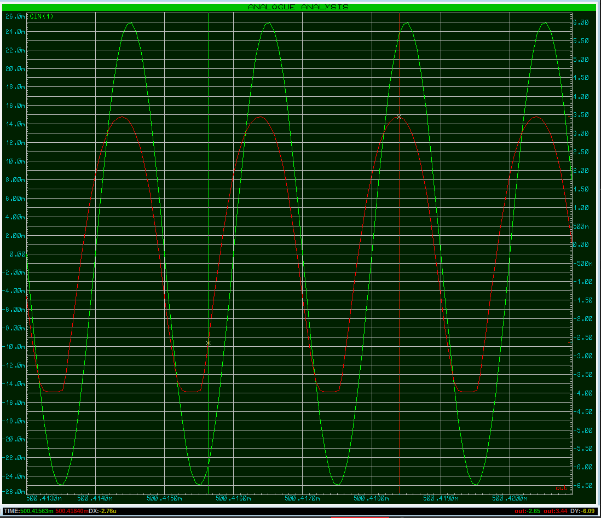

# BJT NPN. Схема с общей базой


### Схема с общей базой (ОБ) - Common Base (CB), для усиление только напряжения. Для NPN-транзисторов 
Если важно высокое быстродействие и малое искажение — применяют ОБ (общая база).  Идеальный выбор для ВЧ-усилителей. Схема ОБ лучше работает на высоких частотах, чем ОЭ, из-за отсутствия эффекта Миллера (емкость перехода база-коллектор не усиливается).

Коэффициент по усилению по напряжению $A=10\cdot 2500$. Ток не усиливает.
Сигнал не инвертирует. Входное сопротивление очень маленькое. А выходное сопротивление очень большое.
Схему используют в высокочастотной схемотехнике из-за тго что паразитная эмкость цепи коллектор-база не участвует в отрицательной обратной связи и схема устойчива к самовозбуждению.


https://youtu.be/oPKx_itmNkM?t=463





В схеме ОБ:
- **Входной сигнал** подаётся **между эмиттером и базой** (база заземлена по переменному току через конденсатор).  
- **Выходной сигнал** снимается **между коллектором и базой** (база остаётся общей точкой).  
- **База** — общий электрод для входа и выхода (отсюда название "общая база").  

Усиление по напряжению (обычно 10–200)

Фаза не инвертируется: если $U_{вх}$ растёт → $U_{вых}$ тоже растёт.

Входное сопротивление Низкое (десятки Ом), так как ток эмиттера $I_E$ зависит от $U_{вх}$

Выходное сопротивление Очень высокое (~$R_C$), как в схеме ОЭ.

**Роль элементов в схеме ОБ** 
- Резистор в эмиттере $R_E$ — задаёт ток $I_E$, задаёт рабочую точку транзистора. Чем больше $R_E$ тем меньше $I_E$ и тем ниже усиление. Если $R_E$ слишком мал → возможен перегрев транзистора.
- Резистор в коллекторе $R_C$ — формирует выходное напряжение. Преобразует ток коллектора $I_C$ в выходное напряжение $U_{вых}=I_C\cdot R_C$. Определяет коэффициент усиления по напряжению: $K_U \approx \frac{R_C}{r_э}$, где $r_э=\frac{25 mB}{I_E}$
  Выбор значения $R_C$:
  - Большой $R_C$ → выше усиление, но меньше максимальный ток. 
  - Малый $R_C$ → меньше усиление, но выше стабильность.
- Конденсатор $C_B$ — шунтирует базу на землю по переменному току, делая её "общей" для сигнала. Подавляет пульсации питания и помехи. Ёмкость должна быть такой, чтобы на рабочей частоте его сопротивление $X_C=\frac{1}{2 \pi f\cdot C}$ было много меньше входного сопротивления схемы. Обычно используют $C_B\geq 1\ мкФ$  (для НЧ) или 10 – 100 нФ 10–100 нФ (для ВЧ).
- $U_{пит}$ - Обеспечивает смещение транзистора в активный режим. Напряжение должно быть достаточным для работы $R_C$ и $R_E$
- Конденсатор связи $C_{вх}$ — пропускает переменный сигнал на эмиттер, блокируя постоянную составляющую. Ёмкость должна быть такой, чтобы $X_C$ была мала на минимальной рабочей частоте.
- Конденсатор связи $C_{вых}$ — отделяет выходной сигнал от постоянного напряжения коллектора. Ёмкость должна быть такой, чтобы $X_C$ была мала на минимальной рабочей частоте.
- Внешнее сопротивление $R_{нагр}$, подключённое к выходу (например, следующий каскад или динамик). Уменьшает усиление, так как образует делитель с $R_C$. Чем больше $R_{нагр}$ тем ближе усиление к расчётному.

**Итоговая таблица ролей элементов**  

| Элемент         | Роль в схеме ОБ                                                                 | Типовые значения                     | Что будет, если убрать? |
|-----------------|--------------------------------------------------------------------------------|--------------------------------------|-------------------------|
| **Транзистор**  | Усиливает сигнал, управляет током $I_C$ в зависимости от $I_E$.            | BF199 (ВЧ), 2N3904 (НЧ), КТ368 (СССР) | Схема не работает.      |
| **$R_E$**       | Задаёт ток эмиттера $I_E$, определяет входное сопротивление.                 | 100 Ом – 5 кОм (зависит от тока)    | Транзистор может сгореть (неограниченный $I_E$). |
| **$R_C$**       | Преобразует $I_C$ в выходное напряжение, задаёт усиление.                    | 1–10 кОм (для $U_{пит}$=5–15 В)     | Нет выхода (коллектор "висит" в воздухе). |
| **$C_B$**       | Делает базу "общей" для переменного сигнала.                                   | 10 нФ – 1 мкФ (для ВЧ схем)         | База не заземлена → схема теряет свойства ОБ. |
| **$U_{пит}$**   | Обеспечивает питание и смещение.                                               | 5–15 В (маломощные схемы)           | Транзистор закрыт, усиления нет. |
| **$C_{вх}$**    | Пропускает входной сигнал, блокирует постоянное напряжение.                    | 1–10 мкФ (НЧ), 0.1–1 мкФ (ВЧ)       | Нарушается смещение.    |
| **$C_{вых}$**   | Отделяет усиленный сигнал от постоянного напряжения.                           | 1–100 мкФ (НЧ), 0.01–1 мкФ (ВЧ)     | На выходе будет постоянная составляющая. |
| **$R_{нагр}$**  | Внешняя нагрузка (например, следующий каскад).                                 | 1–100 кОм                           | Усиление максимально, но возможны искажения. |


```admonish info
Для PNP-транзисторов схемы аналогичны, но с критическими отличиями в полярности напряжений и направлении токов. 
```