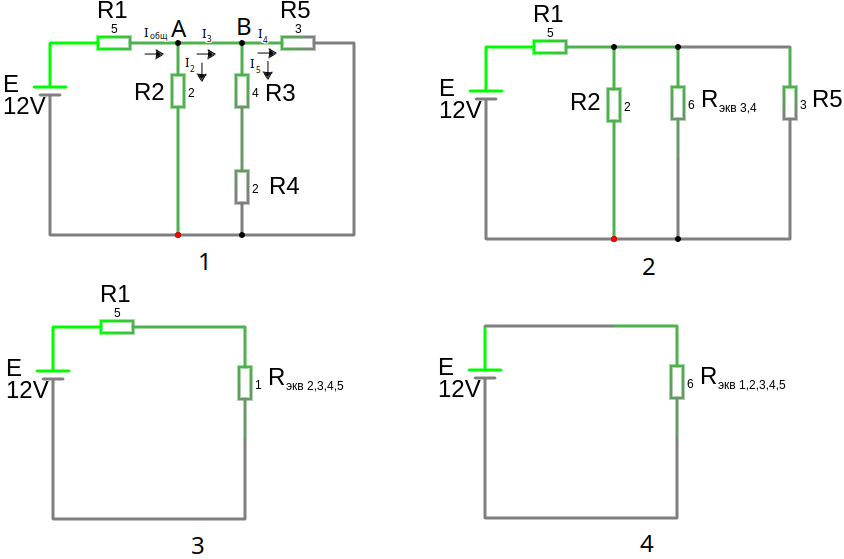

# Урок 11. Смешанное соединение резисторов. Расчет схемы с одним источником ЭДС. Часть 1.

Методика расчёта смешанных цепей с одним источником ЭДС включает упрощение схемы путём последовательного или параллельного соединения резисторов в эквивалентные (свертка).

рис 2. резисторы $R_3 (4, \Omega)$ и $R_4 (2, \Omega)$ соединены последовательно, поэтому их сопротивления мы складываем $R_{экв 3,4} = R_3 + R_4 = 4+2=6, \Omega$

рис 3. резисторы $R_2 (2, \Omega)$, $R_{экв 3,4} (6, \Omega)$ и $R_5 (3, \Omega)$ соединены параллельно, поэтому складываем их сопротивления по формуле:  $R_{экв} = \frac{1}{\left(\frac{1}{R_1} + \frac{1}{R_2} + \dots + \frac{1}{R_n}\right)} = \frac{1}{\frac{1}{2} + \frac{1}{6} + \frac{1}{3}}=\frac{1}{1} = 1, \Omega $

рис 4. резисторы $R_1 (5, \Omega)$ и $R_{экв 2,3,4,5} (1, \Omega)$ соединены последовательно, поэтому их сопротивления мы складываем и получаем конечное сопротивление цепи:
 
 $R_{экв} = 5 + 1 = 6, \Omega$

Общий ток: $I_{общ} = \frac{E}{R_{экв}} = \frac{12, V}{6, \Omega } = 2, A$

Теперь необходимо посчитать токи и напряжение на каждом элементе, сворачивая схему:

 - посчитаем напряжение для $R_1 (5, \Omega)$ через него проходит общий ток:  $U_1=I_{общ} \cdot R = 2 \cdot 5 = 10, V$
 - посчитаем напряжение для $R_{экв 2,3,4,5} (1, \Omega)$, по второму закону Кирхгофа (сумма падений напряжений на каждом элементе равна напряжению источника)  $U_2=U_{общ} - U_1 = 12 -10 = 2, V$ т.е. напряжение $2, V$ на $R_2 (2, \Omega)$, $R_{экв 3,4} (6, \Omega)$ и $R_5 (3, \Omega)$ так как при параллельном соединение резисторов у них общее наряжение.
 - посчитаем ток в ветки для $R_2 (2, \Omega)$: $I_2=\frac{U}{R_2}=\frac{2, V}{2, \Omega }=1,A$ 
 - посчитаем токи для узла "А": $I_{общ}$ входит в узел, $I_2$ и $I_3$ выходят из узла. По первому закону Кирхгофа для узла "А":
   - $I_{общ} - I_2 - I_3 = 0 \to I_3 = I_{общ} - I_2 = 2 - 1 = 1,A$
 - посчитаем токи для узла "B": ток $I_4 = \frac{U_2}{R_5}=\frac{2, V}{3, \Omega }=0.67,A$ 
    - тогда по первому закону Кирхгофа для узла "B":  $I_3-I_4-I_5=0 \to I_5=I_3-I_4 = 1 - 0.67 = 0.33,A$ 
    - либо найдем ток $I_5$ с помощью закона Ома для этой ветви: $I_5=\frac{U}{R_3+R_4}=\frac{2}{6}= 0.33,A$
 - осталось найти личные напряжения на $R_3\ и\ R_4$ : 
    - для $R_3\to U_3=I_5\cdot R_3=0.33\cdot 4=1.32, V$
    - для $R_4\to U_4=I_5\cdot R_5=0.33\cdot 2\approx 0.66, V$ либо через второй закон Кирхгофа $U_4=U_2-U_3 \approx 0.68, V$