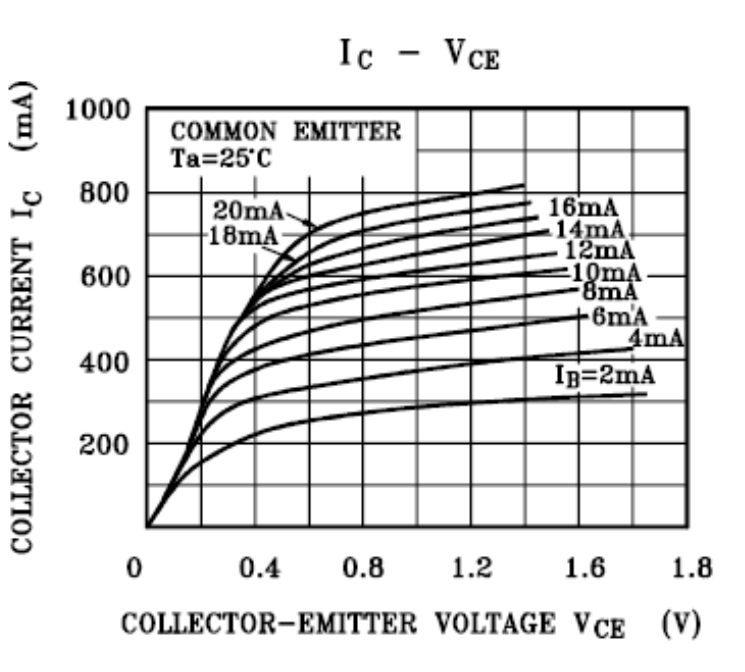
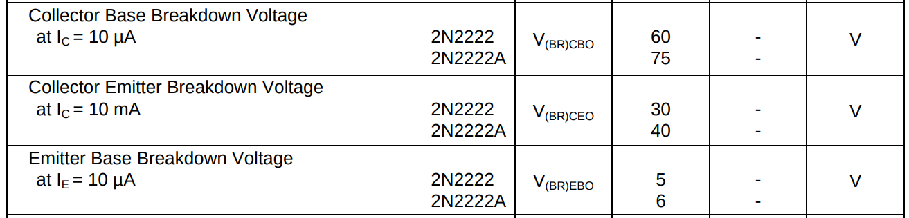
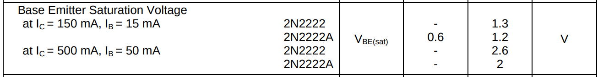
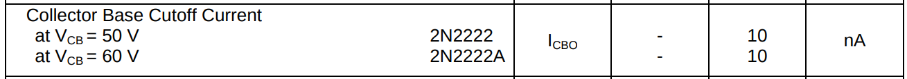
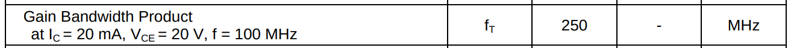

# BJT. Режимы работы транзистора 

### У транзистора есть 3 основных режима работы:

Вот как он может себя вести в зависимости от напряжений $V_{CE}$:

| Режим        | Условие (приблизительно)                    | Что происходит                                      | Где используется              |
|--------------|---------------------------------------------|----------------------------------------------------|-------------------------------|
| **Отсечка**   | $ V_{BE} < 0.6\,В $                       | Транзистор **выключен**, ток **не течёт**          | Логика, ключ "отключён"       |
| **Активный**  | $ V_{BE} \approx 0.6 - 0.7\,В $,  $ V_{CE} > 0.2\,В $ | Транзистор **включен**, усиливает ток             | Усилители                     |
| **Насыщение** | $V_{CE} \lesssim 0.2\,В $   $V_{CE}=V_{C}-V_{E}$             | Транзистор **максимально открыт**, как замкнутый ключ | Ключевые схемы ("вкл")       |

---

# 1. Активный режим (усиление)
**Когда на коллекторе напряжение $U_{CE} = 1-2\ V$** сильно больше чем на базе (P-N переход база-коллектор закрыт, имеет обратное смещение), это создает сильное электрическое поле с положительным потенциалом на коллекторе и отрицательным на базе относительно коллектора, что приводит к притягиванию электронов из базы, т.е. происходит всасывание электронов из базы в которую эмиттер своим сильным легированнием накидал электронов. Тогда формула справедлива ($I_C \approx \beta \cdot I_B$) ток коллектора зависит только от тока базы. 

Выходные характеристики из даташита транзистора 2N2222. Графики зависимости тока коллектора от напряжения между коллектором и эмиттером.

1. До 0.5 В: $I_C$ резко растёт — это насыщение (не для усилителя!).

2. После 1 В: $I_C$ почти не меняется — это активный режим (горизонтальная линия). Т.е. оптимальное напряжение коллектор-эмиттер $U_{CE} = 1-2\ V$

(насыщение) Почему график $I_C-V_{CE}$ при малых значения напряжения $U_{CE} < 0.5\ V$ имеет резкое изменений тока коллектора?
При малом напряжении на коллекторе $U_{CE} < 0.5\ V$, PN переход база-коллектор **открыт** (прямо смещён) очень узкий и электроны идут и в базу и в коллектор от эмиттера без усиления, поэтому с ростом напряжение на коллекторе растет и ток коллектора так как это прямая зависимость по закону Ома, т.е. током коллектора не управляет база. Но с преодолением порога напряжения коллектора, переход база-коллектора **закрывается**  (обратно смещён) становится широким и дальнейшее увеличение напряжения коллектора не приводит к росту тока коллектора, это уже активный режим, током коллектора теперь управляет ток базы,так как электроны теперь не могут преодолеть широкий барьер PN перехода база-коллектор, нужно чтобы база позволила втягивать электроны коллектору, на сколько она открыта на столько идет усиление, это показано на графике $I_C-V_{CE}$.

Соответственно напряжение коллектор-эмиттер после 1 вольта уже становится более благоприятным для усиленного всасывания электронов из базы.

**Ключевые условия:**
- $ U_{BE} \approx 0.7\,В$
- $ U_{CE} > U_{BE}$

**Что происходит:**
- База чуть "подтянута" по напряжению.
- Маленький ток базы $ I_B $ вызывает большой ток коллектора $ I_C = \beta \cdot I_B $
- Используется для **аналогового усиления**.

**Пример:**
- Усилитель микрофона, операционного усилителя и т.п.

Для работы транзистора в линейном режиме (например, в усилителе) необходимо правильно установить его рабочую точку по постоянному току (DC bias). Это означает выбор таких значений сопротивлений в цепи базы и коллектора, чтобы обеспечить желаемые значения тока коллектора ($I_C$) и напряжения коллектор-эмиттер ($U_{CE}$) в отсутствие входного сигнала.

Для установки напряжения между коллектором и эмиттером используют сопротивление коллектора $R_C$, далее замером мультиметра смотрим падение напряжения на $R_C$ и считаем ток $I_C=\frac{U_{R_C}}{R_C}$ 

Тогда напряжение между коллектором и эмиттером: $U_{CE}=U_{вх} - U_{R_C}$

1. Если $U_{CE}$ слишком маленькое ( $\le 0.5\ В$) транзистор перейдет в режим насищения.

2. Если $U_{CE}$ слишком большое ( $\approx U_{вх}$) транзистор перейдет в режим отсечки.

Если слишком большое напряжение, т.е. больше рекомендуемого для транзистора (обычно 30–60 В у 2N2222), то происходит лавинный пробой перехода база-коллектор с неконтролируемым током, транзистор сгорит

Вот из даташита транзистора 2N2222 "Collector Base Breakdown Voltage"  (Напряжение пробоя измеряется при очень малом токе коллектора $I_C =10μA$) Absolute Maximum Ratings ($T_a = 25^\circ C$)

Другие критичные напряжения:
- Пробой коллектор-эмиттер (Collector Emitter Breakdown Voltage)
- Пробой эмиттер-база (Emitter Base Breakdown Voltage)

---

# 2. Насыщение (ключ "включен")
[Транзистор как переключатель](https://www.electronics-tutorials.ws/transistor/tran_4.html#pll_switcher)

Книга "Паоло Аливерти. Электроника для начинающих - самый простой пошаговый самоучитель" стр. 138

**При малом напряжении на коллекторе $ U_{CE} \lesssim 0.2\ В$**, PN переход база-коллектор становится прямосмещенным вместо обратного смещения, что приводит к открытию двух PN переходов и насыщению транзистора электронами, ток при этом уже максимальный и отсутвует усиление новыми электронами так как нет большой разности потенциалов между базой и коллетором соответвенно еоллектор не тянет электроны из базы, электроны идут через прямосмещенный PN переход база-коллектор без усиления, транзистор полностью открыт. Даже при увеличении тока базы, усиление не будет на коллекторе, так как база и так полностью открыта. Ток коллектора уже не зависит от тока базы.

**Ключевые условия:**
- База сильно "запитана": $ I_B $ **больше, чем нужно для усиления**
- $ U_{CE} \lesssim 0.2\,В $

**Что происходит:**
- Транзистор полностью "открыт" (т.е. уже больше нечего усиливать в режиме усилителя, это не подходит).
- Коллектор соединён почти напрямую с эмиттером.
- $ I_C $ не зависит от $I_B $, он ограничен внешней нагрузкой.

**Применение:**
- Как **ключ**: например, включение реле, светодиода, мотора и т.д.

Из даташита транзистора 2N2222 "Base Emitter Saturation Voltage" (Напряжение насыщения база-эмиттер)
$U_{BE}$ — это напряжение между базой и эмиттером транзистора, необходимое для его перевода в режим насыщения (полного открытия).

Из даташита транзистора 2N2222 "Collector Emitter Saturation Voltage" (Напряжение насыщения коллектор-эмиттер )
$U_{CE}$ — падение напряжения на уже открытом транзисторе (коллектор-эмиттер) в режиме насыщения, показывает эффективность транзистора как ключа.

- При токе коллектора $ I_C=150\ mA $ на транзисторе 2N2222A напряжение коллектор-эмиттер $ U_{CE} \le 0.3\ V$
- При токе коллектора $ I_C=500\ mA $ на транзисторе 2N2222A напряжение коллектор-эмиттер $ U_{CE} \le 1\ V$

---

# 3. Отсечка (ключ "выключен", cut-off)
Условие когда нет прямого смещения на переходе эмиттер-база, **обычно при $U_{BE} < 0.6–0.7\ В$ (лучше вообще 0 В или отрицательное, либо вообще подтянута к земле через резистор)**. Нет достаточной разницы потенциалов между базой и эмиттером, переход эмиттер–база закрыт → электроны не выходят из эмиттера. Значит, через коллекторный резистор ток не течёт и нет падения напряжения на нем, т.е. на коллекторе остаётся напряжение, равное $U_{вх}$

Работает как открытый ключ (транзистор "выключен"), нет тока — нет усиления. Это эквивалентно тому, что транзистор ведёт себя как выключатель, который может быть либо открытым, либо закрытым.

**Ключевое условие:**
- $ U_{BE} < 0.5\,В $

**Что происходит:**
- База не запитана, переход закрыт.
- Нет тока $ I_B $ → нет тока $I_C $
- Транзистор полностью "закрыт".

**Применение:**
- Во всех схемах, где транзистор должен быть **выключен**, когда не нужно проводить ток.

---

Из даташита транзистора 2N2222 "**Collector Base Cutoff Current**." (Ток отсечки базы коллектора, разрыв цепи эмиттера) 
$I_{CBO}$ - это обратный ток коллектор-база. 
Этот ток возникает из-за неосновных носителей заряда в p-n-переходе и зависит от температуры. 
При нагреве транзистора, ток $I_{CBO}$ увеличивается экспоненциально (может достигать микроампер), удваивается каждые $10^\circ C$ для кремния (При 125°C — ~10 мкА).
- В режиме отсечки, ток $I_{CBO}$ создаёт паразитную утечку.
- В активном режиме, ток $I_{CBO}$ суммируется с током коллектора, в итоге при значительном $I_{CBO}$ транзистор можем самопроизвольно открываться.

При $U_{CB}=50\ V$ ток $I_{CBO}=10\ nA$  — это значение при комнатной температуре (25°C).

Для критичных применений выбирайте транзисторы с низким $I_{CBO}$ (например, 2N3904 или специализированные модели).

---

**Gain Bandwidth Product** (GBP или $f_T$) — это ключевой параметр транзистора, который определяет максимальную частоту (для 2N2222A f=250 МГц), на которой транзистор имеет $h_{FE}$ коэффициентом усиления 1 (0 дБ). 

Транзистор не может усиливать сигналы бесконечно — на высоких частотах его усиление ( $h_{FE}$ ) снижается.

$f_T=h_{FE}\cdot f$ 

$f_{max}=\frac{f_T}{h_{FE}}$  — максимальная частота сигнала для выбранного коеффициента усиления $h_{FE}$

т.е. $f_T$ рассчитана экстраполяцией, при $U_{CE}=20\ V$, $I_C=20\ mA$ и частоте f=100 МГц замерили коэффициент усиления $h_{FE}=2.5$, тогда $f_T$ по формуле ($f_T=h_{FE}\cdot f \Rightarrow 250=2.5\cdot 100$ ), значит экстраполируя дальше при f=250 МГц, коэффициент усиления $h_{FE}=1$ ($250=1\cdot 250$). Экстраполяция не дает точных данных, при других условиях напряжения,тока,частотах $f_T$ будет меняется (см. графики в полных даташитах).

1. На какое усиление $h_{FE}$ мы можем рассчитывать при частоте переключений транзистора $f=50\ МГц$?
    $h_{FE}=\frac{f_T}{f}=\frac{250}{50}=5$

2. На какую максимальную частоту мы можем рассчитывать при усиление $h_{FE}=50$?
    $h_{max}=\frac{f_T}{h_{FE}}=\frac{250}{50}=5\ МГц$

Для максимально режима усиления $h_{FE}=250$ рассчет частоты покажет $h_{max}=1\ МГц$, но реальное значение $h_{FE}$ зависит от режима работы $I_C=150\ mA$ и $U_{CE}$ (из даташита) и температуры.

$f_T$ — это "предельная частота" транзистора, критичная для ВЧ-применений. В даташите она указана как 250 МГц, что делает 2N2222A пригодным для проектирования усилителей:
- НЧ и СЧ усилителей (аудио, радиосигналы до ~10 МГц).
- Быстрых ключевых схем (ШИМ).

Для более высоких частот (GHz-диапазон) нужны специализированные транзисторы ( RF-транзисторы).

А для ключевых схем $f_T$ влияет на скорость переключения. Чем выше $f_T$, тем быстрее транзистор может реагировать на сигналы.
Но с ростом частоты, коеффициент усиления $h_{FE}$ падает из-за  емкости переходов, в транзисторе есть паразитные ёмкости ($C_{be}$ и  $C_{cb}$), которые шунтируют сигнал на высоких частотах. Также есть ограничения скорости времени пролёта носителей
