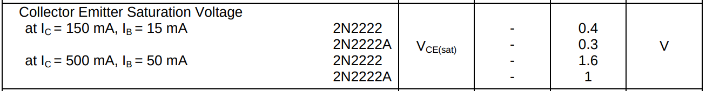

# BJT. Режимы работы транзистора 

### У транзистора есть 3 основных режима работы:

Вот как он может себя вести в зависимости от напряжений $V_{CE}$:

| Режим        | Условие (приблизительно)                    | Что происходит                                      | Где используется              |
|--------------|---------------------------------------------|----------------------------------------------------|-------------------------------|
| **Отсечка**   | $ V_{BE} < 0.6\,В $                       | Транзистор **выключен**, ток **не течёт**          | Логика, ключ "отключён"       |
| **Активный**  | $ V_{BE} \approx 0.6 - 0.7\,В $,  $ V_{CE} > 0.2\,В $ | Транзистор **включен**, усиливает ток             | Усилители                     |
| **Насыщение** | $V_{CE} \lesssim 0.2\,В $               | Транзистор **максимально открыт**, как замкнутый ключ | Ключевые схемы ("вкл")       |

---

# 1. Активный режим (усиление)
**Когда на коллекторе напряжение $U_{CE} = 1-2\ V$** сильно больше чем на базе (P-N переход база-коллектор закрыт, имеет обратное смещение), это создает сильное электрическое поле с положительным потенциалом на коллекторе и отрицательным на базе относительно коллектора, что приводит к притягиванию электронов из базы, т.е. происходит всасывание электронов из базы в которую эмиттер своим сильным легированнием накидал электронов. Тогда формула справедлива ($I_C \approx \beta \cdot I_B$) ток коллектора зависит только от тока базы. 

Выходные характеристики из даташита транзистора 2N2222. Графики зависимости тока коллектора от напряжения между коллектором и эмиттером.

1. До 0.5 В: $I_C$ резко растёт — это насыщение (не для усилителя!).

2. После 1 В: $I_C$ почти не меняется — это активный режим (горизонтальная линия). Т.е. оптимальное напряжение коллектор-эмиттер $U_{CE} = 1-2\ V$

Когда ток $I_C$ резко растёт в начале графика при $U_{CE} < 0.5\ V$ это режим насищения, когда транзистор полностью открыт, т.е. ток уже максимален и соответвенно не подходит для начальной точки усиления.

Соответственно напряжение коллектор-эмиттер после 1 вольта уже становится более благоприятным для усиленного всасывания электронов из базы.

**Ключевые условия:**
- $ U_{BE} \approx 0.7\,В$
- $ U_{CE} > U_{BE}$

**Что происходит:**
- База чуть "подтянута" по напряжению.
- Маленький ток базы $ I_B $ вызывает большой ток коллектора $ I_C = \beta \cdot I_B $
- Используется для **аналогового усиления**.

**Пример:**
- Усилитель микрофона, операционного усилителя и т.п.

Для работы транзистора в линейном режиме (например, в усилителе) необходимо правильно установить его рабочую точку по постоянному току (DC bias). Это означает выбор таких значений сопротивлений в цепи базы и коллектора, чтобы обеспечить желаемые значения тока коллектора ($I_C$) и напряжения коллектор-эмиттер ($U_{CE}$) в отсутствие входного сигнала.

Для установки напряжения между коллектором и эмиттером используют сопротивление коллектора $R_C$, далее замером мультиметра смотрим падение напряжения на $R_C$ и считаем ток $I_C=\frac{U_{R_C}}{R_C}$ 

Тогда напряжение между коллектором и эмиттером: $U_{CE}=U_{вх} - U_{R_C}$

1. Если $U_{CE}$ слишком маленькое ( $\le 0.5\ В$) транзистор перейдет в режим насищения.

2. Если $U_{CE}$ слишком большое ( $\approx U_{вх}$) транзистор перейдет в режим отсечки.

Если слишком большое напряжение, т.е. больше рекомендуемого для транзистора (обычно 30–60 В у 2N2222), то происходит лавинный пробой перехода база-коллектор с неконтролируемым током, транзистор сгорит

Вот из даташита транзистора 2N2222 "Collector Base Breakdown Voltage"  (Напряжение пробоя измеряется при очень малом токе коллектора $I_C =10μA$)

Другие критичные напряжения:
- Пробой коллектор-эмиттер (Collector Emitter Breakdown Voltage)
- Пробой эмиттер-база (Emitter Base Breakdown Voltage)

---

# 2. Насыщение (ключ "включен")
**При малом напряжении на коллекторе $ U_{CE} \lesssim 0.2\ В$**, PN переход база-коллектор становится прямосмещенным вместо обратного смещения, что приводит к открытию двух PN переходов и насыщению транзистора электронами, ток при этом уже максимальный и отсутвует усиление новыми электронами так как нет большой разности потенциалов между базой и коллетором соответвенно еоллектор не тянет электроны из базы, электроны идут через прямосмещенный PN переход база-коллектор без усиления, транзистор полностью открыт. Даже при увеличении тока базы, усиление не будет на коллекторе, так как база и так полностью открыта. Ток коллектора уже не зависит от тока базы.

**Ключевые условия:**
- База сильно "запитана": $ I_B $ **больше, чем нужно для усиления**
- $ U_{CE} \lesssim 0.2\,В $

**Что происходит:**
- Транзистор полностью "открыт" (т.е. уже больше нечего усиливать в режиме усилителя, это не подходит).
- Коллектор соединён почти напрямую с эмиттером.
- $ I_C $ не зависит от $I_B $, он ограничен внешней нагрузкой.

**Применение:**
- Как **ключ**: например, включение реле, светодиода, мотора и т.д.

Из даташита транзистора 2N2222 "Collector Emitter Saturation Voltage" (Напряжение насыщения коллектор-эмиттер для перевода транзистора в режим насищения)

- При токе коллектора $ I_C=150\ mA $ на транзисторе 2N2222A напряжение коллектор-эмиттер $ U_{CE} \le 0.3\ V$
- При токе коллектора $ I_C=500\ mA $ на транзисторе 2N2222A напряжение коллектор-эмиттер $ U_{CE} \le 1\ V$

---

# 3. Отсечка (ключ "выключен", cut-off)
Условие когда нет прямого смещения на переходе эмиттер-база, **обычно при $U_{BE} < 0.6–0.7\ В$ (лучше вообще 0 В или отрицательное) либо вообще подтянута к земле через резистор**. Нет достаточной разницы потенциалов между базой и эмиттером, переход эмиттер–база не открыт → электроны не выходят из эмиттера. Значит, через коллекторный резистор ток не течёт и нет падения напряжения на нем, т.е. на коллекторе остаётся напряжение, равное $U_{вх}$

Работает как открытый ключ (транзистор "выключен"), нет тока — нет усиления. Это эквивалентно тому, что транзистор ведёт себя как выключатель, который может быть либо открытым, либо закрытым.

**Ключевое условие:**
- $ U_{BE} < 0.5\,В $

**Что происходит:**
- База не запитана, переход закрыт.
- Нет тока $ I_B $ → нет тока $I_C $
- Транзистор полностью "закрыт".

**Применение:**
- Во всех схемах, где транзистор должен быть **выключен**, когда не нужно проводить ток.
