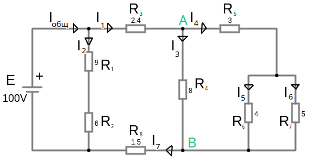
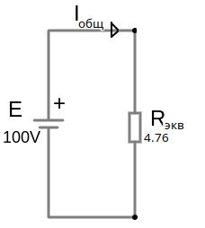

# Урок 12. Смешанное соединение резисторов. Расчет схемы с одним источником ЭДС. Часть 2.

Резисторы $R_6 (4, \Omega)$  и $R_7 (5, \Omega)$ соединены параллельно, поэтому складываем их сопротивления по формуле:    $R_{экв 67} = \frac{1}{\frac{1}{R_6} + \frac{1}{R_7}} = \frac{1}{\frac{1}{4} + \frac{1}{5}}=\frac{1}{0.45} = 2.22, \Omega $

Резисторы $R_5 (3, \Omega)$  и $R_{экв 6,7} (2.22, \Omega)$ соединены последовательно, поэтому складываем их сопротивления по формуле:   $R_{экв 567} = R_5+ R_{экв 67} = 3 + 2.22 = 5.22, \Omega $

Резисторы $R_4 (8, \Omega)$  и $R_{экв 567}\ (5.22, \Omega)$ соединены параллельно, поэтому складываем их сопротивления по формуле:    $R_{экв 4567} = \frac{1}{\frac{1}{R_4} + \frac{1}{R_{экв 567}}} = \frac{1}{\frac{1}{8} + \frac{1}{5.22}}=\frac{1}{0.315} = 3.17, \Omega $

Резисторы $R_3 (2.4, \Omega)$  и $R_{экв 4,5,6,7} (3.17, \Omega)$ и $R_8 (1.5, \Omega)$ соединены последовательно, поэтому складываем их сопротивления по формуле:   $R_{экв 345678} = R_3+ R_{экв 4567} = 2.4 + 3.17 + 1.5= 7.07, \Omega $

Резисторы $R_1 (9, \Omega)$ и $R_2 (6, \Omega)$ соединены последовательно, поэтому складываем их сопротивления по формуле:   $R_{экв 12} = R_1+ R_2 = 9 + 6= 15, \Omega $

Резисторы $R_{экв} 12 (15, \Omega)$ и $R_{экв 345678}\ (7.07, \Omega)$ соединены параллельно, поэтому складываем их сопротивления по формуле:   
     $R_{экв} = \frac{1}{\frac{1}{R_{экв 12}} + \frac{1}{R_{экв 345678}}} = \frac{1}{\frac{1}{15} + \frac{1}{7.07}}=\frac{1}{0.21} = 4.76, \Omega $

Общий ток:   $I_{общ} = \frac{E}{R_{экв}} = \frac{100, V}{4.76, \Omega } = 21, A$

Теперь необходимо посчитать ток и напряжение на каждом элементе, сворачивая схему:  

$I_2 = \frac{E}{R_1 + R_2} = \frac{100, V}{9 + 6, \Omega } = 6.67, A$

Найдем ток $I_1$ по первому закону Кирхгофа:   $I_{общ} - I_1 - I_2 = 0$   
    $ I_1 = I_{общ} - I_2 = 21 - 6.67 = 14.33, A$ 

Найдем напряжение на резисторах $R_1$ и $R_2$:
- $U_{R_1}=I_2\cdot R_1=6.67\cdot 9=60.03, V$
- $U_{R_2}=I_2\cdot R_2=6.67\cdot 6=40, V$ 
   - либо с помощью второго закона Кирхгофа $U_{R_2}=E-U_{R_1}= 100-60.03 \approx 40, V$

Найдем напряжение на резисторе $R_3$:  
    $U_{R_3}=I_1\cdot R_3=14.33\cdot 2.4 \approx 34.4, V$  

По схеме на рисунке 4 видно, что ток $I_7$ это тот же ток что и $I_1$:
-  $I_7=I_1=14.33, A$ 
-  $U_{R_8}=I_7\cdot R_8=14.33\cdot 1.5=21.49, V$  

Напряжение на ветви между узлами $A \to B$ можно найти с помощью второго закона Кирхгофа, на схеме рисунка 4 мы уже знаем все напряжения пассивных компонентов $R_3\ и\ R_8$ следовательно между узлами $A \to B$ будет все оставшееся напряжение:
- $U_{A\to B} = E - U_{R_3} - U_{R_8} = 100 - 34.4 - 21.49 = 44.1, V$ (я думаю это эквивалентное напряжение всех осташихся резисторов)
- $I_3=\frac{U_{A\to B}}{R_4} = \frac{44.1, V}{8, \Omega} = 5.51, A$

$I_4=I_2-I_3= 14.33 - 5.51 = 8.82, A$ 

$U_{R_5}=I_4\cdot R_5= 8.82\cdot 3=26.6, V$  

$U_{R_6}=U_{R_7}$ так как резисторы соединены парралельно и по второму закону Кирхгофа, сумма падений напряжений в замкнутом контуре равна сумме электродвижущих сил действующих в этом контуре: 
$U_{R_{67}}=U_{A\to B}-U_{R_5}=44.1-26.6=17.5, V$

$I_5= \frac{U_{R_6}}{R_6}= \frac{17.5}{4}=4.37, A$ 

$I_6= \frac{U_{R_7}}{R_7}= \frac{17.5}{5}=3.5, A$ 

Далее проверить [баланс мощностей](/theories_of_electrical_circuits/lessons/56.html) 