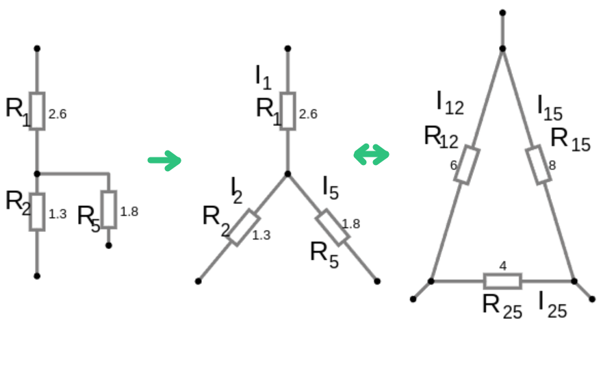

# Урок 13. Преобразование треугольника сопротивлений в звезду сопротивлений и обратно.

Преобразование треугольника сопротивлений в звезду сопротивлений (или наоборот) используется в электротехнике для упрощения анализа электрических цепей. Это преобразование позволяет заменить соединение резисторов, образующих треугольник (Δ), на эквивалентное соединение в виде звезды (Y), или наоборот.

**При наличии в контуре источника ЭДС данное преобразование неполучится!**

 
### Формулы для преобразования звезды в треугольник 

$R_{12} = R_1 + R_2 + \frac{R_1 \cdot R_2}{R_5} = 2.67 + 1.33 +  \frac{2.67 \cdot 1.33}{1.78} = 6, \Omega $

$R_{15} = R_1 + R_5 + \frac{R_1 \cdot R_5}{R_2} = 2.67 + 1.78 +  \frac{2.67 \cdot 1.78}{1.33} = 8, \Omega $

$R_{25} = R_2 + R_5 + \frac{R_2 \cdot R_5}{R_1} = 1.33 + 1.78 +  \frac{1.33 \cdot 1.78}{2.67} = 4, \Omega $

### Формулы для преобразования треугольника в звезду
 
$\sum R = R_1 + R_2 + \cdot + R_n = 6 + 8 + 4 = 18, \Omega$

$R_1 = \frac{R_{12} \cdot R_{15}}{\sum R} = \frac{6 \cdot 8}{18} = 2.67, \Omega$
 
$R_2 = \frac{R_{12} \cdot R_{25}}{\sum R} = \frac{6 \cdot 4}{18} = 1.33, \Omega$

$R_5 = \frac{R_{15} \cdot R_{25}}{\sum R} = \frac{8 \cdot 4}{18} = 1.78, \Omega$