# Делитель напряжения, тока
Делитель напряжения или тока нужны для применения в нужных местах схемы необходимого напряжения или тока, вместо использования их источников.

Потенциометр - это регулируемый делитель напряжения, так как он отмеряет потенциал (используют среднюю ножку), но его еще применяют и в качестве переменного резистора (используют крайние ножки).

* [Шунтирующий делитель напряжения](/theories_of_electrical_circuits/lessons/14.html#Шунтирующий-делитель)
   * [Пример с большим током нагрузки (т.е. сопротивление нагрузки низкое)](/theories_of_electrical_circuits/lessons/14.html#Пример-с-большим-током-нагрузки-те-сопротивление-нагрузки-низкое)
   * [Пример с малым током нагрузки (т.е. сопротивление нагрузки высокое)](/theories_of_electrical_circuits/lessons/14.html#Пример-с-малым-током-нагрузки-те-сопротивление-нагрузки-высокое)
   * [Пример делителя из трех резисторов](/theories_of_electrical_circuits/lessons/14.html#Пример-делителя-из-трех-резисторов)
* [Последовательный делитель напряжения](/theories_of_electrical_circuits/lessons/14.html#Последовательный-делитель)
* [Делитель напряжения на переменном резисторе](/theories_of_electrical_circuits/lessons/14.html#Делитель-напряжения-на-переменном-резисторе)
* [Делитель тока](/theories_of_electrical_circuits/lessons/14.html#Делитель-тока)
 

## Шунтирующий делитель

Делитель напряжения через шунтирующий резистор нагрузки

Делитель напряжения — это простая электрическая схема, которая позволяет получить из входного напряжения ($U_{вх}$) более низкое выходное напряжение ($U_{вых}$). Он состоит из двух или более резисторов, соединённых последовательно. Делитель напряжения широко используется в электронике для получения опорных напряжений, снижения уровня сигналов или измерения напряжений.

Шунтирующий резистор, или шунт, — это резистор $R_{bottom}$, который подключается параллельно (шунтирует) другому $R_{нагрузки}$ элементу цепи. Его основное назначение — отвести часть тока, протекающего в цепи, или создать падение напряжения, пропорциональное току.

```
Для получения 5 вольт на выходе, имея 9 вольт на входе

[U_in +9V]----[R_top]----+----[R_bottom]----[GND]
                         |
                     [U_out 5V]
                         |
                      [load]
                         |
                       [GND]

```

**Применение**
1. Создание опорного напряжения — для питания микросхем, которым требуется определённое напряжение.
2. Измерение напряжения — в сочетании с аналого-цифровыми преобразователями (АЦП).
3. Регулировка уровня сигнала — в аудиотехнике или измерительных приборах.
4. Защита входов микросхем — для снижения напряжения до безопасного уровня.


**Принцип работы**
Делитель напряжения работает на основе закона Ома и правила последовательного соединения резисторов. Если два резистора $R_1$ и $R_2$ соединены последовательно, то напряжение на каждом из них пропорционально их сопротивлению.
 
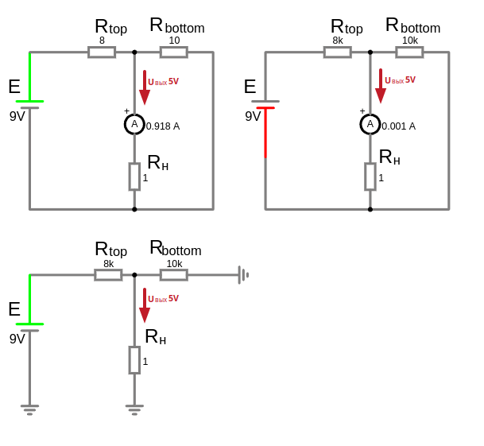 

Формула для расчёта выходного напряжения:
 
$U_{вых} = U_{вх} \cdot \frac{R_{bottom}}{R_{top} + R_{bottom}}$
 
где:
- $U_{вх}$ — входное напряжение,
- $R_{top}$ — сопротивление первого резистора,
- $R_{bottom}$ — сопротивление второго резистора,
- $U_{вых}$ — выходное напряжение.

```admonish info
Нам в любом случае нужно обеспечить, чтобы **ток через делитель был значительно больше, чем ток нагрузки**. Это гарантирует, что выходное напряжение делителя будет стабильным и не будет "проседать" при подключении нагрузки.

Вообщем, в не зависимости от тока нагрузки и его сопротивления, нам следует подобрать сопротивление делителя так, что бы протекающий через него ток был значительно больше тока нагрузки

Чтобы **ток через делитель напряжения** был **значительно больше**, чем **ток нагрузки**, сопротивление резисторов делителя должно быть **меньше**, чем **сопротивление нагрузки**. Это обеспечивает "жёсткость" делителя и предотвращает "просадку" напряжения при подключении нагрузки.

$R_{top} + R_{bottom} \ll R_{нагрузки}$

Если сопротивление нагрузки намного больше, чем сопротивление резисторов делителя, то нагрузка будет потреблять относительно небольшой ток. В этом случае делитель напряжения будет работать почти как идеальный (без нагрузки), и выходное напряжение будет стабильным.

```

Коэффициент полезного действия такой схемы довольно низкий, поскольку только часть мощности источника питания поступает к нагрузке, а остальная мощность преобразуется в тепло, выделяемое на резисторах. Чем больше понижается напряжение, тем меньше мощности от источника питания поступит к нагрузке.

Так как нагрузка подключается параллельно к одному из резисторов делителя, то есть шунтирует его, то общее сопротивление цепи снижается и происходит перераспределение падений напряжений. Поэтому сопротивление нагрузки должно быть гораздо больше сопротивления резистора делителя. В противном случае схема будет работать нестабильно с отклонением от заданных параметров.

### Пример с большим током нагрузки (т.е. сопротивление нагрузки низкое)

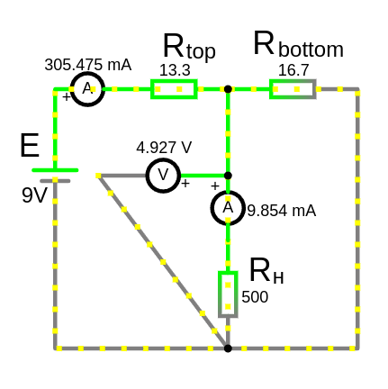 

```admonish info
Вариант когда ток нагрузки большой, **шунтирующий делитель** более эффективен чем делитель через последовательный резистор, так как большой ток меньше влияет на сопротивление нагрузки.
В шунтирующем делителе ток делится между $R_{bottom}$ и нагрузкой, что снижает нагрузку на $R_{top}$

В последовательном делителе ток течет через R1 и нагрузку последовательно. Это означает, что весь ток, который идет через нагрузку, проходит через R1 и следовательно нагревается.
Вся мощность, рассеиваемая на R1, "теряется" в виде тепла, так как R1 не выполняет полезной работы.
Выгода шунтирующего делителя заключается в том, что потери мощности распределяются между двумя резисторами, что снижает нагрузку на каждый из них.
Это особенно важно для больших токов, так как позволяет использовать резисторы с меньшей мощностью и снижает нагрев.
При этом нагрузка получает большую часть мощности 
```

```admonish info
Так же, следует обратить внимание на параметр мощности для резисторов делителя, так как ток или входное напряжение большое то на них выделяется значительная мощность и они сильно греются, что бы избежать их выхода из строя сдедует подобрать подходящие по мощности резисторы (с запасом в 1.5–2 раза больше расчётной), чтобы обеспечить надёжность и долговечность.
```
 
Есть входное напряжение <code>$U_{вх}=E=9$</code> вольт, и датчик $R_{н}$ с рабочим напряжением 5 вольт и обладает сопротивлением 500 Ом. 
Расчитать такие значения сопротивлений резисторов делителя $R_{top}$ и $R_{bottom}$, что бы получить 5 вольт на выходе $U_{вых}$ и обеспечить значительно больший ток делителя чем на нагрузке (<code>$R_{top} + R_{bottom}≪R_{нагрузки}$</code>)
 
Расчитаем ожидаемый ток нагрузки, если подать необходимые 5 вольт:
- $I_{нагрузки}= \frac{U}{R_{нагрузки}} = \frac{5}{500}=0.01\ A$ ($\approx 10\ мА$)

Тогда ток через делить должен быть значительно больше чем $0.01\ A$, допустим в 30 раз:
- $I_{делителя}= I_{нагрузки} \cdot 30 =0.3\ A$ ($\approx 300\ mA$)

Нам нужно знать общее сопротивление делителя $R_{обш}=R_{top} + R_{bottom}$, что бы посчитать его ток $I_{делителя}$:
- $R_{обш}=\frac{U_{вх}}{I_{делителя}}=\frac{9}{0.3}=30\ Om$


Из формулы для расчёта выходного напряжения, найдем соотношение резисторов:
- $U_{вых} = U_{вх} \cdot \frac{R_{bottom}}{R_{top} + R_{bottom}} \to 5 = 9 \cdot \frac{R_{bottom}}{R_{top} + R_{bottom}}$

Упростим уравнение:
* $\frac{R_{bottom}}{R_{top} + R_{bottom}} = \frac{5}{9}$
 
Подставим $R_{top} + R_{bottom} = R_{обш} = 30$:
* $\frac{R_{bottom}}{30} = \frac{5}{9}$
* $R_{bottom}=\frac{5}{9}\cdot 30 \approx 16.666666667\ Om$

Тогда найдем $R_{top}$:
* $R_{top}=30-R_{bottom}=30-16.666666667 \approx 13.333\ Om$

Условие $R_{top} + R_{bottom} \ll R_{нагрузки}$ выполняется: $30 \, \text{Ом} \ll 500 \, \text{Ом}$

Проверка стабильности
- Ток через делитель: $I_{делителя}= \frac{U_{вх}}{R_{top} + R_{bottom}} =\frac{9}{30} = 0.3\ A$ (300 мА)  
- Ток нагрузки: $I_{нагрузки}= \frac{U_{вых}}{R_{нагрузки}}=\frac{5}{500} = 0.01\ A$ (10 мА)

Проверим расчеты сопротивлений делителя по выходному напряжению:
- $R_{экв}=\frac{R_{bottom}\cdot R_{нагрузки}}{R_{bottom} + R_{нагрузки}}= \frac{16.666666667\cdot 500}{16.666666667 + 500}\approx 16.129032258\ Om$ (параллельное соединение резисторов)
- $U_{вых}=U_{вх} \cdot \frac{R_{экв}}{R_{top} + R_{экв}}=9\cdot \frac{16.129032258}{13.333 + 16.129032258}\approx 4.92\ V$

Влияние нагрузки:
- Нагрузка потребляет 10 мА, что составляет 3.3% от тока через делитель.
- Напряжение на выходе немного "просядет", но это будет незначительно.

$\frac{0.01\ A}{0.3\ A}\cdot 100 = 0.033333333\cdot 100=3.3$%

---

### Пример с малым током нагрузки (т.е. сопротивление нагрузки высокое)

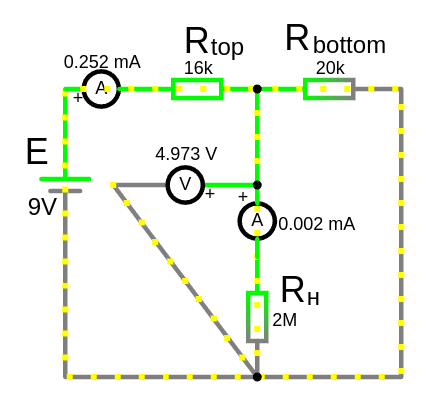 

```admonish info
При малом токе нагрузки, лучше выбрать **последовательный делитель** (при условии что сопротивление нагрузки статично), а не этот шунтирующий. Поскольку ток через нагрузку мал, потери мощности на дополнительном резисторе $R_{top}$ будут незначительными.
```

Есть входное напряжение <code>$U_{вх}=E=9$</code> вольт, и датчик $R_{н}$ с рабочим напряжением 5 вольт и обладает сопротивлением 2000000 Ом (т.е. 2 MOm). 
Расчитать такие значения сопротивлений резисторов делителя $R_{top}$ и $R_{bottom}$, что бы получить 5 вольт на выходе $U_{вых}$ и обеспечить значительно больший ток делителя чем на нагрузке (<code>$R_{top} + R_{bottom}≪R_{нагрузки}$</code>)

Расчитаем ожидаемый ток нагрузки, если подать необходимые 5 вольт:
- $I_{нагрузки}= \frac{U}{R_{нагрузки}} = \frac{5}{2000000}=0.0000025\ A$  (0.0025 мА)

Тогда ток через делить должен быть значительно больше чем $0.0000025\ A$, допустим в 100 раз (чем больше разница, тем меньше "просядет" напряжение):
- $I_{делителя}= I_{нагрузки} \cdot 100 = 0.00025\ A$ (0.25 мА)

Нам нужно знать общее сопротивление делителя $R_{обш}=R_{top} + R_{bottom}$, что бы посчитать его ток $I_{делителя}$:
- $R_{обш}=\frac{U_{вх}}{I_{делителя}}=\frac{9}{0.00025}=36000\ Om$ (36 кОм)

Из формулы для расчёта выходного напряжения, найдем соотношение резисторов:
- $U_{вых} = U_{вх} \cdot \frac{R_{bottom}}{R_{top} + R_{bottom}} \to 5 = 9 \cdot \frac{R_{bottom}}{R_{top} + R_{bottom}}$

Упростим уравнение:
* $\frac{R_{bottom}}{R_{top} + R_{bottom}} = \frac{5}{9}$

Подставим $R_{top} + R_{bottom} = R_{обш} = 36000$:
* $\frac{R_{bottom}}{36000} = \frac{5}{9}$
* $R_{bottom}=\frac{5}{9}\cdot 36000 = 20000\ Om$ (20 кОм)

Тогда найдем $R_{top}$:
* $R_{top}=90000-R_{bottom}=36000-20000 = 16000\ Om$ (16 кОм)

Условие $R_{top} + R_{bottom} \ll R_{нагрузки}$ выполняется: $36000 \, \text{Ом} \ll 2000000 \, \text{Ом}$

Проверка стабильности
- Ток через делитель: $I_{делителя}= \frac{U_{вх}}{R_{top} + R_{bottom}} =\frac{9}{36000} = 0.00025\ A$ (0.25 mA)    
- Ток нагрузки: $I_{нагрузки}= \frac{U_{вых}}{R_{нагрузки}}=\frac{5}{2000000} = 0.0000025\ A$ (0.0025 mA)

Проверим расчеты сопротивлений делителя по выходному напряжению:
- $R_{экв}=\frac{R_{bottom}\cdot R_{нагрузки}}{R_{bottom} + R_{нагрузки}}= \frac{20000\cdot 2000000}{20000 + 2000000} = 19801.98\ Om$ (параллельное соединение резисторов)
- $U_{вых}=U_{вх} \cdot \frac{R_{экв}}{R_{top} + R_{экв}}=9\cdot \frac{19801.98}{16000 + 19801.98}\approx 4.97\ V$


Влияние нагрузки:
- Нагрузка потребляет 0.0000025 A, что составляет 1% от тока через делитель.
- Напряжение на выходе немного "просядет", но это будет незначительно.


$\frac{0.0000025\ A}{0.00025\ A}\cdot 100 = 0.01\cdot 100=1$%

---


### Пример делителя из трех резисторов

<details>

<summary>Пример делителя из трех резисторов</summary>

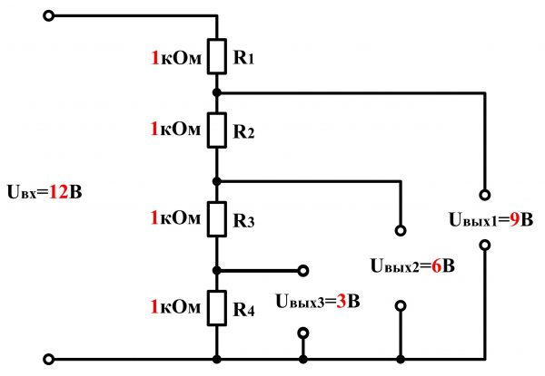 

Если в делителе напряжения используется **три резистора**, соединённых последовательно, то принцип работы остаётся тем же, но формула для расчёта выходного напряжения усложняется. В этом случае напряжение можно снимать между любыми двумя точками цепи, и оно будет зависеть от сопротивлений всех трёх резисторов.

**Общая схема**
Пусть три резистора $R_1$, $R_2$ и $R_3$ соединены последовательно, и к ним приложено входное напряжение $U_{вх}$. Тогда:
- Напряжение на каждом резисторе определяется по закону Ома.
- Общее сопротивление цепи: $R_{общ} = R_1 + R_2 + R_3$.
- Ток в цепи: $I = \frac{U_{вх}}{R_{общ}}$.

**Формулы для напряжений**
1. **Напряжение между точкой после $R_1$ и землёй (GND):**
   
   $U_1 = U_{вх} \cdot \frac{R_1}{R_1 + R_2 + R_3}$
  
2. **Напряжение между точкой после $R_2$ и землёй (GND):**
   
   $U_2 = U_{вх} \cdot \frac{R_1 + R_2}{R_1 + R_2 + R_3}$

3. **Напряжение между точкой после $R_3$ и землёй (GND):**
   
   $U_3 = U_{вх} \cdot \frac{R_1 + R_2 + R_3}{R_1 + R_2 + R_3} = U_{вх}$
   
Пусть $U_{вх} = 12\, \text{В}$, $R_1 = 2\, \text{кОм}$, $R_2 = 3\, \text{кОм}$, $R_3 = 5\, \text{кОм}$.

1. Общее сопротивление:
   
   $R_{общ} = R_1 + R_2 + R_3 = 2 + 3 + 5 = 10\, \text{кОм}$
   
2. Ток в цепи:
   
   $I = \frac{U_{вх}}{R_{общ}} = \frac{12}{10} = 1.2\, \text{мА}$
   
3. Напряжение на каждом резисторе:
   - Напряжение на $R_1$:
    
     $U_{R1} = I \cdot R_1 = 1.2 \cdot 2 = 2.4\, \text{В}$
    
   - Напряжение на \(R_2\):
     
     $U_{R2} = I \cdot R_2 = 1.2 \cdot 3 = 3.6\, \text{В}$
     
   - Напряжение на \(R_3\):
    
     $U_{R3} = I \cdot R_3 = 1.2 \cdot 5 = 6\, \text{В}$
    
4. Напряжение между точками:
   - Между $R_1$ и GND: $U_1 = 2.4\, \text{В}$
   - Между $R_2$ и GND: $U_2 = 2.4 + 3.6 = 6\, \text{В}$
   - Между $R_3$ и GND: $U_3 = 12\, \text{В}$

</details>

---

## Последовательный делитель

```
Для получения 5 вольт на выходе, имея 9 вольт на входе

[U_in ЭДС (9 В)] ---[R_top]--- [U_out 5V]--- [load]--- [GND]
```

Делитель напряжения где нагрузка $R_{н}$ как часть делителя напряжения $R_{bottom}$

Используют в цепях **с высоким входным сопротивлением, т.е. с малым током нагрузки**:
* Если нагрузка имеет высокое входное сопротивление (например, вход операционного усилителя), её влияние на делитель будет минимальным. Поскольку ток через нагрузку мал, потери мощности на дополнительном резисторе $R_{top}$ будут незначительными.

**Недостатки**
- Основной недостаток этой схемы — её чувствительность к изменениям сопротивления нагрузки. Изменение сопротивления нагрузки $R_{нагрузки}$ приводит к изменению выходного напряжения $U_{вых}$, что может быть неприемлемо в некоторых приложениях.
- При больших токах, резисторы могут сильно греться, и рассеивать мощность в пустую.
   - Потери мощности: ток течет через оба резистора ($R_{top}$ и нагрузку), что приводит к рассеиванию мощности на $R_{top}$
   - Низкий КПД: часть энергии тратится впустую на нагрев резистора $R_{top}$
 

Формула делителя напряжения:
- $U_{вых} = U_{вх} \cdot \frac{R_{нагрузки}}{R_{top} + R_{нагрузки}}$

### Пример

Есть входное напряжение $U_{вх}=E=9$ вольт, и датчик $R_{н}$ с рабочим напряжением 5 вольт и обладает сопротивлением 2000000 Ом т.е. 2 MOm. 
Расчитать такое значения сопротивления резистора делителя $R_{top}$, что бы получить 5 вольт на выходе $U_{вых}$ 

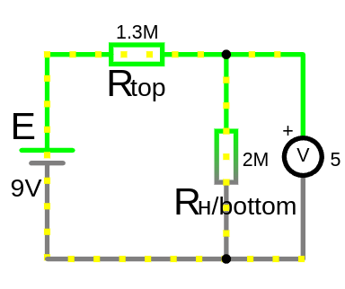 

$U_{вых} = U_{вх} \cdot \frac{R_{нагрузки}}{R_{top} + R_{нагрузки}} \to 5 = 9\cdot \frac{2000000}{R_{top} + 2000000} $

1. Упростим уравнение:
   
   $5 = 9 \cdot \frac{2 \cdot 10^6}{R_{top} + 2 \cdot 10^6}$
  
2. Делим обе стороны на 9:
   
   $\frac{5}{9} = \frac{2 \cdot 10^6}{R_{top} + 2 \cdot 10^6}$
   
3. Переворачиваем дроби:

   $\frac{9}{5} = \frac{R_{top} + 2 \cdot 10^6}{2 \cdot 10^6}$
   
4. Умножаем обе стороны на \(2 \cdot 10^6\):
   
   $\frac{9}{5} \cdot 2 \cdot 10^6 = R_{top} + 2 \cdot 10^6$
  
5. Вычисляем левую часть:
    
   $\frac{9}{5} \cdot 2 \cdot 10^6 = 3.6 \cdot 10^6 \, \text{Ом}$
   
6. Вычитаем $2 \cdot 10^6$ из обеих сторон:
   
   $R_{top} = 3.6 \cdot 10^6 - 2 \cdot 10^6 = 1.6 \cdot 10^6 \, \text{Ом}$
   
Итог:

Необходимо подключить резистор $R_{top} = 1.6 \, \text{МОм}$ последовательно с нагрузкой $R_{нагрузки} = 2 \, \text{МОм}$. Тогда на нагрузке будет 5 В.

Проверка:

Подставим $R_{top} = 1.6 \, \text{МОм}$ и $R_{нагрузки} = 2 \, \text{МОм}$ в формулу делителя напряжения:

$U_{out} = 9 \cdot \frac{2 \cdot 10^6}{1.6 \cdot 10^6 + 2 \cdot 10^6} = 5 \, \text{В}$

Ток, протекающий через цепь, можно рассчитать по закону Ома:
   
   $I = \frac{U_{вх}}{R_{top} + R_{нагрузки}} = \frac{9}{1.6 \cdot 10^6 + 2 \cdot 10^6} = \frac{9}{3.6 \cdot 10^6} = 0.0000025\ A (2.5 \, \text{мкА})$
  
   Это очень маленький ток, что характерно для высокоомных цепей.
 
Зная ток цепи,мы можем удостовериться в верности расчитанного сопротивления $R_{top}$, посчитав падение напряжения на нагрузке:
- $U_{R_{нагрузки}}=I\cdot R_{нагрузки}=0.0000025\cdot 2000000=5 \, \text{В}$ 

---

### Делитель напряжения на переменном резисторе

Схему делителя напряжения на переменном резисторе называют схемой потенциометра. Вращая рукоятку громкости музыкального центра или автомагнитолы, вы таким действием плавно изменяете напряжение, подаваемое на усилитель модности звуковой частоты. 


### Важные замечания
1. Ток через делитель должен быть значительно больше, чем ток нагрузки, чтобы выходное напряжение не "проседало".
2. Если делитель используется для питания нагрузки, необходимо учитывать её сопротивление, так как оно может изменить общее сопротивление цепи.
3. Для повышения точности используют прецизионные резисторы с малым допуском.

Делитель напряжения работает хорошо, если датчик потребляет маленький ток. Если он потребляет много, лучше использовать стабилизатор напряжения или операционный усилитель как буфер.

Например потенциометр 3296. Замер сопротивления (щупами и вне схемы) между 1 и 3 выводами показал $R_{общ}=9400\ Ом$, соответвенно в качестве потенциометра он может менять сопротивление от 0 до 9400 Ом.

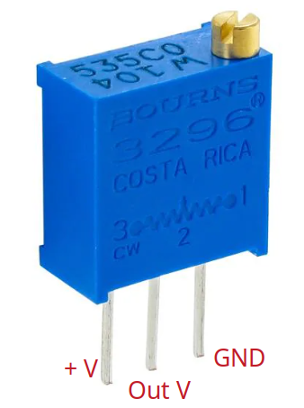

**В качестве делителя напряжения.**
Допустим на входе 5 Вольт и нам необходимо получить 4 вольта на выходе, мы накрутили потенциометр и замерили напряжение между средней ногой и ногой подключенной к GND =4 Вольта, какое сопротивление теперь между ножек 1 и 2 и между 2 и 3, и какой ток под нагрузкой в 47 кОм:
- известно: 
   - $U_{вх}=5\ V$,
   - $U_{вых}=4\ V$
   - $R_{top} + R_{bottom}=9400 Ом$

Из формулы $U_{вых}= U_{вх}\cdot \frac{ R_{bottom}}{R_{top} + R_{bottom}}$ подставляем известные значения:
- $4 = 5\cdot \frac{ R_{bottom}}{9400}$

Разделим обе части уравнения на 5:
- $0.8 = \frac{R_{bottom}}{9400}$
- $R_{bottom}=0.8\cdot 9400=7520\ Om$
 
Тогда $R_{top}=9400-R_{bottom}=1920\ Om$ 

**Замер выходного напряжения**. Черный щуп на среднюю ногу, а красный:
- если вывод 3 подключен к GND, то напряжение на выходе измеряется между ногой 2 (средняя) и ногой 3 (земля). Это напряжение на нижнем плече делителя (Rbottom).

- если вывод 1 подключен к GND, то напряжение на выходе измеряется между ногой 2 (средняя) и ногой 1 (земля). Это напряжение на верхнем плече делителя (Rtop). 

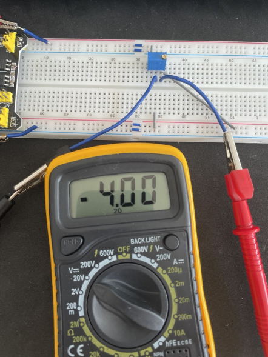 

**Измерение сопротивлений делителя** $R_{top}=1940\ Om$ и $R_{bottom}=7500\ Om$, <br>а вместе $R_{общ}=1940+7500=9440\ Om$ 

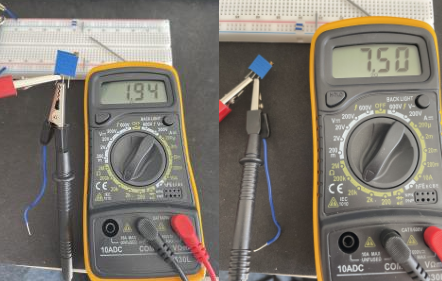 

**Измерим выходной ток при нагрузки 47 кОм**.<br> 
$I_{вых}=\frac{U_{вых}}{R_{нагр}}=\frac{4}{47000} \approx 0.000085\ A$ (0.085 mA)
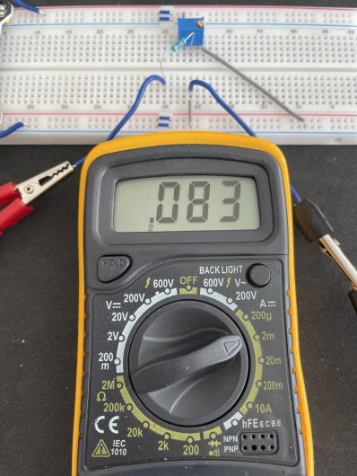 

**Ток через делитель**<br>
$R_{экв} = \frac{R_{bottom} \cdot R_{нагрузки}}{R_{bottom} + R_{нагрузки}}=\frac{7500 \cdot 47000}{7500 + 47000}=6468\ Om$

$I_{общ} = \frac{U_{вх}}{R_{top} + R_{экв}}=\frac{5}{1920 + 6468}=0.000596\ A$ (0.596 mA) **да ток через делитель значительно больше чем на нагрузке**

```admonish info
Минимальное рекомендуемое сопротивление нагрузки для потенциометра 3296 с $R_{общ}=9400\ Ом$ составляет 23.5 кОм.
Так как резисторы $R_{bottom}$ и $R_{top}$ соединены параллельно относительно нагрузки, то формула эквивалентного сопротивления параллельного соединения:
- $R_{вых} = \frac{R1 \cdot R2}{R1 + R2}$ 
- и максимальное $R_{вых}$ будет при равных значениях сопротивлений $R_{bottom}$ и $R_{top}$ подставив найдем $R_{вых\ max}=2350\ Ом$ 

Тогда, что бы нагрузка не привела к проседанию напряжения, должно быть условие $R_{top} + R_{bottom} \ll R_{нагрузки}$ примерно больше в 10, тогда минимально допустимое сопротивлени на нагрузке должно быть $R_{нагрузки\ мин} ≥ 10 * 2350 = 23.5 кОм$
```


---

## Пример, создание опорного напряжения — для питания микросхем/датчиков, которым требуется определённое напряжение.

Если датчик потребляет большой ток (то есть у него малое сопротивление), он начинает «просаживать» напряжение, потому что создаёт дополнительное сопротивление, параллельное нижнему резистору делителя. В делителе напряжения нет активного источника тока — он просто делит напряжение по законам Ома.

Если нагрузка (микросхема/датчик) забирает много тока, напряжение на выходе падает ниже, чем рассчитано по формуле, потому что нижний резистор делителя вместе с нагрузкой образует параллельное сопротивление, уменьшая общее сопротивление нижнего плеча. В результате делитель уже не даст рассчитанное напряжение, а меньше ожидаемого.

Из-за этого датчик может перестать корректно работать, либо вообще не включится, если напряжение упадёт слишком сильно.

Если нужно питать датчик с большим током, вместо простого делителя напряжения лучше использовать стабилизатор напряжения или буферный усилитель, который обеспечит нужное напряжение, не теряя его под нагрузкой.

Для большинства случаев, особенно при работе с датчиками и слаботочными нагрузками, лучше использовать килоомы в качестве значений делителя. Это уменьшает ток через делитель, снижает энергопотребление и минимизирует влияние на нагрузку. Если сопротивление резисторов слишком большое, это может привести к тому, что датчик не получит достаточного тока для корректной работы. Поэтому важно выбирать резисторы так, чтобы напряжение на выходе было правильным, а ток был достаточным для работы датчика. Если для вашего датчика важно, чтобы ток был достаточно большим, нужно будет уменьшить сопротивление резисторов, но при этом все равно нужно соблюдать требуемое соотношение для получения правильного выходного напряжения

## Делитель тока

Делитель тока — это схема, которая разделяет общий ток на несколько частей, каждая из которых протекает через отдельные ветви цепи. В отличие от делителя напряжения, где напряжение делится между компонентами, в делителе тока ток распределяется между параллельно соединёнными сопротивлениями.

В делителе тока общий ток $I_{total}$ разделяется между параллельными ветвями. Ток в каждой ветви обратно пропорционален сопротивлению этой ветви. То есть, чем больше сопротивление ветви, тем меньше ток через неё, и наоборот.

```
       I_total
          │
          ├───[R1]───┐
          │          I1
          │
          ├───[R2]───┐
          │          I2
          │
         GND
```

### Применение делителя тока:
1. **Измерение токов:** Делитель тока используется в измерительных приборах, таких как амперметры, для расширения диапазона измерений.
2. **Распределение мощности:** В схемах, где нужно распределить ток между несколькими компонентами (например, светодиодами или резисторами).
3. **Защита цепей:** Для ограничения тока через чувствительные компоненты.

**Формула делителя тока**:

Если у вас есть две параллельные ветви с сопротивлениями $R_1$ и $R_2$, то токи $I_1$ и $I_2$ в этих ветвях определяются по формулам:

$I_1 = I_{total} \cdot \frac{R_2}{R_1 + R_2}$
 
$I_2 = I_{total} \cdot \frac{R_1}{R_1 + R_2}$
 
Где:
- $I_{total}$ — общий ток, поступающий в узел параллельного соединения,
- $R_1$ и $R_2$ — сопротивления ветвей,
- $I_1$ и $I_2$ — токи в соответствующих ветвях.

**Формула для n ветвей:**

Если у вас есть две и более параллельные ветви, то ток $I_i$ для каждой i-й ветви определяются по формуле:

$I_i = I_{total} \cdot \frac{R_{eq}}{R_i}$

$\frac{1}{R_{eq}} = \frac{1}{R_1} + \frac{1}{R_2} + \frac{1}{R_3} + \dots + \frac{1}{R_n}$

где:
- $I_{total}$ — общий ток, поступающий в узел параллельного соединения,
- $R_i$ — сопротивление $i$-й ветви,
- $R_{eq}$ — эквивалентное сопротивление всех параллельно соединённых ветвей.

### Пример для трёх ветвей:
Предположим, у вас есть три параллельные ветви с сопротивлениями $R_1 = 2 \, \text{Ом}$, $R_2 = 3 \, \text{Ом}$, $R_3 = 6 \, \text{Ом}$, и общий ток $I_{total} = 1 \, \text{А}$.

1. **Вычисляем эквивалентное сопротивление $R_{eq}$:**
    
   $\frac{1}{R_{eq}} = \frac{1}{2} + \frac{1}{3} + \frac{1}{6} \to \frac{1}{R_{eq}} = 0.5 + 0.333 + 0.1667 \to \frac{1}{R_{eq}} = 0.9997 \to R_{eq} = \frac{1}{0.9997} \approx 1$
   
   $R_{eq} = 1 \, \text{Ом}$
   

2. **Ток в каждой ветви:**
   - Ток через $R_1$:
     
     $I_1 = I_{total} \cdot \frac{R_{eq}}{R_1} = 1 \cdot \frac{1}{2} = 0.5 \, \text{А}$
     
   - Ток через $R_2$:
    
     $I_2 = I_{total} \cdot \frac{R_{eq}}{R_2} = 1 \cdot \frac{1}{3} = 0.333 \, \text{А}$
    
   - Ток через $R_3$:
     
     $I_3 = I_{total} \cdot \frac{R_{eq}}{R_3} = 1 \cdot \frac{1}{6} = 0.1667 \, \text{А}$
     

3. **Проверка:**
   Сумма токов в ветвях должна быть равна общему току:
   
   $I_1 + I_2 + I_3 = 0.5 + 0.333 + 0.1667 = 1 \, \text{А}$
   

Отлично! Давайте рассмотрим практическое применение делителя тока для распределения мощности, например, в схеме с несколькими светодиодами. Предположим, у нас есть источник тока, и мы хотим равномерно распределить ток между несколькими светодиодами, чтобы они светились с одинаковой яркостью.

---

### Задача:

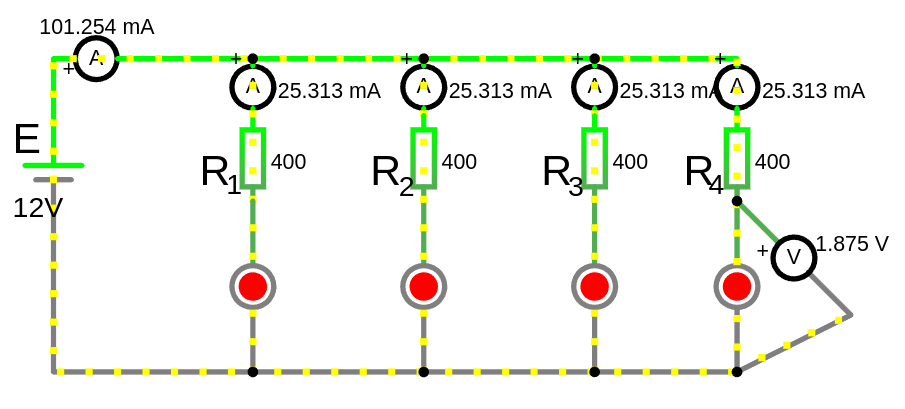 

Расчитать сопротивление резисторов для обеспечения тока в ветви со светодиодом.
- Напряжение источника $V_{source} = 12 \, \text{В}$.
- У нас есть источник тока $I_{total} = 100 \, \text{мА}$.
- Мы хотим подключить 4 светодиода, каждый из которых должен работать при токе $I_{LED} = 25 \, \text{мА}$.
- Напряжение на каждом светодиоде $V_{LED} = 2 \, \text{В}$.


Светодиод — это нелинейный элемент, и его сопротивление зависит от напряжения и тока. Его вольт-амперная характеристика (ВАХ) выглядит как экспоненциальная кривая. Однако в большинстве случаев сопротивление светодиода не учитывается в явном виде при расчётах. Вместо этого используется падение напряжения ($V_{LED} \approx 1.8–3.3В$ если конкретно то для красного 1.8-2.0 В, для зеленого/желтого 2.0-2.2 В, для синего/белого 3.0-3.3 В) и номинальный ток $I_{LED} \approx 10–30мА$)

Светодиод — **это токовый прибор**. Это значит, что его яркость и долговечность зависят от тока, а не от напряжения. Вместо резистора можно использовать специализированные микросхемы (например, драйверы светодиодов), которые поддерживают постоянный ток независимо от напряжения.

При изменении тока через светодиод его падение напряжения ($I_{LED}$) остаётся почти постоянным.

Сопротивление светодиода ($R_{LED}$) можно рассчитать только для конкретного режима работы, но оно не используется в расчётах, так как не является постоянной величиной.

---

**Решение**:

1. **Схема подключения:**
   Светодиоды подключаются параллельно, и для каждого светодиода используется резистор, чтобы ограничить ток.

   ```
   Источник (12 В) ---[R1]---[LED1]--- GND
                   ---[R2]---[LED2]--- GND
                   ---[R3]---[LED3]--- GND
                   ---[R4]---[LED4]--- GND
   ```

2. **Расчёт резисторов:**
   Для каждого светодиода ток должен быть $25 \, \text{мА}$. Напряжение на резисторе $R$ для каждого светодиода:
    
   $V_R = V_{source} - V_{LED} = 12 - 2 = 10 \, \text{В}$
    
   Используем закон Ома для расчёта сопротивления:
    
   $R = \frac{V_R}{I_{LED}} = \frac{10}{0.025} = 400 \, \text{Ом}$
    
   Таким образом, для каждого светодиода нужен резистор $R = 400 \, \text{Ом}$.

3. **Мощность резисторов:**
   Мощность, рассеиваемая на каждом резисторе:
   
   $P = I_{LED}^2 \cdot R = (0.025)^2 \cdot 400 = 0.25 \, \text{Вт}$
    
   Выбираем резисторы с мощностью не менее $0.25 \, \text{Вт}$ (лучше с запасом $0.5 \, \text{Вт}$).

4. **Общий ток:**
   Общий ток, потребляемый от источника:
    
   $I_{total} = 4 \cdot I_{LED} = 4 \cdot 25 \, \text{мА} = 100 \, \text{мА}$
    
---

**Итоговая схема**:
```
Источник (12 В) ---[400 Ом]---[LED1]--- GND
                ---[400 Ом]---[LED2]--- GND
                ---[400 Ом]---[LED3]--- GND
                ---[400 Ом]---[LED4]--- GND
```

---

**Преимущества**:
- Каждый светодиод получает одинаковый ток ($25 \, \text{мА}$), что обеспечивает равномерную яркость.
- Резисторы защищают светодиоды от перегрева и выхода из строя.

---

### Альтернативный подход (без резисторов):
Если светодиоды имеют одинаковые характеристики, можно подключить их последовательно, чтобы ток через них был одинаковым. Однако в этом случае напряжение источника должно быть равно сумме напряжений на светодиодах. Это связано с тем, что светодиоды сами "поглощают" всё напряжение источника, и ток через них будет соответствовать их характеристикам.

Если напряжение источника немного превышает 8В, ток через светодиоды может стать слишком большим, что приведёт к их перегреву.
И необходимо использовать гасящий резистор нужен для ограничения тока через светодиод.

Например:

Если источник питания выдаёт ровно 8 вольт, то ток через светодиоды будет равен их номинальному току (20 мА)
- Для 4 светодиодов с $U_{LED} = 2 \, \text{В}$ каждый:
   
  $U_{source} = 4 \cdot U_{LED} = 8 \, \text{В}$
  
  Тогда резистор не нужен, если источник выдаёт ровно 8 В.

Но, если выходное напряжение больше например 9 вольт, в этом случае "лишнее" напряжение (1 вольт) нужно погасить с помощью резистора, чтобы ограничить ток.
Если выходное напряжение меньше например 7 вольт, то светодиоды не загорятся, так как напряжения недостаточно.

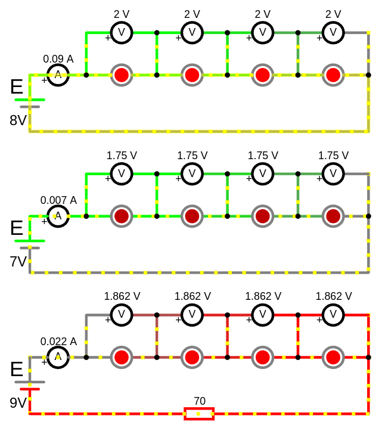

<a href="/theories_of_electrical_circuits/falstad/circuitjs-14.txt" download="circuitjs-14.txt">Скачать схему для www.falstad.com/circuit</a>

p.s. Первая схема явно сломалась, так как ток зашкаливает, ожидался ток равный их номиналу 20 мА.
Если в симуляторе ток составил 90 мА, это указывает на то, что что-то в схеме работает не так, как ожидалось.

Вторая схема показывает недостаток тока и напряжения для питания светодиодов, поэтому они тусклые.

Тертья схема с резистором который гасит излишок напряжения.

### Пример с гасящим резистором
Давайте рассчитаем гасящий резистор для случая, когда ЭДС (напряжение источника) составляет $9 \, \text{В}$, а у нас есть 4 светодиода с падением напряжения $U_{LED} = 2 \, \text{В}$ каждый и номинальным током $I_{LED} = 20 \, \text{мА}$ т.е. светодиоды расчитаны на источник напряжения 8 вольт при последовательном подключении, но подается на 1 вольт больше.

Нам нужно найти такое значение сопротивление для резистора, что бы на нем упало напряжение ровно на столько, на сколько превышает источник ЭДС суммарно напряжения светодиодов, т.е. 1 вольт и при этом обеспечить протекающий ток не более допустимого для светодиодов в 10–30мА так как светодиод это токовый прибор.

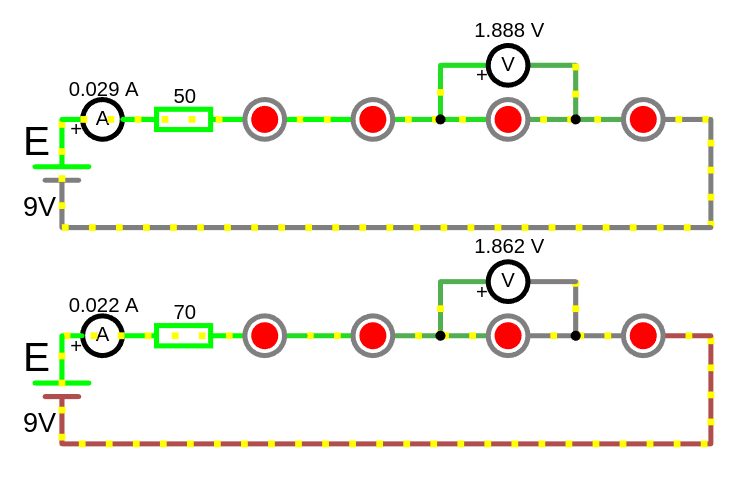 

Расчитать сопротивление резистора для обеспечения тока в ветви со светодиодами.
- Напряжение источника $U_{source} = 9 \, \text{В}$.
- Мы хотим подключить 4 светодиода, каждый из которых должен работать при токе $I_{LED} = 20 \, \text{мА}$.
- Напряжение на каждом светодиоде $U_{LED} = 2 \, \text{В}$.


Шаги для расчёта гасящего резистора:

1. **Определим суммарное падение напряжения на светодиодах:**
    
   $U_{LED_{total}} = 4 \cdot U_{LED} = 4 \cdot 2 = 8 \, \text{В}$ 

2. **Найдём "лишнее" напряжение, которое нужно погасить резистором:**
   
   $U_R = U_{source} - U_{LED\_total} = 9 - 8 = 1 \, \text{В}$
   
3. **Рассчитаем сопротивление гасящего резистора:**
   - Используем закон Ома: 
      - $R_{гасящий} = \frac{U_R}{I_{LED}}$
   - Ток через светодиоды $I_{LED}=0.02 \, \text{А}$ ($20 \, \text{мА}$)
   
   $R_{гасящий} = \frac{1}{0.02} = 50 \, \text{Ом}$
   
4. **Определим мощность резистора:**
   - Мощность рассеиваемая на резисторе: $P = U_R \cdot I_{LED}$
   
   $P = 1 \cdot 0.02 = 0.02 \, \text{Вт} = 20 \, \text{мВт}$
   
   - Выбираем резистор с запасом по мощности, например, $0.125 \, \text{Вт}$ (стандартный резистор)

По итогам измерений тока ветви с гасящим резистором в 50 Ом, **наблюдаем превышение расчетного тока**, 29 мА. 
Учитывая что допустимы ток светодиодов 30 мА, давайте еще повысим сопротивление что бы понизить ток ветви.

**Шаги для расчёта нового сопротивления:**

1: Найдём текущее напряжение на резисторе ($U_R$):
 
- $U_R = I_{current} \cdot R_{current} = 0.028 \cdot 50 = 1.4 \, \text{В}$
 
2: Найдём суммарное падение напряжения на светодиодах ($U_{LED_{total}}$):
 
- $U_{LED_{total}} = U_{source} - U_R = 9 - 1.4 = 7.6 \, \text{В}$
 
3: Найдём новое напряжение на резисторе ($U_{R_{гасящий}}$) для желаемого тока ($I_{desired} = 20 \, \text{мА}$):

- $U_{R_{гасящий}} = U_{source} - U_{LED\_total} = 9 - 7.6 = 1.4 \, \text{В}$
 
(Обратите внимание, что $U_{LED\_total}$ остаётся неизменным, так как падение напряжения на светодиодах зависит от тока, а мы предполагаем, что оно меняется незначительно.)

4: Найдём новое сопротивление ($R_{гасящий}$):
 
- $R_{гасящий} = \frac{U_{R_{гасящий}}}{I_{desired}} = \frac{1.4}{0.02} = 70 \, \text{Ом}$
 

---

### Заключение:
Делитель тока (в данном случае через резисторы) позволяет равномерно распределить ток между несколькими компонентами, такими как светодиоды. Это особенно полезно, когда компоненты подключены параллельно, и важно обеспечить одинаковые условия работы для каждого из них.  

 