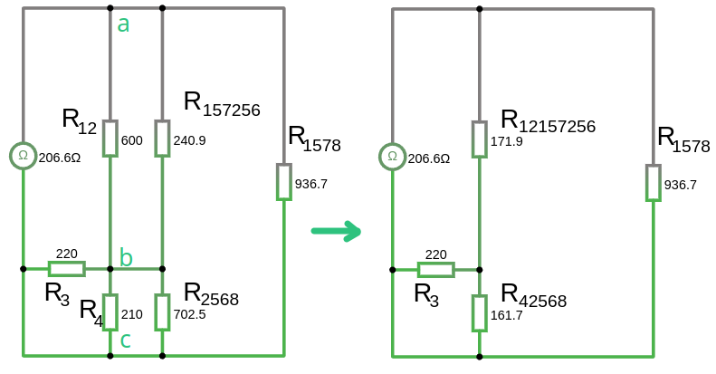

# Расчет электрических цепей со звездой и треугольником сопротивлений.

Так как мы не можем упростить схему с помощью метода сворачивания то воспользуемся упрощением схемы методом треугольник сопротивлений в звезду или наоборот.

Начнем упрощение схемы с преобразования звезды сопротивлений $R_1\ R_2\ R_5$ в треугольник сопротивлений:
- $R_{12} = R_1 + R_2 + \frac{R_1 \cdot R_2}{R_5} = 100 + 300 +  \frac{100 \cdot 300}{150} = 600, \Omega $
- $R_{15} = R_1 + R_5 + \frac{R_1 \cdot R_5}{R_2} = 100 + 150 +  \frac{100 \cdot 150}{300} = 300, \Omega $
- $R_{25} = R_2 + R_5 + \frac{R_2 \cdot R_5}{R_1} = 300 + 150 +  \frac{300 \cdot 150}{100} = 900, \Omega $

Сопротивления $R(15)$ и $R(7)$ соединены параллельно, так же как и $R(25)$ и $R(6)$, поэтому складываем их сопротивления как мы делали методом сворачивания, по формуле:  
- $R_{157} = \frac{1}{\frac{1}{R_{15}} + \frac{1}{R_{7}}} = \frac{1}{\frac{1}{300} + \frac{1}{200}}=\frac{1}{0.00833} = 120, \Omega $
- $R_{256} = \frac{1}{\frac{1}{R_{25}} + \frac{1}{R_{6}}} = \frac{1}{\frac{1}{900} + \frac{1}{100}}=\frac{1}{0.01111} = 90, \Omega $

  

На данном этапе у нас имеется множество вариантов упрощения:
- звезда: $R_{157},\ R_{256},\ R_{8}$
- треугольник:  $R_{12},\  R_{157},\ R_{256}$
- треугольник:  $R_{256},\ R_{8},\ R_{4}$

Упростим схему через преобразование звезды сопротивлений $R_{157},\ R_{256},\ R_{8}$ в треугольник:
- $R_{157256} = R_{157} + R_{256} + \frac{R_{157} \cdot R_{256}}{R_{8}} = 120 + 90 +  \frac{120 \cdot 90}{350} = 240.85, \Omega $
- $R_{1578} = R_{157} + R_{8} + \frac{R_{157} \cdot R_{8}}{R_{256}} = 120 + 350 +  \frac{120 \cdot 350}{90} = 936.66, \Omega $
- $R_{2568} = R_{256} + R_{8} + \frac{R_{256} \cdot R_{8}}{R_{157}} = 90 + 350 +  \frac{90 \cdot 350}{120} = 702.5, \Omega $

 

Сопротивления $R_{12}\ и\ R_{157256}$ соединены параллельно, так же как и $R_{4}$ и $R_{2568}$, поэтому складываем их сопротивления как мы делали методом сворачивания, по формуле:  
- $R_{12157256} = \frac{1}{\frac{1}{R_{12}} + \frac{1}{R_{157256}}} = \frac{1}{\frac{1}{600} + \frac{1}{240.85}}=\frac{1}{0.00581} = 171.86, \Omega $
- $R_{42568} = \frac{1}{\frac{1}{R_{4}} + \frac{1}{R_{2568}}} = \frac{1}{\frac{1}{210} + \frac{1}{702.5}}=\frac{1}{0.00618} = 161.67, \Omega $

Теперь у нас имеется два варианта для упрощения схемы:
- звезда: $R_{12157256},\ R_{3},\ R_{42568}$
- треугольник:  $R_{12157256},\  R_{1578},\ R_{42568}$

Упростим используя преобразование треугольник в звезду:
 
- $\scriptsize \sum R = R_1 + R_2 + \dots + R_n = R_{12157256} + R_{1578} + R_{42568} = 171.9 + 936.66 + 161.67 = 1270.23, \Omega$
- $R(12) = \frac{R_{12157256} \cdot R_{42568}}{\sum R} = \frac{171.9 \cdot 161.67}{1270.23} = 21.87, \Omega$
- $R(13) = \frac{R_{12157256} \cdot R_{1578}}{\sum R} = \frac{171.9 \cdot 936.66}{1270.23} = 126.75, \Omega$
- $R(32) = \frac{R_{1578} \cdot R_{42568}}{\sum R} = \frac{936.66 \cdot 161.67}{1270.23} = 119.21, \Omega$

     

Сопротивления $R_{3}\ и\ R_{12}$ соединены последовательно, поэтому складываем их сопротивления как мы делали методом сворачивания, упростим их: 
- $R_{312} = R_{3} + R_{12} = 220 + 21.9 = 241.9, \Omega$

Сопротивления $R_{312}\ и\ R_{32}$ соединены параллельно, поэтому складываем их сопротивления как мы делали методом сворачивания, по формуле:   
- $R_{31232} = \frac{1}{\frac{1}{R_{312}} + \frac{1}{R_{32}}} = \frac{1}{\frac{1}{241.9} + \frac{1}{119.21}}=\frac{1}{0.0125} = 79.85, \Omega $

А оставшиеся сопротивления $R_{13}\ и\ R_{31232}$ соединены последовательно, поэтому складываем их сопротивления: 
- $R_{экв} = R_{13} + R_{31232} = 126.75 + 79.85 = 206.6, \Omega$

На схемах все время присутствовал омметр, показывающий $R_{экв} = 206.6, \Omega$ что каждый наш шаг упрощения был верен!

Далее можно расчитать токи ветвей и напряжения на элементах с помощью законов Кирхгофа
