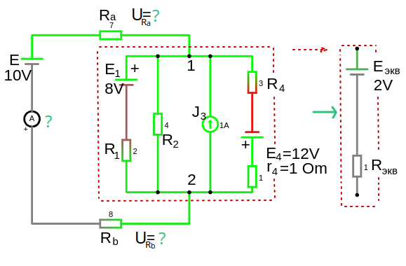
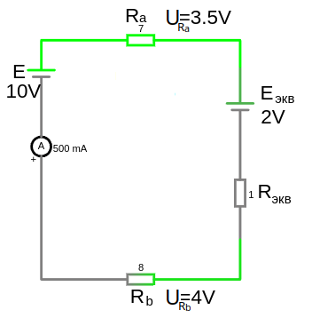
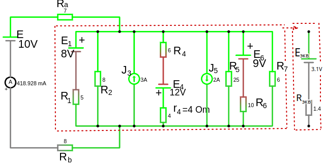

# Урок 16. Преобразование нескольких параллельных ветвей с источниками питания в одну эквивалентную ветвь.

<a href="/theories_of_electrical_circuits/falstad/circuitjs-16.txt" download="circuitjs-16.txt">Скачать схему для www.falstad.com/circuit</a>

Для того что бы найти обший ток и напряжения на $R_a$ и $R_b$ следует упростить схему, параллельные ветви объединим в одну эквивалентную

- Эквивалентное сопротивление:

    $R_{экв} = \frac{1}{\sum G_i} $

    где:
    - $ G_i = \frac{1}{R_i} $ — проводимость каждой ветви. 
    - $ G_i = \frac{1}{R_i + r_i} $ — проводимость ветви c наличием внутреннего сопротивления у источника ЭДС.  

- Эквивалентная ЭДС: (алгебраическая сумма и следует выбрать предполагаемое направление результирующего ЭДС. Учитываются ветви только с источниками напряжения или тока)

    $E_{экв} = \frac{\sum E_n\cdot G_n + \sum J_m}{\sum G} $

**Пример:**

$ G_i = \frac{1}{R_1} + \frac{1}{R_2} + \frac{1}{ R_4 + r_4}= \frac{1}{2} + \frac{1}{ 4} + \frac{1}{ 3 + 1} = 1, S$

$R_{экв} = \frac{1}{\sum G_i} = \frac{1}{ 1 } =  1, \Omega$

предположим направление результирующего ЭДС вниз:

 $E_{экв} = \frac{ (-E_1 \cdot \frac{1}{R_1}) - J_3 + (E_4 \cdot \frac{1}{R_4 + r_4} )}{\sum G} = \frac{ (-8 \cdot \frac{1}{2}) - 1 + (12 \cdot \frac{1}{3 + 1} )}{1} = −2, V $

 - где:
    $-E_1$ и $-J_3$ отнимаем так как не совпадает с выбранным нами направлением

$E_{экв} = −2, V $ означает что мы ошиблись с выбором направления и на самом деле напряжение пойдет вверх

Посчитаем общий ток по закону Ома:
  - $I_{общ} = \frac{E-E_{экв}}{ R_a + R_b +R_{экв} } = \frac{10 - 2}{ 7 + 8 + 1 } = \frac{8}{ 16} = 0.5, A$
    - где: минусуем $E_{экв}$ так как оно идет на всречу $E$
      
Посчитаем напряжение на сопротивлениях $R_a$ и $R_b$: 
    - $U_{R_a} = I\cdot R_a = 0.5 \cdot 7 = 3.5, V$
    - $U_{R_b} = I\cdot R_b = 0.5 \cdot 5 = 4, V$

---

**Пример 2:**

Упростить схему и найти общий ток и напряжения на $R_a$ и $R_b$

<a href="/theories_of_electrical_circuits/falstad/circuitjs-16.2.txt" download="circuitjs-16.2.txt">Скачать схему для www.falstad.com/circuit</a>

1. Посчитаем проводимости параллельно соединенных ветвей:
     - $ G_i = \frac{1}{R_1} + \frac{1}{R_2} + \frac{1}{ R_4 + r_4} + \frac{1}{R_5} + \frac{1}{R_6} + \frac{1}{R_7} = \frac{1}{5} + \frac{1}{8} + \frac{1}{ 6 + 4} + \frac{1}{25} + \frac{1}{10} + \frac{1}{6} = 0.731, S$
2. Посчитаем эквивалентное сопротивление: 
    - $R_{экв} = \frac{1}{\sum G_i} = \frac{1}{0.731} = 1.3667, \Omega$

3. Посчитаем эквивалентное напряжение, предположим направление напряжения в итоговой ветви от точки $\color{#2EC27E}{a \to b}  $ :
    -  $E_{экв} = \frac{\sum E_n\cdot G_n + \sum J_m}{\sum G} =  \frac{ (-E_1 \cdot \frac{1}{R_1}) - J_3 + (E_4 \cdot \frac{1}{R_4 + r_4}) +J_5+ (- E_6 \cdot \frac{1}{R_6})}{\sum G} = \frac{ (-8 \cdot \frac{1}{5}) - 3 + (12 \cdot \frac{1}{6 + 4})+2+(-9\cdot \frac{1}{10})     }{0.731} = −3.146, V $ 
4. Посчитаем общий ток по закону Ома:
  - $I_{общ} = \frac{E-E_{экв}}{ R_a + R_b +R_{экв} } = \frac{10 - 3.146}{ 7 + 8 + 1.3667 } = 0.418, A$  

5. Посчитаем напряжение на сопротивлениях $R_a$ и $R_b$:
    - $U_{R_a} = I\cdot R_a = 0.418 \cdot 7 = 2.93, V$
    - $U_{R_b} = I\cdot R_b = 0.418 \cdot 8 = 3.35, V$  

Вообщем остается непонятный момент, если увеличить составляющую тока или сопротивления в ветке источника тока то расчеты не сходятся.    