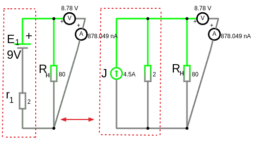

# Урок 17. Преобразование идеального источника ЭДС в источник тока и источника тока в источник ЭДС.

**Преобразование работает только для реального (т.е. с внутренним сопротивлением) источника ЭДС или тока!**
**Допускается преобразование идеального источника ЭДС только если с ним в ветви последовательно соединен резистор.**

Для реального источника ЭДС:
- $U_{хх}=E$
- $I_{кз}=\frac{E}{R}$

Для реального источника тока:
- $U_{хх}=\frac{I}{G}=\frac{J}{G}$
- $I_{кз}=J$

**Преобразование реального источника ЭДС в реального источник тока по формулам**:   
- $J=\frac{E}{r}$
- $G=\frac{1}{r}$
- $R=\frac{1}{G}$

**Преобразование реального источника тока в реальный источник ЭДС по формулам**:   
- $E=\frac{J}{G}$
- $r=\frac{1}{G}$

**Пример**:

Преобразуем реальный источник ЭДС ($E=9\ V,\ r=2\ Om$) в реальный источник тока:
- $J=\frac{E}{r} = \frac{9,V}{r2, Om}= 4.5, A$
- $G=\frac{1}{r} = \frac{1}{2} = 0.5, S$
- $R=\frac{1}{G} = \frac{1}{0.5} = 2, Om$

Преобразуем реальный источник тока ($J=4.5, A,\ R=2\ Om$) в реальный источник ЭДС:
- $G=\frac{1}{R} = \frac{1}{2} = 0.5, S$
- $E=\frac{J}{G}=\frac{4.5}{0.5}=9, V$
- $r=\frac{1}{G} = \frac{1}{0.5} = 2, Om$
