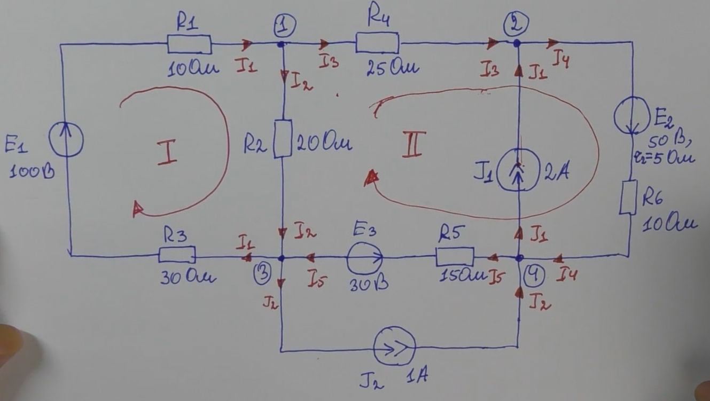

# Расчет электрических цепей методом законов Кирхгофа. Часть 1.

**Для первого закона Кирхгофа**

   - Количество токов в цепи определяет количество ветвей (В ветвях с источником тока уже известен ток).
    
   - Количество уравнений которое необходимо составить по первому закону Кирхгофа, равно количество узлов минус 1

$N_1=n-1$

**Для второго закона Кирхгофа**

   - Количество уравнений которое необходимо составить по второму закону Кирхгофа, для независимых контуров, равно количеству ветвей без источника тока минус количество уравней по первому закону Кирхгофа

$N_2 = (m - m_J) - (n - 1) = m - m_J - n + 1$

где:
- $m$ - число ветвей
- $m_J$ - число ветвей с источником тока
- $n$ - число узлов

**Пример**:

Для начала расчета необходимо выбрать направления токов в ветвях. 

После можем составлять уравнения по первому закону Кирхгофа, количество их будет 3 для нашей схемы т.е.     
- $N_1=n-1=4-1=3$

Теперь можем определить необходимое количество уравнений по второму закону Кирхгофа:
- $N_2 = (m - m_J) - (n - 1) = m - m_J - n + 1 = 7 - 2 - 4 + 1 = 2$
    
Итого наша **система уравнений** будет состоять из $N_1 + N_2 = 3 + 2 = 5$ уравнений.

Составим для любых 3-х узлов, уравнения по первому закону Кирхгофа:
- (узел 1) $I_1-I_2-I_3=0$ 
- (узел 2) $I_3+J_1-I_4=0$
- (узел 4) $I_4+J_2-J_1-I_5=0$

Выберим произвольные направления независимых контуров для обхода, контуры выбираются без ветвей с источником тока!
- (контур 1) $E_1 = R_1\cdot I_1 + R_2\cdot I_2 + R_3\cdot I_1$
- (контур 2) $E_2-E_3 = R_4\cdot I_3 + r_2\cdot I_4 + R_6\cdot I_4 + R_5\cdot I_5 - R_2\cdot I_2$

Далее решаем систему уравнений различными методами, например методом подстановки, выражая одно неравенство через другое

Далее проверить [баланс мощностей](/theories_of_electrical_circuits/lessons/56.html) 