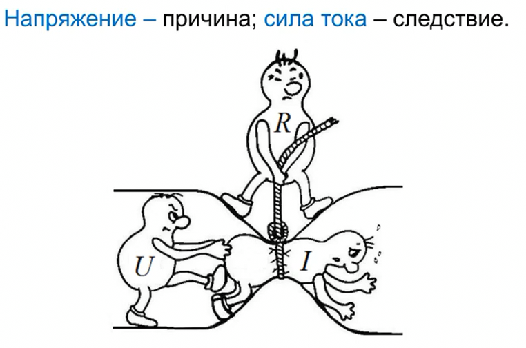

# Электрический ток. Сила тока. Скорость и направление тока.

Электрический заряд - элементарный заряд, наименьший заряд в природе $e=1.6\cdot 10^{-19}\ Кл$ (кулон). Заряд любого тела кратен (дискретен) элементарному заряду. Заряд грозового облака порядка 10 Кл.

Существует два типа электрических зарядов: 
- положительный $q_e=-e=-1.6\cdot 10^{-19}\ Кл$
- отрицательный $q_p=+e=+1.6\cdot 10^{-19}\ Кл$

[Электрический ток](../../glossary_of_terms/index.md#Электрический-ток) – это направленное (упорядоченное) движение электрически заряженных частиц. Представьте себе реку: вода в ней течет в определенном направлении. Точно так же и электрический ток – это поток заряженных частиц, движущихся вдоль проводника.

[Электромагнитное поле](/theories_of_electrical_circuits/lessons/80.html) состоит из двух компонентов:
- Электрическое поле: Оно создается электрическими зарядами и действует на другие заряды, заставляя их двигаться (ток).
- Магнитное поле: Оно создается движущимися зарядами (токами) и действует на другие движущиеся заряды.

Эти поля неразрывно связаны и могут превращаться друг в друга. 

**Источник напряжения создает электрическое поле, которое действует на свободные заряды в проводнике. Заряды начинают двигаться, создавая ток. Ток создает магнитное поле вокруг проводника.**

Чтобы обеспечить постоянный электрический ток в потребителе, необходим подходящий источник электрической энергии (источник тока), поддерживающий разность электрических потенциалов между выводами потребителя, то есть электрическое напряжение. 

**Постоянный ток**: Наличие разницы потенциалов между контактами порождает положительную полярность на одном конце и отрицательную на другом. Эта устойчивая конфигурация сохраняется постоянно, при условии сохранения последовательности подключения. Важно отметить, что направление движения заряженных частиц при этом остается постоянным. Это тип тока, в котором направление и величина электрического потока остаются постоянными с течением времени. Такой ток характерен, например, для батарей, аккумуляторов и постоянных источников электропитания. Обозначается как "DC" (Direct Current) на английском языке.

Направление тока в цепи — это концепция, связанная с движением электрических зарядов. Она зависит от их природы (положительные или отрицательные) и принятых условностей. Вот ключевые моменты:

**Ток в электрической цепи всегда движется от точки с более высоким потенциалом к точке с более низким потенциалом. Это фундаментальный принцип, который следует из определения напряжения и направления тока. Если разность потенциалов между источниками равна нулю, следовательно, ток в цепи не будет течь.**

## Опасность поражения электрическим током

* **1 мА:**
    * Пороговый ощутимый ток. Человек начинает чувствовать действие тока.
* **10-15 мА:**
    * Неотпускающий ток. Мышцы начинают судорожно сокращаться, и человек не может самостоятельно отпустить проводник.
* **25-50 мА:**
    * Нарушение работы легких и сердца. При длительном воздействии возможна остановка дыхания и сердца.
* **100 мА и более:**
    * Фибрилляция сердца. Сердце начинает хаотично сокращаться, что приводит к остановке кровообращения. Это смертельно опасно.

Величина тока зависит от сопротивления тела. (Сухая кожа: от 100 кОм до 1 МОм. Влажная кожа: от 1 кОм до 10 кОм):
* Если сопротивление тела 10 кОм (влажная кожа), то для тока 10 мА необходимо напряжение: U = I * R = 0,01 А * 10 000 Ом = 100 В.
* Если сопротивление тела 1 кОм (влажная кожа), то для тока 10 мА необходимо напряжение: U = I * R = 0,01 А * 1 000 Ом = 10 В.

---

### 1. **Условное направление тока**
- Исторически принято считать, что ток течёт **от положительного полюса к отрицательному** в цепи, то есть от области с более высоким потенциалом к области с более низким.
- Это условное направление было установлено до открытия того, что ток в металлах вызван движением **отрицательных зарядов (электронов)**.

Роль Бенджамина Франклина 

[Франклин, Бенджамин](https://ru.wikipedia.org/wiki/%D0%A4%D1%80%D0%B0%D0%BD%D0%BA%D0%BB%D0%B8%D0%BD,_%D0%91%D0%B5%D0%BD%D0%B4%D0%B6%D0%B0%D0%BC%D0%B8%D0%BD) предположил, что электрический заряд течет от стеклянной палочки, натертой шерстью (которую он считал заряженной положительно), к объекту, который притягивается к этой палочке. 

Позже было открыто, что в металлах электрический ток образуется за счет движения электронов, которые имеют отрицательный заряд. Таким образом, реальное направление движения заряженных частиц в проводнике противоположно тому, которое предположил Франклин. 

Несмотря на то, что мы знаем о движении электронов, соглашение о направлении тока, введенное Франклином, сохранилось в электротехнике. Это связано с тем, что большинство электрических схем и расчетов были разработаны до того, как было точно известно, что именно представляет собой электрический ток. Изменение устоявшегося соглашения привело бы к необходимости переписывать огромный объем технической литературы.

### 2. **Действительное направление тока**
- В металлах ток возникает за счёт движения электронов от **отрицательного полюса к положительному**. Это противоположно условному направлению тока. Это связано с тем, что электроны имеют отрицательный заряд и система стремится к устойчивости, поэтому электроны стремятся к положительному заряду.
- В электролитах (например, растворах солей) ток обеспечивается движением ионов. При этом:
  - **Положительные ионы (катионы)** движутся к отрицательному электроду.
  - **Отрицательные ионы (анионы)** движутся к положительному электроду.

### 3. **Направление тока в полупроводниках**
- В полупроводниках ток обусловлен движением:
  - Электронов (они отрицательно заряжены) в зоне проводимости (в сторону положительного полюса).
  - Положительных «дырок» (псевдозарядов) в валентной зоне, которые движутся в сторону отрицательного полюса.

### 4. **Направление тока в зависимости от типа цепи**
- **Постоянный ток (DC)**: ток движется в одном направлении, обычно от источника напряжения.
- **Переменный ток (AC)**: направление тока периодически меняется, так как меняется полярность источника.

### 5. **Практическое использование направлений**
- В инженерии и физике чаще используют **условное направление тока**, чтобы упрощать расчёты и схемы.
- Для анализа электрических цепей используют такие законы, как:
  - Закон Ома: $I = \frac{U}{R} $.
  - Законы Кирхгофа для тока и напряжения.

### Важный вывод
Хотя условное направление тока и движущиеся электроны в проводниках идут в противоположных направлениях, все расчёты остаются корректными, если придерживаться единого подхода.

## Почему носители заряда движутся?
- Электрическое поле: Оно создается источником тока (например, батарейкой) и действует на заряженные частицы, заставляя их двигаться.
- Разность потенциалов: Это как разница высот в реке. Чем больше разность потенциалов, тем сильнее электрическое поле и тем быстрее движутся заряженные частицы

## Сила тока

Сила тока – это количество электрического заряда, проходящего через поперечное сечение проводника за единицу времени.
Измеряется в амперах (А).

$$I=\frac{q}{t},\ [A=\frac{Кл}{с}]$$

При силе тока в один ампер (1 A) за одну секунду (1 с) по проводнику проходит заряд в один кулон (1 Кл).

Чем больше сила тока, тем больше заряженных частиц проходит через проводник за одну секунду.

Скорость движения заряженных электрических зарядов - 1 мм/сек

Скорость тока - 300 000 км/сек (скорость света)

**Ток так быстро двигается из-за того что заряженные частицы хоть и медленные но порождают электромагнитную волну которая распространяется со скоростью света.**

**Ампер (A)** - основная единица измерения силы электрического тока в Международной системе единиц (СИ). 

Для обозначения более больших или меньших значений силы тока используются кратные и дольные единицы, образованные путем добавления соответствующих приставок к основной единице - амперу. 

Заряд электрона (или, что количественно то же самое, заряд протона) – очень удобная единица заряда. Но очень маленькая. Пользоваться ею на практике было бы так же неудобно, как, скажем, измерять в миллиметрах
расстояние между планетами. Поэтому единица заряда выбрана значительно более крупная – единицей признан электрический заряд, равный суммарному заряду 6 241 516 000 000 000 000 электронов (сокращенная запи­сь – 6,24151 · 1018). Эта единица, вобравшая в себя около 6 миллиардов миллиардов зарядов электрона, получила название кулон. Имея единицу заряда, легко ввести и другие недостающие нам элект­рические единицы. Единица силы тока (величины тока, тока) – ампер – получается так: если через поперечное сечение проводника за одну секунду проходит суммарный электрический заряд в 1 кулон, то ток в таком провод­нике равен 1 амперу

**Кратные единицы тока (большие значения)**:

* **Килоампер (kA):** 1 кА = 1000 А
* **Мегаампер (MA):** 1 МА = 1 000 000 А
* **Гигаампер (GA):** 1 ГА = 1 000 000 000 А

**Дольные единицы тока (малые значения)**:
* **Миллиампер (mA):** 1 мА = 0,001 А
* **Микроампер (μA):** 1 мкА = 0,000001 А
* **Наноампер (nA):** 1 нА = 0,000000001 А
* **Пикоампер (pA):** 1 пА = 0,000000000001 А

**Таблица кратных и дольных единиц тока:**
 
| Единица       | Обозначение | Значение в амперах (А) | Полное написание |
|--------------|------------|--------------------|------------------|
| Гигаампер    | GA         | $ 10^9 $ A      | 1 000 000 000 ампер  |
| Мегаампер    | MA         | $ 10^6 $ A      | 1 000 000 ампер  |
| Килоампер    | kA         | $ 10^3 $ A      | 1 000 ампер      |
| Ампер        | A          | $ 1 $ A         | 1 ампер          |
| Милиампер    | mA         | $ 10^{-3} $ A   | 0,001 ампера     |
| Микроампер   | µA         | $ 10^{-6} $ A   | 0,000001 ампера  |
| Наноампер    | nA         | $ 10^{-9} $ A   | 0,000000001 ампера |
| Пикоампер    | pA         | $ 10^{-12} $ A  | 0,000000000001 ампера |
| Фемтоампер   | fA         | $ 10^{-15} $ A  | 0,000000000000001 ампера |

  
## Закон Ома для однородного участка цепи без источника ЭДС
Связь между силой тока, напряжением и сопротивлением описывается законом Ома:

$$I = \frac{U}{R},\ R = \frac{U}{I},\ U = I\cdot R,\ $$

где:
 - I – сила тока (А) Ампер
 - U – напряжение (В) Вольт
 - R – сопротивление (Ом) Ом

Чем выше напряжение тем выше сила тока

Чем больше сопротивление тем меньше сила ток

Постоянный ток/напряжение/сопротивление/ЭДС маркируются большим регистром `I/U/R/E`

Переменный ток/напряжение/сопротивление/ЭДС маркируются малым регистром `i/u/r/e`

Между двумя произвольными точками цепи `1 и 2` создается напряжение `U`, которое равно разности потенциалов этих точек $V_1 - V_2$

U12$ = V_1 - V_2$

U21$ = V_2 - V_1$

При расчете схемы следует выбрать произвольно положительное направление токов и после проверки того что ток положителен выбрать это направление для всей схемы

Маркировка направления тока:

