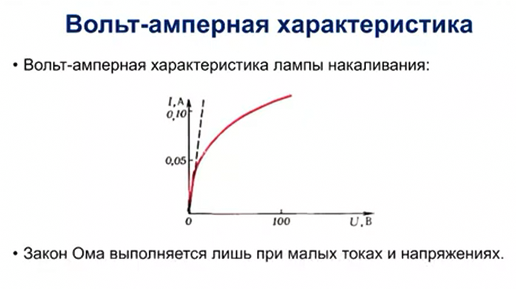

# Активные и пассивные компоненты

## Активные и пассивные компоненты

Электрические компоненты в цепях делятся на активные и пассивные в зависимости от их способности генерировать или потреблять энергию. 

### Активные компонеты 

Активные компоненты способны генерировать энергию или управлять потоком электронов в цепи. Они обычно требуют внешнего источника питания для своей работы.

Такие как источники питания тока или напряжения, это:
- (Источники питания) Батареи и аккумуляторы: обеспечивают постоянный ток (DC)
- (Источники питания) Генераторы: обеспечивают переменный ток (AC)
- (Полупроводниковые устройства) Транзисторы: управляют током и работают как усилители, ключи или генераторы.
- (Полупроводниковые устройства) Тиристоры: используются в схемах управления мощностью.

### Пассивные компонеты 

Пассивные компоненты не могут генерировать энергию, но потребляют, хранят или передают её. Они играют вспомогательную роль в работе цепи.

Такие как: 
- резистор, ограничивают ток и рассеивают энергию в виде тепла.
- конденсатор, накопители энергии в электрическом поле; используются для фильтрации и сглаживания сигналов.
- катушка индуктивности, хранят энергию в магнитном поле; используются в трансформаторах, фильтрах и схемах управления
- диоды, хотя они являются полупроводниковыми устройствами, их основная функция — пропускать ток в одном направлении, что делает их пассивными в большинстве случаев.
- трансформаторы, передают энергию, изменяя напряжение и ток.
они в условиях отсутвия электрического поля не могут функционировать.

### Линейные пассивные компонеты 
Это линейная характеристика зависимости параметров компонета, при изменении одной характеристики линейно изменяется зависимая характеристика. 
График зависимости тока от напряжения для таких компонентов — прямая линия.

**Примеры:**
- Резисторы (идеальные):
    Сопротивление остаётся постоянным при любом напряжении и токе, если не выходить за рабочие пределы.
- Конденсаторы:
    Ёмкость не зависит от напряжения, если материал и геометрия неизменны.
- Катушки индуктивности:
    Индуктивность остаётся постоянной при изменении тока, если сердечник не насыщен.

**Применение:**

Линейные компоненты используются в цепях с предсказуемым поведением, таких как фильтры, усилители и генераторы.

### Не линейные пассивные компонеты

Эти компоненты не подчиняются закону линейности, и их характеристики зависят от условий работы, таких как ток, напряжение или частота. 
График зависимости $I$ от $𝑈$ — нелинейная кривая.

Основные свойства:
- Нелинейная зависимость $I$ от $𝑈$: Например, при увеличении напряжения сопротивление может меняться.
- Зависимость от условий работы: Влияние температуры, частоты, напряжения или других параметров.
- Эффекты насыщения и гистерезиса: Эти эффекты могут проявляться в магнитных или полупроводниковых материалах.

**Примеры:**
- Лампа накаливания
- Диоды:
    Пропускают ток только в одном направлении. Зависимость $I-𝑈$ экспоненциальная.
- Варисторы:
    Их сопротивление резко падает при достижении определённого уровня напряжения (используются для защиты от перенапряжений).
- Ферромагнитные катушки (с насыщением):
    Индуктивность зависит от тока, когда сердечник входит в режим насыщения.
- Электролитические конденсаторы:
    Их ёмкость и сопротивление могут меняться в зависимости от напряжения или частоты.
- Терморезисторы (NTC/PTC):
    Сопротивление изменяется с температурой:
     - NTC (Negative Temperature Coefficient): сопротивление уменьшается с ростом температуры.
     - PTC (Positive Temperature Coefficient): сопротивление увеличивается с ростом температуры.

