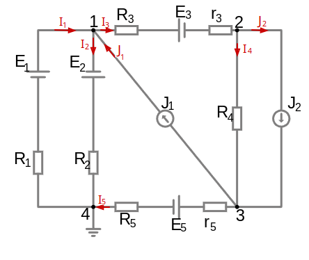
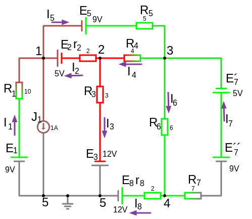

# Урок 22-23. Универсальный способ вывода уравнений.



**Универсальные уравнения**:
 - $\footnotesize G_{11}\cdot V_1 - G_{12}\cdot V_2 - \dots - G_{1(n-1)}\cdot V_{(n-1)} = \sum EG+\sum J= J_{11}\ $ (первое уравнение)
 
 - $\footnotesize -G_{21}\cdot V_1 + G_{22}\cdot V_2 - \dots - G_{2(n-1)}\cdot V_{(n-1)} = \sum EG+\sum J = J_{22}\ $ (второе уравнение)

 - $ \dots $

 - $\footnotesize -G_{(n-1)1}\cdot V_1 - G_{(n-1)2}\cdot V_2 - \dots + G_{(n-1)(n-1)}\cdot V_{(n-1)} = \sum EG_{(n-1)}+\sum J_{(n-1)} =J_{(n-1)(n-1)} \ $ (n-1 уравнение)


**последнее выражение имеет знак "+": <br>
     $\  \dots + G_{(n-1)(n-1)}\cdot V_{(n-1)}$**


где:
- $n$ - число узлов, 
- $(n-1)$ - общее число уравнений и общая длина слогаемых (т.е. для 7-ми узлов будет 6 уравнений по 6 слогаемых потенциалов в каждом)
- $G_{11},G_{22},\dots ,G_{(n-1)(n-1)}$ - т.е. проводимости с одинаковыми индексами, наз. **собственная узловая проводимость**. Это арифметическая сумма (т.е. без учета знака) проводимостей всех ветвей присоединенных к соответствующему узлу, просто сложить все проводимости присоединенных ветвей к узлу **n**. Имеет знак "+"

  Например, почему в первом выведенном уравнении 
   - $\scriptsize V_1\cdot (G_1+G_2+G_3)-V_2\cdot G_3=E_1\cdot G_1-E_2\cdot G_2 + E_3\cdot G-3 + J_1$<br>
  мы имеем такую запись "$\scriptsize V_1\cdot (G_1+G_2+G_3)$" ?<br> Потому что, это 1-й узел $G_{11}$, этот узел имеет проводимости в ветвях такие как $G_1=\frac{1}{R_1},G_2=\frac{1}{R_2},G_3=\frac{1}{R_3+r_3}$, а ветвь с источником тока $J_1$ без проводимости.

- $G_{12}=G_{21},G_{45},\dots ,G_{(n-1)(n-2)}$ - т.е. проводимости с отличными индексами, наз. **общая узловая проводимость**. Это арифметическая сумма (т.е. без учета знака) проводимостей соединяющая указанные в индексе два узла. Если узлы не имеют соединения то $G=0$ и мы не пишем это в уравнение. Имеет знак "-"

    Например, почему в первом выведенном уравнении 
   - $\scriptsize V_1\cdot (G_1+G_2+G_3)-V_2\cdot G_3=E_1\cdot G_1-E_2\cdot G_2 + E_3\cdot G-3 + J_1$<br>
   мы имеем такую запись "$- V_2\cdot G_3$" ?<br> 
   Потому что, это 1-й узел $G(12)$, который соеденен от 1-го узла до 2-го с единственной проводимостью $G_3$.<br> И других ветвей нет между узлами, поэтому это единственное выражение.<br> Если ветвь не имеет сопротивления то проводимость равно 0 и выражение<br> $V\cdot G=0$

- если в ветви между узлами отсутвует проводимость то $G=0$
- $\sum EG_{(n-1)}+\sum J= J_{(n-1)(n-1)}$ это алгебраическая сумма (с учетом знака) **узловых токов собственных узлов**. Если источник ЭДС/тока направлен **к узлу** то он записывается со знаком "+", если источник ЭДС/тока направлен **от узла** то он записывается со знаком "-"


---

**Пример**, теперь выведем уравнения универсальным способом, для той же схемы.
Схема имеет 4-ри узла, следовательно уравнений будет $N=n-1=4-1=3$.<br> 
И 4-й узел не рассматривается так как он заземлен.

1. Для первого узла:
    - $G_{11}=G_1 + G_2 + G_3$
    - $G_{12}=G_3$
    - $G_{13}=0,\ V_3=0\ $ (так как нет проводимости между узлами $1,3$)
    - $J_{11}=E_3\cdot G_3 + J_1 - E_2\cdot G_2  + E_1\cdot G_1 $

итого имеем: 

$V_1\cdot G_1 + V_1\cdot G_2 + V_1\cdot G_3 - V_2\cdot G_3 = E_3\cdot G_3 + J_1 - E_2\cdot G_2  + E_1\cdot G_1$

2. Для второго узла:
    - $G_{21}=G_3$
    - $G_{22}=G_3 + G_4$
    - $G_{23}=G_4$ (так как узел 2 имеет связь с 1-м и с 3-м узлом)
    - $J_{22}=-E_3\cdot G_3 - J_2$

итого имеем: 

$- V_1\cdot G_3 + V_2\cdot G_3 + V_2\cdot G_4 -V_3\cdot G_4 = -E_3\cdot G_3 - J_2$

так как узел 2 имеет связь с 1-м и с 3-м узлом т.е. три связи, поэтому в уравнении будет присутсвовать три выражения с потенциалом $V_1, V_2, V_3$ между этими узлами

3. Для третьего узла:
    - $G_{31}=0,\ V_1=0\ $ (так как нет проводимости между узлами $3,1$)
    - $G_{32}=G_4$
    - $G_{33}=G_4+G_5$
    - $J_{33}=J_2-J_1+E_5\cdot G_5$

итого имеем: 

$- V_2\cdot G_4 + V_3\cdot G_4+ V_3\cdot G_5 = J_2-J_1+E_5\cdot G_5$

т.е. мы получили тоже самое, что и при решении [методом узловых потенциалов](/theories_of_electrical_circuits/lessons/20.html#По-итогу-получим-такие-уравнения):

$V_1\cdot G_1 + V_1\cdot G_2 + V_1\cdot G_3 - V_2\cdot G_3 = E_3\cdot G_3 + J_1 - E_2\cdot G_2  + E_1\cdot G_1$

$- V_1\cdot G_3 + V_2\cdot G_3 + V_2\cdot G_4 -V_3\cdot G_4 = -E_3\cdot G_3 - J_2$

$- V_2\cdot G_4 + V_3\cdot G_4+ V_3\cdot G_5 = J_2-J_1+E_5\cdot G_5$

##### упростим:

$V_1\cdot (G_1 + G_2 + G_3) - V_2\cdot G_3 = E_3\cdot G_3 + J_1 - E_2\cdot G_2  + E_1\cdot G_1$

$- V_1\cdot G_3 + V_2\cdot (G_3 + G_4) -V_3\cdot G_4 = -E_3\cdot G_3 - J_2$

$- V_2\cdot G_4 + V_3\cdot (G_4+G_5) = J_2-J_1+E_5\cdot G_5$

Далее, подставляем в уравнение значение проводимостей и находим потенциалы $V_1,V_2,V_3$.
После найдем токи ветвей, через узловые потенциалы, используем обобщенный закон Ома.

---

### Пример расчета схемы с помощью универсальных уравнений



<a href="/theories_of_electrical_circuits/falstad/circuitjs-20.txt" download="circuitjs-20.txt">Скачать схему для www.falstad.com/circuit</a>

```admonish info
Для схемы где присутвует идеальный источник ЭДС (т.е. без внутреннего сопротивления) и без сопротивления в ветви, перед расчетом [необхомимо модифицировать схему](/theories_of_electrical_circuits/lessons/24.html).
```

1. Для 5-ти узлов составим 4 уравнения:
- $V_1\cdot G_{11} - V_2\cdot G_{12} - V_3\cdot G_{13} - V_4\cdot G_{14} = J_{11}$
- $-V_1\cdot G_{21} + V_2\cdot G_{22} - V_3\cdot G_{23} - V_4\cdot G_{24} = J_{22}$
- $-V_1\cdot G_{31} - V_2\cdot G_{32} + V_3\cdot G_{33} - V_4\cdot G_{34} = J_{33}$
- $-V_1\cdot G_{41} - V_2\cdot G_{42} - V_3\cdot G_{43} + V_4\cdot G_{44} = J_{44}$

где:

$G_{11}=G_1+G_2+G_5$

$G_{12}=G_{21}=G_2$

$G_{13}=G_{31}=G_5$

$G_{14}=G_{41}=0$

$G_{22}=G_2+G_4+G_3$

$G_{23}=G_{32}=G_4$

$G_{24}=G_{42}=0$

$G_{25}=G_3$

$G_{33}=G_4+G_5+G_6+G_7$

$G_{34}=G_{43}=G_6+G_7$

$G_{35}=0$

$G_{44}=G_8+G_6+G_7$

$G_{45}=G_8$

$J_{11}=-J_1+E_1\cdot G_1+E_2\cdot G_2-E-5\cdot G_5$

$J_{22}=-E_2\cdot G_2-E_3\cdot G_3$

$J_{33}=E_5\cdot G_5 + (-E_7^´+E_7^{´´})\cdot G_7$

$J_{44}=E_8\cdot G_8 + (E_7^´-E_7^{´´})\cdot G_7$

Подставим значения:
- $\small V_1\cdot (G_1+G_2+G_5) - V_2\cdot G_{2} - V_3\cdot G_{5} - V_4\cdot 0 = -J_1+E_1\cdot G_1+E_2\cdot G_2-E_5\cdot G_5$
- $\small -V_1\cdot G_{2} + V_2\cdot (G_2+G_4+G_3) - V_3\cdot G_{4} - V_4\cdot 0 = -E_2\cdot G_2-E_3\cdot G_3$
- $\small -V_1\cdot G_{5} - V_2\cdot G_{4} + V_3\cdot (G_4+G_5+G_6+G_7) - V_4\cdot (G_6+G_7) = E_5\cdot G_5 + (-E_7^´+E_7^{´´})\cdot G_7$
- $\small -V_1\cdot 0 - V_2\cdot 0 - V_3\cdot (G_6+G_7) + V_4\cdot (G_8+G_6+G_7) = E_8\cdot G_8 + (E_7^´-E_7^{´´})\cdot G_7$

Упростим:
- $\small V_1\cdot (G_1+G_2+G_5) - V_2\cdot G_{2} - V_3\cdot G_{5} = -J_1+E_1\cdot G_1+E_2\cdot G_2-E_5\cdot G_5$
- $\small -V_1\cdot G_{2} + V_2\cdot (G_2+G_4+G_3) - V_3\cdot G_{4} = -E_2\cdot G_2-E_3\cdot G_3$
- $\small -V_1\cdot G_{5} - V_2\cdot G_{4} + V_3\cdot (G_4+G_5+G_6+G_7) - V_4\cdot (G_6+G_7) = E_5\cdot G_5 + (-E_7^´+E_7^{´´})\cdot G_7$
- $\small - V_3\cdot (G_6+G_7) + V_4\cdot (G_8+G_6+G_7) = E_8\cdot G_8 + (E_7^´-E_7^{´´})\cdot G_7$

Решим данную систему уравнений методом матричного анализа (метод Крамера или метод обратной матрицы) с помощью LLM

```python
import numpy as np

G1=1/10
G2=1/2
G3=1/3
G4=1/4
G5=1/5
G6=1/6
G7=1/7
G8=1/2
J1=1
E1=9
E2=5
E3=12
E5=9
E7_prime=5
E7_double_prime=9
E8=12

# Задаем матрицу A и вектор B
A = np.array([
    [G1 + G2 + G5, -G2, -G5, 0],
    [-G2, G2 + G4 + G3, -G4, 0],
    [-G5, -G4, G4 + G5 + G6 + G7, -(G6 + G7)],
    [0, 0, -(G6 + G7), G8 + G6 + G7]
])

B = np.array([
    -J1 + E1 * G1 + E2 * G2 - E5 * G5,
    -E2 * G2 - E3 * G3,
    E5 * G5 + (-E7_prime + E7_double_prime) * G7,
    E8 * G8 + (E7_prime - E7_double_prime) * G7
])

# Решаем систему
V = np.linalg.solve(A, B)

print("V1 =", V[0])
print("V2 =", V[1])
print("V3 =", V[2])
print("V4 =", V[3])
```

V1 = -2.0239206534422403<br>
V2 = -6.021003500583431<br>
V3 = 3.9568261376896157<br>
V4 = 8.218786464410735<br>

тут мы найдем чему равны потенциалы, после их надо подставить в уравнения токов чтобы найти токи

2. Записываем токи ветвей через узловые потенциалы, используем [обобщенный закон Ома для участка цепи с источником ЭДС](/theories_of_electrical_circuits/lessons/7.html#ii-Закон-Ома-для-участка-цепи-с-источником-ЭДС-присутствие-активных-компонентов) и выразим через проводимость:

    ($V_5=0$ этот потенциал мы приняли за 0, он заземлен)
- $I_1=\frac{U_{51}+E_1}{R_1}=\frac{V_5-V_1+E_1}{R_1}=(-V_1+E_1)\cdot G_1 = (-(-2.0239)+9)\cdot \frac{1}{10}=1.102,\ A$; 
- $I_2=\frac{U_{21}+E_2}{r_2}=(V_2-V_1+E_2)\cdot G_2 = (-6.0210-(-2.0239)+5)\cdot \frac{1}{2}=0.501,\ A$;
- $I_3=\frac{U_{25}+E_3}{R_3}=(V_2+E_3)\cdot G_3 = (-6.0210+12)\cdot \frac{1}{3}=1.99,\ A $;
- $I_4=\frac{U_{32}}{R_4}=(V_3-V_2)\cdot G_4 = (3.956-(-6.0210))\cdot \frac{1}{4}= 2.49\ A $;
- $I_5=\frac{U_{13}+E_5}{R_5}=(V_1-V_3+E_5)\cdot G_5 =(-2.0239-3.956+9)\cdot \frac{1}{5} = 0.604,\ A $; 
- $I_6=\frac{U_{34}}{R_6}=(V_3-V_4)\cdot G_6=(3.956-8.218)\cdot \frac{1}{6} =−0.710,\ A$;
- $I_7=\frac{U_{43}+E_7^{´´} - E_7^´ }{R_7}=(V_4-V_3 + E_7^{´´} - E_7^´)\cdot G_7=(8.218-3.956+9-5)\cdot \frac{1}{7}=1.180,\ A $;
- $I_8=\frac{U_{45}-E_8}{r_8}=(V_4-E_8)\cdot G_8=(8.218-12)\cdot \frac{1}{2}=−1.891\ A $;

2. Что бы удостовериться в верности значения токов, составим уравнения по **первому правилу Кирхгофа** для всех узлов кроме заземленного: 
- (узел 1) $I_1+I_2-J_1-I_5=0 \to 1.102 + 0.501 - 1 - 0.604 = 0 $
- (узел 2) $I_4-I_3-I_2=0  \to 2.49 - 1.99 - 0.501 = 0 $
- (узел 3) $I_5+I_7-I_6-I_4=0 \to 0.604 + 1.180 -(-0.710) - 2.49 = 0 $
- (узел 4) $I_6-I_8-I_7=0 \to (-0.710)-(-1.891)-1.180=0$

Далее проверить [баланс мощностей](/theories_of_electrical_circuits/lessons/56.html) 

---

### **Преимущества метода узловых потенциалов**  
✔ Использует **меньше уравнений**, чем метод контурных токов.  
✔ Удобен при **наличии источников тока**.  
✔ Хорошо автоматизируется в компьютерных расчетах.  

Этот метод активно применяется в анализе электрических схем, в том числе в **LTspice, MATLAB, PSpice**.