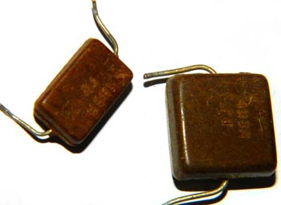
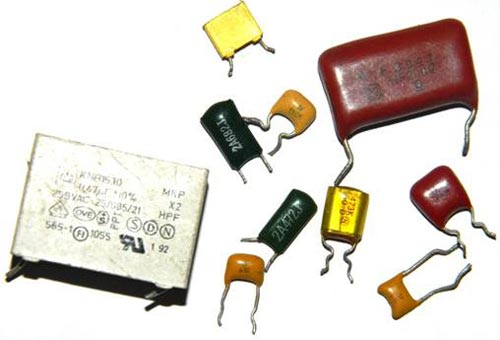

# [Радиоэлементы из старой аппаратуры: конденсаторы](https://cxem.net/beginner/beginner93.php)

Вторым незаменимым элементом в электрических схемах является конденсатор. Они бывают полярные и неполярные. Различия их в том, что одни применяются в цепях постоянного напряжения, а другие в цепях переменного. Возможно, применение постоянных конденсаторов в цепях переменного напряжения при включении их последовательно одноименными полюсами, но они при этом показывают не лучшие параметры.

**Конденсаторы неполярные**

Неполярные, так же как и резисторы бывают постоянные, переменные и подстроечные.

**Подстроечные** конденсаторы применяются для настройки резонансных цепей в приемо-передающей аппаратуре.

Конденсаторы КПК

Рис. 1. Конденсаторы КПК

Тип КПК. Представляют из себя посеребренные обкладки и керамический изолятор. Имеют емкость в несколько десятков пикофарад. Встретить можно в любых приемниках, радиолах и телевизионных модуляторах. Подстроечные конденсаторы также обозначаются буквами КТ. Затем следует цифра, указывающая тип диэлектрика:

1 - вакуумные; 2 - воздушные; 3 - газонаполненные; 4 - твердый диэлектрик; 5 - жидкий диэлектрик. Например, обозначение КП2 означает конденсатор переменной емкости с воздушным диэлектриком, а обозначение КТ4 - подстроечный конденсатор с твердым диэлектриком.

 
Рис. 2 Современные подстроечные чип-конденсаторы
 

Для настройки радиоприемников на нужную частоту применяют **конденсаторы переменной емкости (КПЕ)**

**Конденсаторы КПЕ**

Рис. 3 Конденсаторы КПЕ

Их можно встретить только в приемо-передающей аппаратуре

1- КПЕ с воздушным диэлектриком, найти можно в любом радиоприемнике 60- 80-х годов.
2 - переменный конденсатор для УКВ блоков с верньером
3 - переменный конденсатор, применяется в приемной технике 90-х годов и по сей день, можно встретить в любом музыкальном центре, магнитофоне, кассетном плеере с приемником. В основном китайского производства.

Типов постоянных конденсаторов существует великое множество, в рамках этой статьи невозможно описать все их разнообразие, опишу лишь те, что в бытовой аппаратуре чаще всего встречаются.

**Конденсатор КСО**

Рис. 4 Конденсатор КСО

Конденсаторы КСО - Конденсатор слюдяной опресованный. Диэлектрик - слюда, обкладки - алюминиевое напыление. Залит в корпус из коричневого компаунда. Встречаются в аппаратуре 30-70-х годов, емкость не превышает  несколько десятков нанофарад, на корпусе указывается в пикофарадах нанофарадах и микрофарадах. Благодаря применению слюды в качестве диэлектрика, эти конденсаторы способны работать на высоких частотах, поскольку имеют малые потери и имеют большое сопротивление утечки около 10^10 Ом.

**Конденсаторы КТК**

Рис. 5 Конденсаторы КТК

Конденсаторы КТК - Конденсатор трубчатый керамический В качестве диэлектрика используется керамическая трубка, обкладки из серебра. Широко применялись в колебательных контурах ламповой аппаратуры с 40-х по начало восьмидесятых годов. Цвет конденсатора означает  ТКЕ(температурный коэффициент изменения емкости). Рядом с емкостью, как правило прописывается группа ТКЕ, которая имеет буквенное или цифровое обозначение (Таблица1.) Как видно из таблицы, самые  термостабильные - голубые и серые. Вообще этот тип очень хорош для ВЧ техники.  

Таблица 1. Маркировка ТКЕ керамических конденсаторов

Маркировка ТКЕ керамических конденсаторов

При настройке приемников часто приходится подбирать конденсаторы гетеродинных и входных контуров. Если в приемнике используются конденсаторы КТК, то подбор емкости конденсаторов в этих контурах можно упростить. Для этого на корпус конденсатора рядом с выводом наматывают плотно несколько витков провода ПЭЛ 0,3 и один из концов этой спиральки подпаивают к выводу конденсаторов. Раздвигая и сдвигая витки спиральки, можно в небольших пределах регулировать емкость конденсатора. Может случиться, что, подключив конец спиральки к одному из выводов конденсатора, добиться изменения емкости не удается. В этом случае спираль следует подпаять к другому выводу.

Советские керамические конденсаторы

Импортные керамические конденсаторы

Рис. 6 Керамические конденсаторы. Вверху советские, внизу импортные.

Керамические конденсаторы, их обычно называют «красные флажки», также иногда встречается название «глиняные».  Эти конденсаторы широко применяются в высокочастотных цепях. Обычно эти конденсаторы не котируются и редко применяются любителями, поскольку конденсаторы одного и того же типа могут быть изготовлены из разной керамики и имеют различные характеристики. В керамических конденсаторах выигрывая в размерах, проигрывают в термостабильности и линейности. На корпусе обозначается емкость и ТКЕ (таблица 2.)

Таблица 2

Таблица ТКЕ

Достаточно взглянуть на допустимое изменение емкости у конденсаторов с ТКЕ Н90 емкость может изменяться почти в два раза! Для многих целей это не приемлемо, но все же не стоит отвергать этот тип, при небольшом перепаде температур и не жестких требованиях ими вполне можно пользоваться. Применяя параллельное включение конденсаторов с разными знаками ТКЕ можно получить достаточно высокую стабильность результирующей емкости. Встретить их можно в любой аппаратуре, особенно любят китайцы в своих поделках.

Имеют на корпусе обозначение емкости в пикофарадах или нанофарадах, импортные маркируются числовой кодировкой. Первые две цифры указывают на значение емкости в пикофарадах (пФ), последняя - количество нулей. Когда конденсатор имеет емкость менее 10 пФ, то последняя цифра может быть "9". При емкостях меньше 1.0 пФ первая цифра "0". Буква R используется в качестве десятичной запятой. Например, код 010 равен 1.0 пФ, код 0R5 - 0.5 пФ. Несколько примеров собраны в таблице:

Обозначение емкости

Маркировка цифробуквенная:
- 22р - 22 пикофарада
- 2n2 - 2.2 нанофарада
- n10 - 100 пикофарад

Хотелось бы особо отметить керамические конденсаторы типа КМ, применяются в промышленном оборудовании и военных аппаратах, имеют высокую стабильность, найти весьма сложно, потому как содержат редкоземельные металлы, и если вы нашли плату, где применяется данный тип конденсаторов, то в 70 % случаев их вырезали до вас.

КМ

В последнее десятилетие очень часто стали применяться радиодетали для поверхностного монтажа, вот основные типоразмеры корпусов для керамических чип-конденсаторов

 

Конденсаторы МБМ – металлобумажный конденсатор(рис 6.), применялся как правило в ламповой звукоусилительной аппаратуре. Сейчас весьма ценятся некоторыми аудиофилами. Также к данному типу относятся конденсаторы К42У-2 военной приемки, но их иногда можно встретить и в бытовой вппаратуре.

**Конденсатор МБМ**

Рис. 7 Конденсатор МБМ и К42У-2

**МБГО, МБГЧ**

Следует отметить отдельно такие типы конденсаторов как МБГО и МБГЧ(рис.8), любителями зачастую используются как пусковые конденсаторы для запуска электродвигателей. Как пример, мой запас на двигатель на 7кВт (рис 9.). Рассчитаны на высокое напряжение от 160 до 1000в, что им дает много различных применений в быту и промышленности. Следует помнить, что для использования в домашней сети, нужно брать конденсаторы, с рабочим напряжением не менее 350в. Найти такие конденсаторы можно в старых бытовых стиральных машинах, различных устройствах с электродвигателями и в промышленных установках. Часто применяются в качестве фильтров для акустических систем, имея для этого неплохие параметры.

Рис. 8. МБГО, МБГЧ

 
Рис. 9 МБГО, МБГЧ

Кроме обозначения, указывающего конструктивные особенности (КСО - конденсатор слюдяной спрессованный, КТК -керамический трубчатый и т. д.), существует система обозначений конденсаторов постоянной емкости, состоящая из ряда элементов: на первом месте стоит буква К, на втором месте -двухзначное число, первая цифра которого характеризует тип диэлектрика, а вторая - особенности диэлектрика или эксплуатации, затем через дефис ставится порядковый номер разработки.

Например, обозначение К73-17 означает пленочный полиэтилен-терефталатный конденсатор с 17 порядковым номером разработки.

Рис. 10. Различные типы конденсаторов

Рис. 11. Конденсатор типа К73-15

Основные типы конденсаторов, в скобочках импортные аналоги.

- К10 -Керамический, низковольтный (Upa6<1600B)
- К50 -Электролитический, фольговый, Алюминиевый
- К15 -Керамический, высоковольтный (Upa6>1600B)
- К51 -Электролитический, фольговый, танталовый,ниобиевый и др.
- К20 -Кварцевый
- К52 -Электролитический, объемно-пористый
- К21 -Стеклянный
- К53 -Оксидо-полупроводниковый
- К22 -Стеклокерамический
- К54 -Оксидно-металлический
- К23 -Стеклоэмалевый
- К60- С воздушным диэлектриком
- К31- Слюдяной малой мощности (Mica)
- К61 -Вакуумный
- К32 -Слюдяной большой мощности
- К71 -Пленочный полистирольный(KS или FKS)
- К40 -Бумажный низковольтный(ираб<2 kB) с фольговыми обкладками
- К72 -Пленочный фторопластовый (TFT)
- К73 -Пленочный полиэтилентереф-талатный (KT ,TFM, TFF или FKT)
- К41 -Бумажный высоковольт-ный(ираб>2 kB) с фольговыми обкладками
- К75 -Пленочный комбинированный
- К76 –Лакопленочный (MKL)
- К42 -Бумажный с металлизированными Обкладками (MP)
- К77 -Пленочный, Поликарбонатный (KC, MKC или FKC)
- К78 – Пленочный полипропилен (KP, MKP или FKP)

Конденсаторы с пленочным диэлектриком в простонародье называют слюдяными, различные применяемые диэлектрики дают хорошие показатели ТКЕ. В качестве обкладок в пленочных конденсаторах используют либо алюминиевую фольгу, либо напыленные на диэлектрическую пленку тонкие слои алюминия или цинка. Они имеют достаточно стабильные параметры и применяются для любых целей (не для всех типов). Встречаются в бытовой аппаратуре повсеместно. Корпус таких конденсаторов может быть как металлическим, так и пластмассовым и иметь цилиндрическую или прямоугольную форму(рис. 10.) Импортные слюдяные конденсаторы(рис.12)

**Импортные слюдяные конденсаторы**

Рис. 12. Импортные слюдяные конденсаторы

На конденсаторах указывается номинальное отклонение от емкости, может быть показано в процентах или иметь буквенный код. В основном в бытовой аппаратуре широко применяются конденсаторы с допуском H, M, J, K. Буква, обозначающая допуск указывается после значения номинальной ёмкости конденсатора, вот так 22nK, 220nM, 470nJ.

Таблица для расшифровки условного буквенного кода допустимого отклонения ёмкости конденсаторов. Допуск в %   

<table border="1" cellpadding="0" cellspacing="0"><tbody><tr><td>
			
<strong>Буквенное обозначение</strong>

			</td>
			<td>
			
<strong>лат.</strong>

			</td>
			<td>
			
<strong>рус.</strong>

			</td>
		</tr><tr><td>
			
+/- 0,05p

			</td>
			<td>
			
A

			</td>
			<td>&nbsp;</td>
		</tr><tr><td>
			
+/- 0,1p

			</td>
			<td>
			
B

			</td>
			<td>
			
Ж

			</td>
		</tr><tr><td>
			
+/- 0,25p

			</td>
			<td>
			
C

			</td>
			<td>
			
У

			</td>
		</tr><tr><td>
			
+/- 0,5p

			</td>
			<td>
			
D

			</td>
			<td>
			
Д

			</td>
		</tr><tr><td>
			
+/- 1,0

			</td>
			<td>
			
F

			</td>
			<td>
			
Р

			</td>
		</tr><tr><td>
			
+/- 2,0

			</td>
			<td>
			
G

			</td>
			<td>
			
Л

			</td>
		</tr><tr><td>
			
+/- 2,5

			</td>
			<td>
			
H

			</td>
			<td>&nbsp;</td>
		</tr><tr><td>
			
+/- 5,0

			</td>
			<td>
			
J

			</td>
			<td>
			
И

			</td>
		</tr><tr><td>
			
+/- 10

			</td>
			<td>
			
K

			</td>
			<td>
			
С

			</td>
		</tr><tr><td>
			
+/- 15

			</td>
			<td>
			
L

			</td>
			<td>&nbsp;</td>
		</tr><tr><td>
			
+/- 20

			</td>
			<td>
			
M

			</td>
			<td>
			
В

			</td>
		</tr><tr><td>
			
+/- 30

			</td>
			<td>
			
N

			</td>
			<td>
			
Ф

			</td>
		</tr><tr><td>
			
-0...+100

			</td>
			<td>
			
P

			</td>
			<td>&nbsp;</td>
		</tr><tr><td>
			
-10...+30

			</td>
			<td>
			
Q

			</td>
			<td>&nbsp;</td>
		</tr><tr><td>
			
+/- 22

			</td>
			<td>
			
S

			</td>
			<td>&nbsp;</td>
		</tr><tr><td>
			
-0...+50

			</td>
			<td>
			
T

			</td>
			<td>&nbsp;</td>
		</tr><tr><td>
			
-0...+75

			</td>
			<td>
			
U

			</td>
			<td>
			
Э

			</td>
		</tr><tr><td>
			
-10...+100

			</td>
			<td>
			
W

			</td>
			<td>
			
Ю

			</td>
		</tr><tr><td>
			
-20...+5

			</td>
			<td>
			
Y

			</td>
			<td>
			
Б

			</td>
		</tr><tr><td>
			
-20...+80

			</td>
			<td>
			
Z

			</td>
			<td>
			
А

			</td>
		</tr></tbody></table>

Важным является значение допустимого рабочего напряжения конденсатора, указывается после номинальной ёмкости и допуска. Обозначается в вольтах с буквы В (старая маркировка), и V (новая маркировка). Например, так: 250В, 400В, 1600V, 200V. В некоторых случаях, буква V опускается.

Иногда применяется кодирование латинской буквой. Для расшифровки следует пользоваться таблицей буквенного кодирования рабочего напряжения конденсаторов.

<table border="1" cellpadding="0" cellspacing="0"><tbody><tr><td>
			
<strong>Номинальное напряжение, В</strong>

			</td>
			<td>
			
<strong>Буква обозначения</strong>

			</td>
		</tr><tr><td>
			
1

			</td>
			<td>
			
I

			</td>
		</tr><tr><td>
			
1,6

			</td>
			<td>
			
R

			</td>
		</tr><tr><td>
			
2,5

			</td>
			<td>
			
M

			</td>
		</tr><tr><td>
			
3,2

			</td>
			<td>
			
A

			</td>
		</tr><tr><td>
			
4

			</td>
			<td>
			
C

			</td>
		</tr><tr><td>
			
6,3

			</td>
			<td>
			
B

			</td>
		</tr><tr><td>
			
10

			</td>
			<td>
			
D

			</td>
		</tr><tr><td>
			
16

			</td>
			<td>
			
E

			</td>
		</tr><tr><td>
			
20

			</td>
			<td>
			
F

			</td>
		</tr><tr><td>
			
25

			</td>
			<td>
			
G

			</td>
		</tr><tr><td>
			
32

			</td>
			<td>
			
H

			</td>
		</tr><tr><td>
			
40

			</td>
			<td>
			
S

			</td>
		</tr><tr><td>
			
50

			</td>
			<td>
			
J

			</td>
		</tr><tr><td>
			
63

			</td>
			<td>
			
K

			</td>
		</tr><tr><td>
			
80

			</td>
			<td>
			
L

			</td>
		</tr><tr><td>
			
100

			</td>
			<td>
			
N

			</td>
		</tr><tr><td>
			
125

			</td>
			<td>
			
P

			</td>
		</tr><tr><td>
			
160

			</td>
			<td>
			
Q

			</td>
		</tr><tr><td>
			
200

			</td>
			<td>
			
Z

			</td>
		</tr><tr><td>
			
250

			</td>
			<td>
			
W

			</td>
		</tr><tr><td>
			
315

			</td>
			<td>
			
X

			</td>
		</tr><tr><td>
			
350

			</td>
			<td>
			
T

			</td>
		</tr><tr><td>
			
400

			</td>
			<td>
			
Y

			</td>
		</tr><tr><td>
			
450

			</td>
			<td>
			
U

			</td>
		</tr><tr><td>
			
500

			</td>
			<td>
			
V

			</td>
		</tr></tbody></table> 

**Высоковольтные конденсаторы**

Поклонники Николы Тесла имеют частую потребность в высоковольтных конденсаторах, вот некоторые которые можно встретить, в основном в телевизорах в блоках строчной развертки.

Рис. 13. Высоковольтные конденсаторы

**Конденсаторы полярные**

К полярным конденсаторам относятся все электролитические, которые бывают:

Алюминиевые электролитические конденсаторы обладают высокой емкостью, низкой стоимостью и доступностью. Такие конденсаторы широко применяются в радиоприборостроении, но имеют существенный недостаток. Со временем электролит внутри конденсатора высыхает и они теряют емкость. Вместе с емкостью увеличивается эквивалентное последовательное сопротивление и такие конденсаторы уже не справляются с поставленными задачами. Это как правило служит причиной неисправности многих бытовых приборов. Использование б/у конденсаторов не желательно, но все же если возникло желание их использовать, нужно тщательно измерить емкость и esr, чтоб потом не искать причину неработоспособности прибора. Перечислять типы алюминиевых конденсаторов не вижу смысла, поскольку особых отличий в них нет, кроме геометрических параметров. Конденсаторы бывают радиальные(с выводами с одного торца цилиндра)и аксиальные(с выводами с противоположных торцов), встречаются конденсаторы с одним выводом, в качестве второго-используется корпус с резьбовым наконечником(он же и является крепежом), такие конденсаторы можно встретить в старой ламповой радиотелевизионной технике. Также стоит заметить, что на материнских платах компьютеров, в импульсных блоках питания часто встречаются конденсаторы с низким эквивалентным сопротивлением, так называемые LOW ESR, так вот они имеют улучшенные параметры и заменяются только на подобные, иначе при первом включении будет взрыв.

Электролитические конденсаторы для поверхностного монтажа

Электролитические конденсаторы

Рис. 14. Электролитические конденсаторы для поверхностного монтажа.

**Танталовые конденсаторы.**

Танталовые конденсаторы, лучше чем алюминиевые, за счет использования более дорогой технологии. В них применяется сухой электролит, поэтому им не свойственно «высыхание» алюминиевых конденсаторов. Кроме того, танталовые конденсаторы имеют более низкое активное сопротивление на высоких частотах (100 кГц), что важно при использовании в импульсных источниках питания. Недостатком танталовых конденсаторов является относительно большое уменьшение емкости с увеличением частоты и повышенная чувствительность к переполюсовке и перегрузкам. К сожалению, этот тип конденсаторов характеризуется невысокими значениями емкости (как правило, не более 100 мкФ). Высокая чувствительность к напряжению заставляет разработчиков делать запас по напряжению Увеличенным в два и более раз.

 
Рис. 14. Танталовые конденсаторы. Первые три отечественные, предпоследний импортный, последний импортный для поверхностного монтажа.

Основные размеры танталовых чип-конденсаторов:

**Варикап**

К одной из разновидностей конденсаторов (на самом деле это полупроводники и с обычными конденсаторами имеют мало общего, но упомянуть их все же имеет смысл) относятся варикапы. Это особый вид диодо-конденсатора, который изменяет свою емкость в зависимости от приложенного напряжения. Применяются в качестве элементов с электрически управляемой ёмкостью в схемах перестройки частоты колебательного контура, деления и умножения частоты, частотной модуляции, управляемых фазовращателей и др.

Рис. 15 Варикапы кв106б, кв102

Также весьма интересны «суперконденсаторы» или ионисторы. При малых размерах они обладают колоссальной емкостью и часто используются для питания микросхем памяти, и иногда ими подменяют электрохимические батареи. Ионисторы могут работать и в буфере с батареями в целях защиты их от резких скачков тока нагрузки: при низком токе нагрузки батарея подзаряжает суперконденсатор, и если ток резко возрастет, ионистор отдаст запасенную энергию, чем уменьшит нагрузку на батарею. При таком варианте использования его размещают либо непосредственно возле аккумуляторной батареи, либо внутри ее корпуса. Их можно встретить в ноутбуках в качестве элемента питания для CMOS.

К недостаткам можно отнести:
- Удельная энергия меньше, чем у аккумуляторов (5-12 Вт·ч/кг при 200 Вт·ч/кг для литий-ионных аккумуляторов).
- Напряжение зависит от степени заряженности.
- Возможность выгорания внутренних контактов при коротком замыкании.
- Большое внутреннее сопротивление по сравнению с традиционными конденсаторами (10...100 Ом у ионистора 1 Ф × 5,5 В).
- Значительно больший, по сравнению с аккумуляторами, саморазряд: порядка 1 мкА у ионистора 2 Ф × 2,5 В[4].

**Ионистор**

Рис. 16. Ионисторы

Источники:
- www.powerinfo.ru
- www.qrz.ru
- www.go-radio.ru
- форум cxem.net