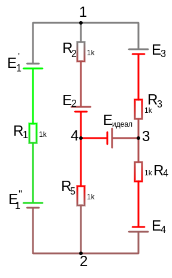
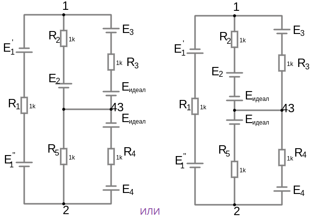
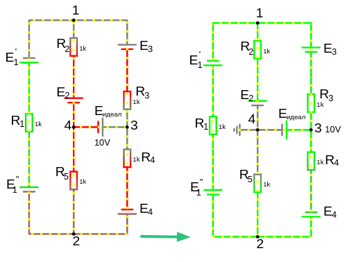

# Урок 24. Метод узловых потенциалов. Часть 5. Ветвь с идеальным источником ЭДС.

В [идеальном источнике ЭДС](/theories_of_electrical_circuits/lessons/4.html): 
- $R=0$ 
- $G\approx \infty$

Поэтому выполнение стандартного математического подхода расчета схемы не выйдет, хотя в реальном мире ток будет протекать и посчитать возможно.

## Способ 1

Перенести идеальный источник ЭДС по его напрвлению к узлу ветви которых обладают сопротивлением и разделить по ветвям в направлении от этого узла.
Или перенести идеальный источник ЭДС в обратную сторону его действия к узлу ветви которых обладают сопротивлением и разделить по ветвям в направлении к этому узлу.

узлов стало на один меньше, вместо узла 4 и 3 теперь один узел 43 (провод это обычная перемычка)

После расчета модифицированной схемы, найденные токи можем подставить по первому правилу Кирхгофа для узлов 4 или 3 и найти ток ветви с идеальным источником ЭДС

$V_1\cdot G_{11} - V_2\cdot G_{12} = J_{11}$

$-V_1\cdot G_{21} + V_2\cdot G_{22} = J_{22}$

## Способ 2

Необходимо заземлить один из узлов ветви с идеальным ЭДС, допусти мы заземлили 4-й узел, тогда потенциал его нулевой $V_4=0$, а второй узел приобретает все оставшееся напряжение, так как сопротивления в ветви нет и соответственно не будет падения напряжения, то потенциал второго узла известен $V_3=10, V$

$V_1\cdot G_{11} - V_2\cdot G_{12} - V_3\cdot G_{13}  = J_{11}$

$-V_1\cdot G_{21} + V_2\cdot G_{22} - V_3\cdot G_{23} = J_{22}$

и по формуле количества уравнений нам необходимо еще одно, но нам уже известен потенциал $V_3$ так что нет необходимости выводить еще одно уравнение

для интереса вот оно:
- $-V_1\cdot G_{31} - V_2\cdot G_{32} + V_3\cdot G_{33} = J_{33}$