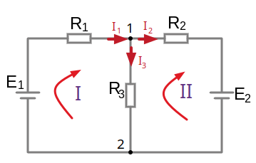
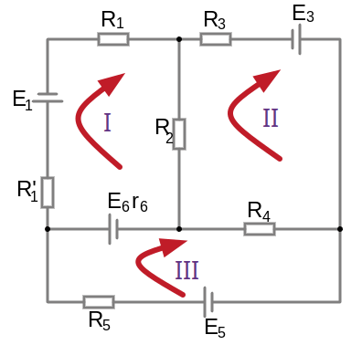
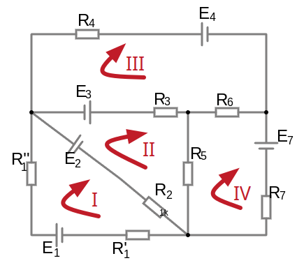

# Урок 27-28. Метод контурных токов. Часть 1-2.

```admonish info
Рациональность применения методов расчета схем:

**Метод по законам Кирхгофа** громоздкий, за счет составления большего количества уравнений.

**Метод узловых потенциалов** рационально применять для схем в которых число узлов минус один меньше числа независимых контуров т.е. ($N_{узлов}-1 < N_{контуров}$), иначе если наоборот ($N_{узлов}-1 > N_{контуров}$) тогда рационально использовать **метод контурных токов**, так как меньше уравнений придется составлять. 
```
 
### 🔄 **Метод контурных токов (метод Меш-анализа)**

Метод контурных токов — это один из эффективных способов анализа электрических цепей. Он основан на применении **второго закона Кирхгофа (Закон напряжений)**, который гласит, что алгебраическая сумма напряжений в замкнутом контуре равна нулю. 

Этот метод особенно полезен для **планарных схем**, где можно легко выделить замкнутые контуры.


В схеме видим 3 независимых контура I, II, III. Контуры имеют свои контурные токи $I_{11},I_{22},I_{33}$ протекающие по всем элементам своего кантура, направление выбираем произвольно. Эти токи условны, так как ветви общие и не могут иметь разный ток.

### **Универсальная система уравнений**:
- $\small R_{11}\cdot I_{11} \plusmn R_{12}\cdot I_{22} \plusmn R_{13}\cdot I_{33}\plusmn R_{1k}\cdot I_{kk}   \plusmn R_{1n}\cdot I_{nn} = E_{11}$
- $\small \plusmn R_{21}\cdot I_{11} + R_{22}\cdot I_{22} \plusmn R_{23}\cdot I_{33}\plusmn R_{2k}\cdot I_{kk}   \plusmn R_{2n}\cdot I_{nn} = E_{22}$
- $\dots$
- $\small \plusmn R_{n1}\cdot I_{11} \plusmn R_{n2}\cdot I_{22} \plusmn R_{n3}\cdot I_{33}\plusmn R_{nk}\cdot I_{kk}  + R_{nn}\cdot I_{nn} = E_{nn}$

Где:
-  перед **общими сопротивлениями** $R_{12}, R_{31}, \dots$ может быть знак "+" или "-" (в отличии от метода узловых потенциалов). Общие включают в себя только общие сопротивления. Например, для $R_{12}$ если направление контуров 1 и 2 несовпадают то ставим "-", иначе если совпадают то ставим "+".
В [планарные схемах](/theories_of_electrical_circuits/lessons/29.htm) если выбрать направления обходов контуров по часовой стрелке то всегда знак "-". Собственные сопротивлениями включают в себя только собственные сопротивления.
- перед **собственными сопротивлениями** $R_{11}, R_{22}, \dots$ всегда знак "+"  

---

### ⚡ **Основные шаги метода:**

1. **Определение контуров:**  
   Раздели схему на минимальное количество замкнутых контуров (мешей).

2. **Назначение контурных токов:**  
   Для каждого контура вводится свой ток $ I_{11}, I_{22}, I_{33}, \dots $. Обычно направление токов выбирается по часовой стрелке для удобства (но это не обязательно).

3. **Применение второго закона Кирхгофа для каждого контура:**  
   Задали направление токов для всех узлов, $(узел\ 1: I_{1}, I_{3}, I_{6}, \dots) $.
   Задали направление обхода контуров и направления протекания тока контуров, проще чтобы они совпадали.
   Для каждого контура записывается уравнение, где сумма падений напряжений на всех элементах равна сумме ЭДС в контуре:
  
   Количество уравнений равно, от количества ветвей отнять количество узлов и плюс 1  

   $N_{уравнений}=N_{ветвей} - N_{узлов} + 1 = 6 - 4 +1 = 3$

   $\sum (IR) = \sum E$

   Где:
   - $ I $ — контурный ток;
   - $ R $ — сопротивление элемента;
   - $ E $ — ЭДС в контуре.

   ---

   Составим уравнения по схеме:
   - (для контура 1): $\small R_1\cdot I_{11} + R_3\cdot (I_{11} - I_{33}) + (R_2 + r_2)\cdot (I_{11} - I_{22})=E_1 + E_2$
   - (для контура 2): $\small R_2\cdot (I_{22} - I_{11}) + r_2\cdot (I_{22} - I_{11}) + R_4\cdot (I_{22} - I_{33}) + R_5\cdot I_{22} = - E_2 + E_4$
   - (для контура 3): $\small R_3\cdot (I_{33} - I_{11})+R_6\cdot I_{33} + R_4\cdot (I_{33} - I_{22}) = -E_4 $

   Где:
    - $(I_{11} - I_{33}) $ — так как токи разных контуров и они протекают в разных направлениях, то берем их разность, иначе сумму. **Учет общих элементов:**  
   Если резистор принадлежит сразу двум контурам, через него течет **разность контурных токов**. Например, если резистор находится между контурами с токами $ I_{11} $ и $ I_{22} $, ток через резистор равен $ (I_{11} - I_{22}) $.

    Упростим:
    - (для контура 1): $\small (R_1+R_2+r_2+R_3)\cdot I_{11} - (R_2 + r_2)\cdot I_{22} - R_3\cdot I_{33} = E_1 + E_2$
    - (для контура 2): $\small - (R_2+r_2)\cdot I_{11} + (R_2+r_2+R_4+R_5)\cdot I_{22} - R_4\cdot I_{33} = - E_2 + E_4$
    - (для контура 3): $\small - R_3\cdot I_{11} - R_4\cdot I_{22} + (R_3+R_4+R_6)\cdot I_{33} = -E_4$
 
    Введем новые переменные **собственных (полных) сопротивлений контура**, (арифметическая сумма т.е. без учета знака):
    - (для контура 1): $R_{11} = R_1+R_2+r_2+R_3$  
    - (для контура 2): $R_{22} = R_2+r_2+R_4+R_5$
    - (для контура 3): $R_{33} = R_3+R_4+R_6$

    Введем новые переменные **общих сопротивлений контура**, (арифметическая сумма т.е. без учета знака):
    - $R_{12}=R_{21} = R_2 + r_2$ (для первого контура используется $R_{12}$, а для второго контура $R_{21}$)
    - $R_{13}=R_{31} = R_3$
    - $R_{23}=R_{32} = R_4$

    Введем новые переменные **контурных ЭДС**, (алгебраическая сумма т.е. с учетом знака):
    - $E_{11}=E_{1}+ E_2$
    - $E_{22}=-E_{2}+ E_4$
    - $E_{33}=-E_4$

    Перепишем уравнения с учетом новых переменных, так как надо состалять на основе универсальных уравнений:
    - (для контура 1): $\small R_{11}\cdot I_{11} - R_{12}\cdot I_{22} - R_{13}\cdot I_{33} = E_{11}$
    - (для контура 2): $\small - R_{12}\cdot I_{11} + R_{22}\cdot I_{22} - R_{23}\cdot I_{33} = E_{22}$
    - (для контура 3): $\small - R_{31}\cdot I_{11} - R_{32}\cdot I_{22} + R_{33}\cdot I_{33} = E_{33}$
 
5. **Решение системы уравнений:**  
   После составления уравнений для всех контуров, решается система линейных уравнений (обычно методами линейной алгебры) для контурных токов $I_{11}, I_{22}, I_{33}, \dots I_{nn}$.

6. **Расчет реальных токов и напряжений:**  
   Найдя контурные токи, легко определить токи ветвей через отдельные элементы и напряжения на них, выбрав направления токов и составив уравнения учитывая направления обхода контура и тока.
   Облегчает задачу нахождения токов, то что, ток в ветвях не входящих в другие контуры, будет равен конторному току!
   А в общих ветвях, между контурами, ток буде равен их алгебраической сумме!
---

### 📝 1. Пример составления уравнений универсальным способом:



$N_{уравнений}=N_{ветвей} - N_{узлов} + 1 = 3 - 2 +1 = 2$

Универсальные уравнения в общем виде:
- $R_{11}\cdot I_{11} \plusmn R_{12}\cdot I_{22} = E_{11}$
- $\plusmn R_{21}\cdot I_{11} + R_{22}\cdot I_{22} = E_{22}$

Обозначим собственные (полные) сопротивления контуров:
- $R_{11} = R_{1} + R_{3}$
- $R_{22} = R_{2} + R_{3}$

Обозначим общие сопротивления контуров:
- $R_{12} = R_{11} = R_{3}$

Обозначим контурные ЭДС, (алгебраическая сумма т.е. с учетом знака):
- $E_{11}=E_{1}$
- $E_{22}=-E_{2}$

Подставим значения:
- (1-й контур):$(R_1+R_3)\cdot I_{11} - R_{3}\cdot I_{22} = E_{1}$
- (2-й контур):$-R_3\cdot I_{11} + (R_2+R_3)\cdot I_{22} = -E_{2}$


Где:
- $- R_{3}\cdot I_{22}$  — для описания взаимодействия первого контура со вторым, мы вычитаем произведение $I\cdot R$, так как токи контуров текут в разных направлениях, а сопротивление общее.
- тоже самое и для этого $-R_3\cdot I_{11}$ — мы вычитаем, так как токи контуров текут в разных направлениях, а сопротивление общее.


После составления уравнений для всех контуров решается система линейных уравнений (обычно методами линейной алгебры). Найдя контурные токи, легко определить токи ветвей через отдельные элементы и напряжения на них.

Токи:

(в несмежных ветвях ток равен контурному)
- $I_1 = I_{11}$
- $I_2 = I_{22}$

(в смежных ветвях ток равен алгебраической сумме токов смежной ветви двух контуров)
- $I_3 = I_{22} - I_{11}$

**Допустим**, мы подставили в уравнения известные значения сопротивлений и источников ЭДС и нашли контурные токи:
- $I_{11} = 2, A$
- $I_{22} = 3, A$

Найдем ток $I_3$:
- $I_1=I_{11} = 2, A$
- $I_2=I_{22} = 3, A$
- $I_3 = I_{22}-I_{11}= 3-2=1, A$ 

Или воспользуемся первым правилом Кирхгофа.<br>
Выберем, произвольно, направления токов ветвей и составим уравнения:
- (узел 1) $I_1-I_2-I_3 = 0 \to I_3=I_1-I_2$
- (узел 2) $I_2+I_3-I_1 = 0$

Найдем ток $I_3$:
- $I_3 = I_1-I_2 = 2-3=-1, A$ (таким способом можем понять истинное направление тока)

---

### 📝 2. Пример составления уравнений универсальным способом:



$N_{уравнений}=N_{ветвей} - N_{узлов} + 1 = 6 - 4 + 1 = 3$

Универсальные уравнения в общем виде:
- $R_{11}\cdot I_{11} \plusmn R_{12}\cdot I_{22} \plusmn R_{13}\cdot I_{33} = E_{11}$
- $\plusmn R_{21}\cdot I_{11} + R_{22}\cdot I_{22} \plusmn R_{23}\cdot I_{33} = E_{22}$
- $\plusmn R_{31}\cdot I_{11} \plusmn R_{32}\cdot I_{22} + R_{33}\cdot I_{33} = E_{33}$

Обозначим собственные (полные) сопротивления контуров:
- $R_{11} = R^´_{1} + R_{1} + R_{2} + r_6$
- $R_{22} = R_{2} + R_{3} + R_{4}$
- $R_{33} = R_{5} + r_6 + R_{4}$

Обозначим общие сопротивления контуров:
- $R_{12} = R_{21} = R_{2}$
- $R_{13} = R_{31} = r_{6}$
- $R_{23} = R_{32} = R_{4}$

Обозначим контурные ЭДС, (алгебраическая сумма т.е. с учетом знака):
- $E_{11}=-E_{1}+E_{6}$
- $E_{22}=E_{3}$
- $E_{33}=-E_{6}+E_{5}$

Подставим значения:
- (1-й контур):$\ (R^´_{1} + R_{1} + R_{2} + r_6)\cdot I_{11} - R_{2}\cdot I_{22} - r_{6}\cdot I_{33} = -E_{1}+E_{6}$
- (2-й контур):$\ - R_{2}\cdot I_{11} + (R_{2} + R_{3} + R_{4})\cdot I_{22} - R_{4}\cdot I_{33} = E_{3}$
- (3-й контур):$\ - r_{6}\cdot I_{11} - R_{4}\cdot I_{22} + (R_{5} + r_6 + R_{4})\cdot I_{33} = -E_{6}+E_{5}$

Токи:

(в несмежных ветвях ток равен контурному)
- $I_1 = I_{11}$
- $I_3 = I_{22}$
- $I_5 = I_{33}$

(в смежных ветвях ток равен алгебраической сумме токов смежной ветви двух контуров)
- $I_4 = I_{33} - I_{22}\ $ (вычитаем так как направления не совпадают)
- $I_6 = I_{33} - I_{11}\ $ (вычитаем так как направления не совпадают)
- $I_2 = I_{11} - I_{22}\ $ (вычитаем так как направления не совпадают)
---

### 📝 3. Пример составления уравнений универсальным способом:



<a href="/theories_of_electrical_circuits/falstad/circuitjs-27.2.txt" download="circuitjs-27.2.txt">Скачать схему для www.falstad.com/circuit</a>


$N_{уравнений}=N_{ветвей} - N_{узлов} + 1 = 7 - 4 + 1 = 4$

Универсальные уравнения в общем виде:
- $R_{11}\cdot I_{11} \plusmn R_{12}\cdot I_{22} \plusmn R_{13}\cdot I_{33} \plusmn R_{14}\cdot I_{44} = E_{11}$
- $\plusmn R_{21}\cdot I_{11} + R_{22}\cdot I_{22} \plusmn R_{23}\cdot I_{33} \plusmn R_{24}\cdot I_{44}= E_{22}$
- $\plusmn R_{31}\cdot I_{11} \plusmn R_{32}\cdot I_{22} + R_{33}\cdot I_{33} \plusmn R_{34}\cdot I_{44} = E_{33}$
- $\plusmn R_{41}\cdot I_{11} \plusmn R_{42}\cdot I_{22} \plusmn R_{43}\cdot I_{33} + R_{44}\cdot I_{44} = E_{44}$

Обозначим собственные (полные) сопротивления контуров:
- $R_{11} = R^´_{1} + R^{´´}_{1} + R_{2}$
- $R_{22} = R_{2} + R_{3} + R_{5}$
- $R_{33} = R_{3} + R_4 + R_{6}$
- $R_{44} = R_{5} + R_6 + R_{7}$

Обозначим общие сопротивления контуров:
- $R_{12} = R_{21} = R_{2}$
- $R_{13} = R_{31} = 0 $
- $R_{14} = R_{41} = 0 $
- $R_{23} = R_{32} = R_{3}$
- $R_{24} = R_{42} = R_{5}$
- $R_{34} = R_{43} = R_{6}$

Обозначим контурные ЭДС, (алгебраическая сумма т.е. с учетом знака):
- $E_{11}=E_{1}-E_{2}$
- $E_{22}=E_{2}+E_{3}$
- $E_{33}=-E_{3}-E_{4}$
- $E_{44}=-E_{7}$

Подставим значения:
- (1-й контур): $\ (R^´_{1} + R^{´´}_{1} + R_{2})\cdot I_{11} - R_{2}\cdot I_{22} \plusmn 0\cdot I_{33} \plusmn 0\cdot I_{44} = E_{1}-E_{2}$
- (2-й контур): $\ - R_{2}\cdot I_{11} + (R_{2} + R_{3} + R_{5})\cdot I_{22} - R_{3}\cdot I_{33} -R_{5}\cdot I_{44}= E_{2}+E_{3}$
- (3-й контур): $\ \plusmn 0\cdot I_{11} -R_{3}\cdot I_{22} + (R_{3} + R_4 + R_{6})\cdot I_{33} - R_{6}\cdot I_{44} = -E_{3}-E_{4}$
- (4-й контур): $\ \plusmn 0\cdot I_{11} - R_{5}\cdot I_{22} - R_{6}\cdot I_{33} + (R_{5} + R_6 + R_{7})\cdot I_{44} = -E_{7}$


Токи:

(в несмежных ветвях ток равен контурному)
- $I_1 = I_{11}$
- $I_4 = I_{33}$
- $I_7 = I_{44}$
 
(в смежных ветвях ток равен алгебраической сумме токов смежной ветви двух контуров)
- $I_2 = I_{11} - I_{22}$ 
- $I_3 = I_{22} - I_{33}$ 
- $I_6 = I_{33} - I_{44}$ 
- $I_5 = I_{22} - I_{44}$ 

---

### ✅ **Преимущества метода:**
- Удобен для схем с большим количеством резисторов, но малым количеством контуров;
- Меньше уравнений по сравнению с методом узловых потенциалов в некоторых случаях;
- Легко применим в анализе сложных схем с симметрией.

