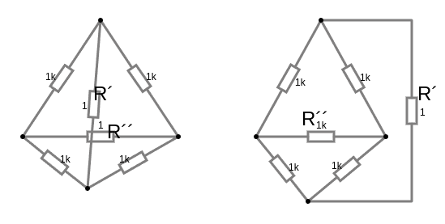
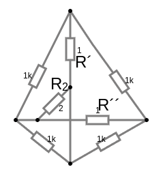

# Метод контурных токов. Планарные и непланарные схемы.

### 📊 **Планарные и непланарные схемы**

Эти термины используются для описания типов электрических цепей в зависимости от того, можно ли изобразить их на плоскости без пересечения проводников. 

---

### ✅ **Планарные схемы**

**Планарная схема** — это схема, которую можно нарисовать на плоскости так, чтобы проводники не пересекались, кроме как в узлах соединения.  

**Признаки планарной схемы:**
- Все соединения можно изобразить на бумаге без «скрещивания» проводов.  
- Удобны для анализа с помощью методов контурных токов и узловых потенциалов.  
- Используются в печатных платах (PCB), где важно избегать пересечения дорожек.  

**Пример:**  
Обычный мостовой выпрямитель или простая цепь с резисторами и конденсаторами.  

**Визуализация:**  

Эта схема планарна, так как нет линий, пересекающихся без соединения.
Ветви с резисторами $R´$ и $R^{´´}$ на самом деле не имеют соединения, они могут быть вынесены так, что бы не перекаться на печатной плате.

---

### 🚫 **Непланарные схемы**

**Непланарная схема** — это схема, которую невозможно изобразить на плоскости без пересечения проводников, если не использовать «мостики» или перемычки.  

**Признаки непланарной схемы:**
- Обязательно будут провода, которые «пересекаются» в воздухе (без электрического контакта).
- Анализ сложнее, особенно при использовании методов контурных токов.
- Часто встречаются в сложных электронных устройствах и интегральных схемах.

Классический **граф Куратовского** $K_{3,3}$ или мост Уитстона с добавленным элементом.

**Пример:**  
  

Из-за наличия ветви с резистором $R_2$ схема всегда будет иметь пересечение ветвей, как бы мы не выносили ветви в стороны.

---

### ⚡ **Как определить тип схемы?**

1. **Попробуй нарисовать схему, избегая пересечений.**  
   Если это возможно — схема планарная.

2. **Используй теорему Куратовского:**  
   Схема является непланарной, если в ней можно найти подграф, который является преобразованным вариантом $K_5$ (полный граф с 5 вершинами) или $K_{3,3}$ (двудольный полный граф).

---

### 📌 **Практическое значение:**
- **Планарные схемы** легче изготавливать на печатных платах.  
- **Непланарные схемы** требуют использования многослойных плат или перемычек.  
- В микросхемах непланарность решается за счет нескольких слоев металлизации.  