# Сопротивление. Резистор. Мощность. Энергия. Проводимость.
 
* [Сопротивление, Резистор](/theories_of_electrical_circuits/lessons/3.html#Резистивный-элемент-резистор)

* [Проводимость](/theories_of_electrical_circuits/lessons/3.html#Проводимость-𝐺)

* [Мощность](/theories_of_electrical_circuits/lessons/3.html#Мощность)

* [Энергия](/theories_of_electrical_circuits/lessons/3.html#Энергия)

 
## Сопротивление

Сопротивление – это свойство проводника препятствовать прохождению электрического тока.
Измеряется в омах (Ом).

Сопротивление зависит от материала проводника, его длины и площади поперечного сечения.

Сопротивление характеризует способность данного проводника препятствовать прохождению по нему тока.

$$R=\frac{p\cdot l}{S},\ [Ом=\frac{В}{А}]$$

где:
 - p – удельное электрическое сопротивление вещества
 - p – длина проводника
 - S – площадь поперечного сечения проводника

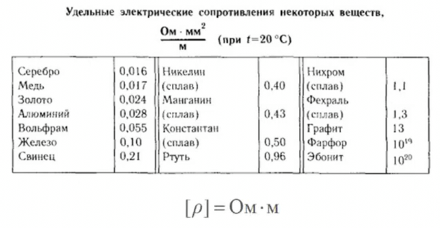

**Короткое замыкание (кз)** – состояние, когда $R_{нагр} \lll R_{ист}$ сопротивление нагрузки много меньше внутреннего сопротивления источника питания. Что приводит к резкому увеличению силы тока, что может вызвать перегрев проводов, искрение и даже пожар. Название "короткое замыкание" указывает на то, что электрический ток находит более короткий и лёгкий путь для своего прохождения, минуя обычную нагрузку (например, лампочку или электроприбор). Вместо того чтобы проходить через устройство, которое оказывает сопротивление, ток стремится пройти по пути с минимальным сопротивлением.

$I_{кз}=\frac{\mathcal{E}}{r}$

Например, сопротивление проводника 0.1 Ом, тогда даже при 3 вольт $I_{кз}=\frac{3}{0.1}=30\ A$

Если ток превышает допустимый, провод нагреется, что может привести к оплавлению изоляции и даже возгоранию, cжечь дорожки на плате.
Если в цепи установлен предохранитель или автоматический выключатель, они могут сработать

**Сверхпроводимость** – охлаждение проводника приводит к увеличению его проводимости.
Колеблющиеся атомы создают препятствия для движения электронов, которые переносят электрический ток. С повышением температуры атомы больше колеблются и создают сопротивление движению электронов в проводнике. Следовательно при охлаждении проводника тепловое движение атомов уменьшается. Это снижает сопротивление и увеличивает проводимость. В некоторых материалах при очень низких температурах (близких к абсолютному нулю) сопротивление полностью исчезает. Это явление называется сверхпроводимостью.

Практические применения сверхпроводимости:
- В криоэлектронике для создания высокоэффективных электронных устройств
- Сверхпроводящие магниты используются в медицинских томографах (сильное магнитное поле)

## [Резистивный элемент (резистор)](https://www.ruselectronic.com/resistors/)

Резисторы применяются для:
- для "лимитирования" или ограничения тока в цепи.
- для контроля/регулирования величины напряжения (делители напряжения).

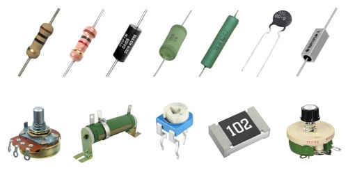

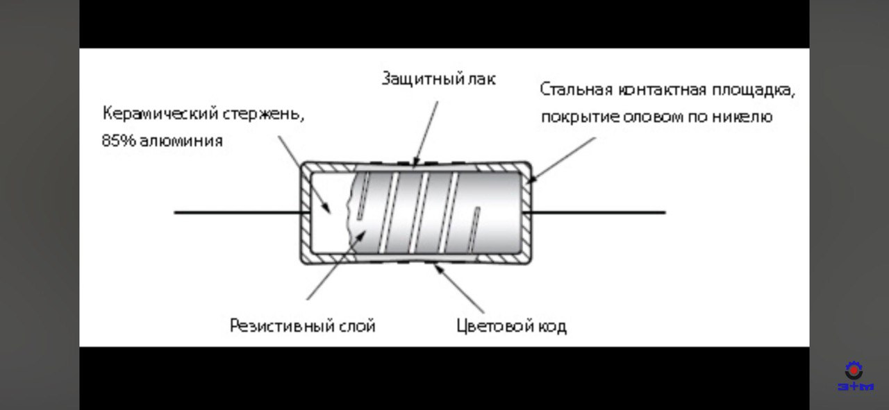

 

Резистор – это **линейный пассивный** электронный компонент, основная задача которого – создавать сопротивление электрическому току. Представьте его как узкое горлышко в трубе: чем уже горлышко, тем сложнее воде протекать. Точно так же резистор затрудняет движение электронов в электрической цепи.

Сама харак­теристика «сопротивление» говорит о том, насколько легко генератору создавать ток в данном проводнике.

В цепях переменного тока резистор называется как активный резистор.

В цепях постоянного тока резистор так и называется - резистор или электрическим сопротивлением.

Закон Ома описывает связь между током, напряжением и сопротивлением в электрической цепи:

$$R = \frac{U_R}{I_R} [Ом] [\Omega]$$

Где:  
- $I$ — ток, измеряемый в амперах ($\text{A}$).  
- $U$ — напряжение, измеряемое в вольтах ($\text{V}$).  
- $R$ — сопротивление, измеряемое в омах ($\Omega$).

При последовательном соединении:

$I=I_1=I_2$

$R=R_1+R_2$

$U=U_1+U_2$

При парралельном соединение

$U=U_1=U_2$

$I=I_1+I_2$

$R=\frac{1}{(\frac{1}R_1+\frac{1}R_2)}$

**Имя Георга Ома**
Закон Ома назван в честь немецкого физика **Георга Симона Ома** (1789–1854). В 1827 году он сформулировал основные законы электрической проводимости, которые легли в основу современной электроники. Единица сопротивления, Ом ($\Omega$), была названа в его честь.

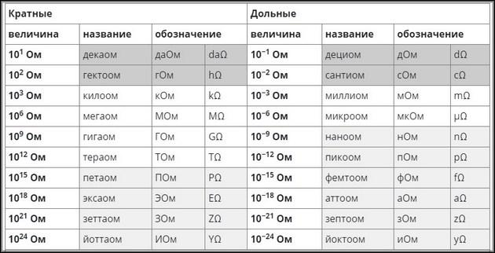

$Килоом (кОм): 1\ k\Omega = 10^{3}\Omega\ (1000\ \Omega)$

#### **Примеры применения закона Ома**
1. **Рассчёт тока:**  
   Если напряжение $U = 10 \, \text{В}$, а сопротивление $R = 5 \, \Omega$:  
   $I = \frac{U}{R} = \frac{10}{5} = 2 \, \text{А}.$

2. **Рассчёт напряжения:**  
   Если ток $I = 2 \, \text{А}$, а сопротивление $R = 10 \, \Omega$:  
   $U = I \cdot R = 2 \cdot 10 = 20 \, \text{В}.$

3. **Рассчёт сопротивления:**  
   Если ток $I = 3 \, \text{А}$, а напряжение $U = 12 \, \text{В}$:  
   $R = \frac{U}{I} = \frac{12}{3} = 4 \, \Omega.$

#### **Функции резистора**
1. **Ограничение тока:**  
   Используется для предотвращения избыточного тока в цепи.
2. **Разделение напряжения:**  
   Делит напряжение между различными частями схемы.
3. **Стабилизация работы схемы:**  
   Ограничивает ток для правильной работы активных компонентов, таких как транзисторы или светодиоды.
4. **Формирование сигнала:**  
   В комбинации с конденсаторами и катушками индуктивности создаёт фильтры и временные задержки.
 
#### **Основные параметры резистора**
1. **Сопротивление (R):**  
   Измеряется в омах ($\Omega$) и определяет, насколько сильно резистор ограничивает ток.
2. **Мощность (P):**  
   Максимальная мощность, которую резистор может рассеивать без перегрева, измеряется в ваттах (Вт).
3. **Точность (допуск):**  
   Указывается в процентах и отражает отклонение реального сопротивления от номинального.
4. **Температурный коэффициент сопротивления (TCR):**  
   Показывает, как сопротивление меняется с температурой.

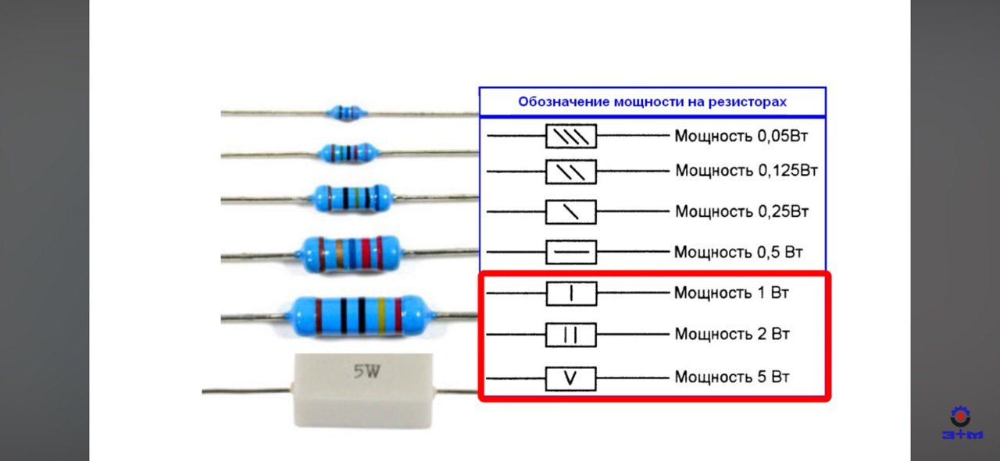
 

#### **Типы резисторов**
1. **Постоянные резисторы:**
   - Значение сопротивления фиксировано.
   - Примеры: углеродные, металлоплёночные, проволочные.
2. **Переменные резисторы:**
   - Сопротивление можно изменять вручную.
   - Примеры: потенциометры, подстроечные резисторы.
3. **Специальные резисторы:**
   - Терморезисторы (NTC/PTC): изменяют сопротивление в зависимости от температуры.
   - Фото резисторы: меняют сопротивление под воздействием света.

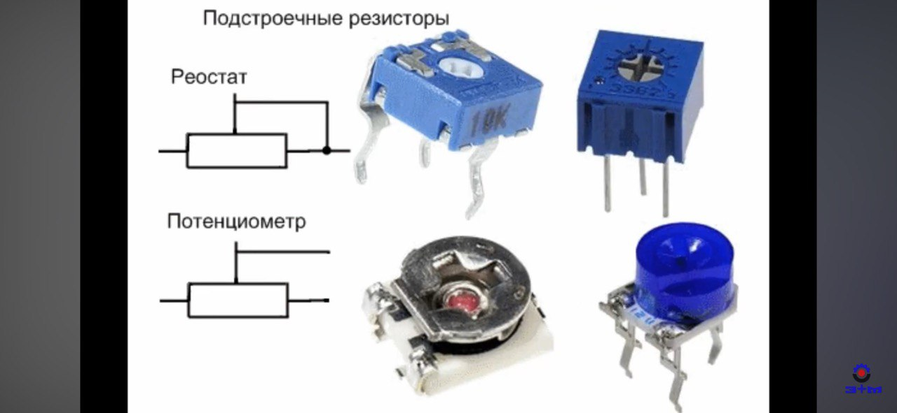

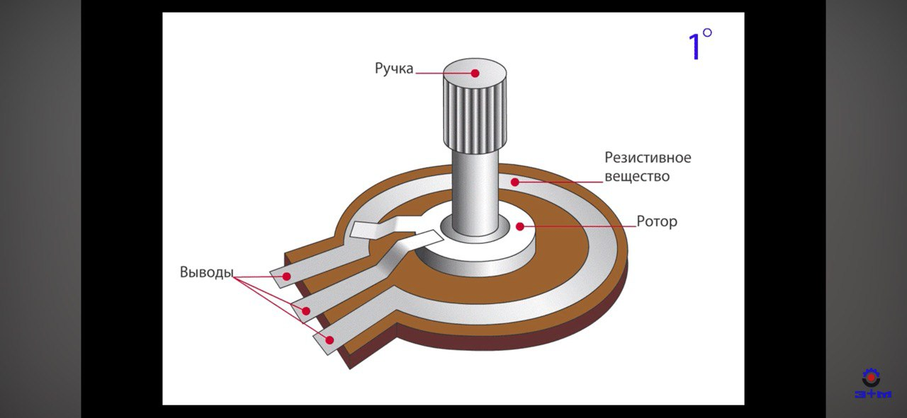

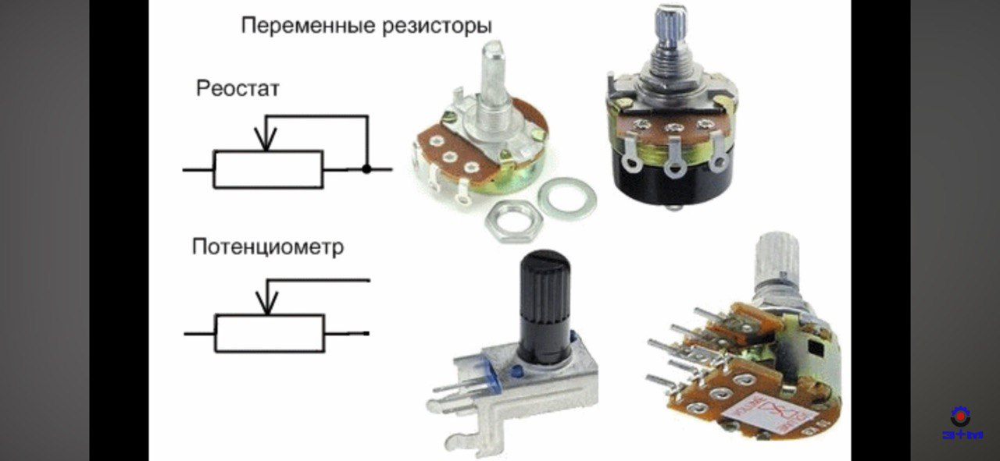

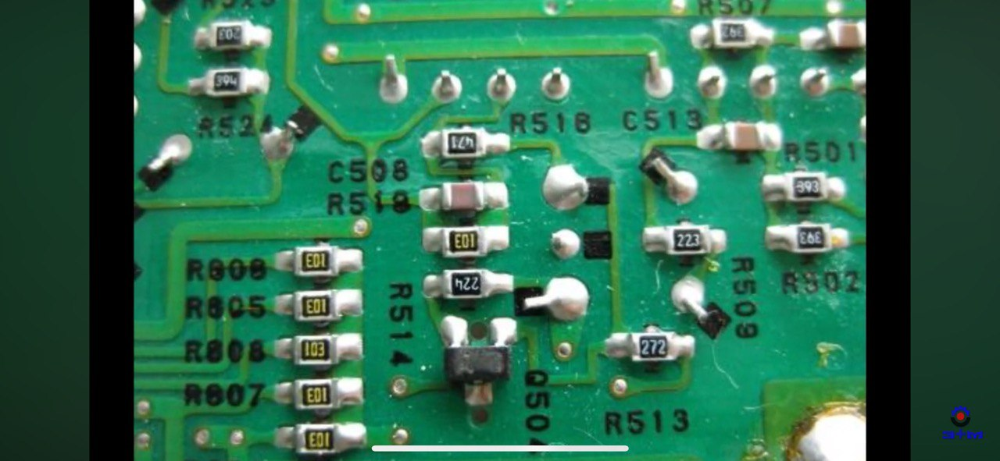

### Цветовая маркировка резисторов

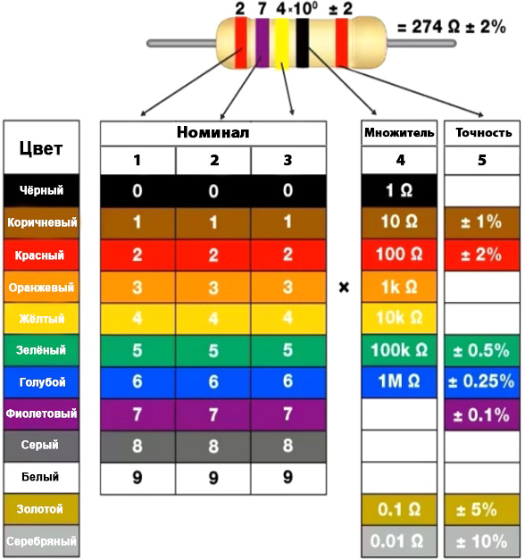

Первые две полоски абсолютно всегда обозначают первые две цифры номинального сопротивления резистора. 

Всего 3 полосы, то первые 2-е полосы это номинал, а третья полоса это множитель, на который необходимо умножить число, полученное из первых двух полос.

Всего 4 полосы, то первые 2-е полосы это номинал, третья полоса это множитель, а четвертая это точность резистора.

Всего 5 полос, первые 3-и полосы это номинал (сопротивления) резистора, четвертая - множитель, пятая - точность.

[Калькулятор цветовой маркировки резисторов](https://www.chipdip.ru/calc/resistor?mode=5)

Отличный вопрос! Резисторы действительно характеризуются не только сопротивлением (в Омах), но и **мощностью** (в Ваттах), которую они могут рассеивать без повреждения. Давайте разберёмся, что это значит и почему это важно.
 

### Что такое мощность резистора?
Мощность резистора — это максимальная мощность, которую резистор может рассеивать в виде тепла без перегрева и выхода из строя. Если мощность, выделяемая на резисторе, превышает его номинальную мощность, резистор может перегреться, сгореть или даже вызвать повреждение других компонентов схемы.
 

### Как рассчитывается мощность на резисторе?
Мощность $P$, рассеиваемая на резисторе, рассчитывается по одной из следующих формул:
1. $P = I^2 \cdot R$ (где $I$ — ток через резистор, $R$ — сопротивление резистора).
2. $P = V^2 / R$ (где $V$ — напряжение на резисторе).
3. $P = V \cdot I$ (где $V$ — напряжение на резисторе, $I$ — ток через резистор).

 
### Пример:
В нашем случае с делителем тока для светодиодов:
- Ток через каждый резистор: $I = 25 \, \text{мА} = 0.025 \, \text{А}$.
- Сопротивление резистора: $R = 400 \, \text{Ом}$.
- Напряжение на резисторе: $V = 10 \, \text{В}$.

Мощность, рассеиваемая на резисторе:
 
$P = I^2 \cdot R = (0.025)^2 \cdot 400 = 0.25 \, \text{Вт}$
 
 

### Почему выбираем резистор с запасом по мощности?
1. **Надёжность:** Резисторы работают в реальных условиях, где могут быть колебания напряжения, температуры и другие факторы. Запас по мощности обеспечивает надёжность и долговечность.
2. **Перегрев:** Если резистор работает на пределе своей мощности, он может сильно нагреваться, что снижает его срок службы.
3. **Безопасность:** Запас по мощности предотвращает выход резистора из строя, что особенно важно в ответственных схемах.

Поэтому, если расчётная мощность резистора $0.25 \, \text{Вт}$, лучше выбрать резистор с номинальной мощностью $0.5 \, \text{Вт}$ (в два раза больше).
 
### Как выглядят резисторы разной мощности?
Резисторы разной мощности отличаются размерами и конструкцией:
- **Маломощные резисторы (0.125 Вт, 0.25 Вт):** Маленькие, обычно используются в слаботочных схемах.
- **Резисторы средней мощности (0.5 Вт, 1 Вт):** Крупнее, часто используются в схемах с умеренными токами.
- **Мощные резисторы (2 Вт, 5 Вт и выше):** Большие, могут иметь радиаторы или специальное охлаждение.
 

### Итог:
- Резисторы выбираются не только по сопротивлению, но и по мощности.
- Мощность резистора должна быть не меньше расчётной, а лучше — с запасом.
- В нашем примере для $0.25 \, \text{Вт}$ лучше выбрать резистор на $0.5 \, \text{Вт}$.

 

## Проводимость (𝐺)

Проводимость — это величина, обратная сопротивлению (𝑅), которая характеризует способность проводника или компонента проводить электрический ток. Чем выше проводимость, тем легче ток проходит через элемент цепи.

Проводимость рассчитывается как:

$G = \frac{1}{R}$

Где:  
- $G$ — проводимость, измеряется в **сименсах** (S).  
- $R$ — сопротивление, измеряется в **омах** ($\Omega$).

Единица проводимости в Международной системе единиц (СИ) называется **сименс** (S или См), в честь немецкого учёного **Эрнста Вернера фон Сименса**.  
$1 \, S = \frac{1}\Omega$.

Если в ветви есть как сопротивление $ R $, так и источник ЭДС с внутренним сопротивлением $ R_{вн} $, то полное сопротивление ветви определяется как их сумма:  

 
$R_{общ} = R + R_{вн}$
 
### Если $G = 0$

Если $G = 0$ то $R = \infty$ потому что $G = \frac{1}{\infty} = 0$

### Проводимость ветви
Проводимость — это величина, обратная сопротивлению:
 
$G = \frac{1}{R_{общ}} = \frac{1}{R + R_{вн}}$
 

где:  
- $ G $ — проводимость ветви (в сименсах, **См**),  
- $ R_{общ} $ — общее сопротивление ветви,  
- $ R $ — сопротивление нагрузки,  
- $ R_{вн} $ — внутреннее сопротивление источника.  

**Пример расчета**  
Допустим:  
- $ R = 10 \Omega $,  
- $ R_{вн} = 2 \Omega $,  

Тогда:  

$R_{общ} = 10 + 2 = 12 \Omega$
 
$G = \frac{1}{12} = 0.0833 \text{ См}$
 
Таким образом, **проводимость ветви составит 0.0833 См**.
 
### Связь проводимости с законом Ома

Закон Ома через проводимость записывается так:

$I = G \cdot U$

Где:  
- $I$ — ток (A).  
- $G$ — проводимость (S или См).  
- $U$ — напряжение (V).

Если сопротивление компонента велико $(R \to \infty)$, то проводимость стремится к нулю $(G \to 0)$, и ток практически не проходит. 
Наоборот, если сопротивление мало $(R \to 0)$, проводимость становится большой, что позволяет току свободно протекать.

**Физическая интерпретация**
- Проводимость показывает, насколько эффективно материал или элемент цепи передаёт ток.  
- Материалы с высокой проводимостью (G) называют **проводниками**, такие как медь, серебро и алюминий.  
- Материалы с низкой проводимостью (G) называют **диэлектриками**, такие как стекло или пластик.

**Удельная проводимость ($\sigma$)**

Для материалов проводимость на единицу объёма называется **удельной проводимостью** и определяется как:
 
$\sigma = \frac{1}{\rho}$
 
Где:  
- $\sigma$ — удельная проводимость ($\frac{S}m$).  
- $\rho$ — удельное сопротивление ($\Omega \cdot m$ ).

**Примеры расчёта**
1. Если сопротивление резистора  ($R = 10 \, \Omega$), то проводимость:
   
   $G = \frac{1}{R} = \frac{1}{10} = 0.1 \, S.$
   

2. Для проводника с удельной проводимостью ($\sigma = 5.8 \cdot 10^7 \, S/m$) и площадью поперечного сечения ($A = 1 \, mm^2$), длиной ($L = 1 \, m$):
   
   $G = \sigma \cdot \frac{A}{L} = 5.8 \cdot 10^7 \cdot \frac{1 \cdot 10^{-6}}{1} = 58 \, S.$
   

## Мощность

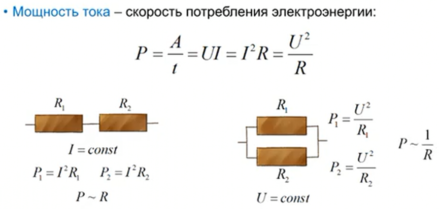

Мощность (𝑃) — это физическая величина, которая показывает скорость изменения (передачи или преобразования) энергии во времени.

$P_R=\frac{A}{t}=U_R \cdot I_R = I² \cdot R  = \frac{U^2_R}R=G \cdot U^2_R$  ватт, (𝑊) 

Где:
   - $G$ — проводимость (S или См).

1 ватт (1 𝑊) = 1 Дж/c (джоуль энергии, преобразованной за 1 секунду)

**Полная мощность** - работа сторонних сил в единицу времени: $P_{полн}=\mathcal{E}\cdot I=\frac{\mathcal{E}²}{R+r}$

**Общая мощность в цепи (полезная мощность)**. Она показывает, сколько энергии передается или потребляется в цепи за единицу времени. Эта формула справедлива для идеальных условий, когда отсутствуют потери мощности:
- $P=U\cdot I=I²\cdot R=\frac{\mathcal{E}²\cdot R}{(R+r)²}$

**Потери мощности** в проводниках. Она показывает, сколько энергии теряется из-за сопротивления проводов и превращается в тепло:
- $ΔP = I^2 \cdot R$

[**Потери мощности**](/theories_of_electrical_circuits/lessons/54.html) - это часть мощности, которая теряется из-за различных факторов, таких как сопротивление проводов, нагрев элементов цепи и т.д. Потери мощности превращаются в тепло или другие виды энергии, которые не используются для полезной работы.

Провода - это проводники, по которым течет ток. Сопротивление проводов зависит от их материала, длины и сечения. Чем больше сопротивление проводов, тем больше потери мощности.

Чем больше ток, тем больше мощность нужно передать или потребить.

Чем больше сопротивление проводов, тем больше потери мощности.

Зависимость мощности от тока в квадрата, означает, что чем больше ток при том же значении сопротивления тем больше **потери мощность**

Потери мощности являются частью общей мощности. Поэтому общая мощность, передаваемая в цепи, всегда будет больше, чем полезная мощность, которая доходит до потребителя, на величину потерь мощности.

 
**Применение в электротехнике**

В электрических цепях мощность можно выразить через ток (I) и напряжение (U):

$P = U \cdot I$
 

#### Разные формы выражения:

1. Если известно сопротивление (R) и ток (I):
  
   $P = I^2 \cdot R$
   
2. Если известно напряжение (U) и сопротивление (R):
    
   $P = \frac{U^2}{R}$
   
**Примеры расчёта**

1. Если прибор подключён к сети с напряжением ($U = 220 \, V$), и он потребляет ток  ($I = 2 \, A$), мощность будет:
   
   $P = U \cdot I = 220 \cdot 2 = 440 \, W.$
   

2. Для резистора с сопротивлением ($R = 10 \, \Omega$) и током ($I = 3 \, A$):  
   
   $P = I^2 \cdot R = 3^2 \cdot 10 = 90 \, W.$
   

**Пример для постоянного тока**:

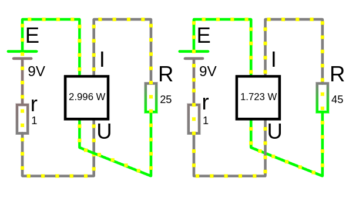 

<a href="/theories_of_electrical_circuits/falstad/circuitjs-3.txt" download="circuitjs-3.txt">Скачать схему для www.falstad.com/circuit</a>

Ток который протекает через цепь:
- $I=\frac{U}{R}=\frac{9}{25+1}=0.346154\ A$

Напряжение на нагрузке:
- $U_R = I \cdot R = 0.346154\cdot 25 = 8.654\ V$

Мощность источника напряжения:
- $P_{источника} = E\cdot I = 9\cdot 0.346154=3.115\ W$

Мощность, которая выделяется на нагрузке:
- $P_{нагрузки} = U \cdot I = 8.654\cdot 0.346154=2.996\ W$
- $P_{нагрузки} = I^2 \cdot R = 0.346154^2 \cdot 25=2.996\ W$

Расчет потерь мощности в источнике (это мощность, которая теряется на внутреннем сопротивлении источника и превращается в тепло):
- $ΔP_r = I^2 \cdot r=0.346154^2 \cdot 1 \approx 0.1198\ W$

Или мы можем найти потребляемую мощность нагрузки как разницу мощности источника и его потерь:
- $P_{нагрузки} = P_{источника} - ΔP_r = 3.115 - 0.1198 = 2.996\ W$ 

Анализ результатов:
- Чем больше сопротивление резистора (на схеме справа резистор с большим сопротивлением поэтому мощность нагрузки меньше 1.723 W), тем меньше ток будет протекать через цепь, и тем меньше будет мощность, которая выделяется на резисторе.
- Мы видим, что мощность, которая выделяется на нагрузке (2.996 W), меньше, чем мощность, которую отдает источник напряжения (3.115 W). Это связано с потерями мощности на внутреннем сопротивлении источника (0.1198 W).
- Напряжение на нагрузке (8.654 V) также немного меньше, чем ЭДС источника напряжения (9 V). Это также связано с потерями напряжения на внутреннем сопротивлении источника.

## Энергия 

Энергия — это физическая величина, которая характеризует способность системы совершать **работу ($A$)**. Она является одной из фундаментальных характеристик природы и играет ключевую роль во всех физических процессах.

Электрическое поле совершает работу по перемещению зарядов:
$$A=qU=UIt=I²Rt=\frac{U²}{R}t$$

$[A]=Дж; кВт\cdot ч$

$1\ кВт\cdot ч=1000\ Вт \cdot 3600\ с=3.6\cdot 10⁶\ Дж$

В электротехнике и физике энергия обозначается буквой **W** и измеряется в **джоулях (Дж)** в Международной системе единиц (СИ).

**Закон Джойля-Ленца** — определяет количество теплоты (работа совершаемая током в участке цепи), выделяющееся при прохождении тока по проводнику.

$$Q=I²\cdot R\cdot t$$

---

### Формы энергии:
1. **Кинетическая энергия**: Энергия, связанная с движением тела.

   $W_k = \frac{1}{2}mv^2$

   где  
    - $m$ — масса тела,  
    - $v$ — скорость тела.

2. **Потенциальная энергия**: Энергия, связанная с положением тела в поле сил (например, гравитационном или электрическом).
   
   $W_p = mgh$
   
   где  
    - $m$ — масса тела,  
    - $g$ — ускорение свободного падения,  
    - $h$ — высота над уровнем отсчета.

3. **Внутренняя энергия**: Энергия, связанная с движением и взаимодействием частиц внутри системы (например, в тепловых процессах).

4. **Электрическая энергия**: Энергия, связанная с движением зарядов в электрическом поле.
 
   $W = U \cdot I \cdot t$
  
   где 
    - $U$ — напряжение,  
    - $I$ — ток,  
    - $t$ — время.

5. **Магнитная энергия**: Энергия, запасённая в магнитном поле, например, в катушках индуктивности:
 
   $W = \frac{1}{2} L I^2$
  
   где  
    - $L$ — индуктивность,  
    - $I$ — ток.

6. **Механическая энергия**: Сумма кинетической и потенциальной энергии.

---

### Свойства энергии:
1. **Сохранение энергии**: Энергия не создаётся и не исчезает, она может только преобразовываться из одной формы в другую.
2. **Измерение**: Основная единица измерения энергии — **джоуль (Дж)**. 

    **Ватт-секунда** $Вт\cdot с$ — это эквивалент джоуля.

    $ 1\ Вт \cdot с = 1\ Дж $

    Другие единицы:
    - **кВт·ч (киловатт-час)** для электрической энергии.
    - **калории** для тепловой энергии.
3. **Превращение энергии**: 
   - Химическая энергия батареи может быть преобразована в электрическую.
   - Электрическая энергия может быть преобразована в механическую (например, в электродвигателе).

---

### Примеры в электротехнике:
- Энергия, выделяемая резистором:
  
  $W = I^2 R t = G \cdot U^2_R \cdot t$
  
  где  
   - $R$ — сопротивление,  
   - $I$ — ток,  
   - $t$ — время.
  
  **Пример:**

  Если лампа мощностью 100 Вт работает в течение 10 секунд, её энергия будет:

  $$W = 100 \, Вт \cdot 10 \, с = 1000 \, Вт\cdot с = 1000 \, Дж.$$
 

- Энергия конденсатора:
  
  $W = \frac{1}{2} C U^2$
  
  где 
   - $C$ — ёмкость, 
   - $U$ — напряжение на конденсаторе.

Энергия играет ключевую роль в понимании работы электрических цепей, механических систем, тепловых процессов и многих других явлений.

 