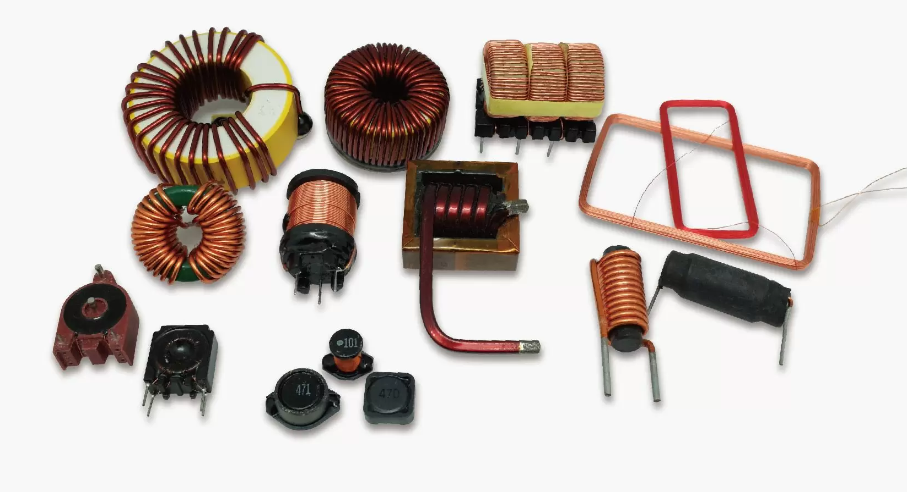
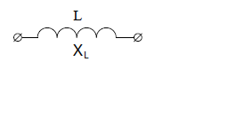
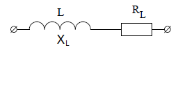

# Урок 3. Резистор. Конденсатор. Катушка индуктивности. Мощность. Энергия. Проводимость.

## Активные и пассивные компоненты

Электрические компоненты в цепях делятся на активные и пассивные в зависимости от их способности генерировать или потреблять энергию. 

### Активные компонеты 

Активные компоненты способны генерировать энергию или управлять потоком электронов в цепи. Они обычно требуют внешнего источника питания для своей работы.

Такие как источники питания тока или напряжения, это:
- (Источники питания) Батареи и аккумуляторы: обеспечивают постоянный ток (DC)
- (Источники питания) Генераторы: обеспечивают переменный ток (AC)
- (Полупроводниковые устройства) Транзисторы: управляют током и работают как усилители, ключи или генераторы.
- (Полупроводниковые устройства) Тиристоры: используются в схемах управления мощностью.

### Пассивные компонеты 

Пассивные компоненты не могут генерировать энергию, но потребляют, хранят или передают её. Они играют вспомогательную роль в работе цепи.

Такие как: 
- резистор, ограничивают ток и рассеивают энергию в виде тепла.
- конденсатор, накопители энергии в электрическом поле; используются для фильтрации и сглаживания сигналов.
- катушка индуктивности, хранят энергию в магнитном поле; используются в трансформаторах, фильтрах и схемах управления
- диоды, хотя они являются полупроводниковыми устройствами, их основная функция — пропускать ток в одном направлении, что делает их пассивными в большинстве случаев.
- трансформаторы, передают энергию, изменяя напряжение и ток.
они в условиях отсутвия электрического поля не могут функционировать.

### Линейные пассивные компонеты 
Это линейная характеристика зависимости параметров компонета, при изменении одной характеристики линейно изменяется зависимая характеристика. 
График зависимости тока от напряжения для таких компонентов — прямая линия.

**Примеры:**
- Резисторы (идеальные):
    Сопротивление остаётся постоянным при любом напряжении и токе, если не выходить за рабочие пределы.
- Конденсаторы:
    Ёмкость не зависит от напряжения, если материал и геометрия неизменны.
- Катушки индуктивности:
    Индуктивность остаётся постоянной при изменении тока, если сердечник не насыщен.

**Применение:**

Линейные компоненты используются в цепях с предсказуемым поведением, таких как фильтры, усилители и генераторы.

### Не линейные пассивные компонеты

Эти компоненты не подчиняются закону линейности, и их характеристики зависят от условий работы, таких как ток, напряжение или частота. 
График зависимости $I$ от $𝑈$ — нелинейная кривая.

Основные свойства:
- Нелинейная зависимость $I$ от $𝑈$: Например, при увеличении напряжения сопротивление может меняться.
- Зависимость от условий работы: Влияние температуры, частоты, напряжения или других параметров.
- Эффекты насыщения и гистерезиса: Эти эффекты могут проявляться в магнитных или полупроводниковых материалах.

**Примеры:**
- Диоды:
    Пропускают ток только в одном направлении. Зависимость $I-𝑈$ экспоненциальная.
- Варисторы:
    Их сопротивление резко падает при достижении определённого уровня напряжения (используются для защиты от перенапряжений).
- Ферромагнитные катушки (с насыщением):
    Индуктивность зависит от тока, когда сердечник входит в режим насыщения.
- Электролитические конденсаторы:
    Их ёмкость и сопротивление могут меняться в зависимости от напряжения или частоты.
- Терморезисторы (NTC/PTC):
    Сопротивление изменяется с температурой:
     - NTC (Negative Temperature Coefficient): сопротивление уменьшается с ростом температуры.
     - PTC (Positive Temperature Coefficient): сопротивление увеличивается с ростом температуры.

## Резистивный элемент (резистор)

Резистор – это линейный пассивный электронный компонент, основная задача которого – создавать сопротивление электрическому току. Представьте его как узкое горлышко в трубе: чем уже горлышко, тем сложнее воде протекать. Точно так же резистор затрудняет движение электронов в электрической цепи.

В цепях переменного тока резистор называется как активный резистор.

В цепях постоянного тока резистор так и называется - резистор или электрическим сопротивлением.

Закон Ома описывает связь между током, напряжением и сопротивлением в электрической цепи:

$$R = \frac{U_R}{I_R} [Ом] [\Omega]$$

Где:  
- $I$ — ток, измеряемый в амперах ($\text{A}$).  
- $U$ — напряжение, измеряемое в вольтах ($\text{V}$).  
- $R$ — сопротивление, измеряемое в омах ($\Omega$).

При последовательном соединении:

$I=I_1=I_2$

$R=R_1+R_2$

$U=U_1+U_2$

При парралельном соединение

$U=U_1=U_2$

$I=I_1+I_2$

$R=\frac{1}{(\frac{1}R_1+\frac{1}R_2)}$

**Имя Георга Ома**
Закон Ома назван в честь немецкого физика **Георга Симона Ома** (1789–1854). В 1827 году он сформулировал основные законы электрической проводимости, которые легли в основу современной электроники. Единица сопротивления, Ом ($\Omega$), была названа в его честь.

$Килоом (кОм): 1\ k\Omega = 10^{3}\Omega\ (1000\ \Omega)$

#### **Примеры применения закона Ома**
1. **Рассчёт тока:**  
   Если напряжение $U = 10 \, \text{В}$, а сопротивление $R = 5 \, \Omega$:  
   $I = \frac{U}{R} = \frac{10}{5} = 2 \, \text{А}.$

2. **Рассчёт напряжения:**  
   Если ток $I = 2 \, \text{А}$, а сопротивление $R = 10 \, \Omega$:  
   $U = I \cdot R = 2 \cdot 10 = 20 \, \text{В}.$

3. **Рассчёт сопротивления:**  
   Если ток $I = 3 \, \text{А}$, а напряжение $U = 12 \, \text{В}$:  
   $R = \frac{U}{I} = \frac{12}{3} = 4 \, \Omega.$

#### **Функции резистора**
1. **Ограничение тока:**  
   Используется для предотвращения избыточного тока в цепи.
2. **Разделение напряжения:**  
   Делит напряжение между различными частями схемы.
3. **Стабилизация работы схемы:**  
   Ограничивает ток для правильной работы активных компонентов, таких как транзисторы или светодиоды.
4. **Формирование сигнала:**  
   В комбинации с конденсаторами и катушками индуктивности создаёт фильтры и временные задержки.

---

#### **Основные параметры резистора**
1. **Сопротивление (R):**  
   Измеряется в омах ($\Omega$) и определяет, насколько сильно резистор ограничивает ток.
2. **Мощность (P):**  
   Максимальная мощность, которую резистор может рассеивать без перегрева, измеряется в ваттах (Вт).
3. **Точность (допуск):**  
   Указывается в процентах и отражает отклонение реального сопротивления от номинального.
4. **Температурный коэффициент сопротивления (TCR):**  
   Показывает, как сопротивление меняется с температурой.

---

#### **Типы резисторов**
1. **Постоянные резисторы:**
   - Значение сопротивления фиксировано.
   - Примеры: углеродные, металлоплёночные, проволочные.
2. **Переменные резисторы:**
   - Сопротивление можно изменять вручную.
   - Примеры: потенциометры, подстроечные резисторы.
3. **Специальные резисторы:**
   - Терморезисторы (NTC/PTC): изменяют сопротивление в зависимости от температуры.
   - Фото резисторы: меняют сопротивление под воздействием света.

### Цветовая маркировка резисторов

Первые две полоски абсолютно всегда обозначают первые две цифры номинального сопротивления резистора. Если всего полосок 3 или 4, то третья полоса будет означать множитель, на который необходимо умножить число, полученное из первых двух полос. Когда на резисторе 4 полосы, то четвертая будет указывать на точность резистора.
В случае, когда полос 5, первые три полосы означают три цифры номинала (сопротивления) резистора, четвертая - множитель, пятая - точность.

[Калькулятор цветовой маркировки резисторов](https://www.chipdip.ru/calc/resistor?mode=5)

## Проводимость (𝐺)

Проводимость — это величина, обратная сопротивлению (𝑅), которая характеризует способность проводника или компонента проводить электрический ток. Чем выше проводимость, тем легче ток проходит через элемент цепи.

Проводимость рассчитывается как:

$G = \frac{1}{R}$

Где:  
- $G$ — проводимость, измеряется в **сименсах** (S).  
- $R$ — сопротивление, измеряется в **омах** ($\Omega$).

Единица проводимости в Международной системе единиц (СИ) называется **сименс** (S или См), в честь немецкого учёного **Эрнста Вернера фон Сименса**.  
$1 \, S = \frac{1}\Omega$.

Если в ветви есть как сопротивление $ R $, так и источник ЭДС с внутренним сопротивлением $ R_{вн} $, то полное сопротивление ветви определяется как их сумма:  

 
$R_{общ} = R + R_{вн}$
 
### Если $G = 0$

Если $G = 0$ то $R = \infty$ потому что $G = \frac{1}{\infty} = 0$

### **Проводимость ветви**
Проводимость — это величина, обратная сопротивлению:
 
$G = \frac{1}{R_{общ}} = \frac{1}{R + R_{вн}}$
 

где:  
- $ G $ — проводимость ветви (в сименсах, **См**),  
- $ R_{общ} $ — общее сопротивление ветви,  
- $ R $ — сопротивление нагрузки,  
- $ R_{вн} $ — внутреннее сопротивление источника.  

**Пример расчета**  
Допустим:  
- $ R = 10 \Omega $,  
- $ R_{вн} = 2 \Omega $,  

Тогда:  

$R_{общ} = 10 + 2 = 12 \Omega$

$G = \frac{1}{12} = 0.0833 \text{ См}$
 
Таким образом, **проводимость ветви составит 0.0833 См**.

### **Связь проводимости с законом Ома**

Закон Ома через проводимость записывается так:

$I = G \cdot U$

Где:  
- $I$ — ток (A).  
- $G$ — проводимость (S или См).  
- $U$ — напряжение (V).

Если сопротивление компонента велико $(R \to \infty)$, то проводимость стремится к нулю $(G \to 0)$, и ток практически не проходит. 
Наоборот, если сопротивление мало $(R \to 0)$, проводимость становится большой, что позволяет току свободно протекать.

**Физическая интерпретация**
- Проводимость показывает, насколько эффективно материал или элемент цепи передаёт ток.  
- Материалы с высокой проводимостью (G) называют **проводниками**, такие как медь, серебро и алюминий.  
- Материалы с низкой проводимостью (G) называют **диэлектриками**, такие как стекло или пластик.

**Удельная проводимость ($\sigma$)**

Для материалов проводимость на единицу объёма называется **удельной проводимостью** и определяется как:
 
$\sigma = \frac{1}{\rho}$
 
Где:  
- $\sigma$ — удельная проводимость ($\frac{S}m$).  
- $\rho$ — удельное сопротивление ($\Omega \cdot m$ ).

**Примеры расчёта**
1. Если сопротивление резистора  ($R = 10 \, \Omega$), то проводимость:
   
   $G = \frac{1}{R} = \frac{1}{10} = 0.1 \, S.$
   

2. Для проводника с удельной проводимостью ($\sigma = 5.8 \cdot 10^7 \, S/m$) и площадью поперечного сечения ($A = 1 \, mm^2$), длиной ($L = 1 \, m$):
   
   $G = \sigma \cdot \frac{A}{L} = 5.8 \cdot 10^7 \cdot \frac{1 \cdot 10^{-6}}{1} = 58 \, S.$
   
## Мощность

Мощность (𝑃) — это физическая величина, которая показывает скорость изменения (передачи или преобразования) энергии во времени.

$P_R=U_R \cdot I_R = R \cdot I² = \frac{U^2_R}R=G \cdot U^2_R$  ватт, (𝑊) 

Где:
   - $G$ — проводимость (S или См).

1 ватт (1 𝑊) = 1 джоуль энергии, преобразованной за 1 секунду.

**Применение в электротехнике**

В электрических цепях мощность можно выразить через ток (I) и напряжение (U):

$P = U \cdot I$
 

#### Разные формы выражения:

1. Если известно сопротивление (R) и ток (I):
  
   $P = I^2 \cdot R$
   
2. Если известно напряжение (U) и сопротивление (R):
    
   $P = \frac{U^2}{R}$
   
**Примеры расчёта**

1. Если прибор подключён к сети с напряжением ($U = 220 \, V$), и он потребляет ток  ($I = 2 \, A$), мощность будет:
   
   $P = U \cdot I = 220 \cdot 2 = 440 \, W.$
   

2. Для резистора с сопротивлением ($R = 10 \, \Omega$) и током ($I = 3 \, A$):  
   
   $P = I^2 \cdot R = 3^2 \cdot 10 = 90 \, W.$
   

## Энергия 

Энергия — это физическая величина, которая характеризует способность системы совершать работу. Она является одной из фундаментальных характеристик природы и играет ключевую роль во всех физических процессах.

В электротехнике и физике энергия обозначается буквой **W** и измеряется в **джоулях (Дж)** в Международной системе единиц (СИ).

---

### Формы энергии:
1. **Кинетическая энергия**: Энергия, связанная с движением тела.

   $W_k = \frac{1}{2}mv^2$

   где  
    - $m$ — масса тела,  
    - $v$ — скорость тела.

2. **Потенциальная энергия**: Энергия, связанная с положением тела в поле сил (например, гравитационном или электрическом).
   
   $W_p = mgh$
   
   где  
    - $m$ — масса тела,  
    - $g$ — ускорение свободного падения,  
    - $h$ — высота над уровнем отсчета.

3. **Внутренняя энергия**: Энергия, связанная с движением и взаимодействием частиц внутри системы (например, в тепловых процессах).

4. **Электрическая энергия**: Энергия, связанная с движением зарядов в электрическом поле.
 
   $W = U \cdot I \cdot t$
  
   где 
    - $U$ — напряжение,  
    - $I$ — ток,  
    - $t$ — время.

5. **Магнитная энергия**: Энергия, запасённая в магнитном поле, например, в катушках индуктивности:
 
   $W = \frac{1}{2} L I^2$
  
   где  
    - $L$ — индуктивность,  
    - $I$ — ток.

6. **Механическая энергия**: Сумма кинетической и потенциальной энергии.

---

### Свойства энергии:
1. **Сохранение энергии**: Энергия не создаётся и не исчезает, она может только преобразовываться из одной формы в другую.
2. **Измерение**: Основная единица измерения энергии — **джоуль (Дж)**. 

    **Ватт-секунда** $Вт\cdot с$ — это эквивалент джоуля.

    $ 1\ Вт \cdot с = 1\ Дж $

    Другие единицы:
    - **кВт·ч (киловатт-час)** для электрической энергии.
    - **калории** для тепловой энергии.
3. **Превращение энергии**: 
   - Химическая энергия батареи может быть преобразована в электрическую.
   - Электрическая энергия может быть преобразована в механическую (например, в электродвигателе).

---

### Примеры в электротехнике:
- Энергия, выделяемая резистором:
  
  $W = I^2 R t = G \cdot U^2_R \cdot t$
  
  где  
   - $R$ — сопротивление,  
   - $I$ — ток,  
   - $t$ — время.
  
  **Пример:**

  Если лампа мощностью 100 Вт работает в течение 10 секунд, её энергия будет:

  $$W = 100 \, Вт \cdot 10 \, с = 1000 \, Вт\cdot с = 1000 \, Дж.$$
 

- Энергия конденсатора:
  
  $W = \frac{1}{2} C U^2$
  
  где 
   - $C$ — ёмкость, 
   - $U$ — напряжение на конденсаторе.

Энергия играет ключевую роль в понимании работы электрических цепей, механических систем, тепловых процессов и многих других явлений.

## Индуктивный элемент

**Индуктивный элемент** — это линейный компонент электрической цепи, который обладает свойством индуктивности, то есть способностью накапливать **энергию ($W $) в виде магнитного поля** при прохождении через него электрического тока. Индуктивные элементы играют важную роль в цепях переменного тока и в схемах, где требуется управление или фильтрация сигналов.

Схема замещения идеального реактивного элемента:

Схема реального реактивного элемента т.е. он обладает каким-то сопротивлением, резистор подключенным последовательно с индуктивностью, на плате резистор будет но на схеме замещения резистора не будет:

### Пример индуктивного элемента:
1. **Катушка индуктивности (индуктивность)** — это наиболее распространённый индуктивный элемент. Она состоит из проводника, намотанного в виде спирали, что создаёт магнитное поле при прохождении тока. При этом ее индуктивность значительно выше чем ее внутреннее сопротивление.

---

### Основные характеристики индуктивного элемента:

1. **Индуктивность (L)**:
   - Измеряется в **генри (Гн)**.
     - Миллигенри (мГн): $1\ mH = 10^{-3} H (0.001 H)$
     - Микрогенри (мкГн): $1\ \mu H = 10^{-6} H (0.000001 H)$
   - Определяет способность элемента накапливать магнитную энергию.
   - Чем больше витков провода в катушке и чем выше проницаемость сердечника, тем больше индуктивность.

   $ L = \frac{\Phi}{I} \cdot  N_{витки\ кат}$

   $ L = \frac{\psi}{I}$

   $ U_L = {I_L} \cdot {R} = 0$ (напряжение на индуктивности стремиться к 0 в цепи постоянного тока)
 
   где:  
    $\Phi $ — магнитный поток через площадь, ограниченную одним витком
    

     **Магнитное потоксосцепление**: $\psi (пси) = N{витки\ кат.} \cdot \Phi$  [веберов]

     Магнитное потокосцепление — это физическая величина, характеризующая взаимодействие магнитного поля и электрической цепи, в частности, катушки. Оно численно равно произведению магнитного потока через площадь, ограниченную контуром витка, на число витков контура.

     **Закон электромагнитной индукции Фарадея**: ЭДС индукции в контуре пропорциональна скорости изменения магнитного потоксосцепления.
          
   

2. **Энергия магнитного поля**:
   - Накапливаемая энергия выражается формулой:
    
     $W = \frac{1}{2} L I^2,$
    
     где  
      - $W$ — энергия (Дж),  
      - $L$ — индуктивность (Гн),  
      - $I$ — ток (А).

3. **ЭДС самоиндукции**:
   - Когда ток через индуктивный элемент изменяется, в нём возникает электродвижущая сила (ЭДС) самоиндукции, которая препятствует изменению тока:
     
     $\mathcal{E} = -L \frac{dI}{dt},$
     
     где  
     - $\mathcal{E}$ — ЭДС (В),  
     - $\frac{dI}{dt}$ — скорость изменения тока.

---

### Поведение индуктивного элемента в цепи:
1. **Постоянный ток**:
   - Индуктивный элемент ведёт себя как обычный проводник с очень малым сопротивлением, так как магнитное поле стабилизируется.

2. **Переменный ток**:
   - Индуктивный элемент сопротивляется изменениям тока, создавая реактивное сопротивление:
     
     $X_L = \omega L = 2 \pi f L,$
     
     где  
     - $X_L$ — индуктивное сопротивление,  
     - $\omega$ — круговая частота, 
     - $f$ — частота сигнала.

---

### Применения индуктивных элементов:
1. **Фильтры и контуры**:
   - Используются для фильтрации сигналов в радиочастотных цепях.
2. **Трансформаторы**:
   - Индуктивные элементы с магнитной связью между катушками.
3. **Электродвигатели и генераторы**:
   - Принципы работы основаны на индуктивности.
4. **Энергетические системы**:
   - Индуктивности применяются для сглаживания переменного тока или ограничения пусковых токов.

Индуктивные элементы являются ключевыми компонентами в электротехнике и электронике, обеспечивая важные функции в управлении токами, энергией и сигналами.

## Емкостной элемент

Емкостной элемент — это линейный компонент электрической цепи, который обладает свойством ёмкости, то есть способностью накапливать **электрический заряд** (количество электрики) и **энергию в электрическом поле** между своими обкладками. Основным представителем емкостных элементов является **конденсатор** либо две метталические пластины рядом расположенные.

Схема замещения емкости:

В тепи постоянного тока после времени заряда кондекнсатора, ток на конденсаторе будет равен 0, а напряжение будет равно источнику питания.

График заряда и разряда конденсатора:

Так как между выводами конденсатора может протекать **ток утечки**, поэтому реальный конденсатор с влияющими на цепь токами утечки используют **шунтированный резистором кондексатор** т.е. параллельно подкоюченный резистор, на плате резистор будет но на схеме замещения резистора не будет:

---

### Основные характеристики емкостного элемента:

1. **Ёмкость ($ C $)**:
   - Измеряется в **фарадах (Ф)** ([конвертер](https://www.translatorscafe.com/unit-converter/ru-RU/electrostatic-capacitance/13-1/microfarad-farad/)).
     * **Миллифарад (мкФ):** 1 мкФ = $10^{-3}$ Ф (0.001 Ф)
     * **Микрофарад (мкФ):** 1 мкФ = $10^{-6}$ Ф (0.000001 Ф)
     * **Нанофарад (нФ):** 1 нФ = $10^{-9}$ Ф (0.000000001 Ф)
     * **Пикофарад (пФ):** 1 пФ = $10^{-12}$ Ф (0.000000000001 Ф)

        Выбор фарада в качестве единицы измерения емкости связан с именем известного английского физика Майкла Фарадея, внесшего значительный вклад в изучение электромагнетизма.

   - Определяет способность элемента накапливать заряд при заданном напряжении.
   - Формула для ёмкости:
    
     $C = \frac{Q}{U},$
    
     где  
      - $C$ — ёмкость,  
      - $Q$ — заряд (Кл),  
      - $U$ — напряжение (В).

2. **Энергия электрического поля**:
   - Ёмкостный элемент накапливает энергию в виде электрического поля между обкладками.
   - Формула для накопленной энергии:
    
     $W = \frac{1}{2} C U^2,$
     
     где  
      - $W$ — энергия (Дж),  
      - $C$ — ёмкость (Ф),  
      - $U$ — напряжение (В).

3. **Ток через конденсатор**:
   - Зависит от скорости изменения напряжения:
      
     $I = C \frac{dU}{dt},$
     
     где  
      - $I$ — ток (А),  
      - $C$ — ёмкость (Ф),  
      - $ \frac{dU}{dt}$ — скорость изменения напряжения (В/с).

---

### Поведение емкостного элемента в цепи:
1. **Постоянный ток**:
   - Конденсатор блокирует постоянный ток, так как его обкладки разделены диэлектриком, и через него не проходит ток после зарядки.
   Зарядка продолжается до тех пор, пока напряжение на обкладках конденсатора не станет равным напряжению источника. 
   Однако это не означает, что цепь перестаёт работать. Давайте разберёмся подробнее.

   #### Как цепь постоянного тока работает дальше?
    1. **При постоянном токе**:
        - Если в цепи нет других элементов, кроме конденсатора и источника постоянного напряжения, то после зарядки конденсатора ток в цепи прекратится.
        - Цепь "замыкается" через электрическое поле конденсатора, но ток (перенос зарядов) не течёт.

    2. **Цепь с нагрузкой**:
        - Если в цепи есть дополнительная нагрузка (например, резистор), после зарядки конденсатора ток через нагрузку может продолжать течь, если конденсатор разряжается через неё.
        - В реальных схемах часто используются комбинации резисторов, индуктивностей и конденсаторов, обеспечивающих различные режимы работы.

2. **Переменный ток**:
   - Емкостный элемент пропускает переменный ток, создавая реактивное сопротивление:
     
     $X_C = \frac{1}{\omega C} = \frac{1}{2 \pi f C},$
    
     где  
      - $X_C$ — емкостное сопротивление ($\Omega$),  
      - $f$ — частота ($ \text{Гц}$).

     Однако это не означает, что цепь перестаёт работать. Давайте разберёмся подробнее.

     #### Как цепь переменного тока работает дальше?
        - В цепях переменного тока напряжение постоянно меняется.
        - Это изменение напряжения приводит к постоянной зарядке и разрядке конденсатора, создавая ток через цепь.
        - Формально, ток в цепи создаётся за счёт изменения электрического поля между обкладками.

---

### Применение емкостных элементов:
1. **Фильтры**:
   - Используются для фильтрации высоких или низких частот.
2. **Сглаживание пульсаций**:
   - Применяются в блоках питания для сглаживания переменного напряжения.
3. **Энергетические хранилища**:
   - Конденсаторы накапливают энергию для кратковременной выдачи.
4. **Частотные контуры**:
   - В комбинации с индуктивными элементами образуют резонансные контуры.

---

### Типы емкостных элементов:
1. **Постоянные конденсаторы**:
   - Полярные (например, электролитические).
   - Неполярные (например, керамические или плёночные).
2. **Переменные конденсаторы**:
   - Ёмкость которых можно изменять механически или электрически.

---

**Емкостные элементы** играют ключевую роль в электронике и электротехнике, обеспечивая функции накопления заряда, фильтрации сигналов и управления энергией.