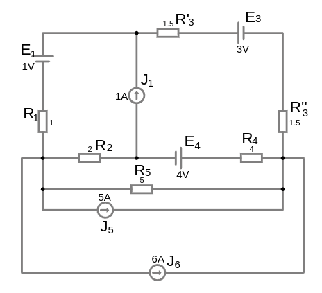
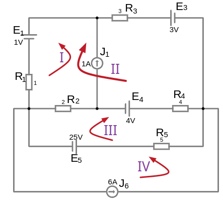

# Урок 30-31. Метод контурных токов. Часть 4-5. Схема с внешним и внутренним источником тока.

Если на схеме есть реальный источник тока, то его можно заменить на реальный источник ЭДС и продолжить расчеты, а если реальный источник ЭДС расположен на уникальной ветви контура (т.е. ветвь не общая между контурами) то контурный ток можно    приравнять значением этого источника тока.

Если в контуре есть ветвь с источником тока идеальным или реальным то значение контурного тока равно источнику тока и следовательно уравнение для этого тока составлять нет необходимости. Направление контурного тока следует выбрать таким же как и направление идеального источника тока, для учета влияния на другие контуры.

Если идеальный источник тока расположен на внутренней стороне т.е. его ветвь обшая с другим контуром, тогда этот идеальный ток оставляют для первого контура, а второй контур выбирают другой конфигурации так что бы он не содержал ветвь с этим идеальным источников тока (например, эта ветвь с идеальным источником тока может быть внутри нового контура)

### Пример расчета схемы с идеальным источником тока

<a href="/theories_of_electrical_circuits/falstad/circuitjs-31.txt" download="circuitjs-31.txt">Скачать схему для www.falstad.com/circuit</a>

Подготовим схему для расчета

- Заменим реальный источник тока $J_5$ на реальный источник ЭДС $E_5$ по формуле:
  - $E_5 = J \cdot R_{\text{вн}} = J_5\cdot R_5 = 5\cdot 5 = 25, V $
- Заменим последовательно соединение резисторов $R´_3$, $R^{´'}_3$ на эквивалентное $R_{3\ экв}$:
    - $R_{3\ экв} = R´_3 + R^{´´}_3 = 1.5+1.5=3, Om$

Получим упрощенную схему. Выберем [контуры](/glossary_of_terms/index.html#Контур) и их направления:

   

Контур $II$ выбираем так, что бы у него небыло в расчетах ветви с идеальным источником тока $J_1$, так как она будет в другом контуре $I$. Контур $II$ будет включать в себя полностью контур $I$ и еще одну уникальную ветвь, которой нет в других контурах, это условие допускается.

$N_{уравнений}=N_{ветвей} - N_{узлов} + 1 = 7 - 4 + 1 = 4$

Универсальные уравнения в общем виде:
- $R_{11}\cdot I_{11} \plusmn R_{12}\cdot I_{22} \plusmn R_{13}\cdot I_{33} \plusmn R_{14}\cdot I_{44} = E_{11}$ (это уравнение лишнее так как ток контура нам известен $I_{11}=J_1$)
- $\plusmn R_{21}\cdot I_{11} + R_{22}\cdot I_{22} \plusmn R_{23}\cdot I_{33} \plusmn R_{24}\cdot I_{44}= E_{22}$
- $\plusmn R_{31}\cdot I_{11} \plusmn R_{32}\cdot I_{22} + R_{33}\cdot I_{33} \plusmn R_{34}\cdot I_{44} = E_{33}$
- $\plusmn R_{41}\cdot I_{11} \plusmn R_{42}\cdot I_{22} \plusmn R_{43}\cdot I_{33} + R_{44}\cdot I_{44} = E_{44}$ (это уравнение лишнее так как ток контура нам известен $I_{44}=I_6$)

Обозначим собственные (полные) сопротивления контура:
- $R_{11} = R_{1} + R_{2}$
- $R_{22} = R_{4} + R_{2} + R_{1} + R_{3}$
- $R_{33} = R_{5} + R_2 + R_{4}$
- $R_{44} = R_{5}$

Обозначим общие сопротивления контуров:
- $R_{12} = R_{21} = R_{2} + R_{1}$
- $R_{13} = R_{31} = R_{2} $
- $R_{14} = R_{41} = 0 $
- $R_{23} = R_{32} = R_{4} + R_{2}$
- $R_{24} = R_{42} = 0$
- $R_{34} = R_{43} = R_{5}$

Обозначим контурные ЭДС, (алгебраическая сумма т.е. с учетом знака):
- $E_{11}=-E_{1}$
- $E_{22}=-E_{4}+E_{1}-E_{3}$
- $E_{33}=-E_{5}+E_{4}$
- $E_{44}=-E_{5}$

Подставим значения:
- (1-й контур): $\plusmn (R_{1} + R_{2})\cdot I_{11} \plusmn (R_{2} + R_{1})\cdot I_{22} \plusmn R_{2}\cdot I_{33} + 0 = -E_{1}$
- (2-й контур): $\plusmn (R_{2} + R_{1})\cdot I_{11} + (R_{4} + R_{2} + R_{1} + R_{3})\cdot I_{22} \plusmn (R_{4} + R_{2})\cdot I_{33} + 0 = -E_{4}+E_{1}-E_{3}$
- (3-й контур): $\plusmn R_{2}\cdot I_{11} \plusmn (R_{4} + R_{2})\cdot I_{22} + (R_{5} + R_2 + R_{4})\cdot I_{33} \plusmn R_{5}\cdot I_{44} = -E_{5}+E_{4}$
- (4-й контур): $\plusmn 0 + 0 + R_{5}\cdot I_{33} + R_{5}\cdot I_{44} = -E_{5}$

