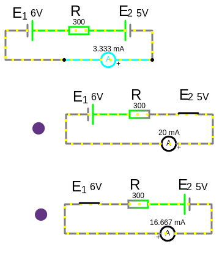

# Урок 34. Метод наложения. Часть 1. Расчет простой схемы электрической цепи.

```admonish info
Позволяет наглядно увидеть вклад каждого источника в общую работу цепи.
```
 
**Метод наложения** — это метод анализа **линейных** электрических цепей, который используется для определения токов и напряжений в цепи с несколькими источниками энергии (источниками тока или ЭДС). Основная идея метода заключается в том, что реакция цепи на несколько источников может быть найдена как сумма реакций на каждый источник в отдельности, при условии, что все остальные источники "выключены". Метод наложения демонстрирует, что в линейной цепи реакция на несколько источников — это просто сумма реакций на каждый источник в отдельности.

**[Принцип суперпозиции](/glossary_of_terms/index.html#Линейная-цепь)**

Принцип суперпозиции гласит, что в линейной цепи (цепи, где все элементы линейны, например, резисторы, конденсаторы, катушки индуктивности) реакция на несколько источников энергии (источников тока или ЭДС) может быть найдена как сумма реакций на каждый источник в отдельности, при условии, что все остальные источники "выключены".
В линейной цепи токи и напряжения являются линейными функциями от источников. Это означает, что если источник увеличивается в $k$ раз, то токи и напряжения также изменятся в $k$ раз.

**Простой пример**:

 


$I_{общ} = \frac{E_1 - E_2}{R} = \frac{6 - 5}{300} = \frac{1}{300} = 0.0033,\ A\ (3.3\ mA)$

Расчет для $E_1$, а $E_2$ выключаем т.е. делаем перемычкой, тогда:
- $I_{1} = \frac{E_1}{R} = \frac{6}{300} = 0.02, A$

Расчет для $E_2$, а $E_1$ выключаем т.е. делаем перемычкой, тогда:
- $I_{2} = \frac{E_2}{R} = \frac{5}{300} = 0.016, A$

Подводим итог алгебраической суммы токов цепи, ток $I_{2}$ от источника напряжения $E_{2}$ направлен против течения тока цепи (вызванного протеканием тока от большего потенциала $E_1$ к меньшему $E_2$ ), поэтому вычитаем его:

$I_{общ} = I_{1} - I_{2} = 0.02 - 0.016 = 0.0033,\ A\ (3.3\ mA)$

---

### Основные принципы метода наложения:
1. **Линейность цепи**:
   Метод наложения применим только к линейным цепям, где выполняется принцип суперпозиции. Это означает, что токи и напряжения в цепи являются линейными функциями от источников.

2. **Пошаговый расчет**:
   - Рассматривается каждый источник в цепи по отдельности или несколько источников, главное учесть влияние всех источников, после исключения источников можно считать схему методом контурных токов или потенциалов, главное в конце свести влияние всех источников вместе.
   - Все остальные источники ЭДС заменяются на короткое замыкание (провод), а источники тока — на разрыв цепи (обрыв).
   - Для каждого случая рассчитываются токи и напряжения в цепи.

3. **Суммирование результатов**:
   После расчета токов и напряжений для каждого источника в отдельности, результаты алгебраически суммируются для получения итоговых значений.

---

### Алгоритм применения метода наложения:
1. Выберите один источник (ЭДС или тока) и "включите" его.
2. "Выключите" все остальные источники:
   - Источники ЭДС заменяются на короткое замыкание (провод).
   - Источники тока заменяются на разрыв цепи (обрыв).
3. Рассчитайте токи и напряжения в цепи для этого источника.
4. Повторите шаги 1–3 для каждого источника в цепи.
5. Сложите все полученные токи и напряжения для нахождения итоговых значений.

---

 

### Преимущества метода наложения:
- Позволяет упростить анализ сложных цепей с несколькими источниками.
- Наглядно демонстрирует вклад каждого источника в общую работу цепи.

### Ограничения:
- Применим только к линейным цепям.
- Неэффективен для цепей с большим количеством источников, так как требует многократных расчетов.

