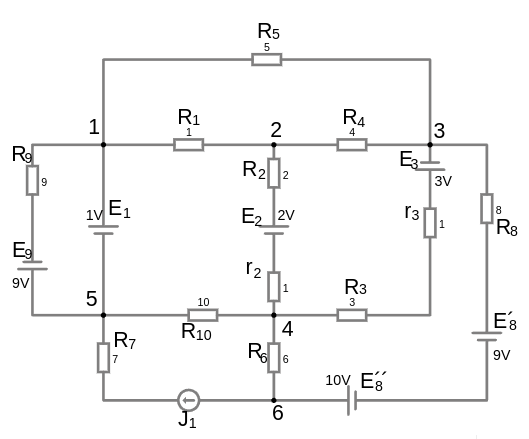
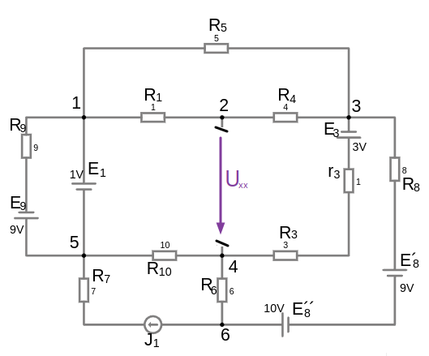
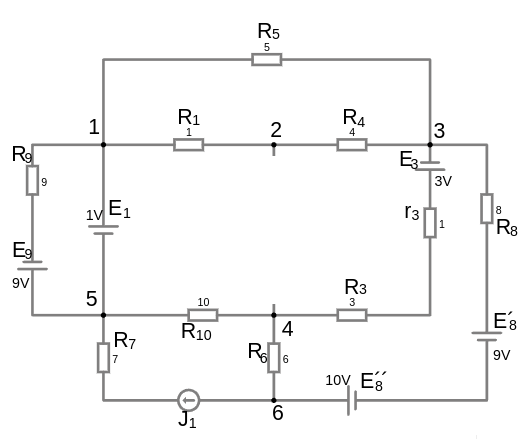
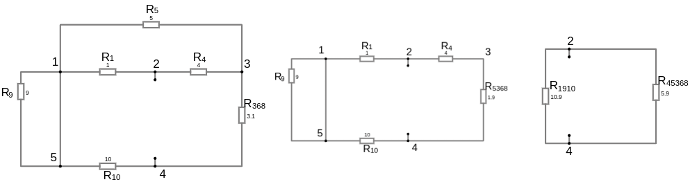
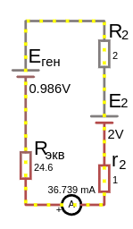

# Урок 37. Метод эквивалентного генератора. Часть 1. Теорема про активный двухполюсник.

**Метод эквивалентного генератора (Метод Тевенина и Нортона) или метод холостого хода или короткого замыкания** — это способ упрощения сложных электрических цепей, позволяющий заменить их эквивалентной схемой, состоящей из одного источника и одного сопротивления. Этот метод полезен для анализа токов и напряжений на определённом участке цепи.


```admonish info
Это особенно полезный метод, если вы хотите исследовать, как изменение нагрузки влияет на ток и напряжение в выбранном участке. Сперва придется просчитать всю схему, кроме исследуемого участка, но после того как найдены $U_{xx}\ и\ R_{экв}$, дальнейший анализ участка цепи упрощается, ведь вместо большой схемы с множеством элементов, остается эквивалентная схема с источником ЭДС и сопротивлением, которую можно изменять и анализовать влияние на выбранный участок цепи.

Полезен когда нам необходимо сконцентрироваться на работе с одним участком схемы, но нам мешает остальная часть схемы. Применяя метод эквивалентного генератора мы упрощаем работу с выбранным участком схемы, сводя всю оставшуюся часть к источнику ЭДС и сопротивлению.

Если в цепи есть зависимые источники, то для расчета $R_{экв}$ используется метод "подачи тестового напряжения" или "тестового тока".
```

Измерить сопротивление участка цепи с помощью прибора Омметр при наличии влияния источника ЭДС или тока неудастся. Омметр измеряет сопротивление, подавая собственное небольшое напряжение и измеряя ток, который протекает через цепь. Он предполагает, что в цепи нет посторонних источников, которые могли бы исказить измерение. источник ЭДС искажает показания омметра, создавая неправильное значение тока. Если напряжение источника ЭДС велико, ток может превысить допустимые значения для омметра, что может повредить чувствительные компоненты прибора или Омметр может случайно создать замкнутую цепь для источника питания, вызвав короткое замыкание.

Если нам нужно измерить сопротивление участка цепи с источником ЭДС но вся оставшеяся схема пассивна, то мы просто измеряем омметром в разрыв нашей ветви.
Если в осташееся схема активная то:
   1. измеряют вольтметром $U_{хх}$ напряжение холостого хода в разрыв нашей ветви
   2. измеряют амперметром $I_{кз}$ ток к.з. тоже в разрыв нашей ветви
   3. считают сопротиивление $R=\frac{U_{хх}}{I_{кз}}$

**Как правильно измерять сопротивление?**
- Обязательно обесточьте цепь.
- Отключите источники ЭДС.
- По возможности, разомкните один конец цепи, чтобы избежать влияния параллельных путей.

```admonish info
Преимущества метода эквивалентного генератора

**Анализ без отключения источников ЭДС**

В отличие от омметра, вам не нужно физически отключать источники питания для определения эквивалентного сопротивления цепи. Вместо этого вы просто математически заменяете сложную часть схемы на эквивалентное сопротивление и ЭДС.

**Идеален для анализа цепей с изменяющейся нагрузкой**

Если нужно анализировать, как изменится работа схемы при разных нагрузках, метод эквивалентного генератора позволяет легко делать это без повторных измерений — достаточно один раз найти эквивалентную схему.
```

Основа метода, это **теорема активного двухполюсника** - Она позволяет упростить сложные [линейные цепи](/glossary_of_terms/index.html#Линейная-цепь), содержащие источники напряжения и тока, до эквивалентного двухполюсника, состоящего из одного источника напряжения ​(напряжение холостого хода на выводах двухполюсника) и одного последовательно соединенного сопротивления (эквивалентное сопротивление двухполюсника при "выключенных" источниках). Это значительно упрощает анализ цепей.

Активный двухполюсник - в оставшейся области (которую мы не рассматриваем, "черный ящик") присутствует активный элемент источника тока или напряжения.

Пассивный двухполюсник - в оставшейся области есть только потребители, т.е. пассивные элементы. Схема может стать пассивной на этапе расчета методом Наложения.

Альтернатива. Теорема Нортона — это "двойственная" теорема, которая заменяет двухполюсник на эквивалентный источник тока и параллельное сопротивление.

### 🔌 **Метод Тевенина (эквивалентный генератор ЭДС):**  
Схема заменяется источником ЭДС $U_{хх} $ и последовательным сопротивлением $R_{экв}$


 

**Формула:**  

$I_{нагрузки\ (к.з.)} = \frac{U_{хх}}{R_{экв} + R_{нагрузки}}$
 
 
$R_{экв} = \frac{U_{хх}}{ I_{нагрузки\ (к.з.)} }$

$U_{х.х.} = E + I_{нагрузки\ (к.з.)} \cdot (\sum R)$


 
где:
- **$R_{нагрузки}$** - это сопротивление исселедуемого участка, который мы разомкнули
- **$I_{нагрузки\ (к.з.)}$** - это ток в исследуемом участке при отсутствии сопротивления в нем
- **$U_{хх} $** — это **напряжение холостого хода** (ЭДС генератора) на зажимах (без нагрузки).  
- **$ R_{экв} $** — это **эквивалентное сопротивление** (сопротивление пассивного двухполюсника) цепи, когда все источники ЭДС замкнуты накоротко (к.з.), а источники тока разомкнуты.

Если в ветви есть реальный источник ЭДС с внутренним сопротивлением $r$: 

$I_{нагрузки\ (к.з.)} = \frac{E + I_{\text{цепи}} \cdot r}{R_{экв} + r}$

где:
- $R_{экв}$ — эквивалентное сопротивление остальной части схемы, "черного ящика".
---

### ⚡ **Метод Нортона (эквивалентный генератор тока):**  
Схема заменяется источником тока $ I_{n} $ и параллельным сопротивлением $R_{n} $.

- **$ I_{n} $** — это **ток короткого замыкания** на зажимах.  
- **$ R_{n} $** — то же, что и $ R_{экв} $, т.е. эквивалентное сопротивление цепи.

**Формула:**  
 
$I_{\text{нагрузки\ (к.з.)}} = I_n \cdot \frac{R_{n}}{R_{n} + R_{\text{нагрузки}}}$
 

---

### 🚀 **Преобразование между Тевенином и Нортоном:**

 
$I_n = \frac{U_{хх}}{R_{экв}}, \quad R_n = R_{экв}$
 
---

### Шаги применения теоремы:
1. **Найдите напряжение холостого хода $U_{\text{хх}} $**:
   - Разомкните цепь на выводах двухполюсника. (т.е. ветвь с искомым током разрывают, удаляя сопротивление и оставляя ЭДС)
   - Задать направление токов в оставшейся части схемы после размыкания
   - Записать выражения для нахождения $U_{хх}$ между разомкнутыми зажимами по второму закону Кирхгофа для напряжений
   - Рациональным методом расчитывают токи, которые входят в выражение $U_{\text{хх}}$

2. **Найдите эквивалентное сопротивление $ R_{\text{экв}} $**:
   - "Выключите" все источники в цепи:
     - Источники напряжения заменяются на **короткое замыкание** (провод).
     - Источники тока заменяются на **разрыв цепи** (обрыв).
   - Рассчитайте сопротивление между выводами двухполюсника. Это и будет $ R_{\text{экв}}$.

3. **Постройте эквивалентную схему**:
   - Замените исходный двухполюсник на эквивалентную схему, состоящую из $U_{\text{хх}} $ и $ R_{\text{экв}} $, соединенных последовательно.


---

### Пример:

 

<a href="/theories_of_electrical_circuits/falstad/circuitjs-38.txt" download="circuitjs-38.txt">Скачать схему для www.falstad.com/circuit</a>

Наша цель - найти такое значение напряжения и сопротивления, чтобы это стало эквивалентной заменой, той части схемы, которая нам не интересна (эквивалентный генератор), что бы уделить внимание работе с выбранным участком $2 \to 4$

Выберем участок цепи $2 \to 4$ в котором мы хотим знать ток, напряжение либо мощность.
 
Что бы работать с выбранным участком, нам необходимо определить влияние на него остальной части схемы, а именно какое напряжение подается на наши клемы $2 \to 4$ и какое сопротивление имеет остальная часть схемы, что бы мы могли узнать протекаюший ток в $2 \to 4$ (согласно законам Ома)

Напряжение между точками $2 \to 4$ т.е. разность потенциалов $ \varphi_2  \to \varphi_4$ это и есть $U_{xx}$ (конечно если мы уберем нагрузку в выбранном участке)

По сути, нам необходимо посчитать схему без нашего выбранного участка. 
Ведь мы должны знать значение потенциалов $\varphi_2$ и $\varphi_4$

**ниже тут путаница, мы находим $U_{xx}$ либо по Кирхгофу либо контурными токами, а тут все вместе, что создает путаницу**


Основываясь на втором законе Кирхгофа для напряжений, выберем любой удобный контур в который входит $U_{xx}$ т.е. участок цепи $2 \to 4$:

по левому контуру:

$\pm I_{R_{1}}\cdot R_{1} \pm I_{R_{10}}\cdot R_{10} \pm U_{xx} = \pm E_{1}$

$U_{xx} = \pm E_{1} \pm I_{R_{1}}\cdot R_{1} \pm I_{R_{10}}\cdot R_{10}$

или по правому контуру:

$\pm I_{R_{4}}\cdot R_{4} \pm I_{r_{3}}\cdot r_{3} \pm I_{R_{3}}\cdot R_{3} \pm U_{xx} = \pm E_{3}$

$U_{xx} = \pm E_{3} \pm I_{R_{4}}\cdot R_{4} \pm I_{r_{3}}\cdot r_{3} \pm I_{R_{3}}\cdot R_{3}$


#### 1. Найдем напряжение $U_{хх}$

Уберем нагрузку (если она есть), чтобы цепь между выбранными зажимами ($2 \to 4$) была разомкнута, и найдем напряжение $U_{хх}$ на зажимах точек ($2 \to 4$). 
 
 

   
- Если цепь простая: используешь контурных токов, узловых потенциалов, метод наложения, вторым законом Кирхгофа для напряжений, делитель напряжения и т.д.
- Если цепь сложная: применяешь упрощение цепей с помощью законов Ома и суперпозиции.
Здесь важно учесть, что через разомкнутую ветвь ток равен нулю, что упрощает расчёты. В эквивалентной схеме на холостом ходу обычно нет тока нагрузки, поэтому не нужно учитывать сопротивление нагрузки.


 
Определить $U_{хх}$ напряжение холостого хода
 
<details>

<summary>методом контурных токов</summary>

Если вы ищете напряжение холостого хода между двумя зажимами, то эта ветвь разомкнута (ток через неё не течёт).

В методе контурных токов такая ветвь не создаёт отдельного контура, так как она разомкнута.

Задаем направление обхода контура и токи контура в одном направлении

 

$N_{уравнений}=N_{ветвей} - N_{узлов} + 1 = 9 - 5 + 1 = 5$

Универсальные уравнения в общем виде:
- $R_{11}\cdot I_{11} \plusmn R_{12}\cdot I_{22} \plusmn R_{13}\cdot I_{33} \plusmn R_{14}\cdot I_{44} \plusmn R_{15}\cdot I_{55} = E_{11}$
- $\plusmn R_{21}\cdot I_{11} + R_{22}\cdot I_{22} \plusmn R_{23}\cdot I_{33} \plusmn R_{24}\cdot I_{44} \plusmn R_{25}\cdot I_{55} = E_{22}$
- $\plusmn R_{31}\cdot I_{11} \plusmn R_{32}\cdot I_{22} + R_{33}\cdot I_{33} \plusmn R_{34}\cdot I_{44} \plusmn R_{35}\cdot I_{55} = E_{33}$
- $\plusmn R_{41}\cdot I_{11} \plusmn R_{42}\cdot I_{22} \plusmn R_{43}\cdot I_{33} + R_{44}\cdot I_{44} \plusmn R_{45}\cdot I_{55} = E_{44}$
- $\plusmn R_{51}\cdot I_{11} \plusmn R_{52}\cdot I_{22} \plusmn R_{53}\cdot I_{33} \plusmn R_{54}\cdot I_{44} + R_{55}\cdot I_{55} = E_{55}$

Обозначим собственные (полные) сопротивления контуров:
- $R_{11} = R_{1} + R_{4} + R_{5}$
- $R_{22} = R_{9} $
- $R_{33} = R_{1} + R_4 + r_{3} + R_{3} + R_{10}$
- $R_{44} = R_{10} + R_6 + R_{7}$
- $R_{55} = r_{3} + R_{3} + R_6 + R_{8}$

Обозначим общие сопротивления контуров:
- $R_{12} = R_{21} = 0 $
- $R_{13} = R_{31} = R_{1} + R_{4} $
- $R_{14} = R_{41} = 0 $
- $R_{15} = R_{51} = 0 $
- $R_{23} = R_{32} = 0 $
- $R_{24} = R_{42} = 0 $
- $R_{25} = R_{52} = 0 $
- $R_{34} = R_{43} = R_{10} $
- $R_{35} = R_{53} = r_{3} + R_{3} $
- $R_{45} = R_{54} = R_{6} $

Обозначим контурные ЭДС, (алгебраическая сумма т.е. с учетом знака):
- $E_{11} = 0 $
- $E_{22} = E_{9}-E_{1}$
- $E_{33} = E_{1}+E_{3}$
- $E_{44} = J_{1}$
- $E_{55} = E^{´´}_{8} - E^{´}_{8} - E_{3}$

Перепишем универсальные уравнения:
- (1-й контур): $(R_{1} + R_{4} + R_{5})\cdot I_{11} - (R_{1} + R_{4})\cdot I_{33} = 0$

- (2-й контур): $ R_{9}\cdot I_{22} = -E_{9}-E_{1}$
- (3-й контур): $- (R_{1} + R_{4})\cdot I_{11} + (R_{1} + R_4 + r_{3} + R_{3} + R_{10})\cdot I_{33} - R_{10}\cdot I_{44} - (r_{3} + R_{3})\cdot I_{55} = E_{1}+E_{3}$
- (4-й контур): $I_{44}=J_{1}$
- (5-й контур): $-(r_{3} + R_{3})\cdot I_{33} - R_{6}\cdot I_{44} + (r_{3} + R_{3} + R_{5} + R_6 + R_{8})\cdot I_{55} = E^{´´}_{8} - E^{´}_{8} - E_{3}$ 

Подставим значения:
- (1-й контур): $ 10\cdot I_{11} - 5\cdot I_{33} = 0 $
- (2-й контур): $ 9\cdot I_{22} = -10 \to I_{22} = \frac{-10}{9} = -1.111\ А$ (значит истинное направление тока противоположно)
- (3-й контур): $-5\cdot I_{11} + 19\cdot I_{33} - 10\cdot 1 - 4\cdot I_{55} = 4 $
- (4-й контур): $I_{44}=J_{1}=1 $
- (5-й контур): $-4\cdot I_{33} - 6\cdot 1 + 18\cdot I_{55} = -2 $

Найденные контурные токи:
- $I_{11} \approx 0.4768\ А$
- $I_{22} \approx -1.111\ А$
- $I_{33} \approx 0.9537\ А$
- $I_{44} = 1\ А$
- $I_{55} \approx 0.434\ А$

**Расчет реальных токов**:

(в несмежных ветвях ток равен контурному)
- $I_{9} = I_{22} \approx -1.111\ А$  
- $I_{5} = I_{11} \approx 0.4768\ А$  
- $I_{8} = I_{55} \approx 0.434\ А$  

(в смежных ветвях ток равен алгебраической сумме токов смежной ветви двух контуров)
- $I_{1} = I_{22} - I_{33} = -1,111 - 0.9537 = -2.0647\ А$ (значит истинное направление тока противоположно)
- $I_{3} = I_{33} - I_{55} = 0.9537 - 0.434 = 0.5197 \ А$  
- $I^´_{3} = I_{44} - I_{33} = 1 - 0.9537 = 0.0463\ А$  
- $I_{4} = I_{33} - I_{11} = 0.9537 - 0.4768 = 0.4769\ А$  
- $I_{6} = I_{44} - I_{55} = 1 - 0.434 = 0.566\ А$  

**Напряжения**

$U_{I_{5}} = I_{5}\cdot R_{5} = 0.4768\cdot 5 = 2.384,\ V$

$U_{I_{4}} = I_{4}\cdot R_{1} + I_{4}\cdot R_{4} = 0.4769\cdot 1 + 0.4769\cdot 4 = 2.384,\ V$
   - $U_{I_{5}} = U_{I_{4}}$ - что и логично, ведь ветки параллельно соединены
 
$U_{I´_{3}} = I´_{3}\cdot R_{10} = 0.0463\cdot 10 = 0.463,\ V$ 

$U_{I_{3}} = E_{3} - I_{3}\cdot R_{3} + I_{3}\cdot r_{3} = 3 - 0.5197\cdot 3 + 0.5197\cdot 1 = 1.9606 ,\ V$

$U_{I_{6}} = I_{6}\cdot R_{6} = 0.566\cdot 6 = 3.396,\ V$ 


Зная токи ветвей, и полагаясь на их направление, проставим знаки в уравнении Кирхгофа:

$U_{xx} = E_{1} - I_{R_{1}}\cdot R_{1} + I_{R_{10}}\cdot R_{10} = 1 - 0.4769\cdot 1 + 0.0463\cdot 10 = 0.986,\ V$

где:
- $E_{1}$ - с плюсом, так как ток $I_{1}$ совпадает с контуром 3
- $I_{R_{1}} = I_{4}$ - с минусом, так как ток $I_{4}$ не совпадает с контуром 3
- $I_{R_{10}} = I^´_{3}$ - с плюсом, так как ток $I^´_{3}$ совпадает с контуром 3

Или по второму уравнению:

$U_{xx} = - E_{3} - I_{R_{4}}\cdot R_{4} - I_{r_{3}}\cdot r_{3} - I_{R_{3}}\cdot R_{3} = - 3 - 0.4769\cdot 4 - 0.5197\cdot 1 - 0.5197\cdot 3 = 0.986,\ V$

где:
- $E_{3}$ - с минусом, так как ток $I_{3}$ не совпадает с контуром 5
- $I_{R_{3}}\ и\  I_{r_{3}} = I_{3}$ - с минусом, так как ток $I_{3}$ не совпадает с контуром 5

 


---

</details>


<details>

<summary>методом узловых потенциалов</summary>

Это разность потенциалов между точками 2 и 4 при отсутствии тока в разомкнутой ветви: <br>
$U_{хх} = V_2 - V_4$

---

</details>


<details>

<summary>методом наложения</summary>

---

</details>

<details>

<summary>вторым законом Кирхгофа для напряжений</summary>

$\sum E = \sum U$

Используя второй закон Кирхгофа запишем уравнение для $U_{хх}$ между точками (2, 4). 
Выберем любой удобный контур, включающий нашу исследуемую ветвь.
Направление обхода контура выберем таким же как направление $U_{хх}$:

$U_{хх} + I_{10}\cdot R_{10} + I_9\cdot R_{1}  = -E_2 - E_1$

$U_{хх} = -(E_1 + E_2 + I_{10}\cdot R_{10} + I_9\cdot R_{1})$

Выберим произвольно контур с нашей искомой ветвью и задаем совпадаюшее направление обхода с направлением искомого $U_{хх}$, запишем уравнение:

$U_{хх} = I_2\cdot (R_2 + r_2)$

$E_{2} - E_{1} = U_{хх} + I_9\cdot R_1$

где:
- $I_9\cdot R_1$ как и $U_{хх}$ - напряжение на этой ветви мы прибавляем так как выбранное нами направление тока этой ветви совпадает с направлением обхода контура, направление которого мы выбрали на основе направления $E_2$
- $E_{1}$ - вычитаем источник ЭДС так как его направление не совпадает с направлением контура

$U_{хх} = E_{2} - E_{1} - I_9\cdot R_1$

Так как в точке 2 у нас нет больше узла из-за разрыва в ветви то ток $I_9=I_4$

Найдем рациональным способом ток $I_9$, с помощью метода контурных токов:

(для этого нам надо найти $R_{экв}$)


---

</details>

#### 2. Найдем $R_{экв}$

<details>

<summary>Найдем $R_{экв}$</summary>


Найти $R_{экв}$ эквивалентное сопротивление оставшейся части схемы, **методом сворачивания схемы или с помощью тока к.з.** (заменить исследуемый участок цепи перемычкой, найти в ней $I_{кз}$ ток к.з. любым из методов (контурных токов, узловых потенциалов, метод наложения, уравнениями Кирхгофа) и далее с помошью известного $U_{хх}$ найти $R_{экв}=\frac{U_{хх}}{I_{кз}}$). Удаляем из схемы все источники ЭДС, оставляя их внутреннее сопротивление, а идеальные источники тока заменяем на разомкнутую цепь
 
**Находим $R_{экв}$ эквивалентное сопротивление оставшейся части схемы**:

 

Объединим: 
- $R_{1}$ с $R_{4}$ в $R_{14}=5,\ Om$,   
- $R_{14}$ с $R_{5}$ в $R_{514}=\frac{1}{\frac{1}{R_{5}}+\frac{1}{R_{14}} }=2.5,\ Om$

Объединим: 
- $R_{3}$ с $r_{3}$ в $R^´_{3}=4,\ Om$

Источник тока $J_{1}$ заменяем на разрыв и резистор $R_{7}$ больше не влияет на схему

 

Объединим: 
- $R_{6}$ с $R_{8}$ в $R_{68}=14,\ Om$

Объединим: 
- $R_{68}$ с $R^´_{3}$ в $R_{368}=\frac{1}{\frac{1}{R_{68}}+\frac{1}{R^´_{3}} }=3.111,\ Om$

Объединим: 
- $R_{9}$, $R_{514}$, $R_{368}$, $R_{10}$ в $R_{экв}=9+2.5+3.1+10 =24.6,\ Om$

Должно быть $R_{экв}=3.8365$
</details>


#### 3. Присоединить ветвь обратно и найти ток ветви по закону Ома

$I_{нагрузки\ (к.з.)} = \frac{U_{хх}}{R_{экв} + R_{нагрузки}}$

$I_{нагрузки\ (к.з.)} = \frac{-E_{2} + U_{хх}}{R_{экв} + R_{2} + r_{2} } = \frac{-2 + 0.986}{24.6 + 2 + 1 } = -0.0367,\ A $

Подсоединим исследуемую ветку к эквивалентному генератору:

 


---

Этот метод особенно удобен для анализа цепей с изменяющейся нагрузкой. Нужно только один раз найти $U_{хх}$ и $R_{экв}$, чтобы потом быстро рассчитывать токи и напряжения для различных нагрузок.

Метод эквивалентного генератора (Тевенина/Нортона) наиболее эффективен в определённых сценариях, где он значительно упрощает расчёты. Вот когда стоит использовать именно этот метод:

### ✅ **Когда использовать метод эквивалентного генератора:**

1. **Анализ цепи с изменяющейся нагрузкой**  
   Если нужно рассчитать ток или напряжение на *различных нагрузках*, метод Тевенина позволяет упростить цепь до одной ЭДС и одного сопротивления.  
   - **Пример:** Анализ работы усилителя с разными выходными сопротивлениями нагрузки.

2. **Определение максимальной мощности (Теорема максимальной мощности)**  
   Для задачи нахождения условий максимальной передачи мощности к нагрузке ($ R_{\text{нагрузки}} = R_{экв} $) метод Тевенина незаменим.  
   - **Пример:** Настройка антенн, усилителей или согласование нагрузок.

3. **Сложная цепь, но интересует только один участок**  
   Когда есть сложная схема, но нужно найти ток или напряжение на одном элементе, проще заменить остальную часть цепи на эквивалентный генератор.  
   - **Пример:** Анализ цепей питания микроконтроллеров или датчиков.

4. **Смешанные цепи с источниками тока и ЭДС**  
   Метод Нортона удобен для работы с источниками тока, особенно если они параллельны. Можно легко перейти между эквивалентами Тевенина и Нортона.

---

### 🚫 **Когда метод не подходит:**

1. **Нужно анализировать всю цепь целиком**  
   Если требуется найти токи и напряжения во многих ветвях цепи, метод узловых потенциалов или контурных токов будет эффективнее.

2. **Наличие зависимых источников**  
   Хотя метод Тевенина можно использовать с зависимыми источниками, расчёт эквивалентного сопротивления может быть сложным. В таких случаях узловой метод проще.

3. **Временные процессы (RC, RL, RLC цепи)**  
   Для анализа переходных процессов лучше использовать дифференциальные уравнения или метод Лапласа.

---

### 🎯 **Вывод:**  
- **Если задача — анализ одного элемента при изменении условий нагрузки → Тевенин/Нортон.**  
- **Если нужно рассчитать токи/напряжения во многих точках → метод узловых потенциалов или контурных токов.**
