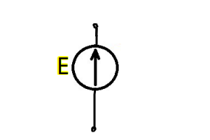
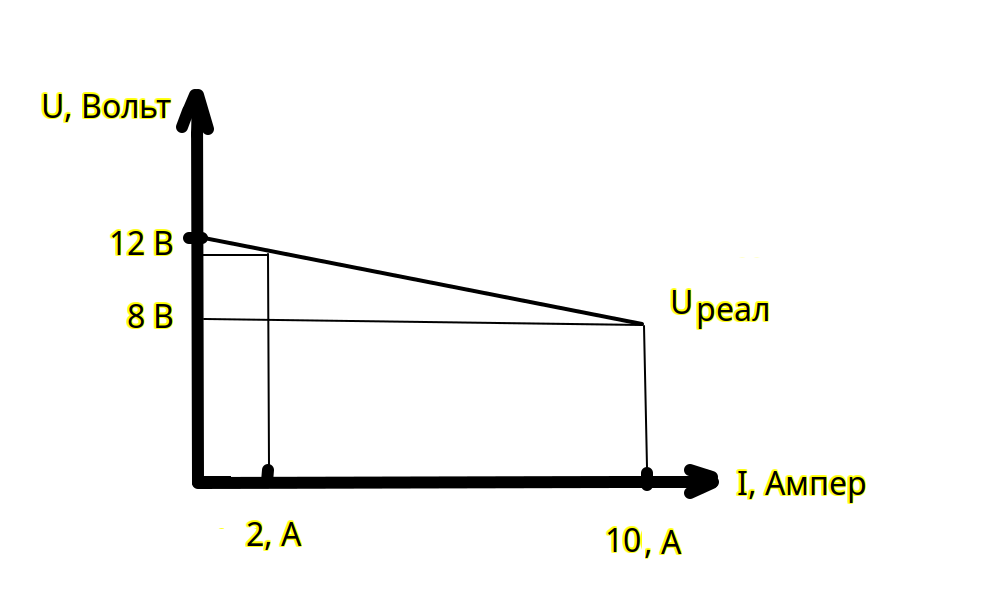

# Урок 4. Источник напряжения идеальный и реальный.

### **Источники питания**  
Источники питания — это активные компоненты, это устройства или системы, которые обеспечивают электрической энергией различные потребители (электрические цепи, устройства, машины и т.д.). Они преобразуют и регулируют энергию из различных источников, таких как батареи, генераторы, или электрическая сеть. Если внутреннее сопротивление источника питания намного меньше сопротивления нагрузки то данный источник питания можно представить как **источник напряжения** ($R\ внутр \ll R\ нагрузки$)

---

### **Классификация источников питания**:

#### Два типа источника питания
- **Источник напряжения** (ЭДС)
- **Источник тока**

 
#### 1. **По типу преобразуемой энергии**:
- **Химические источники**:  
  Используют химическую энергию, преобразуя её в электрическую.  
  Примеры: батарейки, аккумуляторы.
- **Электромеханические источники**:  
  Преобразуют механическую энергию в электрическую.  
  Примеры: генераторы.
- **Тепловые источники**:  
  Преобразуют тепловую энергию в электрическую.  
  Примеры: термоэлектрические генераторы.
- **Фотовольтаические источники**:  
  Преобразуют солнечную энергию в электрическую.  
  Примеры: солнечные панели.

---

#### 2. **По форме выходного сигнала**:
- **Источники постоянного тока (DC)**:  
  Обеспечивают стабильное напряжение или ток.  
  Примеры: батареи, выпрямители, DC-адаптеры.
- **Источники переменного тока (AC)**:  
  Выдают переменный ток, часто синусоидальной формы.  
  Примеры: электрическая сеть, генераторы переменного тока.

---

#### 3. **По функциональным особенностям**:
- **Регулируемые источники питания**:  
  Позволяют изменять выходное напряжение или ток в заданных пределах.  
  Применяются в лабораториях, измерительных системах.
- **Нерегулируемые источники**:  
  Выдают фиксированное напряжение или ток.  
  Примеры: обычные зарядные устройства.
- **Импульсные источники питания**:  
  Преобразуют напряжение с высокой эффективностью за счёт работы на высокой частоте.  
  Примеры: блоки питания для компьютеров, зарядные устройства.

---

#### 4. **По количеству выходных каналов**:
- **Одноканальные**:  
  Имеют один выход с заданными характеристиками.
- **Многоканальные**:  
  Позволяют подключать несколько устройств с разными требованиями к питанию.

---

### **Основные параметры источников питания**
1. **Номинальное напряжение ($ U $)**:  
   Напряжение, которое источник питания обеспечивает на выходе.
2. **Выходной ток ($ I $)**:  
   Максимальный ток, который может обеспечить источник.
3. **Мощность ($ P $)**:  
   Общая электрическая мощность, отдаваемая потребителям.  
   
   $P = U \cdot I$
    
4. **Коэффициент полезного действия (КПД)**:  
   Отношение отдаваемой мощности к потребляемой.
5. **Стабильность выходного напряжения**:  
   Способность поддерживать напряжение при изменении нагрузки.

---

### **Типовые источники питания**
#### 1. **Батареи и аккумуляторы**:  
   - Переносные и автономные.  
   - Применяются в мобильных устройствах, транспортных средствах.  
   - Пример: литий-ионные аккумуляторы.

#### 2. **Сетевые блоки питания**:  
   - Работают от электрической сети переменного тока.  
   - Включают трансформатор, выпрямитель и регуляторы.

#### 3. **Генераторы**:  
   - Производят электрическую энергию из механической.  
   - Используются в автономных системах и для аварийного питания.

#### 4. **Солнечные панели**:  
   - Вырабатывают энергию из солнечного света.  
   - Эффективны в удалённых местах или в качестве экологичного источника.

#### 5. **Импульсные источники питания**:  
   - Высокая эффективность и компактность.  
   - Используются в современных электронных устройствах.

---

### **Применение источников питания**
1. **Электроника**: питание микросхем, компьютеров, телефонов.
2. **Электротехника**: запуск двигателей, подача энергии в сети.
3. **Освещение**: светодиоды, лампы накаливания.
4. **Энергетика**: генерация и распределение энергии.

Источники питания — это основа работы электрических устройств, от бытовой техники до сложных промышленных систем.

## Источник напряжения (ЭДС, $\mathcal{E}$)

Основная задача источника напряжения — поддерживать постоянное или заданное напряжение, независимо от подключённой нагрузки в пределах своих возможностей.

Основные параметры источника напряжения являеться электродвижущая сила и внутреннее сопротивление $R_в$
Основным свойством источника напряжения являеться создавать и поддерживать разность потенциалов на участке цепи. 
Внутреннее сопротивление источника питания $R_в$ позволяет учитывать потери энергии и снижение напряжения в нем.
Ток внутри источника питания питания протекает от более низкого потенциала к более высокому потенциалу.

Схема замещения идеального источника напряжения (ЭДС):

Схема замещения рального источника напряжения (ЭДС):

### **ЭДС (Электродвижущая сила)**

Электродвижущая сила ($ \mathcal{E} $) — это физическая величина, характеризующая работу, которую источник выполняет по перемещению заряда в цепи. Она измеряется в **вольтах (В)**. ЭДС часто упрощённо называют "напряжением источника", хотя это не совсем одно и то же.

 
$\mathcal{E} = \frac{A}{q}$
 
где:  
- $A$ — работа по перемещению заряда $ q $,  
- $q$ — заряд.

### **Виды источников напряжения**

#### 1. **Идеальный источник напряжения**  
- **Описание**:  
  Теоретический источник, который всегда поддерживает фиксированное напряжение на своих клеммах, независимо от силы тока и нагрузки.  
- **Особенности**:  
  - Не имеет внутреннего сопротивления ($ R_{внутр} = 0 $).  
  - Напряжение на выходе всегда равно ЭДС ($ U = \mathcal{E} $).
  
- ВАХ (внешняя/выходная характеристика) источника напряжения:

   

**Увеличение нагрузки т.е. тока это равносильно снижению сопротивления. И наоборот при повышении сопротивления у нас повышается нагрузка т.е. повышается ток**

Даже при **коротком замыкании** (кз), когда сопротивление стремиться к 0 $R \to 0$ то идеальный источник питания должен поддерживать стабильно напряжение ну и ток будет стремиться к бесконечности $(I \to \infty)$ ну и следовательно мощность идеального источника питания тоже сремится к бесконечности $(P \to \infty)$

#### 2. **Реальный источник напряжения**  

ВАХ (внешняя/выходная характеристика) источника напряжения:

   

В качественном источнике напряжения, падение напряжение не сильно снижает ток т.е. почти прямая линия как у идеального источника напряжения.
- **Описание**:  
  Учитывает наличие внутреннего сопротивления $R_{внутр}$, которое ограничивает максимальный ток.  
- **Особенности**:  
  - Напряжение на выходе уменьшается при увеличении тока нагрузки из-за падения напряжения на $ R_{внутр}$.  
    - $U = \mathcal{E} - I \cdot R_{внутр}$
  - В условиях отсутвия нагрузки, напряжение холостого хода равно напряжению источника ЭДС  
  - Внутреннее сопротивление намного меньше сопротивление нагрузки 
    - $R_{внутр} \ll R_{нагрузки}$
  - В условиях присутвия нагрузки, наряжение на выводах источника напряжения будет меньше чем на источнике ЭДС, 
  потому что часть напряжения забирает внутреннее сопротивление источника ЭДС
  
    $I=\frac{E}{R_{внутр} + R_{нагрузки}}$

    $E=R_{внутр} \cdot I + R_{нагрузки} \cdot I$

    С ростом тока нагрузки будет снижаться напряжение ЭДС и наоборот, с радением тока нагрузки, растет напряжение на ЭДС:

    $U_{на\ выводах\ эдс} = E - R\ внутр \cdot I$

### **Основные параметры источников напряжения**

1. **ЭДС ($ \mathcal{E} $)**:  
   Максимальное напряжение, которое источник может создать в идеальных условиях.
   
2. **Внутреннее сопротивление ($ R_{внутр} $)**:  
   Сопротивление внутри источника, влияющее на выходное напряжение при протекании тока.

3. **Номинальное напряжение ($ U $)**:  
   Напряжение, которое источник должен обеспечивать при нормальной нагрузке.

4. **Номинальная мощность ($ P $)**:  
   Максимальная мощность, которую источник способен выдавать.  
  
   $P = U \cdot I$
  

5. **Короткозамыкательный ток ($ I_{кз} $)**:  
   Ток, который протекает при коротком замыкании клемм источника.  
   
   $I_{кз} = \frac{\mathcal{E}}{R_{внутр}}$
    

---

### **Примеры источников напряжения**

1. **Химические источники**:  
   Батареи и аккумуляторы (например, литий-ионные батареи).  

2. **Электромеханические источники**:  
   Электрогенераторы, создающие напряжение за счёт движения магнитного поля относительно обмоток.

3. **Фотоэлектрические элементы**:  
   Солнечные панели, преобразующие световую энергию в электрическую.

4. **Сетевые источники**:  
   Трансформаторы и выпрямители, обеспечивающие питание бытовых приборов от электрической сети.

---

### **Пример работы источника напряжения**

- Если к батарее с ЭДС $ 12 \, \text{В} $ и внутренним сопротивлением $ 1 \, \Omega $ подключить нагрузку с сопротивлением $ 5 \, \Omega $:  
  
  $I = \frac{\mathcal{E}}{R_{внутр} + R_{нагрузки}} = \frac{12}{1 + 5} = 2 \, \text{А}$
  
  Напряжение на нагрузке:  
  
  $U = I \cdot R_{нагрузки} = 2 \cdot 5 = 10 \, В $
   
 
---

### **Роль источников напряжения в электрических цепях**

Источники напряжения являются основой функционирования электрических цепей, обеспечивая работу всех подключённых устройств — от ламп накаливания до сложных микропроцессоров.

