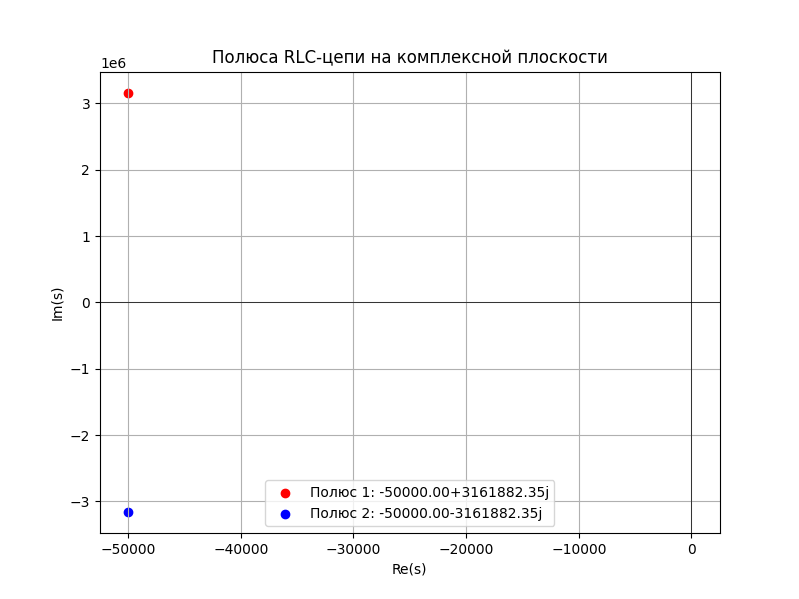

# Устойчивость системы. (недоработана)

```admonish info
Чтобы система стала неустойчивой, нужно, чтобы вещественная часть полюсов стала положительной, а это возможно только если сопротивление R станет отрицательным.Отрицательное сопротивление можно реализовать только с помощью **активных компонентов (например, операционных усилителей, транзисторов)**.Активные компоненты могут компенсировать потери в системе и создать эффект "отрицательного сопротивления".
```

### Физический смысл неустойчивости

Устойчивость системы в ТОЭ определяется тем, как система реагирует на внешние воздействия. Если система устойчива, то после воздействия она возвращается в состояние равновесия. Если нет — система может "разойтись" (стать неустойчивой).


В электрической цепи неустойчивость проявляется в том, что токи и напряжения в системе начинают **неограниченно расти** со временем. Это может быть вызвано:
- Наличием положительной обратной связи.
- Неправильным подбором параметров элементов (например, слишком большие значения индуктивностей или сопротивлений).
- Наличием активных элементов (например, операционных усилителей), которые вносят энергию в систему.

**Какие компоненты схемы создают неустойчивость**

Наличие в схеме реактивных (конденсаторов, индуктивностей) или активных элементов (операционные усилители, транзисторы, которые могут компенсировать потери и создать эффект "отрицательного сопротивления") накапливают энергию и создают колебательные процессы.
Описываемые уравнения с наличием реактивных элементов содержат производные или интегралы, что дает возможность появления экспоненциального роста или колебаний.

Схема, состоящая только из резисторов и источников постоянного напряжения и тока, всегда устойчива, так как:
- Она описывается алгебраическими уравнениями (эти уравнения не содержат производных или интегралов).
- Нет элементов, способных вызвать неограниченный рост токов или напряжений (эти элементы не вносят динамических изменений в систему).
- Энергия в системе только рассеивается, но не накапливается.

**Когда система становится неустойчивой?**

**1. В линейных системах**
- В **линейных системах** неустойчивость может возникнуть, если в системе есть **отрицательное сопротивление** или **положительная обратная связь**.
- Отрицательное сопротивление можно реализовать с помощью **активных компонентов** (например, операционных усилителей).

**2. В нелинейных системах**
- В **нелинейных системах** неустойчивость может возникать из-за сложного взаимодействия компонентов, даже без активных компонентов.
- Например, в системах с нелинейными элементами (диоды, транзисторы) могут возникать автоколебания или хаотические процессы.


**Поведение системы**

Если система неустойчива, то:
1. **Токи и напряжения будут экспоненциально расти** со временем.
2. На практике это может привести к:
   - Перегреву элементов,
   - Выходу из строя компонентов,
   - Непредсказуемому поведению системы.

**Как исправить неустойчивость?**

Чтобы сделать систему устойчивой, необходимо:
1. **Изменить параметры элементов**:
   - Увеличить сопротивления (сделать их положительными) это уменьшит добротность системы и сделает её более устойчивой..
   - Подберите значения L и C, чтобы полюса оказались в левой полуплоскости.
2. **Ввести обратную связь**:
   - Добавить элементы, которые стабилизируют систему (например, конденсаторы или дополнительные резисторы).
3. **Использовать активные методы стабилизации**:
   - Применить управляющие элементы (например, операционные усилители с корректирующими цепями).
   - Используйте отрицательную обратную связь для стабилизации системы.

---

 
## Анализ собственных значений (или полюсов системы) матрицы системы

Этот метод даёт чёткий ответ на вопрос, устойчива ли система, и при этом не требует глубокого понимания сложных математических концепций. Собственные значения — это числа, которые показывают, как система ведёт себя с течением времени. 

**Недостатки:**
- Может быть вычислительно сложным для матриц большой размерности.
- Не всегда дает полную информацию о поведении системы. Если действительная часть наибольшего собственного значения равна нулю, то требуется дополнительное исследование

**Рекомендации**

Для начала рекомендуется освоить метод собственных значений, так как он является наиболее простым и интуитивно понятным. По мере приобретения опыта можно переходить к более сложным методам.

**Альтернативные методы**
- Критерий Рауса-Гурвица: Более сложный метод, но позволяет анализировать устойчивость систем более высоких порядков.
- Частотный метод: Основан на анализе частотных характеристик системы.

**Устойчивость:**
- Если действительная часть наибольшего собственного значения отрицательна, то схема устойчива. (Если все собственные значения имеют отрицательные действительные части, система устойчива.)
- Если действительная часть наибольшего собственного значения положительна, то схема неустойчива. (Если хотя бы одно собственное значение имеет положительную действительную часть, система неустойчива.)
- Если есть нулевые или чисто мнимые собственные значения, система находится на границе устойчивости.

---

### **2. Как использовать анализ собственных значений?**

#### **Шаг 1: Запишите матрицу системы**
Если у вас есть система дифференциальных уравнений, запишите её в матричной форме:
 
$\frac{d\mathbf{x}}{dt} = A \mathbf{x},$
 
где:
- $ \mathbf{x} $ — вектор состояний (например, токи и напряжения),
- $ A $ — квадратная матрица системы.

#### **Шаг 2: Найдите собственные значения**
Собственные значения $ \lambda $ матрицы $ A $ находятся из уравнения:
 
$\det(A - \lambda I) = 0,$
 
где:
- $ I $ — единичная матрица,
- $ \det $ — определитель.

#### **Шаг 3: Проанализируйте собственные значения**
- Если все $ \text{Re}(\lambda) < 0 $, система **устойчива**.
- Если хотя бы одно $ \text{Re}(\lambda) > 0 $, система **неустойчива**.
- Если есть $ \text{Re}(\lambda) = 0 $, система на **границе устойчивости**.

---

### **3. Пример анализа устойчивости**

Рассмотрим простую электрическую цепь с двумя контурами, описываемую матрицей:

$
A = \begin{pmatrix}
-2 & 1 \\
1 & -3
\end{pmatrix} 
$

#### **Шаг 1: Найдём собственные значения**
Решаем характеристическое уравнение:
 
$
\det(A - \lambda I) = \det \begin{pmatrix}
-2 - \lambda & 1 \\
1 & -3 - \lambda
\end{pmatrix} = (-2 - \lambda)(-3 - \lambda) - 1 = 0 
$

Раскрываем определитель:
 
$\lambda^2 + 5\lambda + 5 = 0$
 
Корни уравнения:
 
$\lambda_1 = \frac{-5 + \sqrt{5}}{2} \approx -1.38, \quad \lambda_2 = \frac{-5 - \sqrt{5}}{2} \approx -3.62$
 

#### **Шаг 2: Анализ устойчивости**
- Оба собственных значения имеют отрицательные действительные части.
- Система **устойчива**.

---

## **Что такое устойчивость системы?**
Система считается **устойчивой**, если её выходной сигнал остаётся ограниченным при любом ограниченном входном сигнале. В противном случае система **неустойчива** (например, может начать генерировать колебания или "уходить в насыщение").

Для анализа устойчивости используются:
1. **Критерий устойчивости по полюсам передаточной функции**:
   - Если все полюса передаточной функции системы имеют отрицательные вещественные части, система устойчива.
   - Если хотя бы один полюс имеет положительную вещественную часть, система неустойчива.

2. **Критерий Найквиста**:
   - Используется для анализа устойчивости систем с обратной связью.

---

## **Пример анализа устойчивости LC-фильтра**

Пассивная цепь не моэет стать нейстойчивой, возникновение неустойчивости возможно только в активных цепях. Но для примера расчета, возьмем пассивную цепь.

Рассмотрим **последовательный RLC-фильтр** (катушка $ L $, конденсатор $ C $ и резистор $ R $, соединённые последовательно).


### **1. Передаточная функция RLC-фильтра**
Для последовательного RLC-фильтра передаточная функция $ H(s) $ (в терминах комплексной переменной $ s $) связывает входное напряжение $ U_{вх}(s) $ и выходное напряжение $ U_{вых}(s) $:

$H(s) = \frac{U_{вых}(s)}{U_{вх}(s)} = \frac{1}{LC s^2 + RC s + 1}$

где:
- $ s = j \omega $ (комплексная частота)
- $ \omega = 2 \pi f $ (угловая частота)


### **2. Характеристическое уравнение**
Характеристическое уравнение системы получается из знаменателя передаточной функции:

$LC s^2 + RC s + 1 = 0$
 

### **3. Полюса системы**
Полюса системы — это корни характеристического уравнения.<br>
Решите характеристическое уравнение, чтобы найти полюса:<br>

$s = \frac{-RC \pm \sqrt{(RC)^2 - 4 LC}}{2 LC}$

Упростим:

$s = \frac{-R}{2L} \pm \sqrt{\left(\frac{R}{2L}\right)^2 - \frac{1}{LC}}$


### **4. Анализ устойчивости**
- Если вещественная часть всех полюсов отрицательна ($ \text{Re}(s) < 0 $), система устойчива.
- Если хотя бы один полюс имеет положительную вещественную часть ($ \text{Re}(s) > 0 $), система неустойчива.

#### **Случай 1: $ R > 0 $**
- В реальных системах сопротивление $ R $ всегда положительно.
- В этом случае вещественная часть полюсов:

  $\text{Re}(s) = -\frac{R}{2L} < 0$

  Таким образом, система **устойчива**.

#### **Случай 2: $ R = 0 $**
- Если сопротивление $ R = 0 $, система становится чисто реактивной (без потерь).
- Полюса:

  $s = \pm j \sqrt{\frac{1}{LC}} $

  Вещественная часть полюсов равна нулю ($ \text{Re}(s) = 0 $).
- В этом случае система находится на границе устойчивости и может генерировать незатухающие колебания.

#### **Случай 3: $ R < 0 $**
- Если сопротивление $ R $ отрицательное (например, в активных схемах с обратной связью), система может стать неустойчивой.
- Вещественная часть полюсов:

  $ \text{Re}(s) = -\frac{R}{2L} > 0 $

  Таким образом, система **неустойчива**.

---

### **5. Пример расчёта**
Предположим:
- $ L = 100 \, \mu\text{H} = 0.0001 \, \text{Гн} $,
- $ C = 1 \, \text{нФ} = 0.000000001 \, \text{Ф} $,
- $ R = 10 \, \text{Ом} $.

#### **Характеристическое уравнение:**

$LC s^2 + RC s + 1 = 0  \Rightarrow  0.0001 \cdot 0.000000001 \cdot s^2 + 10 \cdot 0.000000001 \cdot s + 1 = 0$

Упростим:

$10^{-13} s^2 + 10^{-8} s + 1 = 0$

т.е. это квадратное уравнение общего вида:

$as^2+bs+c=0$

#### **Полюса:**

Используем формулу для нахождения корней квадратного уравнения:

$s = \frac{-b \pm \sqrt{b^2 - 4ac}}{2a}$

где:
- $ a = 10^{-13} $
- $ b = 10^{-8} $
- $ c = 1 $.

$s = \frac{-10^{-8} \pm \sqrt{(10^{-8})^2 - 4 \cdot 10^{-13} \cdot 1}}{2 \cdot 10^{-13}}$

Вычислим дискриминант $ D $:
 
$D = b^2 - 4ac = (10^{-8})^2 - 4 \cdot 10^{-13} \cdot 1$
 
$D = 10^{-16} - 4 \cdot 10^{-13}$
 
$D = 10^{-16} - 0.0000000004$
 
$D \approx -0.0000000004$

Поскольку дискриминант отрицательный ($ D < 0 $), корни будут комплексными:
 
$s = \frac{-10^{-8} \pm j \sqrt{4 \cdot 10^{-13} - 10^{-16}}}{2 \cdot 10^{-13}}$
 
 
$s = \frac{-10^{-8} \pm j \sqrt{0.0000000004 - 0.0000000000000001}}{2 \cdot 10^{-13}}$
 
$s = \frac{-10^{-8} \pm j \sqrt{0.0000000004}}{2 \cdot 10^{-13}}$
 
$s = \frac{-10^{-8} \pm j \cdot 0.00002}{2 \cdot 10^{-13}}$


Упростим числитель и знаменатель:
 
$s = \frac{-10^{-8} \pm j \cdot 0.00002}{2 \cdot 10^{-13}}$
 
$s = \frac{-10^{-8}}{2 \cdot 10^{-13}} \pm j \frac{0.00002}{2 \cdot 10^{-13}}$
 
$s = -5 \cdot 10^4 \pm j \cdot 10^6$

Это квадратное уравнение, поэтому у него **два корня** (два полюса). 
Оба полюса имеют одинаковую вещественную часть, потому что они являются комплексно-сопряжёнными. 
Это характерно для систем с действительными коэффициентами (все параметры R, L, C — действительные числа).

В нашем примере эти корни:
 
$s_1 = -5 \cdot 10^4 + j \cdot 10^6$
 
$s_2 = -5 \cdot 10^4- j \cdot 10^6$

#### **Анализ:**
- Вещественная часть полюсов: $ \text{Re}(s) = -5 \cdot 10^4 < 0 $ 
   - Таким образом, полюса системы находятся в левой полуплоскости комплексной плоскости, что означает устойчивость системы
- Мнимая часть: $ \text{Im}(s) = \pm 10^6 $
- Система **устойчива**



<details>

<summary>build calculation use python</summary>

```python
import numpy as np
import matplotlib.pyplot as plt

# Параметры RLC-цепи
L = 0.0001  # Индуктивность, Гн
C = 0.000000001  # Ёмкость, Ф
R = 10  # Сопротивление, Ом

# Коэффициенты характеристического уравнения: a*s^2 + b*s + c = 0
a = L * C
b = R * C
c = 1

# Вычисление дискриминанта
discriminant = b**2 - 4 * a * c

# Нахождение полюсов
if discriminant >= 0:
    # Действительные корни
    s1 = (-b + np.sqrt(discriminant)) / (2 * a)
    s2 = (-b - np.sqrt(discriminant)) / (2 * a)
else:
    # Комплексные корни
    s1 = (-b + 1j * np.sqrt(-discriminant)) / (2 * a)
    s2 = (-b - 1j * np.sqrt(-discriminant)) / (2 * a)

# Вывод полюсов
print(f"Полюс 1: {s1}")
print(f"Полюс 2: {s2}")

# Визуализация полюсов на комплексной плоскости
plt.figure(figsize=(8, 6))
plt.scatter(np.real(s1), np.imag(s1), color='red', label=f'Полюс 1: {s1:.2f}')
plt.scatter(np.real(s2), np.imag(s2), color='blue', label=f'Полюс 2: {s2:.2f}')

# Отрисовка осей
plt.axhline(0, color='black', linewidth=0.5)
plt.axvline(0, color='black', linewidth=0.5)

# Подписи
plt.title('Полюса RLC-цепи на комплексной плоскости')
plt.xlabel('Re(s)')
plt.ylabel('Im(s)')
plt.legend()
plt.grid(True)

# Показать график
plt.show()

```
</details>

---

## **Заключение**
- LC-фильтр с положительным сопротивлением $ R $ всегда устойчив
- Если сопротивление $ R = 0 $, система находится на границе устойчивости
- Если сопротивление $ R < 0 $ (например, в активных схемах), система может стать неустойчивой

- Если все полюса находятся в **левой полуплоскости** ($ \text{Re}(s) < 0 $), система устойчива.
- Если хотя бы один полюс находится в **правой полуплоскости** ($ \text{Re}(s) > 0 $), система неустойчива.
- Если полюса находятся на **мнимой оси** ($ \text{Re}(s) = 0 $), система на границе устойчивости.

 