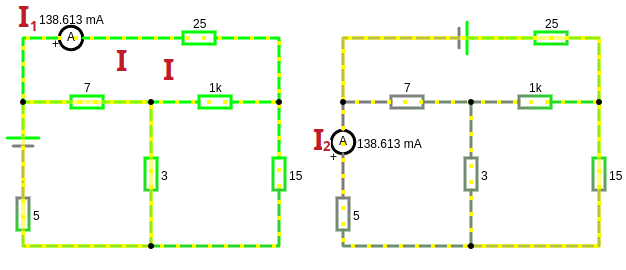

# Урок 49. Теорема взаимности.

**Теорема взаимности** (или **принцип взаимности**) — это важное понятие в теории электрических цепей (ТОЭ), которое описывает симметрию в поведении линейных пассивных систем при определённых условиях. Эта теорема широко применяется для упрощения анализа цепей, особенно в случаях, когда нужно определить взаимное влияние источников и нагрузок.

---

### Формулировка теоремы взаимности

Теорема взаимности утверждает, что в **линейной пассивной цепи** (Пассивные элементы — это элементы, которые не могут усиливать мощность в цепи. Они либо запасают энергию, либо dissipate (рассеивают) её. К пассивным элементам относятся: резисторы, конденсаторы, индуктивности и идеальные трансформаторы. Т.е. в цепи нет активных элементов: операционные усилители, транзисторы) **отношение напряжения на одном элементе к току в другом элементе остаётся неизменным при взаимной замене источника и измерительного прибора**. Теорема взаимности формулируется для случая, когда в цепи действует только **один источник**, и его влияние на другие элементы цепи симметрично.

Если в схеме несколько источников то можно использовать [принцип суперпозиции](/theories_of_electrical_circuits/lessons/34.html):
- Рассмотреть влияние каждого источника по отдельности.
- Сложить результаты для получения общего отклика цепи.

 

На схемах видно, что сперва мы замерили ток $I_1$ в ветви, а потом перенесли туда источник ЭДС и ветвь с которой мы забрали его приобрела значение тока $I_2$ равным ранее измеренному $I_1$ в ветви без ЭДС.

Математически это можно выразить так:
- Если в цепи есть два узла $A $ и $B $, и источник напряжения $ V $, подключённый к узлу $ A $, вызывает ток $ I $ в узле $B $, то тот же источник напряжения $ V $, подключённый к узлу $ B $, вызовет ток $ I $ в узле $ A $.

---

**Линейно пассивная цепь**

Все элементы, кроме источников, являются пассивными (резисторы, конденсаторы, индуктивности).

Источники рассматриваются как внешние воздействия, которые добавляют энергию в систему, но не нарушают линейность и пассивность остальной части цепи.

Линейная цепь — это цепь, в которой все элементы подчиняются линейным зависимостям между током и напряжением.
В линейной цепи принцип суперпозиции выполняется: если в цепи действует несколько источников, то общий отклик цепи равен сумме откликов от каждого источника в отдельности.

Источники рассматриваются как внешние воздействия, которые добавляют энергию в систему, но не нарушают линейность и пассивность остальной части цепи.

---

### Условия применимости теоремы

Теорема взаимности применима только к цепям, которые удовлетворяют следующим условиям:
1. **Линейность**:
   - Все элементы цепи должны быть линейными (например, резисторы, конденсаторы, индуктивности).
   - Нелинейные элементы (например, диоды, транзисторы) нарушают условие взаимности.

2. **Пассивность**:
   - В цепи не должно быть активных элементов (например, транзисторов, операционных усилителей или источников тока или напряжения, зависящих от других токов или напряжений. Зависимых источников 4-ре типа - Источник напряжения, управляемый напряжением (ИНУН), Источник напряжения, управляемый током (ИНУТ), Источник тока, управляемый напряжением (ИТУН), Источник тока, управляемый током (ИТУТ) ).

3. **Отсутствие начальных условий**:
   - В цепи не должно быть начальных токов в индуктивностях или начальных напряжений на конденсаторах (если они не вызваны внешними источниками).

4. **Один источник**:
   - Теорема формулируется для цепей с одним источником напряжения или тока. Если источников несколько, их влияние нужно рассматривать отдельно.

---

### Практическое применение теоремы взаимности

Теорема взаимности полезна в следующих случаях:
1. **Упрощение анализа цепей**:
   - Если нужно определить ток в одной ветви при изменении положения источника, теорема позволяет избежать повторного анализа всей цепи.

2. **Расчёт взаимных влияний**:
   - В цепях с взаимными индуктивностями (например, трансформаторы) теорема взаимности помогает определить, как изменение тока в одной катушке влияет на напряжение в другой.

3. **Теория антенн**:
   - В радиотехнике теорема взаимности используется для анализа передачи и приёма сигналов антеннами. (Если антенна эффективно передаёт сигнал в определённом направлении, она также будет эффективно принимать сигнал с этого направления.)

---

### Математическое обоснование

Теорема взаимности следует из симметрии матрицы проводимости (или сопротивления) линейной пассивной цепи. Для линейной цепи уравнения Кирхгофа можно записать в матричной форме:
 
$\mathbf{V} = \mathbf{Z} \mathbf{I},$
 
где:
- $ \mathbf{V} $ — вектор напряжений,
- $ \mathbf{I} $ — вектор токов,
- $ \mathbf{Z} $ — матрица сопротивлений.

Для пассивной линейной цепи матрица $ \mathbf{Z} $ симметрична ($ Z_{ij} = Z_{ji} $), что и обеспечивает выполнение теоремы взаимности.

---

### Ограничения теоремы

Теорема взаимности **не применима** в следующих случаях:
1. **Нелинейные цепи**:
   - Если в цепи есть нелинейные элементы (например, диоды, транзисторы), теорема не работает.

2. **Активные цепи**:
   - Если в цепи есть активные элементы (например, операционные усилители, зависимые источники), теорема не применима.

3. **Цепи с начальными условиями**:
   - Если в цепи есть начальные токи в индуктивностях или начальные напряжения на конденсаторах, теорема не работает.

---

### Заключение

Теорема взаимности — это мощный инструмент для анализа линейных пассивных цепей. Она позволяет упростить расчёты и понять симметрию в поведении цепей. Однако её применение ограничено линейными и пассивными системами. Если вы работаете с такими цепями, теорема взаимности станет вашим надёжным помощником!