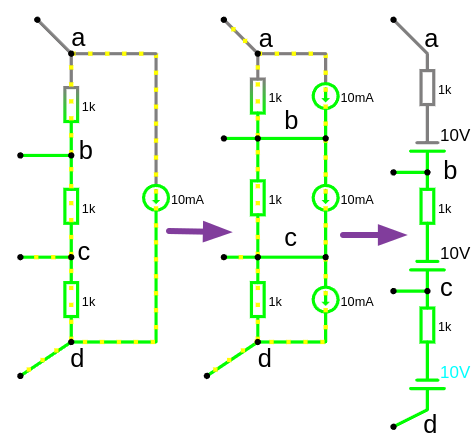

# Урок 5,32. Источник тока идеальный и реальный.

 
### **Источник тока**

**Источник тока** — это устройство или система, которая поддерживает постоянную силу тока $I$ в электрической цепи независимо от изменения сопротивления нагрузки в пределах своих возможностей. Примерами источника тока могут быть: катушка индуктивности либо аккумулятор с парралельно подключенным резистором.  Если внутреннее сопротивление источника питания намного больше чем внешнее сопротивление нагрузки то данный источник питания можно представить как **источник тока** ($R\ внутр \gg R\ нагрузки$) иначе если внутреннее сопротивление источника питания намного меньше сопротивления нагрузки то данный источник питания можно представить как **источник напряжения** ($R\ внутр \ll R\ нагрузки$)

---

### **Виды источников тока**

1. **Идеальный источник тока**  
   - Теоретическая модель, которая поддерживает фиксированный ток через нагрузку, независимо от её сопротивления.  
   - Напряжение на выходе может изменяться бесконечно, чтобы компенсировать изменения нагрузки.  
   - $R\ внутр \to \infty$
   - При бесконечно увеличивающемся сопротивлении нагрузки у нас будет бесконечно увеличиваться напряжение нагрузки. И наоборот, при снижении сопротивления нагрузки у нас будет снижаться напряжение нагрузки.
   - Схема замещения идеального источника тока:

    

   - ВАХ (внешняя/выходная характеристика) источника тока:

    

   - При $U \to \infty$ то $P \to \infty$ 
     - $P = J \cdot U = \infty$

2. **Реальный источник тока**  
   - Учитывает ограничения, такие как максимальное выходное напряжение и внутреннее сопротивление.  
   - При достижении предельного напряжения на нагрузке ток перестаёт быть постоянным.
   - $I\ внутр = J - I\ нагрузки $
     - $I\ нагрузки = J - I\ внутр $
     - С увеличением напряжения будет снижаться выходной ток источника питания
     - $I\ внутр = \frac{U}{R\ внутр }$
     - $I\ нагрузки = J - \frac{U}{R\ внутр } $

   - Схема замещения реального источника тока. Параллельное подключение резистора:

    

   - ВАХ (внешняя/выходная характеристика) реального источника тока:

    

   **Замена на эквивалентный источник ЭДС**  
   - Источник тока $ J $ с параллельным сопротивлением $ R_{\text{вн}} $ заменяется на источник ЭДС $ E $ с последовательным сопротивлением $ R_{\text{вн}} $.  
   - Формула для пересчёта:
      $E = J \cdot R_{\text{вн}}$

   Для $J=10,\ mA = 0.01\,\ A$ и $R_{\text{вн}} = 1,\ kOm = 1000,\ Om$

   $E = J \cdot R_{\text{вн}} = 0.01\cdot 1000 = 10,\ V$

   

   Замена реального источника тока (с внутренним сопротивлением) на реальный источник ЭДС

   

---

### **Основные характеристики источника тока**

1. **Сила тока ($ I $)**  
   - Значение тока, которое источник поддерживает в цепи.

2. **Максимальное напряжение ($ U\ {\text{макс}} $)**  
   - Максимальное напряжение, которое может быть создано источником для поддержания заданного тока.

3. **Внутреннее сопротивление ($ R\ {\text{внутр}} $)**  
   - Определяет, как источник ведёт себя при изменении сопротивления нагрузки. Для реальных источников $R_{\text{внутр}} $ обычно очень велико, приближаясь к бесконечности в идеальном случае.

---

### **Уравнение для реального источника тока**

Для реального источника тока связь между током, напряжением и нагрузкой определяется выражением:
 
$I = \frac{\mathcal{E}}{R\ {\text{внутр}} + R\ {\text{нагрузки}}}$
 
где:  
- $ \mathcal{E} $ — напряжение на внутреннем сопротивлении источника и нагрузке,  
- $ R\ {\text{нагрузки}} $ — сопротивление нагрузки.

---

### **Пример работы источника тока**

1. Если реальный источник поддерживает ток $ I = 5 \, \text{А} $ при нагрузке $ R\ {\text{нагрузки}} = 2 \, \Omega $, то напряжение на нагрузке составит:  
   
   $U = I \cdot R\ {\text{нагрузки}} = 5 \cdot 2 = 10 \, \text{В}$
   

2. Если нагрузка увеличится до $5 \, \Omega $, напряжение возрастёт до:  
   
   $U = 5 \cdot 5 = 25 \, \text{В}$
     
   При этом ток останется неизменным, если источник находится в пределах своего рабочего диапазона.

---

### **Применение источников тока**

1. **Зарядка аккумуляторов**:  
   Поддержание постоянного тока для зарядки батарей.  

2. **Светодиоды (LED)**:  
   Питание светодиодов, которые требуют постоянного тока для стабильной работы.  

3. **Тестирование электрических цепей**:  
   Использование источника тока для проверки характеристик цепей и компонентов.  

4. **Медицинское оборудование**:  
   В устройствах для стимулирования мышц и нервов, где требуется точный контроль тока.

---

### **ВАХ источника тока**

- **Идеальный источник тока**:  
  ВАХ представляет собой горизонтальную линию. Ток остаётся постоянным ($ I = \text{const} $), независимо от изменения напряжения.  

- **Реальный источник тока**:  
  ВАХ сначала выглядит как горизонтальная линия, но затем ток начинает уменьшаться при достижении максимального напряжения ($ U\ {\text{макс}} $).

---

Источник тока является фундаментальным компонентом в электротехнике и электронике, обеспечивая стабильный ток в самых различных приложениях.
 