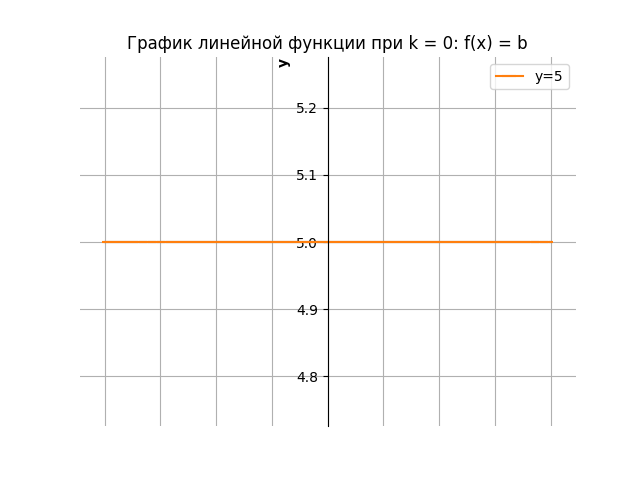

# Линейное уравнение. Линейная функция.

В **теоретических основах электротехники (ТОЭ)** используются математические методы, включая **линейные уравнения**, **линейные функции**, **уравнения первого порядка** и **полиномы первого порядка**. Давай разберём, как они применяются в электротехнике.  

---

### 1. Линейное уравнение 

$A\cdot x + B\cdot y = C$
  
- Первый вид уравнений:

    Где $ A $ и $ B $ — постоянные коэффициенты и $A\ne 0$ и $B\ne 0$. 

    $B\cdot y=-A\cdot x+C$

    $y=-\frac{A}{B}\cdot x+\frac{C}{B}$ - это как раз уравнения вида $f(x)=kx + b$ при $k \ne 0$

- Второй вид уравнений:
    
    Если $A=0$ и $B\ne 0$ это постоянная функция (горизонтальная линия)

    $y=\frac{С}{B}$ - это как раз уравнения вида $f(x)=b$  


- Третий вид уравнений:

    При $A\ne 0$ и $B=0$ это не функция, так как на выходе произвольные данные

    $x=\frac{С}{A}$ - вертикальная прямая, x постоянная величина, а у произвольный

 
**В ТОЭ:**  
- Такие уравнения описывают **линейные электрические цепи**, где параметры элементов (R, L, C) **не зависят** от напряжения или тока. (Резистор обладая 5 Ом сопротивлением при изменении тока или напряжение не изменяет свою характеристику, он по прежнему с 5 Ом, так же для индуктивности и емкости) 
- Используются в методах **узловых потенциалов** и **методе контурных токов**.  

---

### 2. Линейная функция 
Функция вида:  
 
$y = kx + b$ <br>
т.е.<br>
$f(x)=kx + b$
   
Где:
- $k$ — коэффициент наклона (передаточная функция)
- $ b $ — сдвиг
- $x, y$ — оси Декартовой плоскости. Имеют значение тока или напряжения

Строят функцию на графике для ряда точек, чтобы наглядно увидеть поведение функции. 
Входные данные $x$ (независимая переменная), а выходные данные $y$ (зависимая переменная, так как зависит от входных данных) 

Пример: 

Пусть $k = 2$ (отвечает за угол наклона прямой и симметрию), $b = 5$ (отвечает за смещение по y оси), а $x$ изменяется от -10 до 10. <br>
Тогда функция будет иметь вид: $y = 2x + 5$

Запись вида $f(x)=kx + b$ это полином первого порядка, удобна когда мы подставляем реальные значения:
- $f(1)=2\cdot 1 + 5=7\ т.е.\ y=7$
- $f(8)=2\cdot 8 + 5=21\ т.е.\ y=21$

 

 

 

<details>

<summary>build chart use python</summary>

```python
import matplotlib.pyplot as plt
import numpy as np

# Задаем коэффициенты линейной функции y = kx + b
k = 2  # угловой коэффициент
b = 5  # смещение

# Создаем массив значений x
x = np.linspace(-10, 10, 100)  # 100 точек от -10 до 10

# Вычисляем соответствующие значения y
y = k * x + b

# Строим график
plt.plot(x, y)
 
# Добавляем заголовок к графику
plt.title("График линейной функции y = 2x + 5")

# Включаем сетку для лучшей читаемости
plt.grid(True)

# Перемещаем оси в центр графика
ax = plt.gca()
ax.spines['left'].set_position('zero')
ax.spines['bottom'].set_position('zero')
ax.spines['right'].set_color('none')
ax.spines['top'].set_color('none')

# Добавляем подписи к осям
plt.xlabel("x", loc="right", fontweight="bold")
plt.ylabel("y", loc="top", fontweight="bold")

# Показываем график
plt.show()
```

</details>

Для постороения графика достаточно знать всего две точки. Первую находим при $x=0$ это мы узнаем про $y$, а вторую находим при $y=0$ это мы узнаем про $x$


**В ТОЭ:**  
- Описывает **зависимость напряжения от тока** для резистора: $ U = R\cdot I $ (закон Ома).  
- Используется при анализе передаточных характеристик электрических схем.  

---

### Вывод
Все эти темы необходимы для анализа электрических цепей, особенно **линейных**. Если в цепи только **R, L, C и независимые источники**, то уравнения остаются **линейными**. Если же есть **нелинейные элементы** (например, диоды, транзисторы), то применяются **нелинейные уравнения**.  