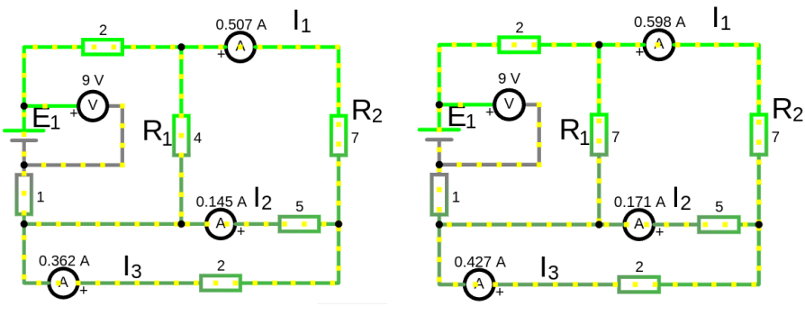
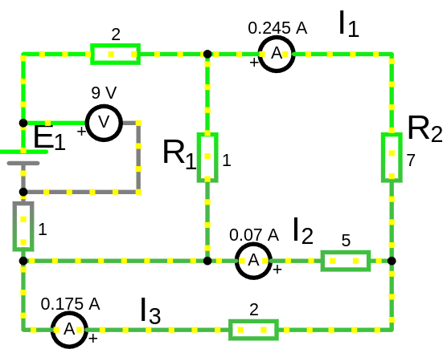

# Урок 52. Принцип линейности в линейных электрических цепях.

Если цепь состоит из линейных элементов, то выполняется принцип суперпозиции и линейная зависимость между токами и напряжениями в различных частях цепи.

Если в линенйной электрической цепи изменяется ЭДС или споротивление в ветви то две любые величины (ток или напряжение) в двух других ветвях связаны между собой линейной зависимостью вида: $y=k\cdot x+b$

где:
- $x, y$ — токи или напряжения в двух различных ветвях
- $k, b$ — коэффициенты, которые зависят от параметров цепи (сопротивлений, ЭДС и т.д.).

**Почему это важно:**
- Принцип линейности позволяет упростить анализ сложных цепей, разбивая их на более простые части.
- Он также позволяет предсказывать, как изменения в одной части цепи повлияют на другие части, используя линейные уравнения.

Если мы знаем зависимый ток или напряжение и его коэффициенты $k, b$ для какого-то режима работы цепи, то мы можем без замеров определить легко по формуле зависимый ток или напряжение и это легче чем заново решать систему уравнений. 
 
### Найти зависимость, коэффициенты $k, b$

1. Замерить два раза ток либо напряжение и подставить эти значения в формулу $y=k\cdot x+b$

2. Решить систему уравнений

**Пример**:

Мы хотим знать, как между собой зависят токи $I_1$ и $I_2$ в режиме работы цепи при изменении $R_1$. Для этого, мы  замерим токи $I_1$ и $I_2$ два раза имитируя работу режима работы цепи. Режимы, в нашем случае, в виде изменение сопротивления резистора $R_1$

При изменении типа режима т.е. если мы будем регулировать не через сопротивление резистора $R_1$, а через резистор $R_2$ либо через изменение напряжения на источнике ЭДС, то коэффициенты $k, b$ не будут подходить к нашему новому режиму работы и следует пересчитать коэффициенты, т.е. провести два замера для нового режима заново.
 
 

Замер для первого уравнения (режим 1)
- При $R_1=4\  Om$, токи $I_1=0.507\ A$ и $I_2=0.145\ A$

Замер для второго уравнения (режим 2)
- При $R_1=7\  Om$, токи $I_1=0.598\ A$ и $I_2=0.171\ A$

Теперь уравнение вида $y=k\cdot x+b$ перепишем для тока. Где $y=I_1$ первый зависимый ток, а $x=I_2$ второй зависимый ток.
- $I_1=k\cdot I_2+b$ 
- $I_2= \frac{I_1 - b}{k}$ (просто выразили ток $I_2$ из первого уравнения)

Теперь запишем систему уравнения для первго и второго режима измерений:
- $0.507=k\cdot 0.145+b$ 
- $0.598=k\cdot 0.171+b$ 

Решение системы уравнений, искомые коэффициенты $k$ и $b$:
- $k \approx 3.5$ 
- $b \approx -0.0005$

Теперь, зная любой из этих двух токов, мы можем легко посчитать другой ток.
Допустим мы знаем ток $I_2=0.07\ A$ (мы применили режим работы цепи 3, понизив сопротивление $R_1=1\ Om$) или по другому сформулируем, хотим знать какой будет ток $I_1$ при токе $I_2=0.07\ A$, подставляем значение $I_2$ в уравнение:
- $I_1=3.5\cdot 0.07+(-0.0005) = 0.2445\ A$ 

Либо, зная $I_1=0.24455\ A$ вычислим ток $I_2$
- $I_2= \frac{I_1 - b}{k} = \frac{0.24455 - (-0.0005)}{3.5}= 0.07\ A$
 

 