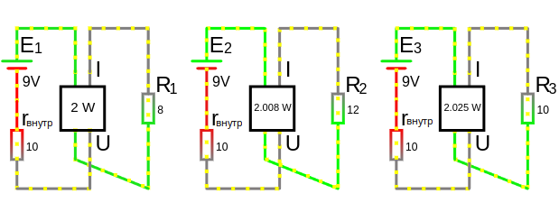

# Урок 54. Передача электроэнергии от источника к приемнику.

При изначально заданном источнике ЭДС с его внутренним сопротивлением, какое должно быть сопротивление нагрузки что бы получить максимальную мощность $P$ от источника?

Максимальная мощность будет при такой производной равной нулю.

$\frac{dP_{нагрузки}}{dR_{нагрузки}} = 0$

**Условие при котором получим максимальную мощность $P$**

$R_{нагрузки} = r_{внутр}$ (называет - согласование нагрузки на внутреннее сопротивление)

Чему равна максимальная мощность

$P_{нагрузки\ max}=\frac{E²}{4\cdot R_{нагрузки}}$
 
Коефициент полезного действия

$\eta = \frac{P_{полезная}}{P_{затраченная}} = \frac{P_{нагрузки}}{P_{подведенная\ ист.\ питания}}=0.5 \to 0.5\cdot 100 = 50\%\ КПД$ (т.е. остальные 50% будут теряться на внутреннем сопротивлении)

где:
- $P_{подведенная\ ист.\ питания} = E\cdot I$
- $P_{полезная}$ - это мошность нагрузки или же мощность на выходе
- $P_{затраченная}$ - это мошность источника или же мощность на входе

Большие потери мощности, при условии что мы максимально передаем мощность, оправданы в некоторых случаях, когда оперируют небольшими мощностями. Т.е. мы пренебрегаем КПД, зато передаем максимальную мощность дальше (например, для усилителя). 

**Пример**:

Измеряем ваттметром мощность при изменении сопротивления

 

<a href="/theories_of_electrical_circuits/falstad/circuitjs-54.txt" download="circuitjs-54.txt">Скачать схему для www.falstad.com/circuit</a>

[Формула мощности](/theories_of_electrical_circuits/lessons/3.html#Мощность):

$P=I²\cdot R_{нагрузки}$

Мощности первой цепи при $R_{нагрузки} = 8\ Om$:
- $I_1=\frac{E_1}{R_1 + r_{внутр}} = \frac{9}{18} = 0.5\ A$
- $P_1=I²_1\cdot R_{нагрузки} = 0.25\cdot 8 = 2\ W $

Мощности второй цепи при $R_{нагрузки} = 12\ Om$:
- $I_2=\frac{E_2}{R_2 + r_{внутр}} = \frac{9}{22} = 0.409\ A$
- $P_2=I²_2\cdot R_{нагрузки} = 0.167281\cdot 12 = 2.008\ W $

Мощности третьей цепи при $R_{нагрузки} = 10\ Om$:
- $I_3=\frac{E_3}{R_3 + r_{внутр}} = \frac{9}{20} = 0.45\ A$
- $P_3=I²_3\cdot R_{нагрузки} = 0.2025\cdot 10 = 2.025\ W $

т.е. при $R_3=r_{внутр}$ максимальная мощность цепи $P= 2.025\ W $