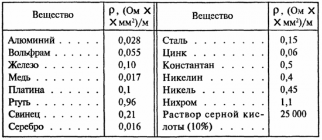

# Урок 55. Передача электроэнергии по линии электропередачи (ЛЭП).

.") 

где:
- $E$ - ЭДС идеалльного источника
- $R_{линии}$ - сопротивление проводов линии
- $U_1=E$ - напряжение в начале линии
- $U_2$ - напряжение в конце линии
- $U_2=U_{R_{нагр}}$ 

Мощность $U_1$ т.е. мощность входа:
- $P_1=E\cdot I=U_1\cdot I$

Мощность выхода т.е. мощность нагрузки:
- $P_2=U_2\cdot I=I²\cdot R_{нагр}$

Напряжение нагрузки:
- $U_2=U_1-R_{линии}\cdot I$

КПД линии:
- $\eta = \frac{P_{нагрузки}}{P_{входа}} = \frac{P_2}{P_1}=1-\frac{U_1-U_2}{U_1}$

**Основные характеристики работы линии электропередач**

График зависимости напряжений, КПД и мощности от тока:
- $U_1, U_2, P_1, P_2, \eta \to f(I)$

.") 

где:
- $U_1$ - зависимость напряжения на входе от тока линии, это прямая линия, так как напряжение $U_1$ это и есть источник идеального напряжение т.е. без внутреннего сопротивления, поэтому  напряжение всегда будет одинаково равным источнику ЭДС и следовательно не зависит от величины тока
- $P_2$ - зависимость мощности нагрузки от тока линии, это парабола, так как формула зависит от квадрата тока $P_2=U_2\cdot I=I²\cdot R_{нагр}$
    - первая крайность это отсутствие тока. Когда сопротивление нагрузки стремится к бесконечности т.е. обрыв, цепь работает на холостом ходу, значит ток не протекает $I=0$  
    - другая крайность, когда ток максимальный $I_{кз}$ короткого замыкания, это может быть если сопротивление нагрузки отсутвует $R_{нагр}=0$
    - теперь проиллюстрируем поведение изменение производной мощности, когда $R_{нагр}=R_{линии}$, этот режим работы цепи характерен максимальной мощностью с КПД 50% (с потерей остальных 50% на сопротивлении линии $R_{линии}$). Из формулы $I=\frac{U_1}{R_{линии}+R_{нагр}}$ и так как $R_{нагр}=R_{линии}$ значит $I=\frac{U_1}{2\cdot R_{линии}}$ т.е. ток станет в два раза меньше по сравнению со своим значением при $I_{кз}$, чему и соответвует точка "a" на графике. Точка "b" на графике, когда производная равна нулю, что соответвует максимальному значение мощности
- $P_1$ - зависимость мощности на входе от тока линии, это линия $P_1=U_1\cdot I$, 
    - когда ток равен нулю то мощность тоже равна нулю, 
    - вторая крайность (точка на графике) когда ток максимальный (короткое замыкание), эта точка на прямой линии $U_1$ расположена прямо над точкой значения тока короткого замыкания, так как величина $U_1$ не меняется, то рост прямой линейно зависит от крайнего знаяения величины тока к.з.  
- $U_2$ - зависимость напряжения на нагрузке от тока линии, это прямая линия, 
    - когда ток равен нулю, это когда $R_{нагр}$ стремится к бесконечности, т.е. обрыв ток не протекает, и следовательно нет никакого падения на $R_{линии}$ и значит напряжение на нагрузке будет такое же как и на источнике ЭДС $U_2=U_1$
    - вторая крайность (точка на графике) когда ток максимальный (короткое замыкание), это может быть если сопротивление нагрузки отсутвует $R_{нагр}=0$ что значит из формулы $U=I\cdot R$ напряжение тоже будет ноль $U_2=I_{кз}\cdot 0=0$ 
- $\eta$ формула $\eta= \frac{P_2}{P_1}$
    - когда ток равен нулю, это когда $R_{нагр}$ стремится к бесконечности, т.е. обрыв ток не протекает, $P_2=P_1$ потому что, нет никакого падения на $R_{линии}$ и значит напряжение на нагрузке будет такое же как и на источнике ЭДС $U_2=U_1$ и следовательно мошности будут одинаковые, $\eta= \frac{P_2}{P_1}=1$ т.е. 100%
    - вторая крайность (точка на графике) когда ток максимальный (короткое замыкание), это может быть если сопротивление нагрузки отсутвует $R_{нагр}=0$ то значит из формулы $U=I\cdot R$ напряжение тоже будет ноль $U=I_{кз}\cdot 0=0$ и мощность будет ноль, тогда и $\eta=0$

Величина тока короткого замыкания в линии:
- $I_{кз}= \frac{U_1}{R_{линии}}$    

Потери мощности на линии электропередачи:
- $dP_{линии}=ρ \cdot \frac{L}{S}\cdot (\frac{ P_2}{U_2})²$

Что бы снизить потери мощности в линии мы можем влиять на $U_2$, чем выше наряжение нагрузки $U_2$ тем ниже потери, зависимость квадратная. Для этого просто повышат напряжение $U_1$ в начале линии до воздейсвия сопротивления линии $R_{линии}$, так как они связаны. Т.е. экономически целесообразно передавать электроэнергию на большие расстояния при **высоких** напряжениях (повышающие трансформаторы).

## Как рассчитать сопротивление провода

 

таб. Удельное сопротивление материалов

Сопротивление провода зависит от нескольких факторов, включая материал, длину и площадь поперечного сечения. Вот формула для расчета сопротивления:

$R_{линии} = ρ \cdot \frac{L}{S}$

Где:

*   **R** - сопротивление провода (измеряется в Омах, Ом)
*   **ρ** - удельное сопротивление материала (измеряется в Ом·м или Ом·мм²/м)
*   **L** - длина провода (измеряется в метрах, м)
*   **S** - площадь поперечного сечения провода (измеряется в квадратных метрах, м² или квадратных миллиметрах, мм²)

**1. Удельное сопротивление материала ($ρ$)**

Удельное сопротивление показывает, насколько сильно материал сопротивляется прохождению электрического тока. Оно зависит от типа материала.

*   Для меди удельное сопротивление составляет примерно $1,68 \cdot 10⁻⁸$ Ом·м или 0,0168 Ом·мм²/м.
*   Для алюминия удельное сопротивление составляет примерно $2,8 \cdot 10⁻⁸$ Ом·м или 0,028 Ом·мм²/м.

Значения удельного сопротивления для других материалов можно найти в специальных таблицах или справочниках.

**2. Длина провода (L)**

Длина провода измеряется в метрах. Чем длиннее провод, тем больше его сопротивление.

**3. Площадь поперечного сечения провода (S)**

Площадь поперечного сечения провода измеряется в квадратных метрах или квадратных миллиметрах. Чем больше площадь сечения провода, тем меньше его сопротивление.

Если вам известен диаметр провода (d), площадь поперечного сечения можно рассчитать по формуле:

$S = π \cdot (\frac{d}{2})²$

Где:

*   $π$ - число "пи" (примерно 3.14)
*   $d$ - диаметр провода (измеряется в метрах или миллиметрах)

Для переменног тока, существует повехностный эффект вытеснения тока наружу на поверхность провода из центра, то эффективно внутреннюю часть провода делать из прочного материала, стали, а внешнюю из высокопроводимого металла, меди.

Для линий электропередач, где значительные расстояния между опорными столбами, играет важную роль жесткость материала, и применяют сталь, так как она меньше деформируется, растягивается по сравнению с медью

Для постоянного тока, нет повехностного эффекта вытеснения тока наружу, и ток течет по всему сечению провода, поэтому весь провод медный.

В радиотехнике на высоких частотах, существует повехностный эффект вытеснения тока наружу, и не целесообразно использовать провода, эффективней использовать полые провода т.е. трубки. В центре пустота, а с наружи медь.

**Пример расчета**

Допустим, у нас есть медный провод длиной 10 метров и диаметром 2 мм. Рассчитаем его сопротивление:

1.  Рассчитываем площадь поперечного сечения:

    $S = π * (2 мм / 2)² ≈ 3,14 мм²$

2.  Подставляем значения в формулу для расчета сопротивления:

    $R = 0,0168 Ом·мм²/м * 10 м / 3,14 мм² ≈ 0,0535 Ом$

**Важные моменты**

*   При расчете сопротивления необходимо использовать единицы измерения, которые соответствуют удельному сопротивлению материала.
*   Реальное сопротивление провода может отличаться от расчетного из-за различных факторов, таких как температура, качество материала и т.д.
*   Для выбора провода необходимо учитывать не только его сопротивление, но и другие параметры, такие как максимальный ток, напряжение и условия эксплуатации.

 
