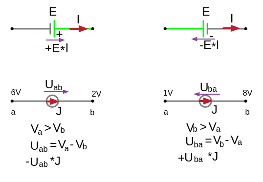
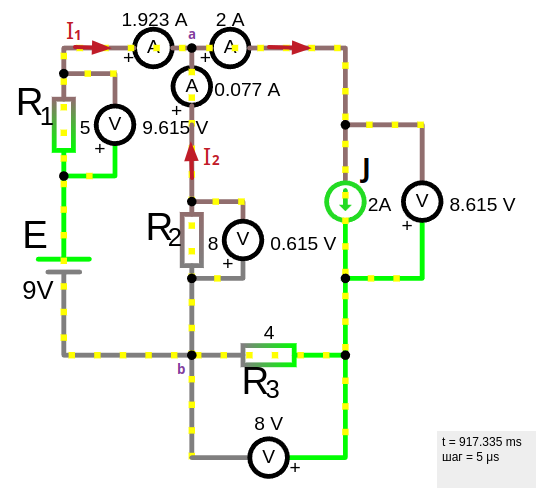
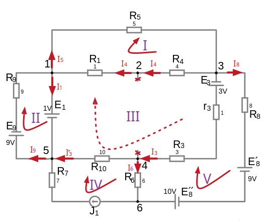
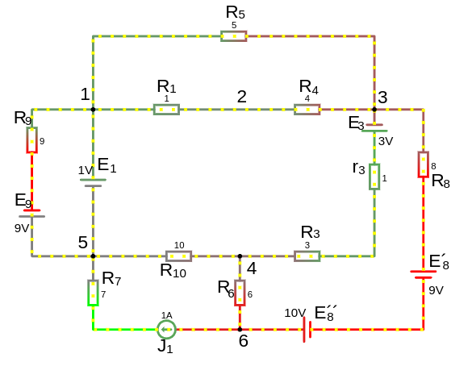

# Урок 56. Баланс мощностей в электрических цепях.

Баланс мощностей в электрических цепях — это фундаментальный принцип закона сохранения энергии, который заключается в том, что **суммарная мощность, выделяемая источниками энергии в цепи, должна быть равна суммарной мощности, потребляемой всеми элементами цепи** (нагрузками, резисторами и другими элементами). Этот принцип основан на законе сохранения энергии.

**Для чего проводить проверку баланса мощностей:**<br>
Для того, чтобы проверить правильность расчета цепи, баланс должен сойтись.<br> Является эффективным критерием качества расчета цепи.

```admonish info
Расчет баланса мощностей производят с **исходной схемой**, т.е. до ее упрощений, преобразований, трансформаций и различных замещений.
```

### Основные понятия:
1. **Мощность источника ($P_{ист}$)** — мощность, которую вырабатывают источники напряжения или тока.
2. **Мощность нагрузки ($P_{нагр}$)** — мощность, потребляемая резисторами.

В цепях постоянного тока **Активная мощность = Мощность нагрузки**, ($P_{нагр}=P$) из-за отсутствия реактивной мощности (которая присуща переменному току)

Вся мощность, потребляемая нагрузкой, dissipируется в виде тепла или преобразуется в полезную работу. Это означает, что мощность нагрузки полностью является активной мощностью.

3. **Активная мощность ($P$)** — мощность, которая преобразуется в полезную работу (например, в тепло на резисторе). В цепях постоянного тока вся мощность, потребляемая резисторами, является активной, так как она преобразуется в тепло или полезную работу. 

$$P=I^2\cdot R=U\cdot I$$

**Почему мощность нагрузки учитывается только на резисторах**
- Конденсаторы: В цепи постоянного тока конденсаторы не потребляют мощность в установившемся режиме, так как после зарядки ток через конденсатор прекращается, и он ведёт себя как разрыв цепи.
- Индуктивности: В цепи постоянного тока индуктивности также не потребляют мощность в установившемся режиме. После завершения переходного процесса т.е. уже в установившемся режиме, индуктивность это просто провод с нулевым сопротивлением и не потребляет мощность.

### Уравнение баланса мощностей:

Для цепи постоянного тока (где реактивная мощность отсутствует):
 
$_{алгебраическая} \sum P_{ист} = _{арифметическая} \sum P_{нагр}$
 
что тоже самое:

$_{алгебраическая} \sum E\cdot I \pm \sum U_k\cdot J_k =  _{арифметическая} \sum R\cdot I² $

---
### Мощность источников энергии $P_{ист}$
Мощность, вырабатываемая источником ЭДС, определяется по формуле:

$P_{\text{ист}} = E \cdot I$
 
где:
- $E$ — ЭДС источника,
- $I$ — ток, протекающий через источник.

Если ток направлен от «$-$» к «$+$» внутри источника (источник работает в режиме генератора), то мощность считается положительной. Если ток направлен от «$+$» к «$-$» (источник работает в режиме потребителя, например, аккумулятор заряжается), то мощность считается отрицательной.

Алгебраическая сумма источников напряжения:
- если направление напряжения совпадает с током ветви ставим знак "+", иначе если не совпадает знак "-"

Алгебраическая сумма источников тока:
- если направление напряжения совпадает с током ветви ставим знак "-", иначе если не совпадает знак "+"

 

---
### Мощность потребителей $P_{нагр}$
Мощность, потребляемая резисторами или другими элементами цепи, рассчитывается по формуле:
 
$P_{\text{нагр}} = I^2 \cdot R$
 
где:
- $I$ — ток, протекающий через элемент,
- $R$ — сопротивление элемента.

Также мощность можно рассчитать через напряжение на элементе:
 
$P_{\text{нагр}} = U \cdot I$
 
где $U$ — напряжение на элементе.

---

### Теоретический пример расчета баланса мощностей:
Рассмотрим простую цепь постоянного тока с источником напряжения $ E $ и резистором $ R $:
1. Мощность источника: $ P_{\text{ист}} = E \cdot I $, 
    * где $ I $ — ток в цепи.
2. Мощность нагрузки: $ P_{\text{нагр}} = I^2 \cdot R $.

По закону Ома $ I = \frac{E}{R} $, поэтому:
 
$P_{\text{ист}} = E \cdot \frac{E}{R} = \frac{E^2}{R}$
 
$P_{\text{нагр}} = \left( \frac{E}{R} \right)^2 \cdot R = \frac{E^2}{R}$
 
Таким образом, $ P_{\text{ист}} = P_{\text{нагр}} $, и баланс мощностей выполняется.

---
### Пример 1 расчёта баланса мощностей

Простой пример 3 из темы [Второй закон Кирхгофа](/theories_of_electrical_circuits/lessons/8.html#Пример-3)



1. **Мощность источника:**

    $P_{ист} = E\cdot I_1 + U_{J}\cdot J = 9\cdot 1.923 + 8.615\cdot 2  = 34.537 \, \text{Вт}$
    
    в схеме источник напряжения совпадает с направлением тока, поэтому со знаком "+", 
    а направление источника тока не совпадает с направление напряжения $b \to a$ ветви так как потенциал в узле $b$ больше чем в $a$. На схеме зеленым цаетом видна небольшая разница.

2. **Мощность потребителя:**
   
   $P_{потр} = I^{2}_1 \cdot R_1 + I^{2}_2 \cdot R_2 + J \cdot R_3 = 1.923^2\cdot 5+ 0.077^2\cdot 8+2^2\cdot 4 = 34.537\, \text{Вт}$

3. **Проверка баланса мощностей:**
   
   $P_{\text{ист}} = P_{\text{потр}} + \text{потери}$
  
   В данном случае потери отсутствуют, поэтому:
   
   $ 34.537 \, \text{Вт} = 34.537 \, \text{Вт}$

Таким образом, $ P_{\text{ист}} = P_{\text{потр}} $, и баланс мощностей выполняется

### Пример 2 расчёта баланса мощностей

Возьмем уже посчитанную цепь из темы [Метод эквивалентного генератора](/theories_of_electrical_circuits/lessons/37.html#Пример-2)

 

Составим уравнение баланса мощностей:

Для начала, найдем напряжение на источнике тока:<br>
$U_{J_1}=I^{´}_3\cdot R_{10} + I_6\cdot R_{6} + J_1\cdot R_{7} \approx 10.858\ V$

1. **Мощность источника:**

    $P_{ист} = E_1\cdot I_1 + E_9\cdot I_9 + E_3\cdot I_3 - E^´_8\cdot I_8 + E^{´´}_8\cdot I_8 - U_{J_1}\cdot J_1 $

    $P_{ист} = 1\cdot (−2.0647) + 9\cdot (−1.111) + 3\cdot 0.5197 - 9\cdot 0.434 + 10\cdot 0.434 - 10.858\cdot 1 = −20.9286\, \text{Вт}$

2. **Мощность потребителя:**

    $P_{потр} = I^{2}_5 \cdot R_5 + I^{2}_4 \cdot R_1 + I^{2}_4\cdot R_4+I^{2}_9\cdot R_9+I^{2}_3\cdot r_3+I^{2}_3\cdot R_3+I^{´2}_3\cdot  R_{10}+I^{2}_8\cdot R_8+I^{2}_6\cdot R_6+J^{2}_1\cdot R_7$

    $P_{потр} = 0.4768^2\cdot 5+0.4769^2\cdot 1+0.4769^2\cdot 4+(−1.111^2)\cdot 9+0.5197^2\cdot 1+0.5197^2\cdot 3+0.0463^2\cdot 10+0.434^2\cdot 8+0.566^2\cdot 6+1^2\cdot 7 = 2.69574351\, \text{Вт}$

 
 
<a href="/theories_of_electrical_circuits/falstad/circuitjs-56.txt" download="circuitjs-56.txt">Скачать схему для www.falstad.com/circuit</a>


---

### Важные замечания:
- В цепях переменного тока необходимо учитывать как активную, так и реактивную мощность.
- Если в цепи присутствуют конденсаторы и катушки индуктивности, реактивная мощность может быть как положительной, так и отрицательной (в зависимости от характера нагрузки).
- Баланс мощностей используется для проверки правильности расчетов электрических цепей.

