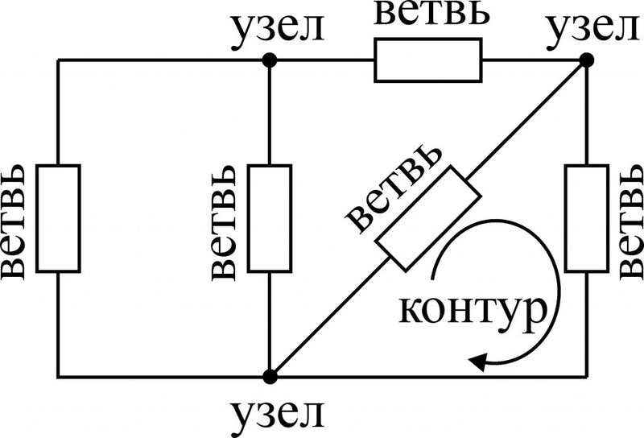
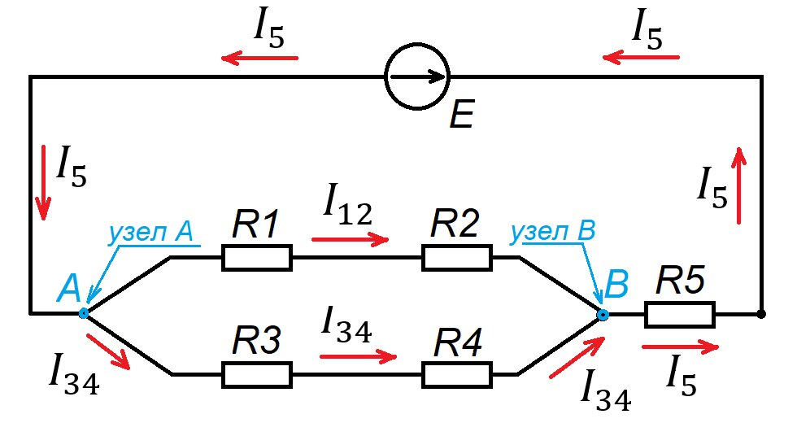
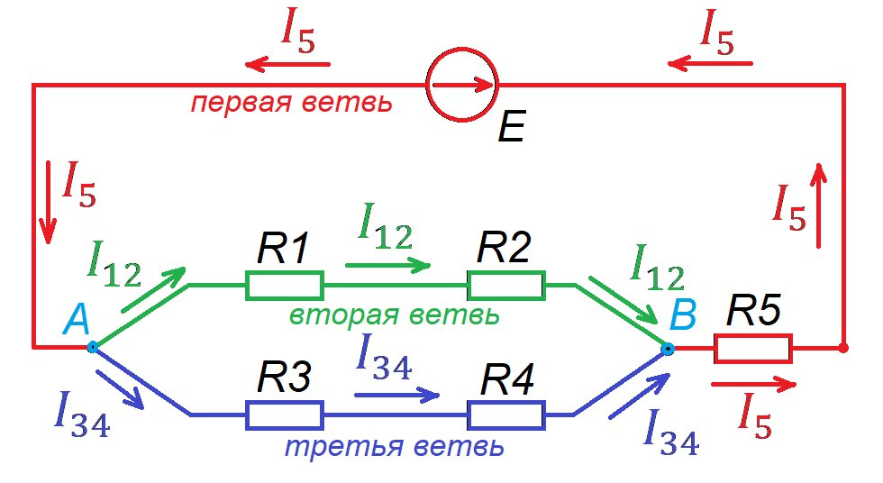
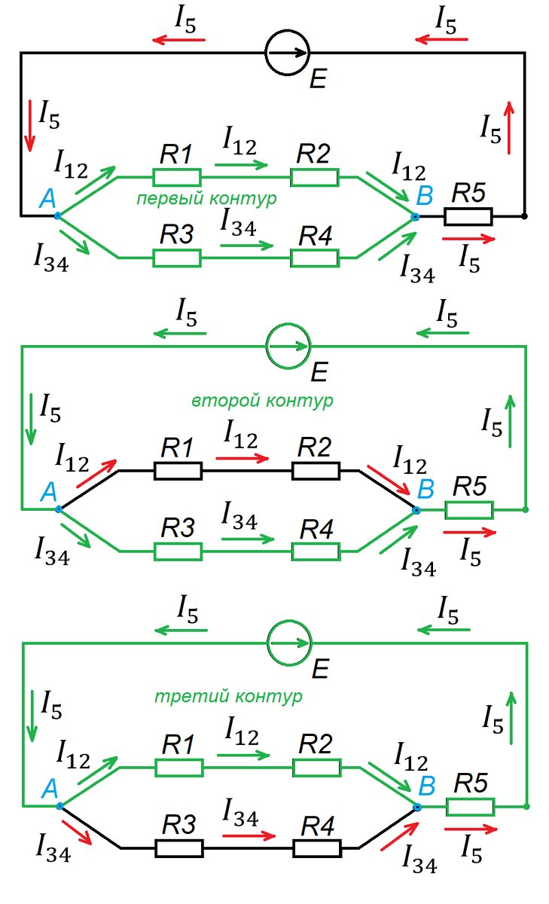

# Электрическая цепь. Узел, ветвь, контур.

[dzen.ru Узлы, ветви и контуры в электрических цепя](https://dzen.ru/a/ZUKAS8KnrX6yIBD-)

**Электрическая цепь** – это совокупность элементов (источники тока, резисторы, конденсаторы и др.), соединенных проводниками для передачи электрической энергии. Чтобы анализировать и рассчитывать такие цепи, вводятся понятия узла, ветви и контура.

### Узел
**Узел** – это точка соединения трех и более проводников в электрической цепи. Представьте, что это перекресток, где сходятся несколько дорог. В узле потенциал одинаков для всех подключенных к нему элементов.

### Ветвь
**Ветвь** – это участок электрической цепи между двумя узлами, по которому течет один и тот же ток. Ветвь может содержать один или несколько элементов.

### Контур
**Контур** – это любой замкнутый путь в электрической цепи, проходящий через несколько ветвей и узлов. 

Подсчёт всех контуров - дело сложное, муторное и бесцельное. При решении практических задач не нужно подсчитывать все контуры в цепи. Для составления уравнений по законам Кирхгофа выбираются так называемые независимые контуры.

**Независимый контур** - это контур электрической схемы, который включает в себя хотя бы одну ветвь, которой нет в предыдущих найденных контурах, и хотя бы одну ветвь, содержащуюся в предыдущих контурах.

Два независимых контура среди этих трех контуров.

### Важность этих понятий
Понимание этих понятий необходимо для:

* **Анализа электрических цепей:** Разделение цепи на узлы, ветви и контуры упрощает ее анализ.
* **Составления уравнений:** Законы Кирхгофа, основанные на этих понятиях, позволяют составлять уравнения для расчета токов и напряжений в цепи.
* **Построения схем:** При проектировании электрических схем необходимо учитывать взаимосвязи между узлами, ветвями и контурами.

### Законы Кирхгофа

Для анализа электрических цепей используются два основных закона Кирхгофа:

* **Первый закон Кирхгофа (закон токов):** Алгебраическая сумма токов, сходящихся в узле, равна нулю. Это означает, что в любой точке цепи количество заряда, втекающего в нее, равно количеству заряда, вытекающего из нее.
* **Второй закон Кирхгофа (закон напряжений):** Алгебраическая сумма напряжений на всех элементах замкнутого контура равна нулю. Это означает, что при обходе любого замкнутого контура сумма падений напряжения равна сумме ЭДС.

### Заключение

Понятия узла, ветви и контура являются фундаментальными для анализа электрических цепей. Они позволяют систематизировать подход к решению задач и применять математические методы для расчета характеристик цепей.
