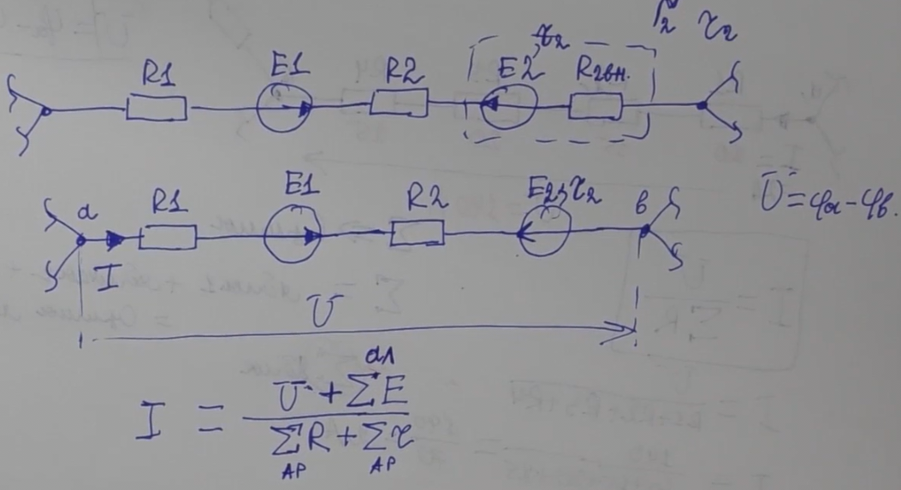
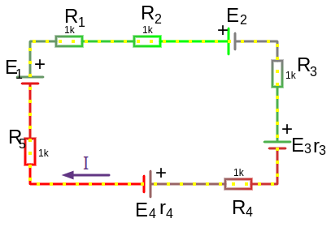
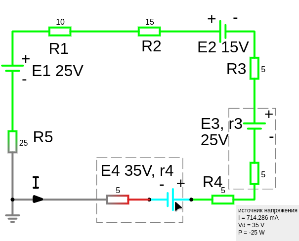
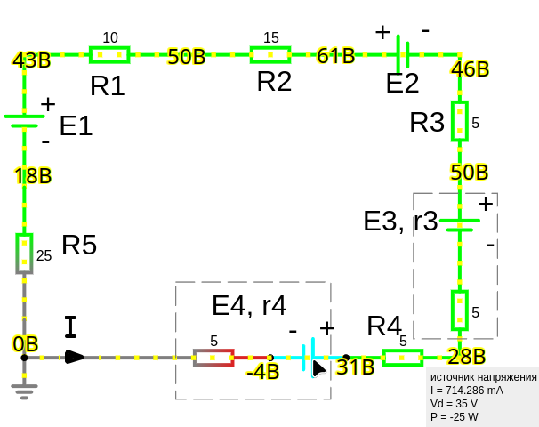

# Урок 7. Закон Ома. Три формы записи.

### **Закон Ома**

**Закон Ома** описывает зависимость между напряжением ($ U $), током ($ I $) и сопротивлением ($ R $) в электрической цепи. Формулируется следующим образом:

 
$I = \frac{U}{R}$
 

Где:  
- $ I $ — сила тока в амперах ($ \text{А} $),  
- $ U $ — напряжение в вольтах ($ \text{В} $),  
- $ R $ — электрическое сопротивление в омах ($ \Omega $).

---

### **Три формы записи закона Ома**

#### I Закон Ома для участка цепи с пассивными элементами:

$$I = \frac{U_{внеш}}{\sum R}=\frac{U_{внеш}}{R_1 + R_2 + R_3 + R_4+ \dots + R_n}$$

где:
- $U_{внеш}$ — напряжение на нагрузке (В). Это напряжение на всей оставшейся части цепи которое подходит к точкам данной ветви.


 

#### II Закон Ома для участка цепи с источником ЭДС (присутствие активных компонентов):

Сила тока на участке цепи с ЭДС равна часному отделения. В числителе напряжение на участке направление которого соврадает с током плюс алгебраическая сумма всех ЭДС участка цепи, в знаменателе арифметическая сумма всех сопротивление пассивных компонентов плюс арифметическая сумма всех внутренних сопротивление источников ЭДС.

Алгебраическая сумма — учитывает знаки, т.е. учитывает направление тока.

Арифметическая сумма — не учитывает знаки.

Формула гибкая и зависит от того, как ты обозначаешь направления напряжений и ЭДС.

Это означает, что **если напряжение $ U $ направлено в ту же сторону, что и ток**, то оно берется со знаком **"+"**. 

$$I = \frac{U_{внеш} + \sum E}{\sum R + \sum r}$$

Если же оно направлено против тока, то его надо записать со знаком **"-"** (что и приводит к виду)

$$I = \frac{\sum E - U_{внеш}}{\sum R + \sum r}$$

 

где:
- $r$ — это внутреннее сопротивление ЭДС. Часто пишут, просто через запятую.
- $U_{внеш}$ — напряжение на нагрузке (В)
- $E$ — ЭДС источника (В),


```admonish info
$U_{внеш}$ применяется в этом типе закона Ома из-за того, что напряжение, как следует из второй закон Кирхгофа (закон напряжений), в замкнутом контуре (которым и является ветвь если замнуть ее крайние точки между собой) должно удовлетворять условие — алгебраическая сумма напряжений в любом замкнутом контуре равна нулю. Это означает, что если мы "обходим" контур, то сумма всех падений напряжения (включая ЭДС и падения на сопротивлениях) должна быть равна сумме ЭДС. И так как после этих точек есть какое-то количество других ветвей, это не важно, главное что крайние точки нашей ветви обладают какой-то суммой падений наряжений, которые должны учитываться в нашей ветви так как у нас есть источник ЭДС, вот это $U_{внеш}$ и учитывается!

Вообщем, первая запись закона Ома для участка цепи с пассивными элементами тоже имеет $U_{внеш}$, но у нас есть источник ЭДС в ветви, поэтому мы должны его учитывать $\sum E$
```

Также можно записать:
$$U_{внеш} = E − I\cdot r$$

То есть напряжение на нагрузке $𝑈_{внеш}$ будет меньше ЭДС на величину падения напряжения на внутреннем сопротивлении источника. 
Так как ЭДС входит в сумму всех падений напряжений.




$$I = \frac{U_{внеш} + E_1 - E_2}{R_1 + R_2 + r_2}$$

где:
- $+ E_1$ — прибавляем так как ЭДС совпадает с направлением тока (алгебраическая сумма)
- $- E_2$ — отнимаем так как ЭДС не совпадает с направлением тока (алгебраическая сумма)

<details>

<summary>Пример расчета тока по закону Ома для участка цепи с источником ЭДС</summary>


Выбрав произвольно направления токов $I_3,I_6,I_7$ и направления обхода 2-x независимых контуров, нам потребуется составить $N_1=n_{узлов}-1=1$ уравнение по первому правилу Кирхгофа, и $N_2=m_{число\ ветвей\ без\ источника\ тока}-N_1=3-1=2$. Итого $N_1+N_2=3$ уравнения.

Для узла А по первому правилу Кирхгофа:
$I_7-I_6-I_3=0$

Для 1-го контура по второму правилу Кирхгофа:
$E_3=I_3(R_3+R_4+R_2)-I_6\cdot R_6$

Для 2-го контура по второму правилу Кирхгофа:
$E^´_7-E^´´_7=I_7\cdot R_7+I_6\cdot R_6$

решив эту систему уравнений получим:
$I_3\approx 1.13\ A,\ I_6\approx 0.302\ A,\ I_7\approx 0.830\ A$

Теперь мы можем проверить формулу рачета тока по закон Ома для участка цепи с источником ЭДС

$$I = \frac{\sum E + U_{внеш}}{\sum R + \sum r}$$

для тока $I_7= \frac{E^´´_7 - E^´_7 + U_{AB}}{R_7}$
где:<br>
- $+ E^´´_7$ − так как совпадает с направлением тока $I_7$
- $- E^´_7$ − так как не совпадает с направлением тока $I_7$
- $U_{AB}$ − это внешнее напряжение источника для ветви в которой течет ток $I_7$. Это напряжение между точка A,B

$U_{AB}=I_6\cdot R_6=1.8,\ V$, подставляем:<br>

$I_7= \frac{9 - 5 + 1.8}{7}=0.830,\ mA$

   где:<br>
   $+ 1.8$ − так как совпадает направление внешнего напряжения с направлением тока

И для тока $I_3$ внешнее напряжение источника тоже будет между точка A,B:<br>

$I_3= \frac{E_3 - U_{AB}}{R_3+R_4+R_2}=\frac{12 - 1.8}{3+4+2}=1.13,\ A$

   где:<br>
   $- 1.8$ − так как не совпадает направление внешнего напряжения с направлением тока

</details>

#### III Закон Ома для замкнутой не развлетленной цепи состоящей из одной ветви:

Неразветвленная электрическая цепь — это такая цепь, в которой все элементы соединены последовательно, то есть образуют один непрерывный путь для протекания электрического тока. Другими словами, в такой цепи нет узлов, где ток может разделиться на несколько ветвей.

Ток для всех компонентов цепи будет одинаковым из-за того что цепь не развлетленная.

Примеры неразветвленных цепь:
   - Гирлянда новогодних лампочек: Лампочки соединены последовательно, образуя неразветвленную цепь.
   - Простой фонарик: В фонарике батарейка и лампочка соединены последовательно.

Сила тока пропорциональна алгебраической сумме всех ЭДС и обратнопропорциональна арифметической сумме всех пассивных элементов и внутренних сопротивлений источников ЭДС

$$I = \frac{\sum E_{алг}}{\sum R + \sum r}$$

$$\sum E_{алг} = I\cdot (\sum R)$$

Выбираем предпологаемое направление тока:



Параметры:
   - R3 = 5 Ом
   - E2 = 15 В
   - R2 = 15 Ом
   - R1 = 10 Ом
   - E1 = 25 В
   - R5 = 25 Ом
   - E4 = 35 В, r4 = 5 Ом
   - R4 = 5 Ом
   - E3 = 25 В, r3 = 5 Ом

$$I = \frac{- E_2 - E_3 - E_4 + E_1}{R_1 + R_2 + R_3 + R_4 + R_5 + r_3 + r_4} = \frac{- 15 - 25 - 35 + 25}{10 + 15 + 5 + 5 + 5 + 5 + 25} = \frac{-50}{70}=-0.714,A$$

где:
- $-0.714,A$ — говорит нам что мы выбрали неверное направление тока, ток будет протекать в противоположном направлении

В программе [www.falstad.com](https://www.falstad.com/circuit/) можно нарисовать схему и запустить, мы видим направление движения тока и если навести курсов на элемент то увидим показатели тока 0.714,A



<a href="/theories_of_electrical_circuits/falstad/circuitjs-7.txt" download="circuitjs-7.txt">Скачать схему для www.falstad.com/circuit</a>

Зеленый цвет обозначает положительное напряжение.   Серый цвет обозначает заземление.   Красный цвет обозначает отрицательное напряжение.

Видно как суммируется вольтаж если у источников ЭДС совпадает направление. Для $E_1$ самое низкое напряжение на участке получилось в следствии того что, напряжение двигалось от $E_2$ c 61 вольтами и понижаясь постепенно от сопротивлений $R_2\ и\ R_1$ и встретило $E_1$ с противоложным знаком, в итоге напряжение иточчника $E_1$ 25 вольт отнялось от пришедших 43 вольт и получилось 18 вольт, если бы по какой-то причине $E_1$ ЭДС был больше чем пришедшие к нему 43 вольта то ток протекал бы в противоположную т.е. туда куда этот ЭДС выдает +. На распределение напряжений влияет нулевой потенциал заземления, с него начинается просчет. 

Почему заземление влияет на распределение напряжений:
- Создание нулевого потенциала: Точка заземления условно принимается за ноль потенциала. Все остальные точки схемы имеют напряжение относительно этой точки.
- Заземление - это точка отсчета потенциалов: Все напряжения в схеме измеряются относительно точки заземления. Когда вы меняете место заземления, вы фактически меняете точку отсчета, что приводит к изменению всех напряжений в схеме.
- Обеспечение безопасных условий: Заземление отводит статические заряды и токи утечки в землю, снижая риск поражения электрическим током.
- Выравнивание потенциалов: Заземление помогает выравнивать потенциалы различных точек схемы, предотвращая возникновение опасных разностных потенциалов.
- Создание опорного потенциала: Заземление служит точкой отсчета для измерения напряжений в схеме.
- Влияние на импеданс схемы: Заземление может изменять импеданс схемы, особенно на высоких частотах, что может повлиять на ее работу.

Что означает отрицательное напряжение:
- Положительное напряжение означает, что потенциал относительно опорной точки выше.
- Отрицательное напряжение означает, что потенциал относительно опорной точки ниже.
- Направление электрического поля: Отрицательное напряжение означает, что электрическое поле направлено в противоположную сторону по сравнению с выбранным направлением отсчета.
- Разность потенциалов: Отрицательное напряжение указывает на то, что точка измерения имеет более низкий потенциал, чем точка отсчета.




### Закон Ома в зависимости от искомой величины:

1. **Для силы тока**:  
   
   $I = \frac{U}{R}$
   

2. **Для напряжения**:  
    
   $U = I \cdot R$
   

3. **Для сопротивления**:  
   
   $R = \frac{U}{I}$
   

---

### **Физический смысл закона Ома**

- Сила тока прямо пропорциональна приложенному напряжению и обратно пропорциональна сопротивлению цепи.  
- Чем больше сопротивление, тем меньше ток при одном и том же напряжении.  
- Чем выше напряжение, тем больше ток при одном и том же сопротивлении.

---

### **Пример использования закона Ома**

1. **Задача 1**:  
   Дано:  
   - Напряжение $ U = 12 \, \text{В} $,  
   - Сопротивление $ R = 4 \, \Omega $.  

   Найти силу тока:  
   
   $I = \frac{U}{R} = \frac{12}{4} = 3 \, \text{А}.$
    

2. **Задача 2**:  
   Дано:  
   - Сила тока $ I = 2 \, \text{А} $,  
   - Сопротивление $ R = 5 \, \Omega $.  

   Найти напряжение:  
    
   $U = I \cdot R = 2 \cdot 5 = 10 \, \text{В}.$
   

---

### **Ограничения закона Ома**

1. Закон Ома применим только к **линейным элементам** цепи, где зависимость $ I $-$ U $ остаётся линейной (например, резисторы).  

2. Для **нелинейных элементов** (например, диоды, транзисторы) закон Ома в его классической форме неприменим. Здесь требуется учитывать их вольт-амперные характеристики (ВАХ).

---

### **Практическое применение закона Ома**

1. **Расчёт электрических цепей**:  
   Используется для анализа простых и сложных электрических схем.  

2. **Проектирование электроники**:  
   Помогает выбрать подходящие компоненты (резисторы, источники питания и т. д.).  

3. **Диагностика неисправностей**:  
   Закон Ома позволяет выявить проблемы, такие как обрывы или короткие замыкания в цепи.

---

Закон Ома — это фундаментальный принцип электротехники, без которого невозможно анализировать или проектировать электрические цепи.