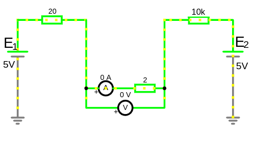
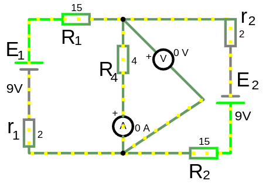
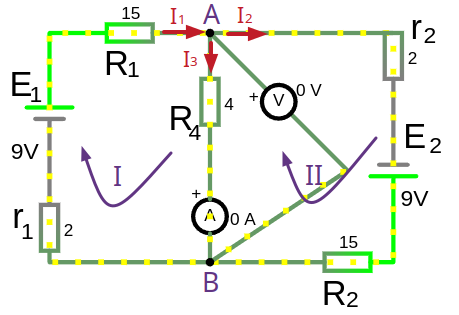
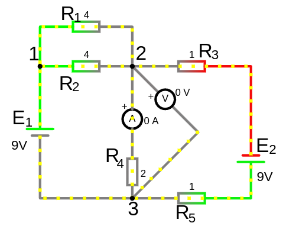
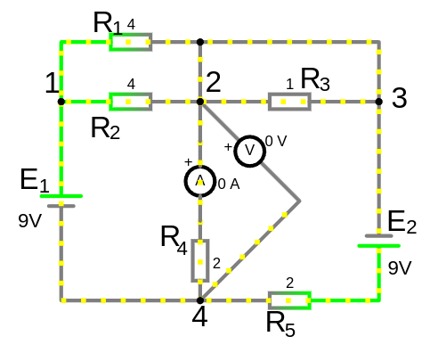
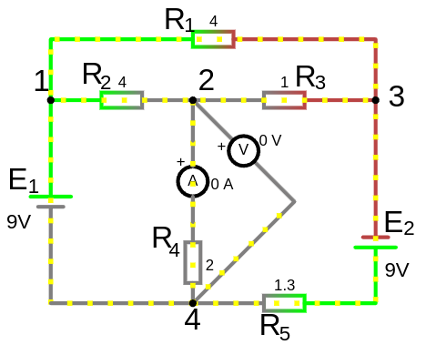
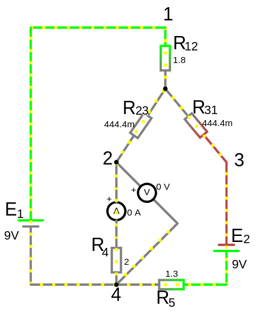

### **Что такое напряжение и как оно связано с разностью потенциалов?** ⚡  

```admonish info
Разность между ЭДС источника и всеми падениями напряжений на элементах ветви, которые находятся между источником и этой точкой.

Направление потенциала напряжения от точки с более высоким потенциалом к точке с более низким потенциалом
```

### 1. Определение напряжения

**Напряжение (U)** — это **разность электрических потенциалов** между двумя точками электрической цепи.  
 
$U_{AB} = \varphi_A - \varphi_B$
 :  
- $ U_{AB} $ — напряжение между точками $ A $ и $ B $;  
- $ \varphi_A$ — потенциал точки $ A $;  
- $ \varphi_B$ — потенциал точки $ B$.  
 
 
Это означает что между этими точками есть «электрическое давление» ($0 < U_{AB} > 0$),<br> но если ($U_{AB} = 0$) то ток не течет. 
- Если подключить к ним нагрузку: 
  - и ($U_{AB} > 0$) то ток будет течь от точки $ A $ к точке $B $ (для положительных зарядов, для электронов — наоборот).
  - и ($U_{AB} < 0$) то ток будет течь от точки $ B $ к точке $A $ (для положительных зарядов, для электронов — наоборот).


### 2. Физический смысл 

Потенциал можно сравнить с высотой в гравитационном поле. Если у вас есть два уровня воды, один выше другого, то вода будет течь вниз из-за разности высот.  
**В электричестве** электроны «текут» от точки с более высоким потенциалом к точке с более низким потенциалом — это и создаёт ток.  

**Если в точке "А" потенциал 7 вольт, а в точке "B" потенциал 6 вольт, то ток в цепи потечет от точки "A" к точке "B", то есть в направлении "A -> B"**. И чем больше будет разность потенциалов (7-6=1 вольт), тем сильнее будет ток, т.е. 2 вольта уже больший ток создатут.

Чем выше потенциал, тем большей энергией обладает положительный заряд в этой точке.

Движение зарядов в проводнике обусловлено разностью потенциалов между двумя точками. Заряды стремятся к состоянию с минимальной энергией, поэтому они перемещаются из области с высоким потенциалом в область с низким потенциалом.

Внутри источника тока (например, батарейки) движение зарядов происходит в обратном направлении - от низкого потенциала к высокому. Это обеспечивается за счет работы сторонних сил (например, химических реакций).


 

На схеме нет разности потенциала, поэтому нет причин для протекания тока

Закон Ома для замкнутой не развлетленной цепи состоящей из одной ветви:
- $I = \frac{\sum E_{алг}}{\sum R + \sum r}=\frac{E_1-E_2}{R_1+R_2+R_3}=\frac{5-5}{ 20+2+10000}=\frac{0}{10022}=0,\ A$

- $\sum E_{алг} = I\cdot (\sum R)=0\cdot (20+2+10000)=0,\ V$

В данном случае, сопротивление и ток ни как не влияет на схему, так как источники ЭДС невелируют друг друга и остутсвие напряжения не толкает ток

---
 
<details>

<summary>Пример 1</summary>

 
 
 
#### 1. Найдем токи ветвей с помощью законов Кирхгофа

 

Уравнения:
- $I_1-I_4-I_2=0$ (для узла А)
- $E_1=I_1\cdot (R_1+r_1)+I_4\cdot R_4$ (для первого контура) 
- $E_2=I_2\cdot (R_2+r_2)-I_4\cdot R_4$ (для второго контура)

Решим систему уравнений:
- $I_1=0.529,\ A$
- $I_2=0.529,\ A$
- $I_4=0,\ A$

- Найдём напряжение:
    - $U_{R_{4}} = I_4\cdot R_4 = 0\cdot 4 = 0,\ V$ 
    - $U_{R_{1}} = I_1\cdot R_1 = 0.529\cdot 15 = 7.935,\ V$ 
    - $U_{R_{2}} = I_2\cdot R_2 = 0.529\cdot 15 = 7.935,\ V$ 
    - $U_{r_1}=I_1\cdot r_1=0.529\cdot 2=1.058,\ V$
    - $U_{r_2}=I_2\cdot r_2=0.529\cdot 2=1.058,\ V$
 
Итого, получаем потенциалы в точках A и B:
  - $\varphi_A=E_1 - U_{r_1} = 9 - 1.058 = 7.942,\ V$ (т.е. мы от источника ЭДС в ветке отняли все падения напряжения на резисторах и то что осталось и будет потенциалом на оставшемся резисторе, ну а точка А как раз за ним)
  - $\varphi_B=E_2 - U_{r_2} = 9 - 1.058 = 7.942,\ V$

- $U_{AB} = \varphi_A - \varphi_B = 7.942 - 7.942 = 0,\ V$


**Посмотрим токи ветвей через законы Ома**
 
Через II закон Ома для участка цепи с источником ЭДС, токи по формуле:

$I = \frac{\sum E - U_{внеш}}{\sum R + \sum r}$

В данном случае $U_{внеш}=0$ и для второй ветви тоже, так как нет разности потенциалов на зажимах ветви.

Тогда второе уравнение Ома действительно сводится к простому делению ЭДС на сумму сопротивлений:

$I_1 = \frac{\sum E_1}{\sum R_1 + \sum r_1} = \frac{9}{17}\approx 0.529,\ А$ (и для $I_2$ тоже)
 
 
---

</details>


<details>

<summary>Пример 2</summary>

 

На потенциал в точке 2 оказывает влияние два источника ЭДС $E_1$ и $E_2$

Ветка с $E_1$, по мере падения напряжений на каждом сопротивлении, имеет итоговое значение напряжения к точке 2. 
Падение напряжения на участке с резисторами $R_1, R_2$ считается по формуле параллельного соединения резисторов $R=\frac{1}{ \frac{1}{R_1} + \frac{1}{R_2}}  = 2,\ Om$ и так как это единственный источник падения напряжения то $\varphi_{2_{E_1}}=2,\ Om$, а со стороны источника напряжения $E_2$, точка 2 для него со стороны его минуса или "земли" т.е. наряжение равно 0 вольт $\varphi_{2_{E_2}}=0,\ Om$, а в ветке с $R_4$ нет источников напряжения, следовательно $\varphi_2=2-0=2,\ Om$

Таким же образом и в точке 3, только $\varphi_{3_{E_2}}=2,\ Om$ получаем разность $\varphi_3=0-2=2,\ Om$

Итого  $U_{23}= \varphi_{2}-\varphi_{3}=2-2=0,\ Om$

На схема эти зоны с нулевым потенциалом окрашены в серый цвет.

---

 

В этой схеме, из-за наличия обходного пути с нулевым сопротивлением, резистор $R_3$ не влияет на потенциалы, а разность потенциалов по прежнему нулева из-за компенсации на резисторе $R_5$

---

 

Потенциалы уравновешены, хотя не сразу понятно, каки образом. На потенциал со стороны $E_1$ в узле 2 влияет группа резисторов $R_1,R_2,R_3$ и со стороны $E_2$ резистор $R_3$ так же влияет на потенциал в узле 2. Если группу резисторов $R_1,R_2,R_3$ преобразовать из "треугольника" в "звезду" то мы сможем увидеть какие из них влияют, а какая их часть сопротивление не влияет на узел 2.

 

(надписи бывших узлов сохранены для наглядности)

Преобразование "треугольника" сопротивлений в "звезду":
- $R_{общ} = \sum R = R_1+R_2+R_3=9, Om$
- $R_{12} = \frac{R_1\cdot R_2}{R_{общ}} \approx 1.77777777777,\ Om$
- $R_{23} = \frac{R_2\cdot R_3}{R_{общ}} \approx 0.44444444444,\ Om$
- $R_{31} = \frac{R_3\cdot R_1}{R_{общ}} \approx 0.44444444444,\ Om$

Потенциал в узле 2 будет равен тому что осталось от напряжения на пути к нему.
Со стороны ветки с $E_1$ сопротивления $R_{12}$ и $R_{23}$ соединены параллельно их эквивалентное сопротивление:
- $R_{экв} = \frac{1}{\frac{1}{R_{12}}+\frac{1}{R_{23}}}\approx 0,355555553,\ Om $

И со стороны ветки с $E_2$ сопротивления $R_{23}$ c (к $R_{31}$ последовательно присоединено $R_{5}$) соединены параллельно:
- $R_{экв} = \frac{1}{\frac{1}{R_{23}}+\frac{1}{R_{31 + R_{5}}}} = 0,355555553,\ Om $

Если эквивалентные сопротивление равны то и напряжения равны

</details>

<details>

<summary>Пример 3</summary>


Согласно второму закону Кирхгофа - "алгебраическая сумма падений напряжений на всех пассивных элементах равна алгебраической сумме электродвижущих сил действующих в этом контуре."

Для 1-го контура по второму закону Кирхгофа:
- $E=I_1\cdot R_1 - I_2\cdot R_2$
​- $9=9.615 - 0.615$

Для 2-го контура по второму закону Кирхгофа:
- $U_{J}=J\cdot R_3 + J\cdot R_2$
​- $8.615=8 + 0.615$

Теперь, смотрим на потенциал в узле "a":
- $\varphi_a=E-U_{R_1}=9-9.615=-0.615\ V$

Потенциал в узле "b":
- $\varphi_b=U_{J}-U_{R_3}=8.615-8=0.615\ V$

т.е. $\varphi_b > \varphi_a$ значит потенциал напряжения движется от "b" $\to$ "a"

[Проверим через баланс мощности](/theories_of_electrical_circuits/lessons/56.html#Пример-1-расчёта-баланса-мощностей). Направление источника тока $J$ не совпадает с направление напряжения потенциала "b" $\to$ "a", поэтому имеет знак "+". И если баланс сходится, значит направление напряжения потенциалов мы посчитали верно!


</details>

---

### 🔋 **4. Важно помнить:**  
- **Знак напряжения** показывает, в каком направлении "давит" электрическое поле.  
- **Отрицательное напряжение** означает, что потенциал во второй точке выше, чем в первой.  

**Пример:**  
 
$U_{BA} = \varphi_B - \varphi_A = 1 - 3 = -2\,В$
  
Здесь напряжение такое же по величине, но противоположное по направлению.

 


 