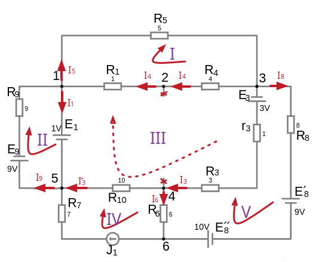

## Урок 58. Матрицы

#### Когда нужно создавать матрицы из уравнений?
Матрицы используются для компактного представления систем уравнений. Это особенно полезно в следующих случаях:
- **Линейные системы уравнений** (например, $Ax = b$).
- **Дифференциальные уравнения** (например, $\frac{dx}{dt} = Ax$).
- **Задачи оптимизации** (например, квадратичные формы).

```admonish info
Прежде чем работать с собственными значениями, нужно научиться **составлять матрицы из уравнений**. Это важный шаг, и давайте разберём его подробно.
```

---

##  Матрица из линейных уравнений

Система линейных уравнений может иметь:
1. **Единственное решение** (Определитель матрицы $A$ **не равен нулю** ($\det(A) \neq 0$), график таких функций пересекается в какой-то точке, что и дает ответ).
2. **Бесконечно много решений** (Ранг матрицы $A$ меньше числа переменных, график таких функций не пересекается, линии друг на друге без точки пересечения).
3. **Не иметь решений** (быть несовместной, Ранг матрицы $A$ меньше ранга расширенной матрицы $[A | \mathbf{b}]$, график таких функций не пересекается, линии параллельны).

Линейные уравнения можно решать методом подстановки, исключения, графически

Если матрица системы не квадратная (то есть число уравнений не равно числу неизвестных), то система может быть:
- Переопределённой (число уравнений больше числа неизвестных).
    Переопределённая система обычно не имеет точного решения, но можно найти наилучшее приближение с помощью метода наименьших квадратов
- Недоопределённой (число уравнений меньше числа неизвестных).
    Недоопределённая система обычно имеет бесконечно много решений. В этом случае можно найти одно из решений или минимальное по норме решение.

Метод наименьших квадратов (numpy.linalg.lstsq) работает для любых систем (квадратных, переопределённых, недоопределённых)    

```python
# Решение методом наименьших квадратов
x, residuals, rank, s = np.linalg.lstsq(A, b, rcond=None)

print("Решение:", x)
print("Невязка:", residuals)

# Проверка невязки
if residuals.size > 0 and residuals < 1e-10:
    print("Решение точное.")
else:
    print("Решение приближённое.")
```
---

Рассмотрим систему линейных уравнений:
$
\begin{cases}
a_{11}x_1 + a_{12}x_2 + \dots + a_{1n}x_n = b_1, \\
a_{21}x_1 + a_{22}x_2 + \dots + a_{2n}x_n = b_2, \\
\vdots \\
a_{m1}x_1 + a_{m2}x_2 + \dots + a_{mn}x_n = b_m.
\end{cases}
$

Эту систему можно записать в матричной форме:
 
$A \mathbf{x} = \mathbf{b}$
 
где:
- $A$ — матрица коэффициентов размера $m \times n$:
    - m  — размернось число строк
    - n  — размернось число столбцов

  $
  A = \begin{pmatrix}
  a_{11} & a_{12} & \dots & a_{1n} \\
  a_{21} & a_{22} & \dots & a_{2n} \\
  \vdots & \vdots & \ddots & \vdots \\
  a_{m1} & a_{m2} & \dots & a_{mn}
  \end{pmatrix}
  $
- $\mathbf{x}$ — вектор переменных (коэффициентов):

  $
  \mathbf{x} = \begin{pmatrix}
  x_1 \\
  x_2 \\
  \vdots \\
  x_n
  \end{pmatrix}
  $

- $\mathbf{b}$ — вектор правых частей (свободных членов):

  $
  \mathbf{b} = \begin{pmatrix}
  b_1 \\
  b_2 \\
  \vdots \\
  b_m
  \end{pmatrix}
  $
 
### Пример 1: Создание матрицы из линейных уравнений
Система уравнений может разной, мы можем искать токи $I_{1}$ или напряжения $U_{1}$, все это неизвестные переменные, обычно обозначают $x_{1}$, $x_{2}$ и т.д.

Исходная система:
$
\begin{cases}
2I_{11} + 3I_{22} = 5 \\
4I_{11} - yI_{22} = 1
\end{cases}
$

Преобразованная система:
$
\begin{cases}
2x_{1} + 3x_{2} = 5 \\
4x_{1} - x_{2} = 1
\end{cases}
$
1. Выпишем коэффициенты:
   - Первое уравнение: $2x_{1} + 3x_{2} = 5$ → коэффициенты: $a_{11}=2$, $a_{12}=3$, $k_{1}=5$
   - Второе уравнение: $4x_{1} - x_{2} = 1$ → коэффициенты: $a_{21}=4$, $a_{22}=-1$, $k_{2}=1$

   $
   A = \begin{pmatrix}
   a_{11} & a_{12} \\
   a_{21} & a_{22}
   \end{pmatrix}, \quad
   \mathbf{b} = \begin{pmatrix}
   k_{1} \\
   k_{2}
   \end{pmatrix}
   $

2. Составим матрицу коэффициентов $A$ и вектор $\mathbf{b}$:
   $
   A = \begin{pmatrix}
   2 & 3 \\
   4 & -1
   \end{pmatrix}, \quad
   \mathbf{b} = \begin{pmatrix}
   5 \\
   1
   \end{pmatrix}
   $
3. Запишем систему в матричной форме:
   $
   A \mathbf{x} = \mathbf{b}, \quad \text{где} \quad \mathbf{x} = \begin{pmatrix}
   x_{1} \\
   x_{2}
   \end{pmatrix}
   $

### Пример 2: Создание матрицы из линейных уравнений

 

Возьмем [уже посчитанную схему](/theories_of_electrical_circuits/lessons/37.html#Пример-2), где мы составили уравнения по методу контурных токов и подставили известные напряжения и сопротивления:
- (1-й контур): $ 10\cdot I_{11} - 5\cdot I_{33} = 0 $
- (3-й контур): $-5\cdot I_{11} + 19\cdot I_{33} - 10\cdot 1 - 4\cdot I_{55} = 4 $
- (5-й контур): $-4\cdot I_{33} - 6\cdot 1 + 18\cdot I_{55} = -2 $

Упростим, переместив константы в правую часть:
- (1-й контур): $10\cdot I_{11} - 5\cdot I_{33} = 0 $
- (3-й контур): $-5\cdot I_{11} + 19\cdot I_{33} - 4\cdot I_{55} = 14 $, мы получили таким образом (14=10+4)
- (5-й контур): $-4\cdot I_{33} + 18\cdot I_{55} = 4 $, мы получили таким образом (4=6+−2)

Итоговая система уравнений, где $I_{11}=X_1,\ I_{33}=X_3 ,\ I_{55}=X_5$:
- $10X_1-5X_3=0$
- $-5X_1+19X_3-4X_5=14$
- $-4X_3+18X_5=4$

Составим матрицу коэффициентов $A$ и векторы $\mathbf{b}$ и $\mathbf{x}$<br>
Недостающие элементы матрицы заменим нулями $a_{13},a_{31}=0$.<br> 
Т.е. в первом уравнении нет данных для $I_{55}$ это же $x_{5}$ и то же самое $a_{13}$<br> 
А в третьем уравнении нехватает $I_{11}$ это же $x_{1}$ и то же самое $a_{31}$

   $
   A = \begin{pmatrix}
   10 & -5 & 0 \\
   -5 & 19 & -4 \\
   0 & -4 & 18
   \end{pmatrix}, \quad
   \mathbf{b} = \begin{pmatrix}
   0 \\
   14 \\
   4
   \end{pmatrix}, \quad
   \mathbf{x} = \begin{pmatrix}
   X_1 \\
   X_3 \\
   X_5
   \end{pmatrix}
   $

Решение на python:

```python
import numpy as np

'''
A = np.array([[a11, a21, a31], [a12, a22, a32], [a13, a23, a33]])
b = np.array([k1, k2, k3])
'''

def solve_system(A, b):
    """
    Решает систему уравнений Ax = b.
    Возвращает вектор x.
    """
    try:
        x = np.linalg.solve(A, b)
        return x
    except np.linalg.LinAlgError:
        print("Система не имеет единственного решения.")
        return None

# Создание матрицы
A = np.array([[10, -5, 0], [-5, 19, -4], [0, -4, 18]]) # массивы колонок
b = np.array([0, 14, 4])
print("Матрица A:\n", A)
print("\nВектор b:\n", b)

print("\nНайти вектор неизвестных x, который удовлетворяет уравнению (Ax = b)")

x = solve_system(A, b)
if x is not None:
    print("Решение:\n", x)
    #print(f"X_1: {x[0]}\nX_3: {x[1]}\nX_5: {x[2]}")

    print("\nПроверка решения, результат должен быть близок к вектору b")
    print(np.dot(A, x))

```

Output:

```
Матрица A:
 [[10 -5  0]
 [-5 19 -4]
 [ 0 -4 18]]

Вектор b:
 [ 0 14  4]

Найти вектор неизвестных x, который удовлетворяет уравнению (Ax = b)
Решение:
 [0.47686833 0.95373665 0.4341637 ]

Проверка решения, результат должен быть близок к вектору b
[ 0. 14.  4.]
```

Решенная матрица $\mathbf{x}$ совпадает с результатами предварительного расчета контурных токов: 
- $X_1 = I_{11} \approx 0.4768\ А$
- $X_3 = I_{33} \approx 0.9537\ А$
- $X_5 = I_{55} \approx 0.434\ А$

---

## Матрица из дифференциальных уравнений
Рассмотрим систему линейных дифференциальных уравнений:
$
\begin{cases}
\frac{dx}{dt} = a_{11}x + a_{12}y \\
\frac{dy}{dt} = a_{21}x + a_{22}y
\end{cases}
$
Эту систему можно записать в матричной форме:
 
$\frac{d\mathbf{x}}{dt} = A \mathbf{x}$
 
где:
- $A$ — матрица коэффициентов:
  $
  A = \begin{pmatrix}
  a_{11} & a_{12} \\
  a_{21} & a_{22}
  \end{pmatrix}
  $
- $\mathbf{x}$ — вектор переменных:
 $
  \mathbf{x} = \begin{pmatrix}
  x \\
  y
  \end{pmatrix}.
 $

 
### Пример: Создание матрицы из дифференциальных уравнений
Рассмотрим систему:
$
\begin{cases}
\frac{dx}{dt} = 3x - y \\
\frac{dy}{dt} = -x + 2y
\end{cases}
$
1. Выпишем коэффициенты:
   - Первое уравнение: $3x - y$ → коэффициенты: $3$, $-1$
   - Второе уравнение: $-x + 2y$ → коэффициенты: $-1$, $2$
2. Составим матрицу коэффициентов $A$:
   $
   A = \begin{pmatrix}
   3 & -1 \\
   -1 & 2
   \end{pmatrix}
   $
3. Запишем систему в матричной форме:
   $
   \frac{d\mathbf{x}}{dt} = A \mathbf{x}, \quad \text{где} \quad \mathbf{x} = \begin{pmatrix}
   x \\
   y
   \end{pmatrix}
   $

 