# Емкостной элемент 

## Конденсатор

```admonish info
В цепи постоянного тока, после времени заряда кондекнсатора т.е. уже в установившемся режиме, ток на конденсаторе будет равен 0, а напряжение будет равно источнику питания. Конденсатор реагирует на изменения **напряжения** в цепи, будь то постоянный ток или переменный, а источник может быть кварцевый генератор. Реальный конденсатор даже в установившемсяя режиме в цепи постоянного тока немного пропускает ток.
```


Емкостной элемент — это **линейный пассивный** компонент электрической цепи, который обладает свойством ёмкости, то есть способностью накапливать **электрический заряд** (количество электрики) и **энергию в электрическом поле** между своими обкладками. Основным представителем емкостных элементов является **конденсатор** либо две метталические пластины рядом расположенные.

Схема замещения емкости:

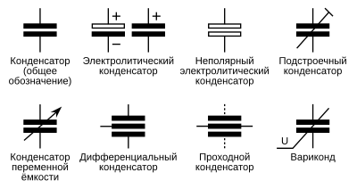

 
График заряда и разряда конденсатора по экспоненте:

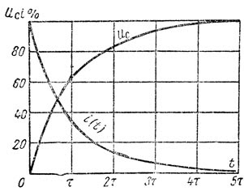


Так как между выводами конденсатора может протекать **ток утечки**, поэтому реальный конденсатор с влияющими на цепь токами утечки используют **шунтированный резистором кондексатор** т.е. параллельно подключенный резистор, на плате резистор будет, но на схеме замещения резистора не будет.

Схема реального емкостного элемента (т.е. модель явления утечки):

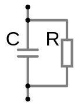

---

## Типы емкостных элементов:
1. **Постоянные конденсаторы**:
   - Полярные (например, электролитические, танталовые, ниобиевые).
   - Неполярные (например, керамические или плёночные).
2. **Переменные конденсаторы**:
   - Ёмкость которых можно изменять механически или электрически.

**Электролитические конденсаторы** — полярный конденсатор, отличаются высокой ёмкостью (от единиц до тысяч микрофарад μF) Внутри используется жидкий или твёрдый электролит, что позволяет достичь высокой ёмкости. Полярностью, имеют "+" и "–" выводы. Неправильное подключение может привести к повреждению. Применяются в основном в цепях постоянного тока (в цепях переменного тока допускается применение этого типа конденсатора при условии что пиковое напряжение не превышает номинальное наряжение конденсатора). Для цепей переменного тока используют специальные конденсаторы. 

Недостаток, алюминиевого электролитического конденсатора из-за свернутой в рулон обкладки, она имеет паразитную индуктивность которая при высокой частоте сигнала может вести себя как катушка индуктивности, и обладает паразитным сопротивлением которое со временем только увеличивается из-за высыхания электролита.

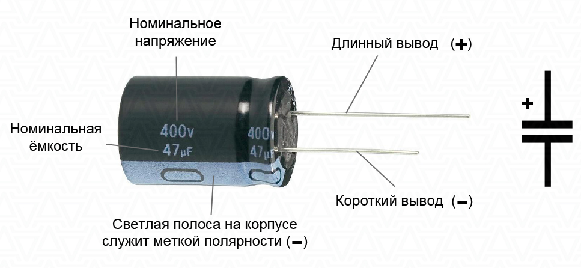

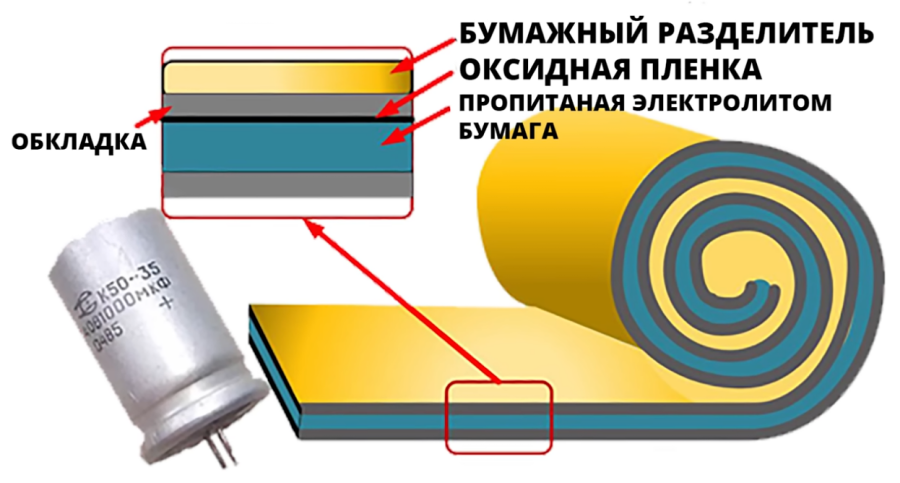

**Танталовые конденсаторы** — тоже электролитический конденсатор, но с высокой стабильность, надежность и компактность, низкий ток утечки. Они не подвержены празитной индуктивностью при высоких частотах.

Главное достоинство — это малый размер при относительно большой емкости. Недостаток, который значительно ограничивает сферу применения, это малая электрическая прочность. Самые мощные образцы способны стабильно и надежно функционировать при напряжениях до 35 В.

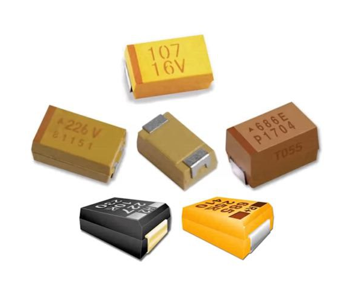

Прорыв в производстве конденсаторов большой емкости и малого размера был достигнут при использовании тантала. Этот редкоземельный металл дороже золота и его добыча довольно сложная, но требуется его для изготовления одного элемента очень мало — не более нескольких микрограммов. Постепенно танталовые электролитические конденсаторы вытеснили устаревшие на основе алюминиевой фольги, так как их производство усовершенствовалось, а стоимость стала довольно низкой.

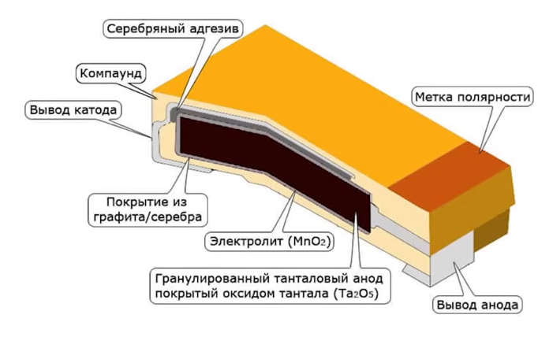

Принятая стандартная маркировка танталовых конденсаторов состоит из указания плюсового контакта и численного значения. А цвет корпуса указывает рабочее напряжение. 

Например:
- розовый цвет — напряжение до 35 В;
- белый цвет — до 30 В;
- серый цвет — до 35 В;
- голубой цвет — до 20 В;
- зеленый цвет — до 16 В;
- черный цвет — до 10 В;
- желтый цвет — до 6,3 В.

Незначительный скачок напряжения может привести к пробою диэлектрической пленки, при котором диэлектрическая пленка приобретает кристаллическую структуру и становится проводником электричества. В этом случае конденсатор становится проводником и сопротивление между анодом и катодом приближается к нулевому значению. На корпусе при пробое часто визуально заметно потемнение и иногда обугливание защитного покрытия из краски.

**Ниобиевые конденсаторы** – это подвид электролитических конденсаторов, отличающийся большим сроком службы и малым сопротивлением токам высокой частоты. Главное достоинство — это малый размер при относительно большой емкости. Недостаток, который значительно ограничивает сферу применения, это малая электрическая прочность. Самые мощные образцы способны стабильно и надежно функционировать при напряжениях до 35 В.

Приемниками танталовых стали ниобиевые конденсаторы, которые по своей конструкции и технологии производства идентичны предшественникам, но превосходят их по эксплуатационным характеристикам.

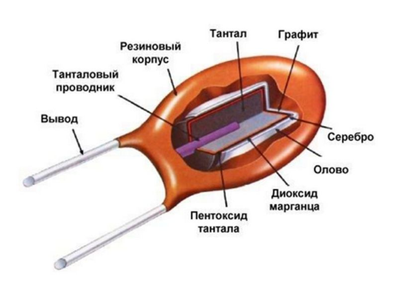

**Керамические конденсаторы** - дисковые и многослойные, обладают меньшими емкостями чем электролитические но не имеют паразитную индуктивность. Недостаток керамических конденсаторов плохая переносимоть температуры от чего меняется сама емкость. И зависимость от напряжения емкость тоже снижается.

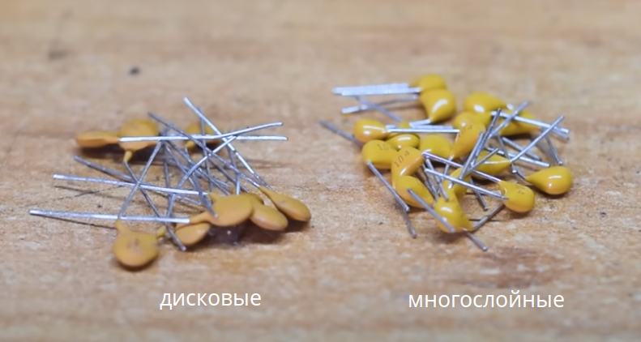

**Пленочные конденсаторы** - устраняют недостатки керамических конденсаторов. Используют в роли диэлектрика пластиковую пленку из различных материалов. Хорошо держат емкость, не имеют паразитную индуктивность, надежные, самовосстанавлияваются после пробоя. Недостаток в низком соотношении емкости к обьему.

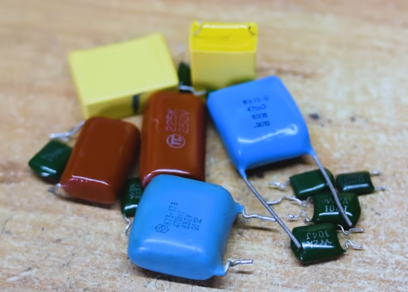

**Переменные конденсаторы** — для изменения емкости в процессе работы, но применяют вместо них диоды варикапы. 

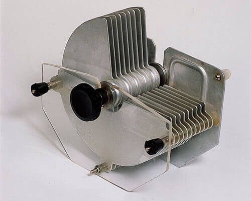

Диод варикап — применяются в качестве элементов с электрически управляемой ёмкостью 

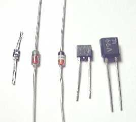

Подстроечный конденсаторы — для тонкой настройки аппаратуры.

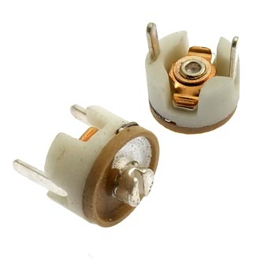


### Пробой диэлектрика конденсатора

Диэлектрик (изоляционный материал между обкладками конденсатора) теряет свои изоляционные свойства, и через него начинает протекать ток. 
Это может произойти по причине превышения рабочего (номинального) напряжения на конденсаторе.
**Если на конденсаторе указано `50 V` это его максимальное допустимое напряжение, а рабочее напряжение не должно превышать `40 V = 50 V - 20%`**. Но в сетех переменного тока расчет рабочего напряжения другой: `311 V = 220 V * 1.41` т.е. это амплитудное напряжение которое будет на нагрузке.   
Так же, из-за превышения рекомендованных температурных условий (ТКЕ) или со временем диэлектрик теряет свои изоляционные свойства.

### Паразитная ёмкость
Паразитная ёмкость — это нежелательная ёмкость, которая возникает в электронных схемах из-за конструктивных особенностей компонентов и проводников. Она может влиять на работу схемы, особенно на высоких частотах.
- Возникает между проводниками, два проводника, расположенные близко друг к другу, образуют конденсатор, между дорожками на печатной плате.
- Возникает между выводами компонентов, выводы транзисторов, микросхем и других компонентов могут создавать паразитную ёмкость.
- Возникает между слоями печатной платы, в многослойных платах ёмкость может возникать между слоями.

Как паразитная ёмкость влияет на схему?
- Влияние на высоких частотах, может создавать нежелательные RC-цепи, которые влияют на частотные характеристики схемы, задержки сигналов или искажения.
- Влияние в импульсных схемах, может замедлять переключение транзисторов.
- В аналоговых схемах, может создавать обратную связь, что приводит к нестабильности или колебаниям.

Как уменьшить паразитную ёмкость?
- Увеличение расстояния между проводниками
- Использование экранирования из металла или заземлённые слои на печатной плате
- Минимизация длины проводников
- Использование материалов с низкой диэлектрической проницаемостью

### Перетекание заряда конденсаторов
Перетекание заряда конденсаторов — это процесс, при котором электрический заряд перераспределяется между конденсаторами, соединенными в электрическую цепь. Это явление происходит из-за разницы потенциалов между обкладками конденсаторов.

Когда конденсаторы соединяются вместе, заряд начинает перемещаться от конденсатора с более высоким напряжением к конденсатору с более низким напряжением.
Этот процесс продолжается до тех пор, пока напряжения на всех конденсаторах не выровняются.

Применение:
- Перетекание заряда используется в различных электронных схемах, таких как:
- Схемы делителей напряжения.
- Схемы умножителей напряжения.
- Схемы формирования импульсов.
- выравнивание напряжения в батареях конденсаторов.

В более сложных цепях, содержащих комбинации последовательного и параллельного соединений, перетекание зарядов может быть более сложным.
Заряд будет перераспределяться между конденсаторами, чтобы удовлетворить законам Кирхгофа.
Этот процесс может привести к тому, что некоторые конденсаторы будут разряжаться быстрее, а другие медленнее.
При разряде емкость теряет напряжение, если есть в цепи емкость с напряжением больше то она начнет отдавать заряд в сторону меньшего напряжения для выравнивания, т.е. подзарядки разрядившей емкости. Это перетекание происходит постоянно, пока напряжение на обоих конденсаторах не выровняется. Каждый конденсатор имеет ограничение по максимальному току разряда. Ток будет распределяться между конденсаторами неравномерно, что приводит к неравномерному износу, сокращению срока их службы. При высоких скоростях разряда, могут возникать **паразитные токи**. В случае, когда необходимо обеспечить равномерный разряд конденсаторов, применяют схемы балансировки.

## Основные характеристики емкостного элемента:


На конденсаторах могут не писать единицу измерения **Ф**, т.е. просто **100 мк**, что означает **100 мкФ** , запись **100.0** означает **100 мкФ**, в то время как просто **100** означает **100 пФ**.

<details>

<summary>Типы маркировки на конденсаторах</summary>

**цифирное кодирование**

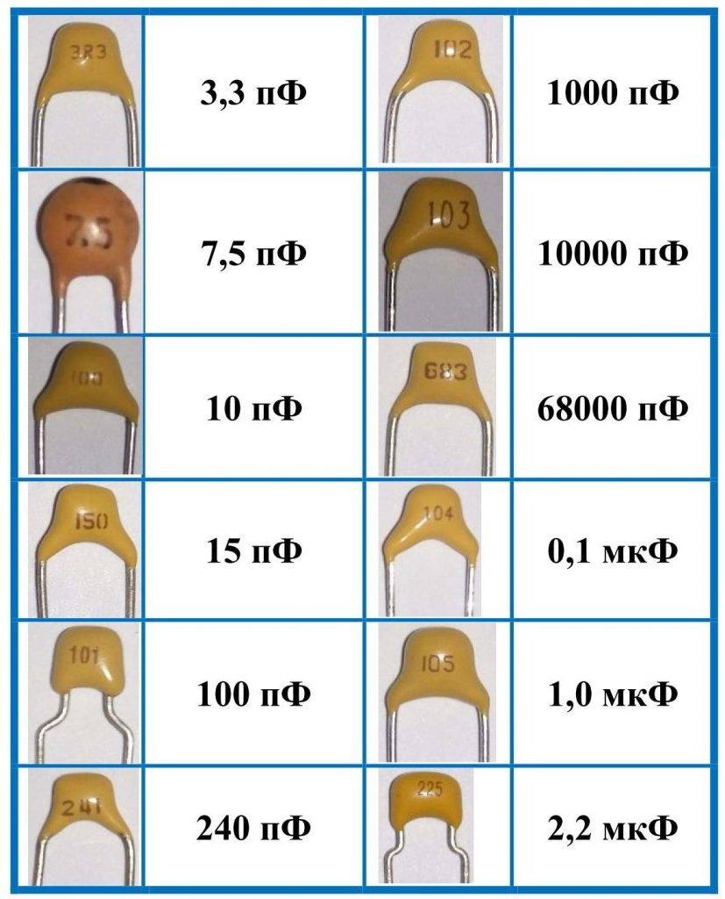

Цифровое кодирование конденсаторов, как и резисторов, предполагает использование всего трех цифр. Такой подход позволяет реализовать множество комбинаций. Две цифры, расположенные слева обозначают мантису, то есть значащее число, а последняя – третья цифра показывает, сколько нулей нужно прибавить к двум предыдущим цифрам. 

Например, если на корпусе накопителя указано `153`, то емкость его равна `15×103 = 15000 пФ = 15 нФ = 0,015 мкФ`.

Номинальное напряжение керамических конденсаторов "104" обычно составляет 50 В. Но бывают и другие значения.

**Цифирно-буквенная маркировка**

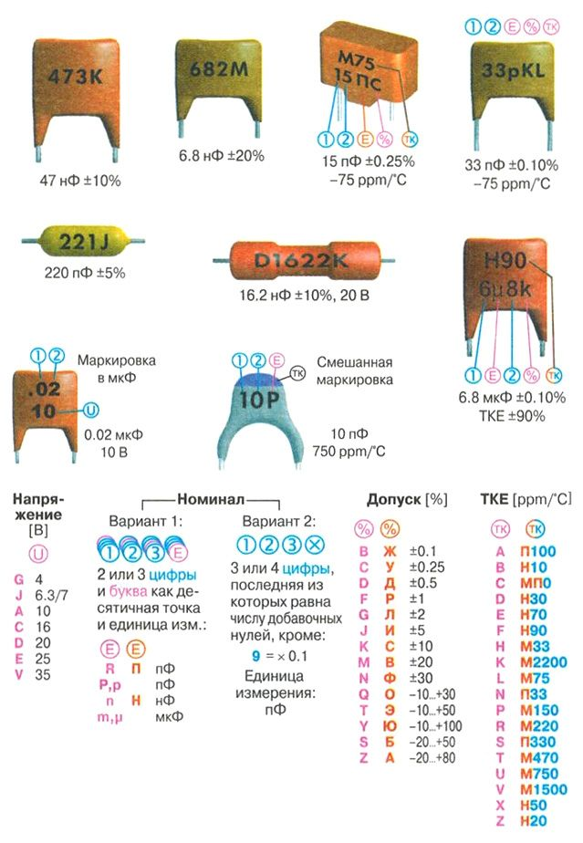

</details>
<br>

**Конвертер единиц измерения Фарад**:<br>

<div class="inline-inputs">
<input type="number" id="valueConvertCapacity">
<label for="fromUnitConvertCapacity">Из:</label>
<select id="fromUnitConvertCapacity">
<option value="F">F, Ф (фарад)</option>
<option value="cF">cF, сФ (сантифарад)</option>
<option value="mF">mF, мФ (миллифарад)</option>
<option value="uF">$\mu\text{F}$, мкФ (микрофарад)</option>
<option value="nF">nF, нФ (нанофарад)</option>
<option value="pF">pF, пФ (пикофарад)</option>
<option value="fF">fF, фФ (фемтофарад)</option>
</select>
<label for="toUnitConvertCapacity">В:</label>
<select id="toUnitConvertCapacity">
<option value="F">F, Ф (фарад)</option>
<option value="cF">cF, сФ (сантифарад)</option>
<option value="mF">mF, мФ (миллифарад)</option>
<option value="uF">$\mu\text{F}$, мкФ (микрофарад)</option>
<option value="nF">nF, нФ (нанофарад)</option>
<option value="pF">pF, пФ (пикофарад)</option>
<option value="fF">fF, пФ (фемтофарад)</option>
</select>
</div>
<div class="inline-inputs">
<button onclick="convertCapacity()">Конвертировать</button>
<p id="resultConvertCapacity">...</p>
</div>


1. **Постоянная времени $\tau$** — это время (обратно пропорциональна скорости, т.е. чем она больше, тем медленне заряд/разряд), за которое конденсатор заряжается до $63.2\%$ от максимального напряжения или разряжается до $36.8\%$ от начального напряжения. По прошествии 5-ти $\tau$ времени, емкость заряжена на 99.24% или разряжена (в зависимости от режима). По прошествии 3-х $\tau$ времени, емкость заряжена/разряжена на 95%.

   $\tau=R\cdot C$ [sec]

2. **Ёмкость ($ C $)**:
   - Формула для ёмкости:
    
     $C = \frac{Q}{U},\ $ $(1\ Ф=\frac{1\ Кл}{1\ В})$
    
     где  
      - $C$ — ёмкость (Ф)
      - $Q$ — заряд (Кл)
      - $U$ — напряжение источника (В)
   - Измеряется в **фарадах (Ф)** ([конвертер](https://www.translatorscafe.com/unit-converter/ru-RU/electrostatic-capacitance/13-1/microfarad-farad/)).
     * **Миллифарад (мФ):** $1\ mF = 10^{-3}$ F ($0.001\ F \cdot 1000=1\ mF$)
     * **Микрофарад (мкФ):** $1\ \mu F= 10^{-6}$ F ($0.000001\ F \cdot 1000.000=1\ \mu F$)
     * **Нанофарад (нФ):** $1\ nF = 10^{-9}$ F (0.000000001 F)
         * $1\ nF = 10^{-3}\  \mu F=10^{-9}\ F$
     * **Пикофарад (пФ):** $1\ pF = 10^{-12}$ F (0.000000000001 F)
         * $1\ pF = 10^{-3}\ nF =10^{-6}\ \mu F =10^{-12}\ F$

        Выбор фарада в качестве единицы измерения емкости связан с именем известного английского физика Майкла Фарадея, внесшего значительный вклад в изучение электромагнетизма.

   - Определяет способность элемента накапливать заряд при заданном входящем напряжении источника.


3. **Энергия электрического поля**:
   - Ёмкостный элемент накапливает энергию в виде электрического поля между обкладками.
   - Формула для накопленной энергии:
     
    - **при заряде и разряде:** $W(t) = \frac{1}{2}\cdot C\cdot U_{C}^2(t)= \frac{Q^2(t)}{2\cdot C}=\frac{Q\cdot U_C}{2}(t)$ (Джоуль, Дж)

     где  
      - $W$ — энергия (Дж)
      - $C$ — ёмкость (Ф) 
      - $U_{C}(t)$ — напряжение на конденсаторе (В) в момент времени t
      - $U_{0}$ — начальное напряжение на конденсаторе (В)
      - $Q^2(t)$ — заряд (Кл) в момент времени t

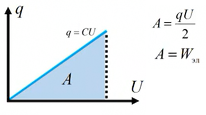

4. **Ток через конденсатор**:

   $I=\frac{Q}{t}=\frac{C\cdot U}{t}$
   - Ток зависит от скорости изменения напряжения:
      
    - **при заряде:** $I(t) = C \frac{dU}{dt} = \frac{U_{source}}{R} \cdot e^{-\frac{t}{R\cdot C}}$
     
    - **при разряде:** $I(t) = \frac{U_С}{R} \cdot e^{-\frac{t}{R\cdot C}}$

     где  
      - $R\cdot C=\tau$ — постоянная времени (сек)
      - $I$ — ток (А)
      - $C$ — ёмкость (Ф)  
      - $\frac{dU}{dt}$ — скорость изменения напряжения (В/с)
      - $U_{source}$ — напряжение источника
      - $U_C$ — напряжение на конденсаторе к моменту начала разряда. 
        - (при полном заряде $U_С=U_{source}$)

5. **Заряд**

    Заряд $Q$ — это физическая величина, которая показывает, сколько электричества накоплено на обкладках конденсатора.

    Это полезно для понимания процессов накопления и передачи энергии.

    Заряд конденсатора связан с напряжением на нём и ёмкостью по формуле:
    
     - **при заряде и разряде:** $Q(t) = C \cdot U_C(t)$

    где:
     - $Q(t)$ — заряд на конденсаторе в момент времени $t$,
     - $C$ — ёмкость конденсатора,
     - $U_C(t)$ — напряжение на конденсаторе в момент времени $t$.

    При последовательном или параллельном соединении конденсаторов заряд помогает понять, как распределяется энергия между ними.
 
6. **Напряжение**

    Закон разряда конденсатора описывается экспоненциальной зависимостью

    - **при заряде:** $U_C(t) = U_{source} \cdot \left(1 - e^{-\frac{t}{R\cdot C}}\right)$
    - **при разряде:** $U_C(t) = U_С \cdot e^{-\frac{t}{R\cdot C}}$

    где:
    - $U_C$ — напряжение на конденсаторе к моменту начала разряда. 
        - (при полном заряде $U_С=U_{source}$)
    - $U_C(t)$ — напряжение на конденсаторе при данном времени t
    - $U_{source}$ — напряжение источника
    - $R$ — сопротивление цепи заряда
    - $C$ — ёмкость конденсатора
    - $R\cdot C=\tau$ — постоянная времени (сек)  
    - $t$ — время с начала заряда
    - $e$ — основание натурального логарифма ($e \approx 2.718$)

7. **Температурный коэффициент ёмкости (ТКЕ)** — это параметр, который характеризует, насколько изменяется ёмкость конденсатора при изменении температуры окружающей среды. Он выражается в миллионных долях на градус (ppm/°C) или в процентах на градус (%/°C). Важно выбирать конденсаторы с низким ТКЕ для приложений, где требуется стабильность ёмкости в широком диапазоне температур.
 
8. **Тангенс угла потерь (tan δ) конденсатора** — это параметр, который характеризует потери энергии в конденсаторе при работе в цепи переменного тока. Это отношение активной мощности потерь к реактивной мощности конденсатора.
Или же это отношение эквивалентного последовательного сопротивления (ESR) к реактивному сопротивлению конденсатора.

   Чем меньше значение `tan δ`, тем меньше потери в конденсаторе.
   Тангенс угла потерь влияет на эффективность работы конденсатора в цепях переменного тока.
   В высокочастотных цепях потери могут быть особенно значительными.
   Тангенс угла потерь важен при выборе конденсаторов для высокочастотных цепей, импульсных источников питания и других приложений, где требуется низкий уровень потерь. 

   В цепях постоянного тока направление электрического поля не меняется.
   После зарядки конденсатора ток через него прекращается (за исключением небольших токов утечки).
   Следовательно, потери, связанные с переполяризацией диэлектрика, практически отсутствуют. Однако, тангенс угла потерь оказывает влияние на работу конденсатора в схеме с диодным мостом, так как конденсатор работает в режиме переменного напряжения.

   Добротность $Q=\frac{1}{tan\ δ}$ которая характеризует эффективность колебательной системы, такой как резонансный контур, конденсатор или катушка индуктивности. Она показывает, насколько хорошо система сохраняет энергию при колебаниях. У качественных конденсаторов добротность больше 1000.

9. **Допустимое отклонение ёмкости от номинального значения** — это параметр, который указывает, в каких пределах может фактически находиться ёмкость конденсатора по сравнению с заявленным на его корпусе или в документации значением.

   Стандартные значения отклонений:
      * I класс `±5% (J) E24`
      * II класс `±10% (K) E12`
      * III класс  `±20% (M) E6`

   Для некоторых типов конденсаторов, таких как прецизионные плёночные или керамические конденсаторы, отклонения могут быть меньше (например, `±1%, ±2%`).
   
   У электролитических конденсаторов отклонения могут достигать `50%` и более. Высокие отклонения ёмкости у электролитических конденсаторов обусловлены технологическими особенностями их производства (толщина пленки формируется химическим способом и может иметь значительные отклонения), свойствами электролита (может изменять свои свойства со временем, высыхать), широким диапазоном ёмкостей чувствительны к технологическим отклонениям и подверженностью старению при высоких температурах и напряжениях.
 
   <details>

   <summary>Выбор типа конденсатора</summary>

   Электролитические конденсаторы, несмотря на свои недостатки, остаются незаменимыми во многих приложениях из-за их высокой ёмкости при относительно небольших размерах. Однако, в зависимости от требований к схеме, можно использовать и другие типы конденсаторов:

   **Для цепей постоянного тока (DC):**

   * **Керамические конденсаторы:**
      * Используются для блокировки, фильтрации и развязки в высокочастотных цепях.
      * Обладают низким ESR (Чем ниже ESR, тем меньше потери и тем эффективнее работает конденсатор) и хорошей стабильностью.
      * Не подходят для больших ёмкостей.
   * **Плёночные конденсаторы:**
      * Используются для фильтрации, сглаживания и временных цепей.
      * Обладают хорошей стабильностью и низким ESR.
      * Подходят для средних и больших ёмкостей.
   * **Танталовые конденсаторы:**
      * Используются для фильтрации и блокировки в маломощных цепях.
      * Обладают высокой ёмкостью при небольших размерах.
      * Чувствительны к перенапряжениям.
   * **Полимерные конденсаторы:**
      * Обладают очень низким ESR, что делает их отличным выбором для цепей питания, особенно в цифровых устройствах.
      * Отличаются высокой стабильностью и долговечностью.
      * Хороши для сглаживания пульсаций.

   **Для цепей переменного тока (AC):**

   * **Плёночные конденсаторы (полипропиленовые, полиэфирные):**
      * Используются в фильтрах, корректорах коэффициента мощности и других AC-приложениях.
      * Обладают высокой стабильностью и низкими потерями.
      * Широко используются в цепях переменного тока, благодаря хорошим характеристикам.
   * **Керамические конденсаторы (высоковольтные):**
      * Используются в высоковольтных AC-приложениях, таких как источники питания и лампы.
      * Обладают высокой прочностью и устойчивостью к высоким напряжениям.
   * **Гибридные конденсаторы:**
      * Сочетают в себе преимущества электролитических и полимерных конденсаторов.
      * Обладают низким ESR, высокой стабильностью и долговечностью.
      * Используются в цепях питания, где требуются высокие характеристики.

   **Когда электролитические конденсаторы все еще хороши:**

   * Несмотря на их недостатки, электролитические конденсаторы остаются лучшим выбором для приложений, где требуется очень высокая ёмкость при ограниченных размерах и стоимости.
   * Они широко используются в источниках питания, аудиоусилителях и других приложениях, где их недостатки не критичны.

   **Выбор конденсатора:**

   * При выборе конденсатора необходимо учитывать требования к схеме, такие как ёмкость, напряжение, частота, температура и допустимые отклонения.
   * Всегда обращайтесь к технической документации на конкретный конденсатор, чтобы узнать его характеристики.
   </details>

   Стандарты номиналов конденсаторов:

   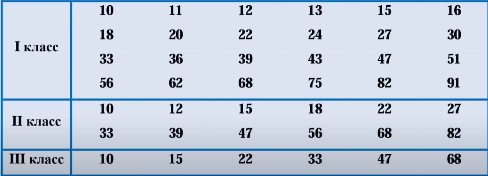

   Наиболее распространёнными стандартами являются ряды `E6, E12, E24, E48, E96 и E192`. Цифра в названии ряда указывает на количество значений в десятичном интервале.

   Ряд `E24` содержит 24 значения (1.0, 1.1, 1.2, 1.3, 1.5, 1.6, 1.8, 2.0, 2.2, 2.4, 2.7, 3.0, 3.3, 3.6, 3.9, 4.3, 4.7, 5.1, 5.6, 6.2, 6.8, 7.5, 8.2, 9.1)

   Ряд `E12` содержит 12 значений (1.0, 1.2, 1.5, 1.8, 2.2, 2.7, 3.3, 3.9, 4.7, 5.6, 6.8, 8.2)

   Числа из ряда представляют собой относительные значения, которые умножаются на степень 10 для получения конкретного номинала.

   Пример:
      * Вам нужна ёмкость около 100 нФ
      * Вы смотрите в ряд E24 и находите число 1.0
      * Вы выбираете конденсатор с номиналом $1.0 \cdot 10^{-7}\ Ф = 100\ нФ$

   Пример:
      * Вам нужна ёмкость около 22 пФ
      * Вы смотрите в ряд E24 и находите число 2.2
      * Вы выбираете конденсатор с номиналом $2.2 \cdot 10^{-11}\ Ф = 22\ пФ$

## Маркировка SMD (Surface Mount Device) конденсаторов  


```admonish info
SMD компоненты применяют при поверхностном монтаже на платах так как не нужды сверлить назквозь плату и можено установить компоненты с двух сторон. SMD компоненты дешевле чем обычные компонеты для навесного монтожа. Но для пайки нужен специальный флюс
```

 конденсаторов.")

Стандартные размеры SMD конденсаторов
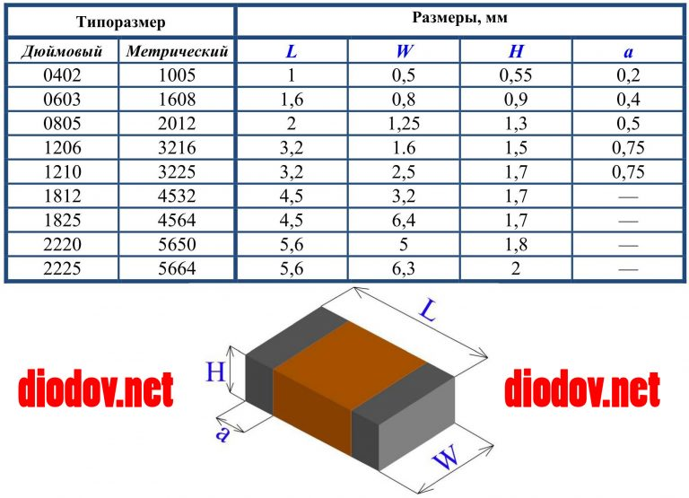

[Маркировка конденсаторов diodov.net](https://diodov.net/kondensatory-printsip-raboty-i-markirovka-kondensatorov/)

<details>

<summary>Маркировка SMD (Surface Mount Device) конденсаторов</summary>

Маркировка SMD (Surface Mount Device) конденсаторов может быть сложной для понимания, так как она часто использует коды вместо полного обозначения номинала. Давайте разберем, как расшифровать маркировку SMD конденсаторов.

---

### **1. Типы SMD конденсаторов:**
- **Керамические конденсаторы:** Наиболее распространенные, маркируются кодом из цифр и букв.
- **Танталовые конденсаторы:** Часто маркируются кодом из цифр, обозначающих емкость и напряжение.
- **Электролитические конденсаторы:** Могут иметь маркировку, указывающую емкость, напряжение и полярность.

---

### **2. Маркировка керамических конденсаторов:**
Керамические SMD конденсаторы обычно маркируются **трехзначным кодом**, где:
- Первые две цифры — это **значение емкости**.
- Третья цифра — это **количество нулей** (множитель).
- Емкость указывается в **пикофарадах (пФ)**.

#### **Пример:**
- Маркировка **104**:
  - Первые две цифры: **10**.
  - Третья цифра: **4** (количество нулей).
  - Емкость: \( 10 \cdot 10^4 \, \text{пФ} = 100,000 \, \text{пФ} = 100 \, \text{нФ} \).

---

### **3. Маркировка танталовых конденсаторов:**
Танталовые SMD конденсаторы маркируются кодом, который указывает **емкость** и **рабочее напряжение**.

#### **Формат:**
- **Емкость:** Обычно указывается в микрофарадах (мкФ).
- **Напряжение:** Обозначается буквой или цифрой.

#### **Пример:**
- Маркировка **106C**:
  - **106:** Емкость \( 10 \cdot 10^6 \, \text{пФ} = 10 \, \text{мкФ} \).
  - **C:** Напряжение (например, C = 16 В).

---

### **4. Маркировка электролитических конденсаторов:**
Электролитические SMD конденсаторы обычно маркируются **емкостью** и **напряжением**.

#### **Формат:**
- **Емкость:** Указывается в микрофарадах (мкФ).
- **Напряжение:** Указывается в вольтах (В).

#### **Пример:**
- Маркировка **47 25V**:
  - **47:** Емкость 47 мкФ.
  - **25V:** Рабочее напряжение 25 В.

---

### **5. Цветовая маркировка:**
Некоторые SMD конденсаторы могут иметь цветовую маркировку, но это редко. Обычно цветовая маркировка используется для керамических конденсаторов.

---

### **6. Таблица маркировки:**
Вот примеры маркировки для керамических конденсаторов:

| Маркировка | Емкость (пФ) | Емкость (нФ) | Емкость (мкФ) |
|------------|--------------|--------------|---------------|
| 101        | 100          | 0.1          | 0.0001        |
| 102        | 1,000        | 1            | 0.001         |
| 103        | 10,000       | 10           | 0.01          |
| 104        | 100,000      | 100          | 0.1           |
| 105        | 1,000,000    | 1,000        | 1             |

---

### **7. Как определить параметры, если маркировка отсутствует:**
Если маркировка отсутствует или нечитаема, можно:
- Использовать **мультиметр с функцией измерения емкости**.
- Ориентироваться на **размер корпуса** (например, 0603, 0805), который может указывать на типичные параметры конденсатора.

---

### **8. Итог:**
- **Керамические конденсаторы:** Трехзначный код (емкость в пФ).
- **Танталовые конденсаторы:** Код, указывающий емкость и напряжение.
- **Электролитические конденсаторы:** Емкость и напряжение указаны напрямую.

</details>
<br>


## Как расcчитать емкость конденсатора

Емкость конденсатора определяется следующими факторами:

- Площадь пластин (A): Чем больше площадь проводящих пластин, тем большую емкость имеет конденсатор.
- Расстояние между пластинами (d): Чем меньше расстояние между пластинами, тем больше емкость.
- Диэлектрическая проницаемость материала между пластинами (ε): Материал-диэлектрик увеличивает емкость по сравнению с вакуумом или воздухом.


Емкость параллельного плоского конденсатора рассчитывается по формуле:

$C = ε₀ * εr * (A / d)$

Где:

* **C** - емкость в Фарадах (F)
* **ε₀** - электрическая постоянная (приблизительно 8.854 × 10⁻¹² Ф/м)
* **εr** - относительная диэлектрическая проницаемость материала между пластинами (для воздуха εr ≈ 1)
* **A** - площадь одной пластины в квадратных метрах (м²)
* **d** - расстояние между пластинами в метрах (м)

**Диэлектрик является ключевым и самым главным** элементом в конденсаторе, определяющим его основные характеристики и свойства.

1. Диэлектрическая проницаемость (εr): Этот параметр показывает, насколько хорошо материал способен концентрировать электрическое поле и, следовательно, насколько большую емкость можно получить при заданных размерах конденсатора. Чем выше εr, тем больше емкость.

1. Диэлектрическая прочность (пробивное напряжение): Это максимальное электрическое поле, которое диэлектрик может выдержать без пробоя (потери изоляционных свойств и возникновения тока). Высокая диэлектрическая прочность позволяет конденсаторам выдерживать высокие напряжения.

1. Тангенс угла потерь (tan δ) или фактор диссипации (DF): Этот параметр характеризует потери энергии в диэлектрике при переменном токе. Низкое значение tan δ означает меньшие потери и более высокую эффективность конденсатора. Идеальный диэлектрик не должен проводить ток и не должен поглощать энергию электрического поля. Однако в реальных диэлектриках существуют потери энергии, которые характеризуются тангенсом угла потерь (tan δ) или фактором диссипации (DF). Диэлектрик с низкими потерями обеспечивает более эффективное накопление и отдачу энергии.

1. Сопротивление изоляции: Высокое сопротивление изоляции означает, что конденсатор хорошо удерживает заряд и имеет малый ток утечки.

1. Частотные характеристики: Диэлектрические свойства могут зависеть от частоты приложенного напряжения. Некоторые диэлектрики лучше работают на высоких частотах, другие - на низких.

**Примеры различных диэлектриков и их общие характеристики:**

Воздух (εr ≈ 1.0006): Дешевый и доступный, используется в конденсаторах переменной емкости и некоторых высоковольтных приложениях. Имеет низкие потери.

Пленка (полиэстер, полипропилен, поликарбонат, полистирол и др.) (εr от 2 до 3): Обеспечивают хорошую стабильность, низкие потери и высокое сопротивление изоляции. Используются в аудиофильтрах, прецизионных схемах и силовых конденсаторах.

Бумага (пропитанная маслом или воском) (εr от 2 до 6): Использовались исторически, но в настоящее время менее распространены. Могут быть чувствительны к влаге.

Слюда (εr от 5 до 7): Обладает высокой стабильностью, низкими потерями и высокой диэлектрической прочностью. Используется в высокочастотных и высоковольтных приложениях.

<details>

<summary>Изготовление конденсатора переменной емкости (КПЕ)</summary>

```admonish info
Варикап – это полупроводниковый диод, емкость которого изменяется в зависимости от приложенного обратного напряжения.
```

Изготовление конденсатора переменной емкости (КПЕ) с медными пластинами и воздушным диэлектриком - это классический радиолюбительский проект. Медь - хороший проводник и легко поддается обработке, что делает ее подходящим материалом для пластин.

**Вот как вы можете реализовать ваш КПЕ:**

**1. Материалы:**

* **Медные пластины:** Вам понадобятся два набора медных пластин:
    * **Статорные пластины (неподвижные):** Несколько пластин, закрепленных на неподвижной основе.
    * **Роторные пластины (подвижные):** Несколько пластин, закрепленных на вращающейся оси. Количество роторных пластин обычно на одну меньше или на одну больше, чем статорных, чтобы обеспечить полное перекрытие и полное разведение.
    * Толщина меди не критична, но лучше использовать достаточно жесткий материал, чтобы пластины не деформировались.
* **Изоляционный материал для статора и ротора:** Вам понадобится хороший электроизолятор для крепления статорных пластин и для оси ротора, чтобы предотвратить короткое замыкание между пластинами и корпусом. Подойдут:
    * Плексиглас (оргстекло)
    * Текстолит
    * Гетинакс
    * Керамика (если доступна)
    * Прочный пластик с хорошими диэлектрическими свойствами
* **Ось для ротора:** Металлический стержень (например, латунный или стальной), который будет вращаться и на котором будут закреплены роторные пластины.
* **Крепежные элементы:** Винты, гайки, шайбы (желательно из непроводящего материала в местах крепления статора), клей (эпоксидный или цианоакрилатный для фиксации).
* **Подшипники (опционально):** Для обеспечения плавного вращения оси ротора можно использовать небольшие подшипники.
* **Ручка для вращения:** Для удобства вращения оси ротора.
* **Контактные пружины (опционально):** Для обеспечения электрического контакта с вращающимся ротором (если это необходимо для вашей схемы).

**2. Конструкция:**

* **Форма пластин:** Форма пластин может быть различной (полукруг, сегмент круга и т.д.). Наиболее распространенная - полукруглая или близкая к ней. Важно, чтобы при вращении ротора пластины могли плавно входить в зазоры между статорными пластинами и выходить из них, обеспечивая изменение площади перекрытия.
* **Зазоры между пластинами:** Расстояние между статорными и роторными пластинами определяет рабочее напряжение КПЕ (чем больше зазор, тем выше пробивное напряжение, но меньше емкость). Воздушный зазор будет диэлектриком (εr ≈ 1). Старайтесь сделать зазоры максимально равномерными.
* **Количество пластин:** Чем больше количество пластин и чем больше их площадь, тем больше будет максимальная емкость вашего КПЕ.
* **Крепление статора:** Статорные пластины должны быть надежно закреплены на изолирующей основе и электрически соединены между собой (обычно через общую шину).
* **Крепление ротора:** Роторные пластины должны быть надежно закреплены на металлической оси и электрически соединены с ней. Ось должна вращаться в изолирующих опорах (подшипниках).
* **Электрические выводы:** Обеспечьте надежные электрические выводы от статорных пластин и от оси ротора.

**3. Расчет емкости (приблизительный):**

Емкость КПЕ можно приблизительно рассчитать по формуле для параллельного плоского конденсатора, учитывая, что у вас много параллельно соединенных конденсаторов (каждая пара перекрывающихся пластин образует конденсатор).

**C ≈ (n - 1) * ε₀ * (A / d)**

Где:

* **C** - максимальная емкость в Фарадах (F)
* **n** - количество статорных пластин (количество роторных пластин должно быть либо \(n-1\), либо \(n+1\))
* **ε₀** - электрическая постоянная (8.854 × 10⁻¹² Ф/м)
* **A** - площадь перекрытия одной пары пластин в квадратных метрах (м²) (максимальная площадь перекрытия)
* **d** - расстояние между пластинами (воздушный зазор) в метрах (м)

**Пример:**

Предположим, у вас 5 статорных и 4 роторных полукруглых пластины с радиусом 3 см (площадь одной пластины ≈ 0.0014 м²) и воздушный зазор 1 мм (0.001 м).

C ≈ (5 - 1) * 8.854 × 10⁻¹² Ф/м * (0.0014 м² / 0.001 м)
C ≈ 4 * 8.854 × 10⁻¹² * 1.4 ≈ 49.58 × 10⁻¹² Ф ≈ 49.58 пФ

Реальная емкость может немного отличаться из-за краевых эффектов и неидеальной геометрии.

**4. Практические советы:**

* **Точность изготовления:** Старайтесь сделать пластины ровными и одинаковой формы, а зазоры - максимально равномерными, чтобы обеспечить плавное изменение емкости при вращении.
* **Избегайте коротких замыканий:** Тщательно изолируйте статорные и роторные части друг от друга.
* **Механическая прочность:** Обеспечьте надежное крепление всех элементов, чтобы КПЕ был механически стабильным.
* **Корпус (опционально):** Для защиты от пыли и механических повреждений можно поместить КПЕ в корпус.

Изготовление КПЕ - увлекательный проект, который позволит вам лучше понять принципы работы конденсаторов и радиоэлектроники. Удачи в вашем начинании!

Для снятия емкости (фактически, для использования вашего КПЕ в электрической цепи) вам необходимо подсоединить провода к двум основным электрическим выводам вашего конденсатора переменной емкости:

1.  **К статорным пластинам:** Все статорные пластины должны быть электрически соединены между собой. Обычно это делается с помощью металлической шины или путем их крепления к общей изолирующей основе с проводящими элементами. К этой объединенной группе статорных пластин вы подсоединяете один провод вашей цепи.

2.  **К роторным пластинам (или оси ротора):** Все роторные пластины также должны быть электрически соединены между собой. Поскольку они закреплены на металлической оси, обычно электрическое соединение осуществляется через эту ось. К оси ротора вы подсоединяете второй провод вашей цепи.

**Способы подключения проводов:**

* **Пайка:** Самый надежный способ соединения. Вы можете припаять провод непосредственно к металлической шине, соединяющей статорные пластины, и к металлической оси ротора (предварительно зачистив места пайки).
* **Винтовые зажимы:** Если ваша конструкция предусматривает винтовые клеммы или лепестки, вы можете закрепить провода с помощью винтов.
* **Пружинные контакты (для ротора):** Если вы используете подшипники для оси ротора, можно предусмотреть скользящий контакт с помощью пружинящей металлической пластинки (например, из фосфористой бронзы), которая будет прижиматься к оси и обеспечивать электрическое соединение. Это позволит ротору свободно вращаться без скручивания проводов.

**Важно:**

* **Изоляция:** Убедитесь, что провода, подключенные к статору и ротору, не касаются друг друга и других металлических частей конструкции, чтобы избежать короткого замыкания.
* **Надежность соединения:** Соединения должны быть механически прочными и обеспечивать хороший электрический контакт.
* **Гибкость (для ротора):** Если вы не используете скользящий контакт для ротора, провода, подсоединенные к оси, должны быть достаточно гибкими, чтобы не препятствовать вращению и не обрываться при многократных поворотах.

**Схема подключения:**

Представьте ваш КПЕ как элемент с двумя выводами: один вывод подключен ко всем статорным пластинам, а другой - ко всем роторным пластинам (через ось). Вы просто включаете этот двухполюсник в вашу электрическую цепь так же, как и любой другой конденсатор. Изменение емкости происходит за счет вращения ротора, что приводит к изменению площади перекрытия между статорными и роторными пластинами.

Таким образом, для снятия емкости заряда вам нужно обеспечить электрическое подключение к двум группам пластин (статору и ротору) вашего КПЕ.

</details>