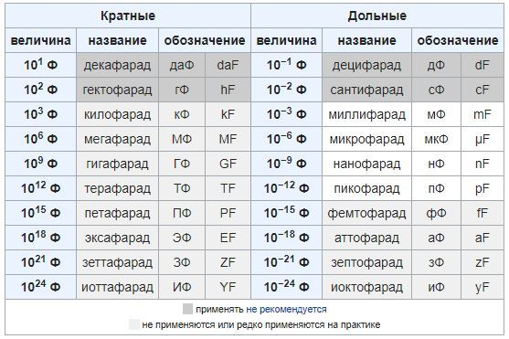

# Конденсатор

## Емкостной элемент

Емкостной элемент — это **линейный пассивный** компонент электрической цепи, который обладает свойством ёмкости, то есть способностью накапливать **электрический заряд** (количество электрики) и **энергию в электрическом поле** между своими обкладками. Основным представителем емкостных элементов является **конденсатор** либо две метталические пластины рядом расположенные.

Схема замещения емкости:

В цепи постоянного тока после времени заряда кондекнсатора, ток на конденсаторе будет равен 0, а напряжение будет равно источнику питания.

График заряда и разряда конденсатора:

Так как между выводами конденсатора может протекать **ток утечки**, поэтому реальный конденсатор с влияющими на цепь токами утечки используют **шунтированный резистором кондексатор** т.е. параллельно подключенный резистор, на плате резистор будет, но на схеме замещения резистора не будет.

Схема реального емкостного элемента (т.е. модель явления утечки):

---

### Типы емкостных элементов:
1. **Постоянные конденсаторы**:
   - Полярные (например, электролитические).
   - Неполярные (например, керамические или плёночные).
2. **Переменные конденсаторы**:
   - Ёмкость которых можно изменять механически или электрически.

Электролитические конденсаторы — отличаются высокой ёмкостью (от единиц до тысяч микрофарад μF) Внутри используется жидкий или твёрдый электролит, что позволяет достичь высокой ёмкости. Полярностью, имеют "+" и "–" выводы. Неправильное подключение может привести к повреждению. Применяются в основном в цепях постоянного тока (в цепях переменного тока допускается применение этого типа конденсатора при условии что пиковое напряжение не превышает номинальное наряжение конденсатора). Для цепей переменного тока используют специальные конденсаторы.

### Пробой диэлектрика конденсатора

Диэлектрик (изоляционный материал между обкладками конденсатора) теряет свои изоляционные свойства, и через него начинает протекать ток. Это может произойти по причине превышения рабочего (номинального) напряжения на конденсаторе. Так же, из-за превышения рекомендованных температурных условий или со временем диэлектрик теряет свои изоляционные свойства.

### Паразитная ёмкость
Паразитная ёмкость — это нежелательная ёмкость, которая возникает в электронных схемах из-за конструктивных особенностей компонентов и проводников. Она может влиять на работу схемы, особенно на высоких частотах.
- Возникает между проводниками, два проводника, расположенные близко друг к другу, образуют конденсатор, между дорожками на печатной плате.
- Возникает между выводами компонентов, выводы транзисторов, микросхем и других компонентов могут создавать паразитную ёмкость.
- Возникает между слоями печатной платы, в многослойных платах ёмкость может возникать между слоями.

Как паразитная ёмкость влияет на схему?
- Влияние на высоких частотах, может создавать нежелательные RC-цепи, которые влияют на частотные характеристики схемы, задержки сигналов или искажения.
- Влияние в импульсных схемах, может замедлять переключение транзисторов.
- В аналоговых схемах, может создавать обратную связь, что приводит к нестабильности или колебаниям.

Как уменьшить паразитную ёмкость?
- Увеличение расстояния между проводниками
- Использование экранирования из металла или заземлённые слои на печатной плате
- Минимизация длины проводников
- Использование материалов с низкой диэлектрической проницаемостью

### Перетекание заряда конденсаторов
Перетекание заряда конденсаторов — это процесс, при котором электрический заряд перераспределяется между конденсаторами, соединенными в электрическую цепь. Это явление происходит из-за разницы потенциалов между обкладками конденсаторов.

Когда конденсаторы соединяются вместе, заряд начинает перемещаться от конденсатора с более высоким напряжением к конденсатору с более низким напряжением.
Этот процесс продолжается до тех пор, пока напряжения на всех конденсаторах не выровняются.

Применение:
- Перетекание заряда используется в различных электронных схемах, таких как:
- Схемы делителей напряжения.
- Схемы умножителей напряжения.
- Схемы формирования импульсов.
- выравнивание напряжения в батареях конденсаторов.

В более сложных цепях, содержащих комбинации последовательного и параллельного соединений, перетекание зарядов может быть более сложным.
Заряд будет перераспределяться между конденсаторами, чтобы удовлетворить законам Кирхгофа.
Этот процесс может привести к тому, что некоторые конденсаторы будут разряжаться быстрее, а другие медленнее.
При разряде емкость теряет напряжение, если есть в цепи емкость с напряжением больше то она начнет отдавать заряд в сторону меньшего напряжения для выравнивания, т.е. подзарядки разрядившей емкости. Это перетекание происходит постоянно, пока напряжение на обоих конденсаторах не выровняется. Каждый конденсатор имеет ограничение по максимальному току разряда. Ток будет распределяться между конденсаторами неравномерно, что приводит к неравномерному износу, сокращению срока их службы. При высоких скоростях разряда, могут возникать **паразитные токи**. В случае, когда необходимо обеспечить равномерный разряд конденсаторов, применяют схемы балансировки.

### Основные характеристики емкостного элемента:

 **Постоянная времени $\tau$** — это время (обратно пропорциональна скорости, т.е. чем она больше, тем медленне заряд/разряд), за которое конденсатор заряжается до $63.2\%$ от максимального напряжения или разряжается до $36.8\%$ от начального напряжения. По прошествии 5-ти $\tau$ времени, емкость заряжена на 99.24% или разряжена (в зависимости от режима). По прошествии 3-х $\tau$ времени, емкость заряжена/разряжена на 95%.

1. **Ёмкость ($ C $)**:
   - Измеряется в **фарадах (Ф)** ([конвертер](https://www.translatorscafe.com/unit-converter/ru-RU/electrostatic-capacitance/13-1/microfarad-farad/)).
     * **Миллифарад (мФ):** $1\ mF = 10^{-3}$ F ($0.001\ F \cdot 1000=1\ mF$)
     * **Микрофарад (мкФ):** $1\ \mu F= 10^{-6}$ F ($0.000001\ F \cdot 1000.000=1\ \mu F$)
     * **Нанофарад (нФ):** $1\ nF = 10^{-9}$ F (0.000000001 F)
     * **Пикофарад (пФ):** $1\ pF = 10^{-12}$ F (0.000000000001 F)

        Выбор фарада в качестве единицы измерения емкости связан с именем известного английского физика Майкла Фарадея, внесшего значительный вклад в изучение электромагнетизма.

   - Определяет способность элемента накапливать заряд при заданном входящем напряжении источника.
   - Формула для ёмкости:
    
     $C = \frac{Q}{U},\ $ $(1\ Ф=\frac{1\ Кл}{1\ В})$
    
     где  
      - $C$ — ёмкость,  
      - $Q$ — заряд (Кл),  
      - $U$ — напряжение источника (В).

2. **Энергия электрического поля**:
   - Ёмкостный элемент накапливает энергию в виде электрического поля между обкладками.
   - Формула для накопленной энергии:
     
    - **при заряде и разряде:** $W(t) = \frac{1}{2}\cdot C\cdot U_{C}^2(t)= \frac{Q^2(t)}{2\cdot C}$ (Джоуль, Дж)

     где  
      - $W$ — энергия (Дж)
      - $C$ — ёмкость (Ф) 
      - $U_{C}(t)$ — напряжение на конденсаторе (В) в момент времени t
      - $U_{0}$ — начальное напряжение на конденсаторе (В)
      - $Q^2(t)$ — заряд (Кл) в момент времени t

3. **Ток через конденсатор**:
   - Ток зависит от скорости изменения напряжения:
      
    - **при заряде:** $I(t) = C \frac{dU}{dt} = \frac{U_{source}}{R} \cdot e^{-\frac{t}{R\cdot C}}$
     
    - **при разряде:** $I(t) = \frac{U_С}{R} \cdot e^{-\frac{t}{R\cdot C}}$

     где  
      - $R\cdot C=\tau$ — постоянная времени (сек)
      - $I$ — ток (А)
      - $C$ — ёмкость (Ф)  
      - $\frac{dU}{dt}$ — скорость изменения напряжения (В/с)
      - $U_{source}$ — напряжение источника
      - $U_C$ — напряжение на конденсаторе к моменту начала разряда. 
        - (при полном заряде $U_С=U_{source}$)

4. **Заряд**

    Заряд — это физическая величина, которая показывает, сколько электричества накоплено на обкладках конденсатора.

    Это полезно для понимания процессов накопления и передачи энергии.

    Заряд конденсатора связан с напряжением на нём и ёмкостью по формуле:
    
     - **при заряде и разряде:** $Q(t) = C \cdot U_C(t)$

    где:
     - $Q(t)$ — заряд на конденсаторе в момент времени $t$,
     - $C$ — ёмкость конденсатора,
     - $U_C(t)$ — напряжение на конденсаторе в момент времени $t$.

    При последовательном или параллельном соединении конденсаторов заряд помогает понять, как распределяется энергия между ними.
 
5. **Напряжение**

    Закон разряда конденсатора описывается экспоненциальной зависимостью

    - **при заряде:** $U_C(t) = U_{source} \cdot \left(1 - e^{-\frac{t}{R\cdot C}}\right)$
    - **при разряде:** $U_C(t) = U_С \cdot e^{-\frac{t}{R\cdot C}}$

    где:
    - $U_C$ — напряжение на конденсаторе к моменту начала разряда. 
        - (при полном заряде $U_С=U_{source}$)
    - $U_C(t)$ — напряжение на конденсаторе при данном времени t
    - $U_{source}$ — напряжение источника
    - $R$ — сопротивление цепи заряда
    - $C$ — ёмкость конденсатора
    - $R\cdot C=\tau$ — постоянная времени (сек)  
    - $t$ — время с начала заряда
    - $e$ — основание натурального логарифма ($e \approx 2.718$)

 
